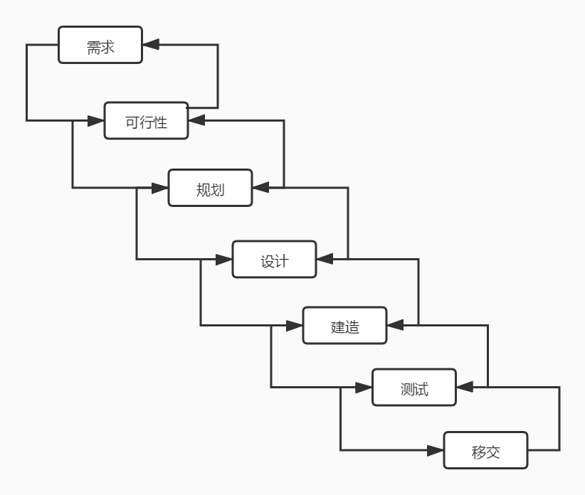

# 敏捷项目管理与敏捷宣言

说到敏捷项目管理就不得不提到那十分出名的敏捷宣言。这篇文章我们就来简单地了解一下敏捷项目管理的出现和敏捷宣言说的是什么。不要有太多的压力哦，这篇文章还是非常轻松的。

## 传统项目管理

对于传统项目管理和敏捷项目管理的不同，我们可以列一个非常大的表出来，不过，这样列出来其实挺没意思。到最后我们学习完了敏捷相关的知识后，大家可以自己再回过头来想一想敏捷和传统项目管理的区别和联系都有哪些，这样对大家知识的掌握才更有好处。所以，我们这里只是简单的介绍一下大概的传统项目管理是如何进行的。

在传统的项目管理中，我们会首先通过商务谈判获得项目合同，然后制定一个详细的计划，在计划没有制定完成前，代码是绝对不会写的。这时，我们会见到一种叫做甘特图的东西。一般是由项目经理画出来的，并和团队一起细化后放在整个项目计划中。接下来就是进入开发阶段，所有的设计、工程师、测试、运维人员根据项目计划以及甘特图，一步一步地完成我们计划中的各个步骤，直到最后整个计划被执行完成。简单来说，这样一个过程就是一个传统的项目管理过程。从软件开发的角度来说，我们可以用软件工程中的瀑布模型来说明这个过程。

可以说，这个瀑布模型就是传统软件开发中最典型的一种项目开发模式。

如果抛开软件这个应用范围来说，传统的项目管理其实就是对应的我们 PMP 中的十大领域，分别是整体、范围、进度、成本、质量、人力资源、沟通、风险、采购、干系人管理。在学习 PMP 的时候，我们会发现整个 PMP 中，这些领域中的计划和文档编制都是非常重要的部分。

综合这两块内容，相信大家看出来了。传统的项目管理以及由此产生的软件开发模式都有一个特点。那就是事前详细完善的计划，事中全员的严丝合缝的执行。

但，如果你真的在应用过这种项目管理或开发方式的公司工作过的话，你就会发现，事前完美的计划实在是太难了，事中严密的执行也不是说说就能成功的。我们的世界有一个东西很难受我们百分之百的掌控。这个东西就是：变化。

## VCUA时代

在敏捷中，有句名言：唯一不变的就是变化。这句话非常有意思，只有变化本身是我们这个世界上唯一不会发生变化的东西。要搞明白这个事情，我们还是再看下传统项目管理和软件开发中的问题。

详尽细致的计划，不是说一定没有，但真的太难的。对于科学家来说，外星、深海的探索需要这种计划的能力。但对于我们的商业软件开发来说，这样的计划会耗费大量的人力物力。常说的一个例子就是，当你用半年的时间计划设计好了一个系统，然后再用半年的时候开发完成。这时客户如果还没倒闭的话，这个系统的用户还一定存在吗？或者说市场还是一年前的那样吗？现在的互联网，特别是移动互联网之后，sns社区、微博、团购、共享、短视频、小视频，一浪接一浪，不要说一年，一周可能都会错过一个风口。详尽的计划和方案，在这种互联网环境下很难。

其实，上述的例子中，就为我们这一小节要说明的 VUCA 时代这个名词说明了个两个方面的内容：V（易变性）和 U（不确定性）。那么剩的字母代表的是什么意思呢？

C（复杂性），现在的系统，不管是电商、小视频、社区团购还是什么，都不是一个单一的产品。电商系统中有小视频、有团购，小视频系统中有电商带货、有朋友联系（社交）。各种功能的交织缠绕就带出了这个复杂性的定义。为什么苹果的产品很夺我们的眼球，正是因为它放弃了很多，减少了复杂性，但你要知道的是，为了让你在使用的时候不复杂，其实苹果的产品在内部以及它的数据中心，都做了许多复杂的事情，这样才让你有简单的体验。

A（模糊性），现代社会很多东西的定义其实并不是那么明确的，甚至你所从事的事业就是一个全新的东西。在没有探明这个商业模式的情况下，很多东西都是说不清道不明的，也就是说，可能很多人都搞不清它的因果关系。在这种情况下，更不用提做出来的东西是有什么明确的方向的。很多产品最开始其实都是在各种摸索中前进的，这个不管是阿里、腾讯还是美团、头条。从他们的历史中，我们都可以看到各种探索，各种尝试，应对模糊，最有效的方式，就是不停地尝试，不停地试验。

在 VUCA 时代下，我们需要一种怎样的方式来应对这个它呢？这个方式需要快、需要轻、需要船小好调头，需要能够以极小的代价去试错，去尝试。公认的最佳的方案，就是：敏捷。

## 敏捷宣言

最后，总算到了我们这篇文章最核心的内容，那就是敏捷宣言。这个东西的历史很多教材以及文章中都会介绍，所以这里就不多说了。大家只要知道有一帮很牛的人聚在一起为了解决传统软件开发中的各种问题，制定出了这一套敏捷宣言。

- **个体和交互** 高于 流程和工具

- **可交付的软件** 高于 完备的文档

- **客户合作** 高于 合同谈判

- **拥抱变化** 高于 遵循计划

**尽管右项有其价值，我们更重视左项的价值**

没别的说得，这四条原则太简单了。需要注意的是，有一些会说“胜于”、“强于”、“重于”，而我们这里用得是“高于”。不管用得是哪种，意思都是一样的，就是左边的内容比右边的内容更有价值一些。但是，绝对不代表右边的内容就完全没有价值。孰轻孰重，是需要我们根据项目的各种特殊环境进行综合衡量的。

在敏捷中，一切以价值为基础，如果你的客户必须要一套完备的文档，他们认为这套文档会带来重大的价值，甚至大于可交付的软件，那么，这个时候，就应该以完备的文档更有价值为基础进行交付。当然，你可以向客户阐明你的敏捷观点，进行详尽的沟通，但是，一切都是以交付客户价值为基础。

所以，敏捷将这四条视为原则，而不是准则、规则。原则在观念上是不会动摇的，但是具体情况又要具体分析，原则并不是完全不能改变的。而准则、规则是不可动摇的，客观的制定的存在。这里我们可以自行查阅参考 法律原则 和 法律规则 这两个名词的区别。

我们再将敏捷原则浓缩为四个词语，那就是：沟通、交付、合作、变化。请记住这四个词，也请记住完整的敏捷原则，在后面的学习中，我们将一直围绕着它们。

## 总结

今天这篇文章我们从传统的项目管理说起，通过 VUCA时代 这样一个时代现象来引出敏捷出现的必要性，最后介绍了敏捷的灵魂：敏捷宣言。当然，敏捷宣言很简单，就四句话，也可以概括成四个词。但，之后我们所学习的一切，都是围绕着这个宣言，所以想考试的、准备面试的、想装X的，背下来吧！

参考文档：

《某培训机构教材》

《用户故事与敏捷方法》

《高效通过PMI-ACP考试（第2版）》

《敏捷项目管理与PMI-ACP应试指南》
