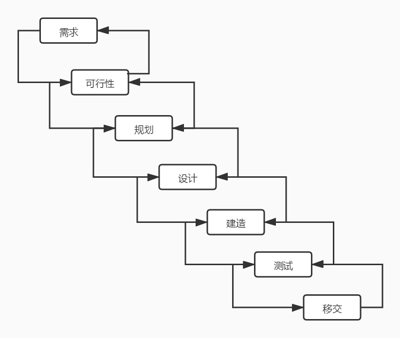
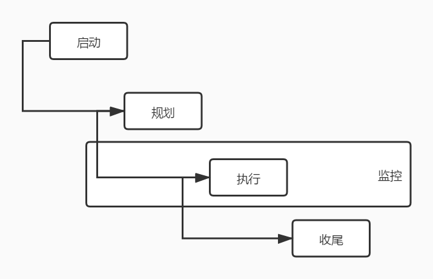

# 敏捷中的项目开发生命周期

每个项目管理理论中，都会提到一个项目生命周期的概念。关于生命周期其实很好理解，就是一个项目从诞生到消亡的整个过程，在这个过程中，一般会有几个重要的节点是我们需要特别关注的。比如说，我们的人生也是一个生命周期，出生、上学、高考、工作、结婚、生子、退休、养老、终结。这些就可以看作是我们人生的一系列的重要结点。生命周期一般就是描述这样一个从无到有再到无的一个周期。

当然，人生只有一次，但项目会不停的开始结束，这样，每个项目都会有一个生命周期的轮回。而敏捷的轮回则会更快，这个我们马上就要学习到。不过在此之前，我们还是要先学习一下传统的项目开发生命周期是什么样的。

## 传统的瀑布式项目开发

在上篇文章中，我们已经说过传统的开发方式是一种瀑布式的开发方式。它的过程其实不必详细的再进行解释了。我们只要记住一点，下图中的顺序一定是固定的，在没有完成上一个阶段的时候，是不能进行下一个阶段的。

就像我们的传统的 PMP 模式一样，所有的步骤都是有输入、输出和处理过程的，而每个过程又牵涉到其它的过程。在整个项目的开发过程中，从启动、计划，到实施、监控，最后进行收尾。这是一个完备的过程，这和软件开发中的瀑布模型其实也是非常相似并且对应的。

但是，敏捷并不是很推崇这种模式。或者说，敏捷更偏爱下面要说的两种模式。

## 迭代式开发生命周期

听说过敏捷的同学一定都听说过迭代这个东西。有的人说我们要迭代一个版本，有的人说我们要在这个迭代周期内完成什么，不管它指的是具体的软件版本，还是一段时间，这两字的含义其实都是一样的，那就是在整个项目开发过程中，切分出来的一个一个的小时间段。这一个时间段就是一次迭代。通过一次次的迭代，让整个项目更加清晰。最出名的针对迭代的概念的图示就是这个图。

从这个图中我们能看出什么呢？迭代就是不断丰富细节的过程。每一次的迭代，我们都应该让这个项目更加的清晰明了，细节也一步步地完善。

## 增量式开发生命周期

说完迭代式开发过程，我们再来说说增量，迭代和增量是所有敏捷教程都会说的东西，因为这两个东西很多人容易搞混。增量实际上是不断的添加待开始项目的产品的模块功能。就像搭积木一样地将不同的模板拼成一个完整的产品。同样地，也有一张图是专门针对增量这个概念的。

看出来增量和迭代的不同了吗？迭代的时候，有轮廓，不断完善细节。而增量，没有整体轮廓，上来就是细节完整的一个部分，不断地一部分一部分地完成，最终形成一个完整的产品。

补充：迭代和增量这两种图，同时对应 Web 应用中图片的两种展示形式，不知道大家有没有印象，在网速不好的时候，有些网站打开大图是一块一块出来的，而有些网站打开大图是先模糊然后一步一步清晰的。有兴趣的同学可以搜索查找一下 PhotoShop 中导出 WEB 格式时选择连续功能的作用。

## 混合式开发生命周期

将上面的迭代和增量合起来，也就是在一次迭代中同时包含着增量，这样的形式就是混合式的生命周期 。这种情况下可以很好地运用这两种开发形式的优点。其实，我们目前大部分公司中的迭代冲刺都是这种混合式的生命周期的开发形式。在每次迭代中，我们添加的新功能模块其实就是在整个项目的轮廓中不断添加完善细节。

但是，需要注意的，不管是考试还是面试，你还是要能清晰地说明白迭代和增量的区别的。此外，在混合的时候，每次迭代也可以看做是一次传统的开发过程，总之，混合就是各种混合，吸收各家优势。

## 总结

今天的学习主要是几种项目生命周期的了解，它们也是我们最常用的这些项目开发方式。说实话，现在除了一些非常传统的外包企业外，很少会是那种完全传统式的完整瀑布开发了。但是，真正完全的敏捷开发也是需要很多条件的，因此我们可以说，大部分企业内部都是混合式的开发。既有传统的开发形式的存在，也有迭代增量的体现，因此，我们在工作过程中，也是要结合实际的业务的公司情况，来选择最合适自己的方法。

参考文档：

《某培训机构教材》

《用户故事与敏捷方法》

《高效通过PMI-ACP考试（第2版）》

《敏捷项目管理与PMI-ACP应试指南》