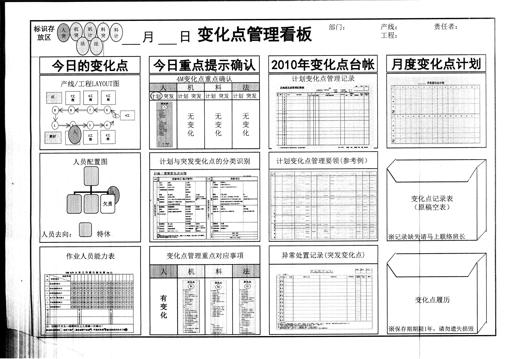
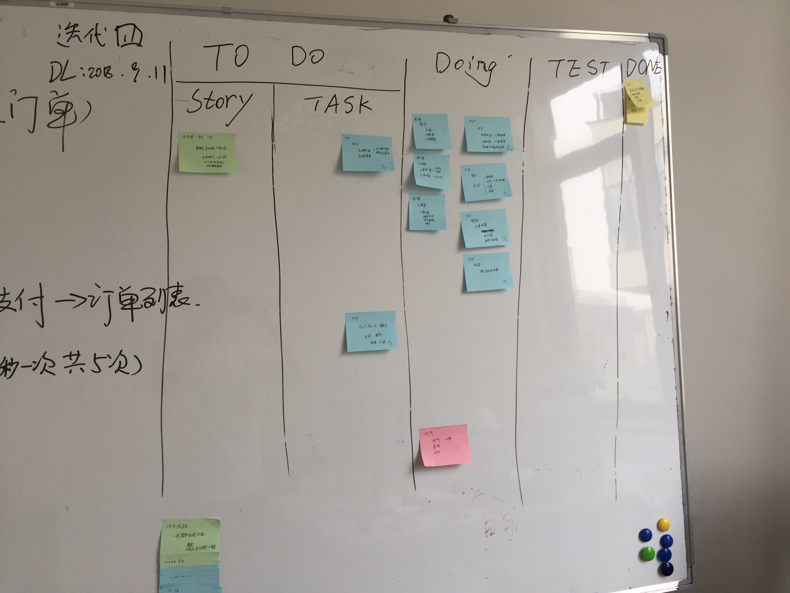

# 精益开发与看板

在出名的敏捷框架中，Scrum 和 XP 的大名想必不用我说，大家也略知一二。但是，既然是系统的理论方向的系列文章，同时也肩负着为一些第一次接触敏捷的同学进行科普的重任，我们还是需要一个一个的来说说各种不同的敏捷框架。当然，最重要的两个敏捷框架，我们也会在敏捷框架相关的系列文章中穿插进行学习。

首先我们要学习的内容，其实在严格意义上来说，并不属于敏捷框架的范畴。但是，它们又是所有敏捷框架，甚至是这个敏捷概念的起源。同时，它也是一系列的实践和方法论的集合，又有着框架的影子。高大上不？激动人心不？赶紧走起吧！

## 敏捷的起源

说到敏捷的起源，总会有不少文章提到那几个人和那个算是第一次的敏捷大会。在那次会议上，有了敏捷宣言和原则。没错，那次大会确实是敏捷的诞生大会，这一点是无可辩驳的。不过，我们这里要追溯的，是在敏捷诞生之前，也就是敏捷，有没有借鉴谁。

说到 “借鉴” 这个词。不好听点就是 “抄” ，好听点就是原来流行过一段时间的 “微创新” 。敏捷是诞生于软件开发行业，所以它吸收了传统瀑布流开发的许多经验，这是无可厚非的。同时，它又是一种项目管理的经验，所以传统项目管理中的一些内容也会体现在敏捷中。

但是，真正让敏捷成为敏捷的，反而不是软件行业中出现的什么管理变革。丰田生产线上的 “精益生产管理” 才是真正影响敏捷的，并且让敏捷真正敏捷起来的重要影响因素。

## 精益方法

是的，你没看错，精益方法确实就是起源于丰田生产线上，是正宗的传统制造业中产能管理的伟大创新。当敏捷先驱们看到它的时候，感觉这东西用在软件开发中也是相当不违和甚至是有许多好处的。这时，基于精益的理念就出现在了软件行业中，进而一步步地影响着敏捷先驱们，直到真正的敏捷宣言的诞生。

精益生产有一个最大的特点，那就是要消除浪费。这是源于汽车装配业的成本问题，拼装一辆汽车需要的零件有多少？需要的人工有多少？库存需要准备多少？消除浪费就是用最少的库存，最少的人力成本，实现最大的量产规模。对于到精益中，就需要 准时生产制 、 全员改善 。

准时生产，就是一个团队负责一个单元，注意，一个小团队。然后改善呢？就是每一次的任务之后所有全部的员工都会参与到建议系统中，进行持续不断地对业务流程和制作工艺的改善。小团队、任务（迭代、增量）、改善（回顾、持续集成），是不是有那么点敏捷的味道了？

我们先来看看一个普通企业可能在生产管理过程中带来的浪费和各种问题。它包括七种主要的浪费形式：过量生产、等待、运输、过度流程、库存、再作业和情绪。在这中间，包括 WIP 在制品、价值流图、拉动系统等也都是敏捷中的常用术语。特别是 WIP 在制品的概念，正大制作中的产品就是在制品，而减少 WIP 的数量，就是在消除浪费，在制品数量越多，上面的七种浪费也就越多越不可控。

而精益提供的一系列方法，就是针对上述的这些浪费而来的。也是精益的核心操作方法。

### 精益方法在敏捷中的应用

前文说过，精益不完全算是一种敏捷框架，但是，这不妨碍你在敏捷项目开发中遵循精益的一些理念。甚至说，你完全也可以将它视做是一个敏捷框架，而且是最简单的一种敏捷框架，只需要你理解下面这七点：

1.消除浪费

没错，第一个就是最核心的概念，我们要把浪费给消除掉。多余的会议、规划、文档、测试或某项功能，如果不做的话会不会也能取得我们想要的结果？如果答案是“是”的话，毫不犹豫地消除它。这也可以表现为一个名词，就是 JIT ，Just In Time ，在需要的时候，按需要的量生产所需的产品，没有一丝的浪费。

2.尽早交付

尽早交付，交付的是什么呢？不一定是一个完整的产品，当然，如果是传统制造业，就是要尽早地交付一个产品。但是在软件业，我们可以尽早交付部分功能，而不是整个项目。好吧，软件开发中的“持续集成”就是这个概念的衍生品，最好的尽快交付是什么？就是我们每次代码的提交，都能完成一次构建，都能马上让用户体验到这个新的功能，都能最快速地获得反馈。

3.强化学习

精益追求的是不断地、快速地学习和改进。无论你的团队有多强大，总会有可以改进的地方，所以当看到 Kaizen 这个单词时不要惊讶，它是日语 持续改进 的意思。那么如何改进呢？学习，积累知识，吸取经验教训，没别的方法。

4.团队授权

关于敏捷团队的问题，上篇文章中已经详细说明了。看到了吗？早在精益生产时期，在流水线上，给团队授权就已经出现了。

5.推迟决策

越早决策，就是越早决定我们要走哪条路。但问题是，往往在路口的时候我们才会清晰地知道我们要走哪条路。项目开发不是一次地图导航，即使是地图导航，在大数据的算法也，也会实时为我们更新更好的路线。所以，让决策来得晚一些，让团队有更多的选择。但，决策也不能太晚，有些东西错过了就是一生的遗憾，如何把握，这是门大学问。提示一点，参考团队的意见。

6.整体优化

在对局部优化的时候，往往也会影响到整个价值流。局部的优化，如果不能带来整体的效益，那么这个优化就是没有价值的。什么意思呢？代码模块的重构是有成本的，哪里的重构最重要？当然是最能影响整体的那部分。流水线上的产品，任何一个部分有优化，都有可能带来整个流水线效率的质的提升，如果不能带来这样的提升，那么不如不做。

7.全盘检视

团队是一个整体，整体创建的解决方案也应该是在全局的、完整的解决方案之上的。我们不能只盯着技术那一块，还要了解市场、商业、规范，甚至是人事调动、行政支持等等一系列的，与项目相关的内容。

## 看板

看板，英文名是 Kanban ，我去，你没看错，不过不是我们的拼音，是日文看板的英语发音。没错，这玩意跟精益是一个体系的，就是放在丰田那条生产线边上的一块白板。虽说就是一块简单的白板，但是它对敏捷的影响力可是非常恐怖的。比如说我们现在常用的一些项目管理软件，Worktile、Teambition、Twoer、Jira，甚至国产的禅道、钉钉的任务管家、腾讯的TAPD，只要说它是支持敏捷的项目管理软件，那么一定就有看板功能。是不是非常恐怖？

那么真正的精益看板是什么样的呢？

没错，看板就是使用一个大白板，而且在生产车间可能还会立着许多这样的白板。图中的每一块可能就是通过一个看板来展示的。标准的看板使用的是一种拉动系统，通过卡片表示出工序何时需要何数量，这其实就是限制 WIP 流动的一种思想以及 JIT 思想的载体。卡片沿着工序流动，不停地向下向后传递，直到这个零件或者组件制造完成，卡片就被取下并入到看板盒中。

综上所述，看板有着 管理流动 的能力，这是看板非常核心的功能。除此之外，我们还可以将任务的进度、耗费的资源也体现在一张白板上，比如我们后面要学习到的燃起图、燃尽图等等。这就出现了看板的第二个能力，它可以 度量 我们的项目。

在看板管理的不断发展过程中，又现出了单独的一些管理看板。比如说质量控制看板、信号看板、任务看板等。在软件领域，主要的就是这种任务看板。

比如我在实际的项目开发过程中，使用过的 Scrum 任务板。这个东西具体的内容我们将在 Scrum 相关的文章再详细的说明。

### 看板方法的核心实践

看板对于敏捷的影响够大吧？许多的敏捷著作都会提到一个问题，那就是到底是使用实物白板来当做团队的看板还是使用电子看板呢？其实各类教材都会回答你，条件允许的话，请在办公室放置足够多的实物白板，甚至是墙壁上挂上，或者隔间的玻璃，都可以当做白板。为什么呢？因为白板要带来的最大效果是可视化的工作流。

每个人，都可以在经过白板时不经意的看一眼白板上的内容，而很多有趣的事情，也很有可能就些发生。对于看板来说，这是一种 协同改进 的能力。让项目的所有信息公开、透明，让团队之间没有秘密，是敏捷的一个崇高理想。

通过上面的学习分析，我们其实就可以得出看板的五个核心实践：

1. 可视化工作

2. 限制在制品数量

3. 度量和管理流动

4. 协同改进

5. 显式化流程规则

也可以说，这五个方面是看板的最大的优点，也是在所有敏捷软件中，看板功能如此盛行的原因。不要以为你会用几个项目管理就够了，这下是不是理解这些软件背后设计的意义了。现在你还觉得这些看板功能只是一个记录 BUG 的工具吗？（我经历过的团队有些就是把这种工具当成 BUG 记录工具的）

## 总结

今天通过精益和看板，正式进入了敏捷框架的学习。其实就像文章中一直说的，这两个东西即是敏捷的一部分，又是敏捷的先祖之一，在各类敏捷实践中都占据着非常重要的位置。后面我们学习到的很多内容，其实都有精益的影子，所以我们把这部分内容放到最前面来，也是希望大家有个提前的预习。

下一篇文章，我们简单了解一下 极限编程 ，也就是大家口头上经常说的 XP ，到底这货有多极限呢？别急，一步一步来。

参考文档：

《某培训机构教材》

《用户故事与敏捷方法》

《高效通过PMI-ACP考试（第2版）》

《敏捷项目管理与PMI-ACP应试指南》

