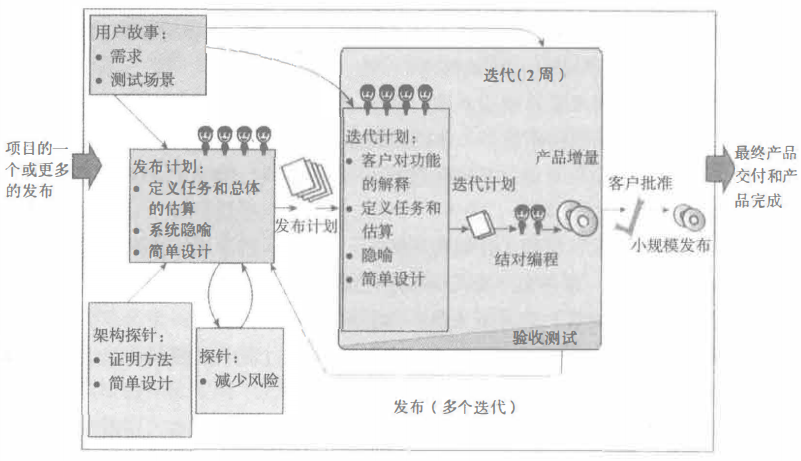

# 极限编程XP

一提到 XP ，很多人的第一反应是微软的那个操作系统。没错，XP 似乎已经是它的代名词了。但是，在敏捷领域，也有一个 XP ，而且也是一样的如雷贯耳。那就是传说中的 ExtremeProgramming 极限编程，它的简称就是 XP 。

既然就带有编程两个字了，很明显，这个理论框架就是出自软件开发行业。之前的文章也说过了，敏捷最初就是一帮软件大神搞出来的，而 XP ，不仅代表着敏捷，还代表着敏捷中的极限。即使你完全不了解这个 XP ，但有几个东西你一定听说过，重构、结对编程、持续集成、编码标准。我说出来了，那你也应该猜到了，这些东西都是 XP 的关键实践，也是 XP 大力推广的内容，甚至更有完全是 XP 创建的概念。

## XP的核心价值

XP 是由 Kent Back 这位大神创建的一个敏捷方法框架。关于这位大神，如果你要学习敏捷，他就是绕不过去的一个人。关于背景我们就不多说了，直接进入主题，XP 的核心是什么？只有八个字。

沟通、简单、反馈、勇气

沟通不必多说，任何问题到最后都可以归结为沟通的问题。特别是在敏捷中，沟通是解决各种问题的一剂万能药。而且，沟通不仅限于敏捷项目开发，传统的 PMP 中，也有专门的一个领域就是 项目沟通管理 。在 XP 中，会强调客户在现场、会强调两个程序员用一台电脑的结对编程、会强调使用隐喻来说明需求，这些，都是为了更好地沟通。

整个敏捷体系都推崇简单的做事，做好事。而 XP 更是将这个简单发挥到了极限，我们在做任何的项目时，都应该从最简单的方向入手，千万不要一上来就以淘宝的架构来设计一个 PV 过不了百的小网站。而是应该一步一步地，通过不断地重构来完善系统。同时，采用测试驱动开发，来保证代码具有极高的质量。

反馈，就是收集系统、客户和团队的各方各面的回馈信息，同时，就像上面的测试驱动开发，也是一种代码上的反馈。它与沟通和简单是紧密相连的。Kent Back 的原话是“编程中的乐观主义是危险的，而及时反馈则是解决它的方法。”

你有重构核心代码的勇气吗？你有提醒产品专家或客户代表不要过度设计的勇气吗。或许有的人天生就喜欢挑战自我，而有的人可能就喜欢循规蹈矩。在 XP 中，我们更倾向于用一组实践来诠释勇气，你只要在规则的限定下，在代码规范下，在测试驱动开发的框架内，那么，自然而然就能够有重构的勇气。你明白了价值是项目和产品最重要的部分，也通过沟通获得了客户的信任，那么，你也能够有勇气指出产品设计中的问题。

除了这四大核心之外，现在还有一个词也慢慢融入到了 XP 的核心思想中，那就是 “尊重” 。尊重团队、尊重客户，尊重产品，尊重代码，更重要的是，尊重自己。在一个项目中，做到对自己负责，能够有收获，提交的都是有质量的内容；对团队负责，能够有产出，信任他们的代码；对客户负责，能够有结果，相信产品的价值；反过来，他们也自然会尊重你。一个好的 XP 团队，会把尊重放在重要的位置，我们尊重的不仅是你的代码和能力，更重要的是，我们是通过团队成员间的信任，来达到真正的尊重。

## XP的生命周期

只要是牵涉到项目开发，就一定有一个生命周期的概念，PMP 是如此，XP 也是如此，后面我们要学习到的 Scrum 也会有它的生命周期。XP 的生命周期就如下图所示。

在这个图中，我们看到了 用户故事 ，注意，它很重要，在敏捷中，需求都会定义为 用户故事 ，关于它的内容我们后面还会学到。然后就是根据 用户故事 定义的 发布计划 。我们会在 发布计划 中包含 总体估算 和 隐喻 。在这里，需要记住的是敏捷中的估算都是相对估算，都是不精准的。

接下来，我们会根据 发布计划 和 用户故事 来确定每个 迭代中需要做的事情，也就是 迭代计划 。在这个计划中，通过客户对功能的解释会将 用户故事 进行更加深入的拆分，变成任务。之后就是通过 结对编程 来实现我们的产品。

当 迭代 结束时，或者到了 发布计划 制定的发布结点时，我们就需要通过 小规模发布 来实现产品的迭代、增量开发，从而达到敏捷的能力。

上述几个步骤，就是一个 XP 项目开发的整个生命周期过程，完整的产品最后就是通过这样不停地迭代实现的。在图中，我们还看到了 架构探针 和 探针 这两个东西。其实，它们是为了些特殊情况而使用的，比如说采用了新的技术、或者使用了新的架构、或者我们每一次尝试 XP 开发。这个时候，一个探针就像是一次测试的微型迭代。探针 是为了减少风险的，并且可能在整个项目开发中经常会使用到。

## 总结

本次列车还没有到站，为什么呢？在文章中，你是不是发现了一大堆新名词。可能有的你懂了，比如说 沟通、简单、反馈、勇气 在 XP 中的意义；有的你可能似懂非懂，比如 重构、小规模发布、结对编程；另外有些则感觉非常朦胧，就像 隐喻、简单设计 都是什么鬼。别急，关于 XP 的内容一篇文章可讲不完，下篇文章我们就将继续学习关于 XP 的一些关键实践，这些关键词也会一一解答。

参考文档：

《某培训机构教材》

《用户故事与敏捷方法》

《高效通过PMI-ACP考试（第2版）》

《敏捷项目管理与PMI-ACP应试指南》
