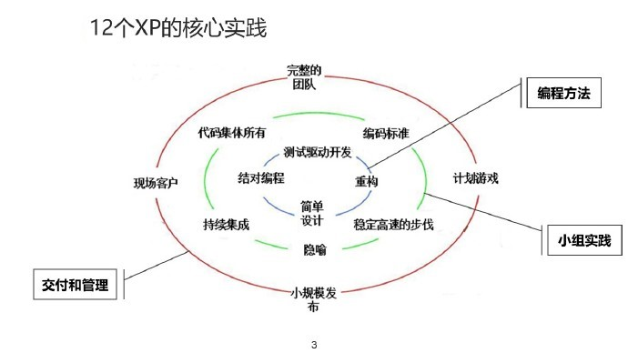

##  极限编程XP的关键实践(一)

提到 XP 的关键实践，就不得不拿出下面这张图。

看着眼熟不？是不是很多内容我们在上篇文章中其实都已经讲过了。没错，可能有些概念你很清楚，但有些概念你就完全没听说过了。今天，我们就来一次性地好好学习一下。看到图中的每一环了吗？最里面的是编程方法相关的，中间的是小组实践相关的，最外面的是交付和管理相关的，我们就从内到外逐一学习。

## 编程方法（一）：结对编程

一提到结对编程，估计写代码的人都会很感兴趣。但是转念一想：俩人一台电脑，一个写一个看，这个画风是不是有点儿暧昧...咳，这个如果是写代码还好，要是看一些别的什么不好的东西就真的很容易出事了，毕竟我们码农的口味是不好拿捏的。好吧，说正事，两个人一起写一份代码，感觉是很大的浪费呀！确实，也有很多人质疑，而且你在国内不管大小公司，很少能见到真正地实现结对编程的公司。为什么呢？的确这种做法不太适合我们现在越来越卷的互联网行业，毕竟我们是需要通过不停地加班 996 来实现一个人当两个人用的。不过，敏捷实践者们既然提出了这个做法，那么也一定是有它的可取之处的。比如：

- 所有的决定都不是一个人做出的

- 至少有两个人熟悉系统的每一部分

- 几乎不可能有 2 个人都忽视的测试或其它任务

- 改变组合对象（也就是换不同的人结对）可以让知识在组织内更好地传播

- 代码总在被审查

- 结对编程的效率比单独编程更高

其它还有一些优点就不一一列举了。咋眼一看，貌似还不错呀，不过就像前面所说的，在国内，或许有一些极限编程爱好者开的公司会用到，但大部分公司，或者说 99% 的公司中你都见不到。

## 编程方法（二）：测试驱动开发（TDD）

想必这个对各位码农来说也不陌生吧，从我们写代码的角度来说，就是先写测试再写代码，然后让我们的代码通过测试之后才算是完成开发。典型的框架就是各种单元测试框架，什么 JUnit、PHPUnit 之类的。这个吧，说实话，我这些年的开发之路上，也没用到过。为什么呢？还是一点，效率略低。不过，这种开发方式最后做出来的产品的质量的确是没话说的。

当然，要使用 TDD 也是有前提的，第一当然是领导和团队的支持，第二就是团队的编码规范完善，第三就是整体水平还不能太次。因为如果你一开始就把测试写错了，那么写出来的代码也不可能对。另外，如果滥用这些单元测试的话，还会让人走向极端，追求完美的 100% 的测试覆盖率，这也是不可取得。大部分情况下，从 60 分到 80 分，我们可能付出 100 分的努力就可以达到，而从 80 分到 95 分，可能需要付出 500 分的努力。但是从 95 分到 99 分，可能就需要 100000 分的努力，而 99 到 100 ，则有可能是 10 的 N 次方的努力了。当我们陷入到这种情况的时候，往往就会得不偿失。

TDD 最核心的测的是什么呢？在 单元测试 阶段，最需要测的是核心的算法，比如电商项目中的折扣金额之类的计算，返点优惠的计算等。在代码架构中，这些往往是服务层要解决的问题，所以，我们主要测试的目标应该是服务层的代码。从分层架构上来说，控制层分发请求，接收参数，做好效验方面的测试即可。模型层处理数据持久化，一定要注意入库数据的安全性和完整性，做好这方面的测试即可。而服务层，也就是我们公共的计算部分，承担着整个系统的核心，这些才是单元测试真正需要关心的地方。

当然，你也可以在控制层写服务，也可以在模型层写服务，总之，找出关键核心的处理业务逻辑和算法的地方，加强这个地方的测试覆盖率，不要盲目的以整体的测试覆盖率为标准，这才是 TDD 能够更好运用的重要方面。

理论归理论，这方面其实我并没有太多的实战经验，不过我也觉得测试覆盖率不能说明一切，也希望有经验的同学能够分享，可以评论里留链接或者加好友转载文章哦！

## 编程方法（三）：重构

这个词对于写代码的人来说就更不陌生了，甚至很多人在换到新的公司时，第一个建议就是咱们重构一下老项目的代码吧，因为前人写得太X了。当然，想法总是好的，但现实其实是很残酷的，真正的重构不是说我们要让所有的代码都变成你喜欢的代码。真正的重构是源于敏捷的不断迭代的重构。在两种情况下，我们通常会开始重构一段代码。

1. 实现某个特性之前：尝试改变现有的代码结构，以使得实现新的特性更加容易

2. 实现特性之后：检查刚刚写完的代码后，看是否能够进一步的优化

在重构中，有一个重要的概念就是 Don't Repect Your Self 也就是非常出名的 DRY 原则。从开发的角度来说，就是不要让一段相同的代码出现两次。另外，重构还和 XP 中的其它元素紧密相关，比如说代码集体所有制，让代码共享所有人都能看到代码，并且通过结对编程，你的重构也会被别人发现并指出优劣。需要完善的测试驱动开发机制，这样才能确保你的重构不会带来问题。简单的设计，会让你在重构的过程中关注最核心的部分，写出能够实现功能的最简单的代码。

通过上述内容，也就保证了 XP 中 勇气 的含义，让你能够勇敢的去重构。

## 编程方法（四）：简单设计

还记得 XP 核心思想中的 简单 原则吗？没错，设计是很重要，但是，我们应该从最简单的设计开始，通过迭代和增量不断地完善它，而不是一开始就做出一个复杂的设计来。对于简单来说，并不是说所有的设计都很小，只是过我们需要的是尽可能简单的设计它，让它尽快跑起来，通过持续发布来不断验证和完善。

之前听说过一个故事，也是程序员间的笑话。一个公司上来就是各种高精尖的技术，各种高并发的处理，引入了一大堆阿里、腾讯的功能实践。结果呢？每日最高只有可怜的几百日活。而这个项目做了多久呢？几百人的开发团队，一年的开发时间，最后不了了之。

还好，目前大部分公司都不会再干这种事。甚至很多公司都会以 MVP(最小可行版本) 的形式来进行新项目的开发。这是好事，也是值得提倡的。那么，在 XP 中，对于简单设计有什么建议吗？

1. 编写测试代码

2. 保持每个类只负责一件事（单一职责原则）

3. 迪米特少则（最少知识原则）

4. DRY 原则

5. 简单的设计需要简单的思考，要有勇于重构的勇气和定期重构的习惯

## 小组实践（一）：持续集成

持续集成也是我们码农们经常听到的一个名词，甚至不少人也使用并实践过 Jenkins 、Travis CI 这类的持续集成工具。但是你知道吗？这些工具的诞生也正是因为受到 XP 的影响。

持续集成的关键点是什么？不断的编译整合代码，在你将代码提交到 Git 的时候，测试环境就开始进行单元测试，如果没有通过，那么会报出异常，如果通过了，就会直接打包代码。这样就可以使代码随时保持在可以发布的状态。因此，随时整合，越频繁越好，集成及测试过程的自动化程度越高越好，这就是持续集成的根本概念。

一般在自营业务的公司，都会有一个固定的代码上线时间，一般快一点的可能是每周一次。而持续集成期望达到的最低标准也是每日集成，也就是每日都能让代码进行上线。当然，依托现代化的这些持续集成工具，其实我们真的可以做到随时提交随时集成并上线。

## 小组实践（二）：隐喻

初看 隐喻 这个词感觉很神秘呀，这个玩意是什么意思呢？比较官方的解释是 “隐喻是一种语言表达手段，它用来暗示字面意义不相似的事物之间的相似之处”，用俗语来说，就是将设计模型、开发模式这些关键概念抽象化为一些比喻。就像一个经典的说法，你能给一个完全不懂软件开发的人讲明白数据库是干什么的一样，在这其中，相信你也会使用很多的比喻。比如说，数据库就是一个书店，我们要从这个书店中一个个的书架上找到想要书的，等等等。

在 XP 中，隐喻的作用主要是加强客户和程序员之间的相互理解，消化积累知识，指导设计的开发方向。具体来说，它可以帮助我们：

1. 寻求共识

2. 发明共享词汇（属于我们团队与客户交流的词典）

3. 创新的重要手段（有时候恰当的比喻能够激发更多的灵感）

4. 描述体系结构（让抽象的概念更加好理解）

## 总结

今天的内容多吗？还好吧，因为我们的 XP 关键实践有 13 个呢，后面还有一篇文章要继续学习的。不知道大家发现没有，XP 的实践完全是和软件开发密切相关的，这也没办法，毕竟 Kent Back 本身就是一名软件大师。你知道吗？设计模式实践的先行者、《重构》作者 Martin Fowler 的好友同时也为这本书提供了不少内容、XP 和 TDD（JUnit） 的创始人，这一堆名头说的都是他。大家别急，下篇文章我们将继续膜拜大师的作品，继续我们的 XP 之路。

参考文档：

《某培训机构教材》

《用户故事与敏捷方法》

《高效通过PMI-ACP考试（第2版）》

《敏捷项目管理与PMI-ACP应试指南》
