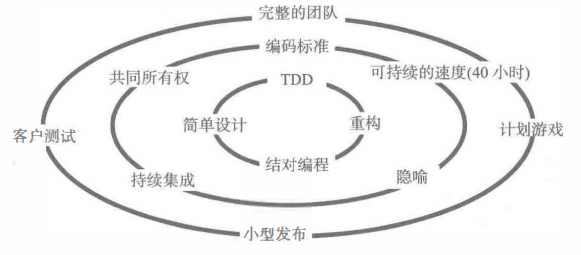

# 2.4极限编程XP的关键实践（二）

首先，我们依然是从这张图开始。

上篇文章中，我们已经学习过的内容是最里面的那一圈的，也就是编程方法相关的四个内容，另外还加上中间那一圈的两个内容。本来我是计划一篇文章写完 XP 的这 13 个实践的，不过很明显，我失策了，每一点一不小心就会写很多，于是，只能再起一篇文章写后面的内容。、

今天的内容，我们将继续聚焦小组实践剩余的两个关键实践以及交付和管理相关的内容，我们就一个一个的继续来看吧。

## 小组实践（三）：编码标准

编码标准这个东西，看似和编程的相关性更大，但为什么会划分到小组的实践中呢？其实这个东西吧，一说出来大家就明白了。XP 的目的，就是为了让小组有一个严格和规范的编码标准，这样就能代替文档，让代码能为小组成员间交流的工具。你说，这是不是一个小组工具呢？

我曾经待过的一个公司，也不算是特别大的公司，是一个上市公司的子公司。程序员吧，说多不多，说少也比小作坊强的多。我在其中感受最深的就是，我们所有 PHP 工程师写出来的代码基本都是一样的。什么意思呢？如果没有注释，如果没有 Git 记录，你可能很难分辨出这段代码是谁写得。我们在入职的时候，都会熟读一份编码标准的文档，然后统一都按这个文档来执行。并且在 Code Review ，也就是代码审查的时候，也会在团队的指引下对不符合规范的代码进行查证。

当然，这只是一个实例，好处自然不用多说，各个部分自解释，沟通确实是不需要文档，因为他的代码一拿过来我就知道这一段或者那一段是在干什么。另外，我随时可以迅速的维护另一个人之前写过的内容，只需要重新熟悉一下数据库而已。坏处嘛，也有，确实这样的工程会缺少一些灵性，很多东西会写得过于死板。但是对于大公司或者大型的项目而言，它的好处是毋庸置疑的。

从上面的例子以及前人的经验来说，我们可以总结出编码标准的七个原则：

- 不要预先花费太多时间

- 目标应该是团队中没有人辨认各自的代码

- 以团队为单位对某一标准达成协议，然后遵守这一标准

- 不是事无巨细的规则列表，而是确保代码可交流的指导方针

- 编码标准开始时应很简单，然后根据团队经验逐步进化

- 创建能够工作的最简单标准，然后逐步发展

- 只制订适合本团队的

## 小组实践（四）：集体拥有代码

这个概念其实现在在日常的企业中也开始越来越多的出现了。那就是代码是“我们”的，而不是“我”的，也就是说，我们都可以修改任何人的代码，这个代码也是属于任何人的，而不是某个特定的人。不过，你改动没关系，但请通过我的测试，如果测试有问题，那么提交之后就会影响线上的运行，进而影响整个团队。从这里来说，又和之前讲过的测试驱动开发联系上了，果然还是一环套一环啊。

另外，光是测试还不够，我们还要有 编码标准 ，可以 结对编程 ，能够进行 简单设计 。这一系列相关的实践操作能够在团队内灵活运用的话，才能说我们的代码可以达到真正的集体所有。

在现实的我们现在的业务开发中，说实话，前后端分离的项目其实还是无法达到这样的集体拥有代码的。一个敏捷团队甚至可能只需要一个前端工程师，于是跨敏捷小团队范围的代码也是可以共享的，前提是这不同的小团队应该是服务于同一个大的项目。而人数不多的小范围集体拥有代码也是敏捷所推崇的。

## 小组实践（五）：稳定高速的步伐

这个应该是所有码农都喜欢的，而所有管理者都讨厌的一个东西了。为啥呢？稳定两个字透露出来的是什么含义？就是别突然给我加班呀。我们要保持一个稳定的速率，在每个迭代周期内应该完成差不多的东西，并且让团队把注意力集中起来，专注地在工作时间内完成更多的东西，这样就能够达到高速的目的。

嗯，老外那边对于加班这个问题确实还是看得比较重的。其实硅谷的大公司加班的不在少数，但他们确实也把待遇和金钱给到位了。而国内的公司，除了少数头部大企业之外，很多小企业确实只是想要培养狼，却不给狼吃肉的这种尴尬状态，也就是我们最常说的 996 ，而且小企业还是根本没有任何补贴的 996 。

这个东西吧，不多做讨论了。毕竟我还在一个大小周的公司上班，虽说没有到 996 这个地步，但确实还是每两周都多了一天的上班时间。有些东西，年轻的时候经历一下可以，但上了年龄之后，不要羞于谈条件了，改变不了的话就谈条件，该得到的应该要去争取。

## 交付和管理（一）：完整的团队

XP 所期望的完整的团队是什么样的呢？不是你想的什么美工、前后端、运维这些人到齐就行了。而是包括上述人员之外，还有客户、测试、产品、项目等各种角色的人一起。当然，这些人最好还是之前讲过的 T 型人才，一门精通，还顺便能了解其它的高级人才。

在 XP 中，没有强调团队的人数，不过依据敏捷的原则来说，团队人数也不宜过多。要想凑齐这样的一个包含全部人员的团队其实还是有难度。如果有条件的话，可以让客户、测试、产品这些尽量多参与，并且尽量坐得离我们的团队更近一些。只要能够达成有效、快捷的沟通，那么我们的团队就是一个完整的团队。不限于任何形式。

## 交付和管理（二）：计划游戏

计划就计划，怎么扯到了游戏上？传统项目管理最擅长做的是什么？计划！传统项目管理最让人受不了的是什么？计划！做计划，本身就是一件说起来容易做起来难的事情。想想你在每年的年初立过多少 Flag ，又有多少能够做到。

在 XP 中，我们将计划称为计划游戏。用游戏这两个字其实是想让 计划 这个东西变得轻松一些。因为传统的项目管理中，特别是在 PMP 中，你会发现大部分的东西都是在 规划过程组 中做的，最后形成的那个 项目管理计划 更是一幅 鸿篇巨制 。但结果呢？大部分的项目最后的结果都不一定甚至很大程度上会偏离那个写了很久的 项目管理计划 。

而 XP 中的计划，是通过不同的阶段进行的，并且是贯穿整个项目开发过程始终的。

在探测阶段，客户和开发人员会产生评估和用户故事。

在计划阶段，客户和开发人员一起制订、发布计划（包含每一次的发布计划、每一次的迭代计划）

在调整阶段，客户和开发人员一起针对开发过程中的实际情况，对计划不停的调整甚至制订新的计划

这就是 XP 中的计划游戏，千万别被 游戏 这两个字误导，它和游戏还真没什么关系，只是一种制定计划的方式。我们在 Scrum 中也会看到 Scrum 是如何来制定计划的，跟 XP 的还真不太一样。

## 交付和管理（三）：现场团队

在这其中，客户是非常重要的。通常来说，客户是很难跟我们天天在一起工作的。这时候，可以选择一个 用户代表 来代替客户的职责。如果有不清楚的地方，他能随时和客户方进行快速地沟通。通常来说，让团队中的产品负责人来担任这个角色会比较好。

## 交付和管理（四）：小规模发布

小规模发布的另一层含义就是能够频繁地发布。有多频繁呢？最佳选择就是每一次的持续构建之后，马上就进行发布。当然，这也要视我们开发的情况而定，大部分情况下，我们的一次迭代所能交付的，应该就是可以上线正式运行的功能。但是，一些大型的功能可能需要受制于其它功能的迭代开发完成才能一起上线，这时，就需要再等一两个迭代。当然，也可以制定对应的发布计划，比如几个迭代之后会有一次全量发布，而每次迭代都是一次增量发布等。

对于小规模的发布来，可以降低项目开发过程中的风险，也能够快速获得用户的反馈并且及时响应，这同时也促进了开发团队与客户之间的交流。不过要实现小规模发布，也需要在有测试驱动开发、持续集成、代码重构以及优良的编码规范的前提条件下，才能让小规模发布能够有条不紊地执行。

## 总结

怎么样，XP 的实践是不是让你怦然心动。不过还是那句话，这些实践有的很容易实现，有的却很难，具体怎么取舍，还是要看你所在的组织情况以及领导的支持态度。而更多的情况是，这些实践已经不单单是 XP 中所独有的，也不是一定要完全遵守的。因此带来的就是，很多实践我们会在不怎么执行敏捷的企业中看到，而有实践则可能在贯彻敏捷的团队中却无法发现。

参考文档：

《某培训机构教材》

《用户故事与敏捷方法》

《高效通过PMI-ACP考试（第2版）》

《敏捷项目管理与PMI-ACP应试指南》
