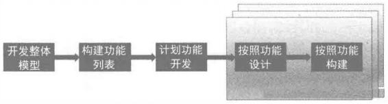
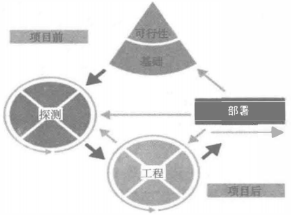
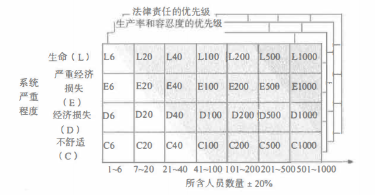

# 其它敏捷框架

你们一定想知道为什么不接着讲 Scrum 呀？干嘛中间横插一脚。好东西嘛，当然要留到最后，所以我在这里也就卖个关子，先陪着大家一起来学习一下其它好玩的敏捷框架，或许你能发现不一样的东西哦！

## 特性驱动开发

在 XP 中，有一个概念跟它的名称特别像，叫什么大家还记得吗？没错，测试驱动开发，英文是 TDD 。而特性驱动开发的英文是 FDD ，这俩货的名字是不是非常非常类似。但是，它们描述的东西可是完全不同的。测试驱动开发更专注于代码层面的，是以测试为主的一种开发方式。而特性驱动开发，则可以看成是一个种敏捷的框架。

特性驱动开发首先为产品开发一个整体的模型，构建特性列表和工作计划，然后团队对开发的特性进行设计和构建，就像下面的图一样。

其实说白了，特性驱动的开发步骤就是这些，看着很简单，但实际上却很难。要知道，能够在一定的领域开发模型必须要有这个领域的许多专业知识的，如果没有相关的这些知识，不能建立良好的模型的话，后面的一切都无从谈起。

接下我们就来看看特性驱动开发的一些良好实践，当然，它们也是从软件工程中衍生而来的。

1. 领域对象建模

对象分解的一种形式，其实就是面向对象开发中对于对象的定义过程，并且描述所建立对象之间的关系。领域对象建模为系统设计提供了一种整体框架，使得系统可以按照特性冲刺增量地进行开发。前面说过，这个过程，一是要对软件开发中对象的概念非常清楚，有一定的架构能力，二是要对所要开发产品的领域非常熟悉，这样设计出来的对象和类才更加好用。

2. 按照特性开发

这里就是按照一组小功能、对客户有价值的功能列表进行开发并跟踪过程。FDD 会将需求问题分解成可以解决的小问题，将每个问题分解为分层列表的功能需求，这个功能需求就是“特性”。设计并实现每个特性的过程就是特性驱动开发的核心过程。如果具体到软件开发中，面向对象中的“类”这个东西，就可以看作是一个“特性”。

3. 类（代码）拥有权

FDD 规定每一个类都有一个指定的人或角色负责类代码的一致性、性能和概念的完整性。FDD 推荐的是使用面向对象的开发方式，在面向对象中，类是一个单一的概念实体，具有不可再分的特点，因此，代码的所有权也可以看作是类的所有权。注意，它并没有和 XP 中一样代码共享的概念，不过不说并不代表没有，但是不同的是，在 FDD 中每一个单独的类一定是有一个人或角色来负责的。

4. 特性小组

有的时候，一个类也就是特性，可能会牵涉到多个类及其所有者，所以，特性的所有者（特性组长）需要协调多个开发人员的工作。特性小组和开发小组非常像，但是，特性小组的组长更像是敏捷教练，而不是一个技术高手。

5. 审查

也就是代码的评审和检查，包括代码审查、走查、自查等。

6. 配置管理

这个对于做软件开发或者 IT 行业的人来说也不会陌生。一是代码管理工具，要随时可追溯可还原；二是要有统一的配置中心，可以实现各种开发环境的快速配置切换。

7. 定期构造

类似于 XP 中的小规模发布，在 FDD 中没有持续集成的概念，但是却有一个定期构造也就是将代码要定期集成到正式代码中的概念。其实这一步又是比较类似于小规模发布的步骤，目的也是为了更容易地创建演示程序，也就是让功能达到可以向客户展示的状态。

8. 可视性进度报告

可视性进度报告就是包括但不限于使用各种敏捷类的图表，或者其它非敏捷的，只要能够有效地反映项目进度情况的图表。当然，更推荐的是白板、大屏这些可视性效果极佳的方式进行进度报告的展示。

## 动态系统开发

动态系统开发的英文简写是 DSDM ，也可以称为业务中心框架开发方法。它倡导的是以业务为核心，快速有效的开发方法。它是一种控制框架，重点在于快速交付、并补充如何应用这些控制的指导原则的框架。

DSDM 的基本观点是，用 20% 的时间去完成 80% 的功能，以适合商业目的为准。然后在冲刺阶段，对功能进行进一步的完善。乍一看，这和我们的 2/8 法则很像呀。没错，我们日常使用的软件，其实大部分情况下，你只使用它 20% 的功能，而另外 80% 的功能你可能根本都不知道。同样的，我们也会将我们使用软件的 80% 的时间消耗在那 20% 的功能上。这些都是 2/8 定律的体现。具体的内容后面我们学习 PMP 或 信管师 的内容时还会讲解（大家可以先自行查阅 2/8 定律或帕累托法则相关的内容）。而 DSDM 之所以说快速地用 20% 的时间去完成那些功能，是因为 DSDM 认为任何事情都不可能一次圆满完成的，但我们可以在一个短时间内快速地实现大部分的功能，不用过多关注它们的质量，而在后面的迭代中再继续去优化完善。

DSDM 的周期过程有 7 个阶段。

1. 项目准备阶段

2. 可行性研究阶段

3. 业务研究阶段

4. 功能建模阶段（冲刺式）

5. 系统设计编码阶段（冲刺式）

6. 实施阶段

7. 项目后期

DSDM 的过程图如下所示：

## 水晶方法

水晶方法其实也是很出名的一种敏捷框架。如果说现在最流行的是 Scrum ，最极客的是 XP ，那么最全面的就是水晶方法。它的英文简写是 Crystal ，但它又有一系列的开发方法，包括Crystal Clear（透明水晶）、Crystal Yellow（黄水晶）、Crystal
Orange （橙水晶） 和Crystal Red （红水晶）， 分别适用于不同的项目。项目可以按照参加人员和重要性划分。重要性根据项目中的错误引发的后果分为：C一－Loss of comfort 
（某些不舒适）、D一－Loss of discretionary money （经济损失）、E一一Loss of Essential 
Money （严重经济损失）、L一－LifeCritical （生命危险）。

Crystal Clear适用于C6,D6项目；Crystal Yellow适用于C20,D20,E20项目；Crystal
Orange适用于C40,D40,E40项目；Crystal Red适用于C80,D80,E80项目。

上面的内容看得晕吗？晕就对了，水晶方法本身就是可以写一本书的，就和 XP 、Scrum 一样，拥有非常复杂的体系内容。我们这里了解一些名词概念就好了。其实，水晶和 XP 很像，只是 XP 会要求很高的纪律性，而水晶则是希望用最少的纪律性约束却仍然能让项目成功，从而在产出效率与易于运作上达到一种平衡。也就是说，水晶的产出效率可能不如 XP ，但它却能让更多人乐于接受并遵守它。

水晶方法包容很多敏捷原则，最主要的有以下几点：

1. 频繁地交付：不多说了吧，XP 的小规模发布。

2. 反思改进：还记得 XP 中的重构和勇气吗？以及我们后面马上要学习到的 Scrum 中的回顾会议，都是为了反思改进。

3. 渗透式沟通：新名词呀？其实并不新，敏捷各个框架中都强调的让团队坐在一起，没有隔离，让客户也尽量和我们坐在一起。然后呢？在其他人讨论的什么内容的时候，你也会不知觉地听到一些，如果和你有关或者你的兴趣的话，自然会加入讨论，如果你正忙于其他事情，也不会因为这种背景听觉而分心。注意，一定不是大声喧哗式的叫骂型沟通，那样就适得其反了。这种通过背景听觉来实现的就是渗透式沟通。

4. 个人安全：其实就是团队间的信任，不用担心报复与敌对，这很考验敏捷教练或者项目管理者的团队协调能力。

5. 焦点：确定首先做什么，然后安排时间。确保团队成员清楚了解他们自己最重要的任务是什么，确保他们有充分的时间去完成。

6. 与专家用户建立方便的联系：和能够提供意见建议的专家保持联系，听取他们的意见，相信是所有产品项目开发时都会关注的内容。专家的意见往往能够带来权威的影响，继而影响项目后续的方方面面。

7. 配有自动测试：好吧，TDD 和 持续集成 是不是真的很重要，到处都是它们的身影。

## 总结

今天一口气了解了三种敏捷框架，是不是感觉意犹未尽。如果确实还不够爽的话，大家就自己查找一些相关的资料进行更深入的了解学习吧。我们的这系列文章还是以 PMI-ACP 的教辅资料为主要参考的，所以这方面的内容会比较少，主要就是因为考试不怎么考这些内容呀。不过这样也好，这篇文章也是 XP 之后的一个过度，因为下面几篇文章又是一个重量级的敏捷框架：Scrum 。

参考文档：

《某培训机构教材》

《用户故事与敏捷方法》

《高效通过PMI-ACP考试（第2版）》

《敏捷项目管理与PMI-ACP应试指南》

