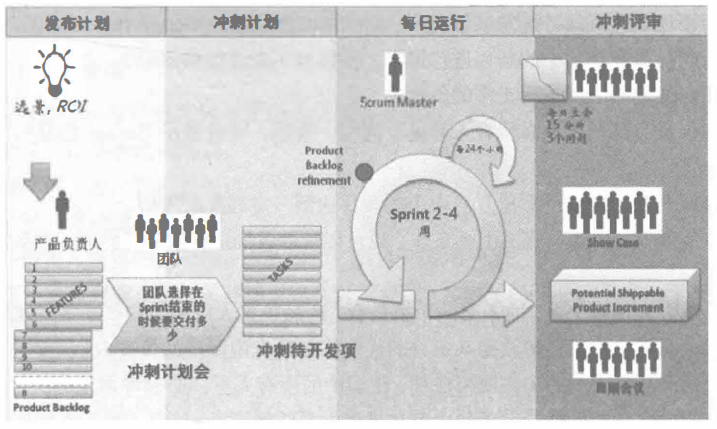

# Scrum框架

但凡接触过一点敏捷的小伙伴，一定会听过 Scrum 的大名，为啥呢？因为各大互联网公司确实都在应用很多 Scrum 的实践。比如我学习过的网易云课堂的项目管理微专业课程，里面的讲的基本上就都是 Scrum 的各种东西。

而其他很多头部公司的项目管理部门相关的公众号，也经常会分享一些 Scrum 的经验，这一切都说明一个问题，Scrum 是现在最流行的敏捷框架。

## Scrum的由来

这个由来嘛，大家可以自己百度一下，这个名词是在诞生于 橄榄球 运动的。但是在这里，我想说的是一个重点问题，那就是 Scrum 的诞生是为了解决什么问题。

在项目管理领域，有两种项目类型，一是非常确定各个步骤流程细节的项目。就好像我们传统的工程制造或者盖楼。虽然也可能有各种临时问题的出现，但经过少则1、200年，多则几百年的发展，其实很多工序都已经非常成熟了。对于这类项目来说，传统的 PMP 那种计划式的项目管理其实并没有什么太大的问题。在面对突发事件的时候，只要是有经验的项目经理，都会运用各种储备来解决。当然，最主要的就是很多东西都已经很成熟而且不会有太大的变化了。

但是，进入信息爆炸的互联网时代后，传统项目管理的弊端就暴露出来了。科技进步太快，时代风向的转变也太快。就像之前我们说过的，你完整的计划完，再按步骤一步一步地开发出来，或许风口早就过了。这个时代需要的是什么？快速验证，尽早试错，持续更新。这不就是敏捷的理念嘛！

另外，现代软件的复杂性或许对于不太了解软件开发的人还不清楚。不管是软件还是硬件，都在向越来越复杂的方向发展。硬件知识我不太了解，但是现在 CPU 的技术想想都很可怕，而软件方面 Windows 系统的源码就算是一个超级高手，可能用一辈子的时间也读不完。更别提各种大数据应用中存储的各类数据，每天都是以海量在递增。量级大小决定了一个严重的问题，那就是 熵增 的不断增强。熵增 就是说物质总是在从有序变得无序，你之前以为的有序也是更早前有序所演化成的无序混乱，事物就是在一步步地向更复杂、更混乱的情况下发展。软件技术如此，软件开发的管理也是如此，就拿员工职位来说，早十来年，哪有什么前后端分离，而现在呢？前端都已经可以成为一个工程化的部门了，人员越来越多，管理呢？当然越来越混乱。

Scrum 说白了，也是在这两种情况下出现的，它要解决的问题也无非就是这两个：变化和混乱。而且它不局限于你使用什么方法，也就是说，它也是一个包容性很强的框架。你可以在 Scrum 中应用 XP 的理念，但是，你要遵循一些 Scrum 的内容，这些内容就是一些流程、计划、模式的应用，远没有 XP 那么详细的偏向于软件开发。也因此，Scrum 的应用范围会更广一些。

## 与 XP 的不同

1. 迭代时间

一般来说，Scrum 的迭代时间要求会比 XP 长一些，XP 会更倾向于比较极限的 1-2 周的迭代时长，而 Scrum 会更倾向于 2-4 周的迭代时长。当然，这个东西还是看我们的组织情况和项目情况来定的。、

2. 迭代中的需求变动

XP 是允许在迭代中修改需求的，如果在迭代未结束前，发现需求有问题，XP 是可以考虑替换、添加、删除需求的。而 Scrum 则会在迭代开发结束前锁定需求，在这个过程中，不能添加新的需求，由 Scrum Master 把关，防止其他人干扰团队的工作。

3. 故事优先级

XP 在开发的过程中，会要求按照需求的优先级来做。但是 Scrum 不同，它会在每次迭代计划会议的时候，根据团队的速率，以及项目的进度、要求，由团队来决定这一次迭代要做的东西。

4. 对工程质量和进度的保证

Scrum 没有这方面的强制保证，完全是信任团队的状态，最多就是有一个迭代结束之后的评审会议。而在 XP 中，会要求 TDD 、持续集成、结对编程、简单设计、重构等一系列的保证措施。

虽说有这么些不同，但是，在每个迭代的具体开发过程中，Scrum 是欢迎使用这些 XP 中的良好实践的。因为这些并不影响整个流程，甚至运用得当还会对整个流程有益。因此，Scrum 更像是一种偏管理的实践，而 XP 则更像是偏开发的实践。两者并没有绝对的利益冲突。

## Scrum的三大支柱和流程图

在 Scrum 中，有三个重要的支柱支撑着 Scrum 的各个方面，它们也是我们后面讲的 Scrum 实践的理论基础。

1. 透明性

透明其实很简单，就是对于影响将会成果的各个方面，对于所有参与交付的人、管理生产成果的人来说，都应该是清晰透明的。对于交付成果，所有人都已经有一个统一的认识，所有人也能理解现在的交付是不是我们想要的成果。这一点是不是很像 XP 是的 集体拥有代码 ，前面就说过，XP 是更偏具体的技术实践的，而在 Scrum 中，则扩展到了全局范围。所以，不管是代码，文档，概念，进度，成本，指标，总之一切与项目有关的东西，都是透明的。

2. 检验

在项目的开发过程中，各个方面都要做到充分的检验，确保能够及时发现整个开发过程中的重大偏差。通过定期的，一般是迭代后的检验，也可以使团队发现需要改进的地方。这个我不多说了，大家想想是 XP 哪些实践的扩展。

3. 适应

如果在检查之后，发现有一个或多个方面不满足验收标准，并且最终产品都有可能是全格的，那么，我们就必须对整个过程进行调整。调整过程必须要尽快实施以减少偏差。这个又是对应着谁呢？大家仔细想想哦。

从这里也可以看出，其实这三大支柱也就是我们敏捷整体思想的一个简要概括。万变不离其宗，最主要的依然还是要把握敏捷宣言以及那 12 条敏捷原则。

最后，我们再来看看 Scrum 的整个过程图。

在这个过程图中，又出现了一些没听过的名词，别急，后面我们要讲的东西就全在这张图里面了。

## 总结

今天的内容其实就是 Scrum 的一个入门讲解，我们了解到了 Scrum 诞生的原因，看到了 Scrum 与 XP 的不同，最后还点出了 Scrum 的三大理论支柱。当然，最重要的是最后这张图，因为我们后续马上就要来讲这张图上的内容了，期待还是兴奋呢，我想你应该和我一样，准备全力冲向 Scrum 了吧，加油少年。

参考文档：

《某培训机构教材》

《用户故事与敏捷方法》

《高效通过PMI-ACP考试（第2版）》

《敏捷项目管理与PMI-ACP应试指南》
