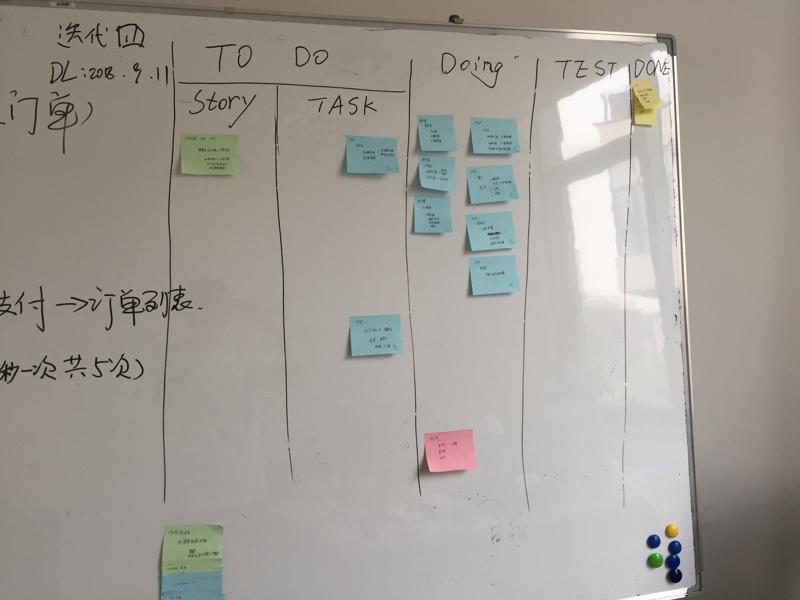

# Scrum流程与实践

相信通过前面一篇文章的介绍，你已经对 Scrum 有了一定的了解了。但是这玩意怎么用呢？XP 的实践如果是做过软件开发的同学，或者是带过软件开发团队的同学一定或多或少的都接触过，至少也是听说过。但就像上篇文章说过的，XP 很偏重于具体的软件开发实践，而 Scrum 则更全面地渗透到管理层面，更加的宽广包容一些。还记得上篇文章中最后的那个 Scrum 过程图吗？

今天我们讲的东西都是这张图里的东西。下面我们一个一个来看。

## 团队三角色

在 Scrum 中，团队里面有三种角色，也就是图上的带人形的图标下面标示的三种角色。

### 产品负责人

产品负责人，英文是 Product Owner ，简称 PO 。这个英文名我们还可以翻译为 “产品拥有者”。看出来和我们传统的 产品经理 的不同了吗？没错，名字不同，哈哈哈哈！

其实他们之间的关系很微秒，PO 也是一样的从市场上获得信息，确定产品的方向和收益回报，并将需求反映给开发团队。因此，PO 的一个重要职责就是对 需求列表 的管理。在 Scrum 中，也就是对我们后面要讲的 Product Backlog 产品待开发列表 的管理，包括清晰定义待开发项，明确优先级排序等。

同时，PO 还代表着相关方，也可以代表客户或者用户方，如果我们不能实现 XP 中的现场团队，那么 PO 就要充当那个 客户代表 的角色。在开发团队和客户之间构建桥梁。你说这个角色重要不重要？

在现实的开发团队中，我们完全可以把 产品经理 等同于 PO ，但是，需要注意的是，在 Scrum 中，PO 一般是和一个 Scrum 小组一起的。而我们的现实公司中，往往产品经理需要关注多个产品线或者跟进多个项目。另外，产品经理 一般会需要画草图、原型图等，而 PO 中没有明确的说明需要画这些图，Scrum 中的 PO 只要管理好 Product Backlog 就好了，这个东西，往往就是一个个的用户故事。

### 团队

这里的团队就是传统意义上的开发团队，开发产品、发布产品就是他们的职责。开发团队应该由专业人士组成，但规模也不宜过大，而且更加推荐的是拥有 T 型能力的专业人才。开发团队一般是由组织构建并授权，能够理解 PO 的业务需求和每一个冲刺的目标，对产品的“完成”每个团队成员都有清晰的概念。理想的人数是 7-12 人，为什么是这个人数呢？我们在后面的文章中还会了解到。

麻雀虽小，但五脏还是要俱全的。一般在软件公司，要组织这样的团队，一个 UI ，一个测试，两三个后端，两三个前端就差不多了。如果有特殊的需求就可能还会有不同的专业人士的加入，比如说如果是重设计的项目，那么 UI 可能就会多些；如果是重数据库的项目，那么就可能会加入 DBA ；如果是大数据或 AI 项目的开发，那么高端的大数据工程师以及算法工程师就必不可少。这些，都是按项目情况而定。

那么，如果有特殊的需求确实需要很多的人手怎么办呢？同样地，卖个关子，我们还是需要去后面团队相关的文章中在进行深入的学习讲解。这里我们主要还是以 Scrum 的学习为主。Scrum 团队还有几个特点：自组织的，没人会告诉团队成员怎么把待办列表转化成产品特性，所以，划重点了，PO 不用画原型；开发团队是跨职能的，上面已经说过了；Scrum 中的开发团队成员是没有头衔的，虽说我上面指出了前后端之类的，但如果是一个 Scrum 团队，那么它们虽有分工，但头衔都是开发者。

### Scrum Master

为啥不写中文，这个 Scrum Master 是个什么鬼？其实，这个 Scrum Master 就是 Scrum 教练的意思，现在它已经引申到了整个敏捷领域，也就是 敏捷教练 。不过后面我们还是以简称 SM 来说明这个角色。

SM 是项目经理吗？很多人会有这个疑问。不完全是，SM 的首要职责是确保 Scrum 的贯彻执行。为了达到这个目的，SM 需要向团队讲解并检查团队的过程是否遵循 Scrum 的理论。当然，这个检查不是管理，而是另一种的仆人式的角色。为团队扫清障碍，为成员提供指导，这就是 SM 最核心的职责。

SM 对于团队来说，需要指导团队的自组织和跨职能的思想，领导团队实现高价值产品，移除产品开发过程中的各种障碍，按照需求推动 Scrum 的各种活动，在组织公司还未完全接受 Scrum 的组织环境下指导开发团队。

SM 对于 PO 来说，会帮助 PO 找到有效管理产品待开发列表的方法，帮助 PO 与开发团队进行清晰有效地沟通，与团队一起理解产品的长期规划，理解并实践敏捷。

SM 对于组织来说，会指导组织运用 Scrum ，在组织范围内计划 Scrum 的实施，帮助组织中所有的员工理解并实施 Scrum 和经验性产品开发，发起能提升团队生产力的变革，与其他 SM 一起工作帮助组织更有效地运用 Scrum 。

上面三种角色其实 PO 和 团队 都是很好理解的，相信大家理解的难点都是 SM 上。确实，这个 敏捷教练 的角色和我们所认知的 项目经理 有很大的区别。敏捷提倡的是扁平化的管理，所以带“经理”两个字的角色并不是什么很好的角色，而且这个 教练 也确实一直是在指导和保护团队，是一个团队的 “仆人” ，只要理解这一点了，其实就能很清晰地搞明白 SM 的是干嘛的了：不外乎上下周旋，提供辅助，指导开发，改变环境。

## 仪式五活动

说完了角色，我们再来看图中的一个活动和四个会议，有两个会议的字比较大，有两个比较小，大家可要仔细看清楚了。而活动则是中间的两个带箭头的圆圈。

### 冲刺活动 Sprint

冲刺？又来一个新名词？

不不不，其实你对冲刺不陌生的，冲刺就是我们一直在说的 迭代 。在 Scrum 中，当进行完后面要讲的冲刺计划会议之后，就进入了冲刺阶段。顾名思义，在冲刺中我们要尽全力地完全产品功能，目的是要在一个冲刺周期内完成产品的某项功能。也可以把每一次地冲刺看成是一个小的项目开发，目的就是在冲刺结束的时候，完成一个可以发布的项目。

每个冲刺都是有时间限制的，这样的时间限制可以称为一个 时间盒 。在这个时间盒内，至少是要有产品发布的。在一个冲刺中，我们会包含后面的四个活动，其实也是四种会议。

### 冲刺计划会

冲刺计划会，从名字就可以看出，这是在冲刺开始之前为这次冲刺做准备的一个计划会议。在冲刺计划会时，PO 会向团队成员展示 待办事项列表 ，并且指出它们的优先级，在这个时候，团队也会向 PO 询问各个待办事项的细节，并终敲定这次冲刺需要完成的任务。

通常这个计划会议不会超过 8 个小时，也就是说，不能耽误超过一天的时间。当然，这个也只是建议，特别是在我们这个内卷的时代。首先，不一定有 8 个小时来给你完成这个会议，其次，如果真的是很重要的冲刺活动，可能也会不止 8 个小时。因此，8 个小时只是一个理想值。

对于任务的选择来说，我们首先要有一个冲刺的目标，也就是说，这一次冲刺我们要解决什么问题。我们要关注的是要解决的问题的本质，而那些无关紧要的东西就可以先放一放了。这些，会通过 待办事项列表的优先级来体现。但也不是唯一，PO 会听取团队的意见，但最终拍板的还是他自己。而团队更核心的作用，是尽全力完成任务，也就是箭在弦上，必须要冲刺了。

在 冲刺计划会 的结尾，产生的输出就是一个 冲刺待开发项 Sprint Backlog ，也是我们后面要讲的内容。

### 每日站会

想必这个东西听过的人就多了吧，简直不要太出名好不好。这个 每日站会 也是 Scrum 中最出名的一个仪式，具体要怎么做呢？

首先，时间不能太，一般建议是 15 分钟内完成。其次，时间的选择依团队而定，有的团队喜欢一大早，有的团队喜欢下班前，这都没关系。但是，时间和地点尽量要固定，不要为了新鲜感每天换时间换地方。再次，根据这个时间限制，团队成员自然不能过多，因为人多了就讲不完了，所以要执行每日站会肯定是要敏捷型的小团队。最后，一定要站着。

那么，在每日站会我们要做些什么呢？很简单，说三个事，每个人：

1. 从上一个每日站会到现在，我完成了什么。

2. 从现在到下一个每日站会，我计划完成什么。

3. 有什么阻碍了我的进展。

然后呢？没有然后了。注意，重点来了，不要询问，不要质疑，不要解惑，有问题，会后说。这里就体现了时间的重要性，如果有别的人插话，说问题，那么时间就不够了。另外，要站着开会的原因也是让团队成员能够更集中注意力在讲话的人身上，有什么问题也会马上记住。而不是一圈人坐着玩手机。

都有谁要参加每日站会呢？当然是团队成员和 PO 以及 SM ，但是，如果有其它人员想参加，特别是想了解项目进展情况的管理层或者客户想参加的话也是没有问题的。但一定要让他们不要说话，每日站会不是向上级汇报进展，也不是向 PO 和 SM 汇报。它们有想说的，也请一起在会后讨论。

每日站会体现的是团队中的透明性，能够获得的是信任和更好的绩效，它能帮助我们快速发现问题，促进团队的自组织。因此，每日立会是 Scrum 中非常重要的一环，甚至也是现在各大小厂中开发团队中必备的一个组织会议。

### 冲刺评审会

这是一个在冲刺结束时举行的会议，在这个会议中，团队是主角。团队需要向 PO 、SM 以及想要参加的管理层、客户等展示我们在这次冲刺中的成果。在这个会议中，开发团队需要证明这个冲刺要做的任务是否 “完成”，并由 PO 确认是否真的 “完成” 。如果有必要，也可以对产品待开发项进行调整，并讨论剩余的待开发项和接下来的工作。

### 冲刺回顾会

嗯？上面不是来了一个冲刺后的评审会了吗？怎么还要回顾一下。注意，上面的评审会的主角是团队，内容是确定冲刺目标是否 "完成" 。而回顾会的主角则是所有的角色，目标是讨论这次的冲刺的整个过程中可以改进的地方，哪些做得好，哪些做得不好。哪些是什么？改进又是改进什么呢？当然是不够敏捷，不够 Scrum 的地方，以及有闪失和错误的地方。往大了说，“吾日三省吾身”才能成长得更快，对人如此，对团队也是如此。

## 工件三法宝

说完了角色团队，接下来就是我们的工具法宝了。Scrum 中有什么法宝呢？其实就像上一篇文章说过的，Scrum 也是一个包容性的框架，所以我们可以借鉴很多其它敏捷框架中的工具来应用，比如 XP 中很多的编程实践，以及 精益 中的看板，这些东西都是一个 Scrum 中常见的工具。但是，有三类工具却是 Scrum 必须的。

### 产品待办列表 Product Backlog

这个其实上文中已经不止一次提过了。所以我们也就是简单地再说一下。产品待办列表 是一系列任务的表格，通常这些任务会以 用户故事 User Story 的形式呈现。具体关于用户故事的内容我们后面再说。PO 需要整理维护这个表格，并为它们制定优先级。这个优先级的排列，不是以技术难度和管理喜好而定的，而是以产品的商业价值的实现来排列的。也就是说，哪一个 用户故事 对于客户的这个产品具有最高的商业价值，那么它的优先级就高。

每个冲刺开始的时候，都会从整个产品的 待办事项列表 中找到最高优先级的事项供团队选择。团队依照这些待办列表的事项来进行冲刺开发。在冲刺过程中，不能添加新的任务进来。之后在冲刺结束的时候，也就是 冲刺评审会 时，我们会针对当前的情况调整 产品待办列表的优先级以及各个 用户故事 的情况，有可能会删减，也有可能会增加。

最后，我们会根据 产品待办列表 来绘制我们的 燃尽图 ，也就是我们最后要讲的那个工具。

### 冲刺待办列表 Sprint Backlog

说完了产品待办列表，其实 冲刺待办列表 就很好理解了。它就是在每次 冲刺 前从 产品待办列表 中选取的内容。产品待办列表 会有一个目标伴随着一起带到 冲刺待办列表 中，这也是我们 团队 和 PO 用于确定冲刺是否 “完成” 的重要指标。

冲刺待办列表 需要完成的任务数量是以 用户故事 的点数来衡量的。每次冲刺都应该尽量是固定的点数，当然，这并不是绝对的。因为随着项目的开发，团队的磨合，可能我们在每个 冲刺 中完成的 用户故事 会越来越多。这时，调整 冲刺待办列表 每次获取的任务数量是合理且必要的。

开发团队会在 每日站会 上看到冲刺的进度情况，如何查看呢？最简单的方式就是在 每日站会 的时候边上放一个白板。可以是 燃尽图 ，也可以是一个简单的 Scrum 任务板。这个任务板，我们在之前的 【敏捷2.1】精益开发与看板[https://mp.weixin.qq.com/s/LSO2nDkYXV5vrOyODa_eMQ](https://mp.weixin.qq.com/s/LSO2nDkYXV5vrOyODa_eMQ) 中有过演示。

如何使用它？很简单，在 每日站会 后，注意，是站会结束后，由团队成员挪动自己的便签到合适的位置。在这个实践应用中，我定义了 Stroy 代表用户故事，Task 代表由用户故事分解出来的任务。当一个任务开始时，就把它移动到 Doing 中，当它完成时，就移动到 Test 中，通过测试后，才能正式的放入 Done 中。实际上，这些步骤，就是在更新每天的进度情况。

如果你不想维护一个简单的像 Excel 一样的表格。那么这个 Scrum 任务板上的那些 蓝色 便签，就可以看做是一系列的 Sprint Backlog 。

### 燃尽图 Burn Down Chart

最后就是 燃尽图 。关于它我没有找到保留的实践照片，所以从网上搜了一个。

嗯，差不多就是这个样子的。当任务数减到 0 的时候，我们的项目也就做完了。这就是 燃尽图 的作用。对比传统项目管理的 甘特图 来说，它表明的不是固定的日期需要做完什么，也没有 关键路径 的概念。但是，它却清晰地表明了我们还剩多少事情没做，已经用了多少时间。

通常，在一个冲刺中会有一个 燃尽图 ，直接在白板上画就可以了，不需要使用什么计算机软件。两个坐标轴的图相信对于你来说没有什么难度。

除了冲刺中的燃尽图外，我们还可以用一块大白板做一个整个项目开发中的燃尽图。其中的结点由每次冲刺中完成的任务来标识，而下面的时间，也替换成每个冲刺阶段。比如 1 代表第一个冲刺。

燃尽图不一定是一直向下的，也有可能在某次冲刺的过程中发现了许多的问题，或者有很多其它任务在之前没有考虑到，这时可能会在冲刺时由团队自行添加一些辅助任务。在这个时候，有可能会让下降的趋势再次上扬。这些是正常的情况，不用过分担心。但我们要保证的是，在冲刺结束时，这个燃尽图应该是燃烧待尽的。就像项目结束后，我们的整个项目的燃尽图也应该是燃烧待尽的。

关于燃尽图，我的实践并不多，也无法给大家更好的指导。希望有经验的同学能够多多分享关于燃尽图的应用实践。

## 总结

今天花了很大的篇幅介绍了整个 Scrum 的核心实践，大家可以记住这样一个数字 353 ，有点类似于一个足球比赛的阵形吧。第一个 3 代表 3 种角色，中间的 5 代表 5 个活动，后面的 3 代表 3 个工具。剩下的，确实只剩实践了，最简单的，先试试 每日站会 的效果怎么样吧！

参考文档：

《某培训机构教材》

《用户故事与敏捷方法》

《高效通过PMI-ACP考试（第2版）》

《敏捷项目管理与PMI-ACP应试指南》