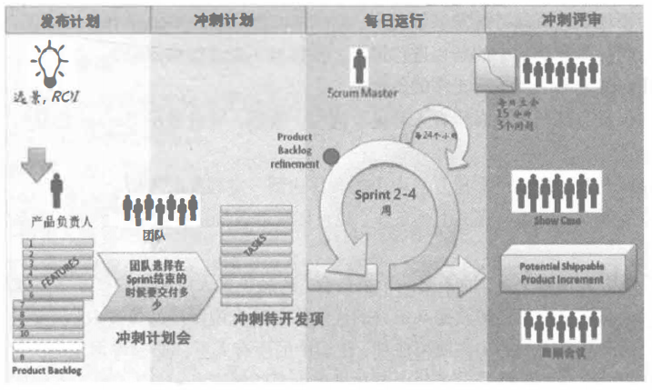

# Scrum 典型开发过程

总算来到了 Scrum 的最后一篇文章，前面的超长文章有没有吓到大家。如果你没记住它们也没关系，看完今天这篇简单的文章内容之后，我们再回去看它们就简单易懂了。当然，如果是要准备 PMI-ACP 考试的同学，那还是尽量回去好好记住它们吧。

## 流程图

首先，我们当然还是从那张再熟悉不过的，每一篇 Scrum 文章中都会出现的流程图开始吧。

在这张图中，我们看到了上篇文章中的 353 。还记得是什么吗？

接下来，我们就要看这些实践内容在这张图中是如何运转的。

## 典型流程应用场景

1. 远景和 ROI（投资回报率） 都是高级管理层或者客户提出了，通常，PO 会参与这些讨论。

2. PO 从远景和 ROI 中提炼出我们要做的事情，也就是我们的 产品待办列表 。这个列表通常以 用户故事 的形式呈现我们要做的事情。其中也会包含一些目标和 史诗 级的故事。史诗 就是更的故事，还远不到可以拆解为任务的地步，但它是可以继续分解成更小的故事的。

3. 产品待办列表 有了，PO 也为它们排列好优先级了，那么，我们就要继续下一步了，也就是和团队一起召开 冲刺 前的 冲刺计划会议 。

4. PO 和 团队 在 冲刺计划会议 中，我们确定了要做的事情，也就形成了 冲刺待开发列表 。这时的冲刺待开发列表可以是故事，也可以是拆得更小的故事——任务。

5. 通过 冲刺待开发列表 的确定，团队就可以开始进行冲刺了，也就是图中的两个圆圈。大圈代表整个 冲刺 周期，通常是 2-4 周。小圈代表每 24 小时要更新的进度。注意到小圈右上角了吗？每日站会 就在那里。

6. 团队进行 每日站会 就在小圈中实施，也就是每 24 个小时我们要知道团队目前的情况。

7. 在大圈的上方，还有一个 Product Backlog Relinement ，也就是在每个 冲刺，和冲刺结束后的 冲刺评审会议 中，团队 和 PO 对 产品待开发列表 进行修正。同时确定团队是否 “完成” 了我们的冲刺目标。

8. 最后，在 冲刺回顾会议 时，我们总结经验教训，为下一次的迭代寻找可以改进的方向。

至此，一个 Scrum 式的冲刺开发流程就结束了。咦？不对呀？Scrum Master 在干嘛？边上站着？

## Scrum Master

又要说回 SM 了。这个缩写其实有点那个啥....

之前在介绍角色的时候，我们就说过 SM 是一个什么样的领导。他是一个服务型的领导，上面的所有步骤，他都要参加，都要在置身其中。不过，他不做太多具体的事情。当他发现有其他的人或者事干扰团队的时候，就需要去清理这些障碍。当他发现团队气氛不对时，就要运用沟通和情商技巧去解决团队成员之间的问题。当他发现燃尽图出现了不明的波动时，就要去分析原因找到问题所在。

SM 需要懂技术和产品吗？需要，而且越懂越好，但是他会亲手做吗？不，绝对不要。SM 可以提醒，可以旁敲侧击，可以引导指明，但是，不要自己动手做。信任你的团队，相信他们的能力，相信敏捷中自组织的力量。

做一个好的 SM 其实和做一个好的传统 项目经理 是一样的。唯一的不同就是我们不用做太多的计划，也不要去发号太多的命令。从敏捷的角度来看，SM 和 团队 、PO 是同级的，没有谁命令谁的问题，有的只是沟通和交流。而 教练 的指导责任，也是通过沟通交流来实现的。

## 总结

没骗大家吧？这篇文章真的是非常简单而且内容非常少。剩下的就是实践了，还是那句话，从最简单的实践起来。Scrum 不同于 XP ，XP 是一套完整的 软件开发 实践，缺少了一环其它的很难做好。比如说在 XP 中没有实现测试驱动开发，那么 持续集成 就很难实现。但在 Scrum 中却不一样，它更偏管理和流程实践。我们可以选择性的使用 Scrum 中的部分流程和实践，并在一步步的开发过程中不断加入更多的其它实践。当然，这也是最难的地方，读书易，行路难，有兴趣的同学赶紧行动起来吧！

参考文档：

《某培训机构教材》

《用户故事与敏捷方法》

《高效通过PMI-ACP考试（第2版）》

《敏捷项目管理与PMI-ACP应试指南》