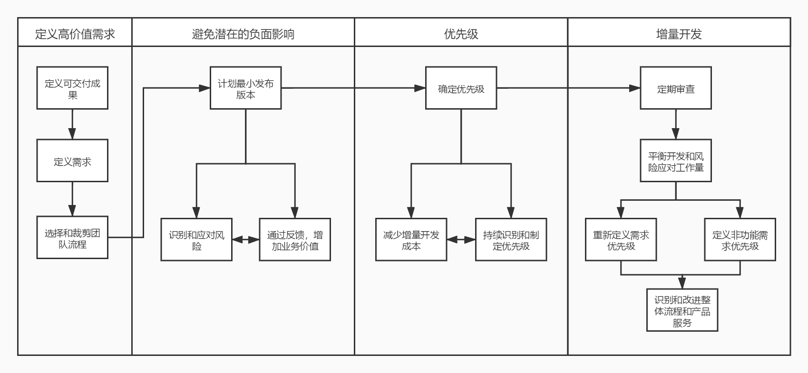

# 价值与价值驱动交付

上一大篇的敏捷框架怎么样，有没有意犹未尽的感觉？敏捷框架只是敏捷的一部分，而且是偏实践的部分。所有的教材都喜欢把这些敏捷框架写在前面也是因为这部分非常吸引人。但是，真正的敏捷还有许多理论等着我们来探索，不要着急，在学习完后面的内容之后，再回来看敏捷框架，或许你会理解得更加深入。

## 什么是价值

其实在敏捷框架中，我们不只一次的提过要交付价值。什么是价值？从最直观的角度来说，就是项目最赚钱的部分，但也不全是。也有一些项目不是以赚钱为主的，比如说公益项目，比如说 12306 。

对于普通的商业项目来说，我们肯定是要以盈利为主。所以，敏捷提倡的是尽早交付有价值的产品。然而，敏捷是迭代、增量的开发的，而一个项目产品中，也一定有一些功能或者内容是会产生更高的价值的，我们要做的就是尽早的交付这一部分的功能。在迭代开始时，PO 或者是其他类型的敏捷团队会优先选择价值最高的部分来优先实现。这也是对需求进行排序的一个重要参考值。

尽早交付价值有什么好处呢？

当然是为了让客户尽早尝到甜头。对于一个项目来说，除了短期的外包项目，都会有一个很长的开发周期。在这个漫长的时间中，任何事情都有可能发生。工期越长，带来的风险也越大，而我们如果能够尽早的交付价值，那么项目也就会越早带来收益。即使在后期出现风险问题，也会将影响降到最小。在《关键链》这本书中，作者就一直在强调，超时的项目带来的亏损会比不做项目更大。

其次，对一个项目的满意度，会影响到项目后期的支援与援助。如果领导或者客户一直看不到我们项目真实的样子。那么你觉得他们心里会有什么想法呢？在迭代和增量中，要交付的是可用的产品，是可以正式上线的功能。这样的项目展示，比起内部测试和原型演示来说，会给予干系人最大的冲击，也让他们更加能够提振对项目的信心。

当然，一次迭代也可能并不是一帆风顺的。如果在迭代中出现了问题，通过敏捷的灵活性和快速反馈的机制，也能够及时的修正错误，将客户的损失降到最小。这也是一种价值的体现。

话说回来，公益项目的价值在哪里？提供援助和帮助，展示成果，推进社会发展，不过公益类的项目一般都比较简单。而 12306 呢？好买票。怎么才能好买？高并发架构、缓存队列？不好使，瞬时并发还是吓死人。最后，用了一个非技术的手段实现了，不同火车站分时段放票，外加候补功能。相信不少人都看到了 12306 一步一步走过来的这些变化。当然，我不知道他们是不是通过敏捷手段来迭代开发的，但这也是一种增量的实现。最终也找到了用户真正的疼点，而这个疼点，正是价值的体现。

价值分为预测价值和货币的时间价值。预测价值当然就是我们要做的产品预期能够带来多少收益，需要多少成本。预测价值有助于组织决定项目是否有价值去推进或提前终止。这也是我们的 PO 所要关注的部分。时间货币价值就是现在的钱和将来的钱的对比，有现在马上就可用的钱，远比将来才有的钱更有价值。怎么理解呢？考虑通胀、通缩以及各类不可预计的风险情况的发生。当然，这个就是很经济学方面的东西了，我也不是太清楚。

总之，对于商业项目产品来说，货币收益是最基本的价值体现。而如上所述的为用户带来的满意度的持续提升，同样也是价值的重要体现。

## 什么是价值驱动的交付

接下来，我们再来讨论一下什么是价值驱动交付。既然我们要交付的是价值，那么我们就要以价值来驱动这个交付的过程。

就像我们上面说过的，一个产品，最大的价值就是要解决用户的需求，而用户的需求又如天上繁星。所以我们要找疼点，这个点，会让用户觉得少了他就没法玩了。这个东西，说容易也容易，说难也真的是难。在这里，我只能说，如果想做一名伟大的产品经理，或许真的有时候是需要天赋的，比如乔帮主。

使用苹果的产品我们会发现一个问题，那就是它从来不会跟进什么大潮流，比如说 5G 。但是，它却很会发现一些疼点并用技术的手段去实现，比如 AppStore 。我们往往只关注每年的硬件新品发布，而忽视了这个软件应用商店的威力。想要卖好硬件，没有好的软件支持也是白搭。而如果有了好的软件支持，但是对开发者不友好，那么开发者数量也会很少。这个可以参考当年 Nokia 的软件开发是有多难受。最后，一起整合在一个其实早就已经不是高科技的触屏手机上，一切便水到渠成了。

用户的疼点在哪里？好用的硬件+好用的软件=消费的欲望。价值便从这里产生了。

同样的，打车难、打车贵的问题被打车软件解决了，用户价值在于便宜快捷的打到车，当然，司机也是不可忽视的一环。快递、外卖更不用说了。而抖音呢？内容生产者是他的最大价值来源，智能算法推荐是他的杀手锏，让用户看到喜欢看的东西自然带来了价值。

综上，用户价值的发掘真的不是一件简单的事情，很可能牵涉到方方面面。如果是我做一款打车软件，我们考虑两个敏捷小组同时开发用户端和司机端。功能多少不重要，前期导航不准没关系，但一定要让司机能快速接单收钱，并给予一定的补贴，这样司机多了自然用户就好打车，用户端也只需要能马上定位到上车的位置，能快速发出订单，能马上就司机接单。我想，最早的滴滴也无外乎就是这么点功能。而你今天所看到的打车软件上的功能，都是在后期一步步地迭代出来的。

我们学习过了 测试驱动开发 和 特性驱动开发 。它们都是偏技术方向的，而真正与产品和项目完成有关的，只是这个 价值驱动开发 。试想，一个电商产品，你先开发一堆分提成、抽佣金、抽奖、运营活动的功能，而最基本的下订单的功能却各种 BUG 不断。似乎看来，这些东西都是能够赚钱的东西，但是在开发的前期阶段，这些可真不一定是实实在在的价值。（别笑，笔者的真实经历）

扯远了，如果仅从做项目的角度来说，价值这个东西，是由客户、用户或者高层领导来确定的，远不是我们所能决定的。所以，我们需要的是在重要干系人确定的价值优先级基础上，以价值为核心，尽早交付这些期望的价值。这些，就是 价值驱动交付 。

## 价值交付驱动的流程

虽说我们不能完全地决定一个项目价值的大小，但是，我们还是有一系列的流程和工具可以对价值进行一些评估的，否则 PO 和团队也就无法排序了。

今天这篇文章，其实我们就是在讲定义高价值需求这一块的内容。之后的最小发布、风险相关的内容我们在后续对应的相关文章中会再提到。而价值驱动交付这块，我们更关注的是评估价值优先级方面和增量开发方面的内容。

## 总结

今天的内容不多，也总算是从敏捷框架的长篇大论中解脱出来了。不过，从现在开始，我们才是进入了敏捷中最核心部分的学习。原则上升至理论方法，理论方法上升到实践框架。我们已经学习过了敏捷原则，也了解了敏捷框架，接下来，最重要的就是要继续学习中间这一层的各种理论和方法。

参考文档：

《某培训机构教材》

《用户故事与敏捷方法》

《高效通过PMI-ACP考试（第2版）》

《敏捷项目管理与PMI-ACP应试指南》