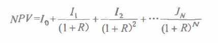

# 评估价值的方法

前文已述，价值在商业项目中的体现最终会回归到赚钱这个事情上。而如何衡量赚钱这个事，那就和金融财务方面的许多计算扯上关系了。项目经理需要掌握这些东西吗？可以不需要，但如果你有这方面的知识那就最好了。如果没有的话，请发挥你的情商，跟公司的财务打好关系吧。

不过，话说回来，项目管理是管理学的一门分支，而管理学中，财务管理也是一门基础课程。所以，有意转向项目经理，走向管理岗位的同学还是要学习一些财务知识的。

衡量一个产品的商业价值，我们可以从 员工人均收入、创新率、客户满意度、员工满意度、客户使用情况、留住客户、回头客户、投资回报 等多个方面进行。在这里，我们只是学习其中的几个而已，而且计算方式都比较简单。这也是 PMI-ACP 的考试内容，是要求必须会的。

## 商业论证

对于一个商业项目来说，商业论证是一个不可或缺的部分，商业论证就是为有重大支出的项目所做的完备论证。它包括成本、效益、选项、问题、风险和潜在问题的信息。它是一种决策支持和规划工具，以计划商业行为可能的后果，这些后果主要从质量和数量的纬度来考虑。

完整的商业论证可以形成一本 商业计划书 。从敏捷的角度来说，商业计划中的东西都是充满风险和不确定性的，但是，项目想要立项，需要投资，需要干系人的支持，少了这个商业论证还真是不行。所以，商业论证是我们启动项目时非常重要的一环。

在商业论证中，财务分析就是一非常重要的内容，同时，这些财务分析结果也不是一成不变的，是需要 PO 和整个团队在项目开发过程中需要时刻关注的。

## ROI 投资回报率

很明显，ROI 就是通过投资而应该返回的价值。它会涵盖企业或者项目的获利目标、利润和投入生产所必须的资源财产。也可以称为 会计收益率、投资利润率 。它的计算公式是：

>> 投资回报率（ROI）= 年利润或年均利润/投资总额 * 100%

比如说，一个项目建成后，第一年能够带来 300 万的利润，我们在项目建设时投入的成本是 200 万，项目的利润率是 10% ，那么利用公式计算的结果是：

(300/200) * 10% = 0.15 * 100% = 15%

如果题目中没有提供利润率或者给出真实的利润的话，那么就要自己计算一下利润，结果就是：

(300-200)/200 * 100% = 5012

## IRR 内部收益率

内部收益率是用来在项目生命周期内，项目内部为收回投资的每年净收益率。换句话说，就是有助于评估项目中计算投资回报期，而不是在当前的投资中使用一个利息率计算。它的计算和原理比较复杂，也不在考试的范围内，大家了解一下即可。

## NPV 净现值

NPV 指的是投资方案所产生的现金净流量以资金成本为贴现率折现之后与原始投资额现值的差额。

概念好像有点复杂，不过确实也真的很复杂。它的计算公式是：

PV=FV/(1+R)^N

其中，PV 是现值，FV 是将来值，R 是利率，N 是时间期数

看不懂吧？没关系，一般作为考试的话，上面的东西都是会给出来的，我们只需要简单的计算就可以了。举例，如果利率是 7% ，那么 4 年后的 20000 元的现值是多少？

PV = 20000/(1+0.07)^4 = 152579

这个利率一般是怎么来的呢？如果你对金融市场不太懂，那么最好的市场参考利率就是 银行定期 的年化利率。

上面说的是 PV ，那么 NPV 又是什么鬼？NPV 的计算公式又有一些不同。

其中，I 表示每年的收入，R 表示贴现率，N 表示年。公式不好理解吗？换个角度看，其实这里每个加号连接起来的不正是我们的 PV 现值公式吗！第一个 I0 是我们开发项目时投入的成本，一般会是一个负数，之后的就是每年的现值计算公式的一个变形。IN 是第一年的收入，也就是第一年的将来值 FV ，下面的 1 + R 就是利率，然后上下都有一个时间期数的次方，提取出来其实就是我们的 PV 公式。仔细想想，这个应该初中水平就可以理解。

我们通过实际的题目例子来看一下，一般考试时会有这样一个表格：

|  年份（利率0.01）   | 每年收入  | 投入成本 | PV (FV/1+R)^N |
|  ----  | ----  | ----  | ----  |
| 0  | 0 | -1000 | -1000 |  
| 1  | 300 | 0 | 272.73 |
| 2  | 300 | 0 | 247.93 |
| 3  | 300 | 0 | 225.93 |
| 4  | 300 | 0 | 204.90 |
| 5  | 300 | 0 | 186.28 |

最后我们的 NPV 是多少呢？ NPV = -1000 + 272.73 +  247.93 +  225.93 + 204.90 + 186.28 = 137.77

除了这种表格类型的题目外，还会有一种直接给数据的应用题，其实意思是一样的，比如说上面的表格例子，我们说一个项目投资了 1000 万，年均收入有 300 万，平均利率是 10 %，要求计算五年后的 NPV 值。整个计算结果其实就是上面的这个表格。

## 挣值

关于挣值这个东西吧，相信学过 PMP 或者 信息系统项目管理师 的同学绝对不会陌生，甚至可以说是所有的公式马上就能手到擒来。这玩意在传统的项目管理中，结合 甘特图 ，那就是神器般的存在。不过，在这里，我们也要简单地介绍一下。

挣值，是用不同维度的数值来计算你挣得了多少价值。它可以计算出项目是否延期，也可以计算成本是否超支。是不是很神奇。

首先，我们要知道几个重要数值：计划价值（PV）、挣得价值（EV）、实际成本（AC）、进度偏差（SV）、成本偏差（CV），进度绩效指数（SPI）、成本绩效指数（CPI）。

然后是几个公式：

- SV = EV - PV

- CV = EV - AC

- SPI = EV/PV

- CPI = EV/AC

接着，我们一个一个来说。

PV 是我们在当前进度时计划要花多少钱，AC 就是在这个进度时刻实际花了多少钱，EV 则是到现在这个节点，我们已经完成的工作应该花多少钱。前面两个好理解，但这个 EV 到底是什么意思？假设我们的项目进行到一半了，计划完成 A/B/C 三个功能，它们都要花 100 块，这时，我们的 PV 就是 300 块，然后我们实际花了 320 块，这个实际花的是 AC 。接下来，查看我们项目的完成情况，发现我们完成的内容是 A/B 的全部，C 只完成了 50% ，那么我们的 EV 就是 250 。

之后套用公式，计算出 SV 目前是 -50 ，SPI 是 0.84 ，这两个值说明什么呢？项目要延期了。从公式的角度看，SV 等于 0 ，SPI 等于 1 表示项目符合进度，大于 0 以及大于 1 表示项目速度快了，超额完成了，小于的话就不用多说了，项目有延期的风险。

接着我们计算 CV 和 CPI 分别为 -70 和 0.781 ，同样的，它们代表项目要超支了。从公式的角度来看，CV 等于 0 ，SPI 等于 1 表示项目成本刚好，大于表示成本富裕了，有多出来的钱，小于表示成本超支了，得找人要钱去了。

如果对你和我一样对公式不敏感的话，仔细想想上面例子中的数据。本身要完成 A/B/C 三个功能，结果我只完成了 A/B 和 50% 的 C ，那么很明显的就是在当前时间节点下，我们的任务没有全部完成嘛，任务当然是要延期了。而我完成的那部分工作的价值是 250 块，最后却已经花费了 300 块了，这也很明显是费用超支了。按照这样走下去，这个项目估计是快要玩完了。怎么办呢？有数据了，当然就是要对内部以及项目的开发流程进行调整啦，至于怎么调整就不是我们今天要考虑的问题了。不过我建议试试敏捷哦！

## 总结

今天介绍的内容主要就是这四个偏计算的东西，头大吗？其实还好了，因为在考试的时候很多条件都已经给了，我们要做的就只是简单的加减乘除而已。如果你的目的不是为了考试，并且如果你是 PO 的话，那么这些评估计算的方法还是非常常见的。毕竟，领导或者资方要给你钱的时候，他们也总会想要知道自己能获得什么好处吧！而且，这些也是一种激励团队的手段，白纸黑字和清晰的数据，一定比画大饼强的多。

参考文档：

《某培训机构教材》

《用户故事与敏捷方法》

《高效通过PMI-ACP考试（第2版）》

《敏捷项目管理与PMI-ACP应试指南》

