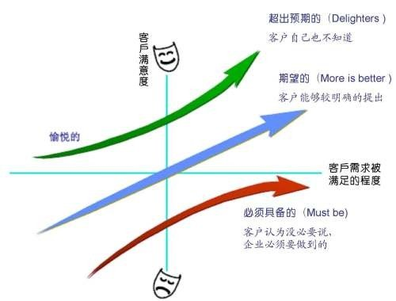

# 价值的优先级

我们已经学习过了从财务的角度来说，一个产品的价值是如何体现在金钱利润上的。这件事本无可厚非，但是，在价值驱动交付的开篇，我们又说过，一个产品的价值也并不是完全的体现在钱这件事上。因此，矛盾也就产生了，那么除了财务维度外，我们还应该怎样衡量一个产品中各项任务的价值优先级呢？

这也是我们今天要解决的问题，所幸的是，在敏捷的工具中，也有一些方法是专门用于处理这些问题的。

## 基于客户价值的优先级排序

这些技术就是为了能够让客户也参与到排序过程中，目的是尽快地为客户产生最高价值的工作。团队可以识别到一些具有高价值的特性，并且将一些低价值的特性后移。优先级排序整体来说就是让团队能够保留有用的功能的前提下调整范围以满足预算或时间目标的基础。

团队应该基于项目的需要和如何做对组织更为有利来选择优先级排序的方案。比如有下面将要说的这些。

### 主观判断

通过个人经验的主观判断来决定 待办事项列表 的优先级。这个其实对于具有丰富经验的 PO 和 SM 来说并不是什么特别大的问题。因为如果是长期从事同一个行业的产品开发，并且有过长时间合作经历的 PO 和 SM 来说，确实有可能会通过他们的主观经验来获得一个非常合理的优先级排序。但是，凡事总有两面，有些东西确实仅凭经验是不够的，毕竟我们所处的是一个不断变化的经验。这一点在 互联网 行业体现得尤其明显。

### MoSCoW 优先级排序

这个单词不好记，那就记住 莫斯科方法 。它是在 DSDM 中使用的一种优先级排序的方案，这个缩写代表的是：

- Must：必须做的。

- Should：应该做的。

- Could：可以做的。

- Would Not：不要做的。

怎么应用它呢？很明显，将 待办事项 和这四个方向一一对应。Must 就是不管怎么样都一定要做的东西，如果没有这个功能，那么这个产品就没法用；Should 是应该会有的功能，有了这些功能产品就可以正常运作，如果没有它们，产品用起来会非常麻烦或者很耗费资源；Could 就是锦上添花的功能，有了可能会让用户更开心，没有的话也并不会对我们的核心功能造成什么影响；Would Not 则是至少在目前阶段下，我们确定不会有的功能。

还是拿电商的项目来举例。

Must 当然是用户、商家和订单流程。要让用户能买到东西，商定能买东西，中间有一个订单流程可以让产品到用户手中。注意，这个一定是必须的，货物无法送到用户手中，其它的一切都无法让他成为一个电商项目。继续分析，用户模块（登录注册、浏览商品、下订单）、商家模块（登录注册、上下架商品、订单处理）、订单流转模块，请先至少完成这三个模块。这里我们用考虑得太细，先确保这个流程能够走通就可以了。

Should 在经过 Must 开发之后的产品可以用吗？当然可以，但是，我们需要快递员货到付款，为什么呢？因为没有支付模块，所以支付模块是一个 Should ，它可以让产品更好用。另外，商品的评价模块也能够提升用户的满意度和商家的竞争意识，也是一个可以考虑的 Should 模块。其它还有什么呢？大家可以自己想想然后在评论区留言讨论哦！

Could 的话，运营玩法，优惠团购都是可以考虑的模块。另外，现在火爆的电商直播也是可以考虑的方向。当然，它们并不影响你的整个下单购买流程，但是却会让你的购物过程更开心。这个地方其实是很考验 PO 和 运营 团队的。

Would Not：这个看过之前文章的同学一定马上就想到了，早期的分成分利。订单功能刚开发好你就准备一键代发了，刚有几个人下单你就考虑各地分公司如何提成分润了。订单量刚过 10 就马上要去开发一个 花呗（金融工具） 想让用户更多地下单了。这种事情好好想想，可能吗？还是尽量 No No No 吧！

### Kano 分析

莫斯科方法好玩吗？还有一个跟他非常类似的，Kano 分析，中文可以叫做 卡诺分析 。先看一张图。

在我们继续之前，先自己看看这张图，看看能不能看懂它所表达的含义。

在 Kano 中，有三个重要的评价维度，没错，比 莫斯科方法 少了一个。不过这三个维度我觉得比 莫斯科方法 更好用。它们分别是：

- Must be：必须具备的，这个和 莫斯科方法 的 Must 是一样的，没什么多说的。

- More is better：期望的，从英文翻译可以看出来，有了会更好，类似于 莫斯科方法 中的 Could 和 Should 。

- Delighters：超出预期的，做出了客户都没想到的惊喜功能。

注意，在这里，没有了 Would Not ，这是因为 Kano 方法认为没必要再为不需要做的东西单独准备一个维度。Kano 分析面对的是真实的可用型的需求。所以这三个维度其实也是对应了三种需求：

- 基本型需求（Must be）：这是一门槛，也是产品必须要实现的功能，没有这些功能的产品不能认为是一个可用的产品。当这个需求无法满足时，客户会很不满意，但是它也是有局限性的，就像在最下面红色的箭头。这一部分的功能你做得再好，对客户或者用户来说也是理所应当，无法冲破那条满意度的横轴。但是，目前的环境下，过硬的产品质量和口碑是有可能冲破的。

- 期望型需求（More is better）：这种需求被满足后，用户会感觉到很满意，但这些并不是必须的需求。这种需求越多越好，因为从图中我们可以看到，它是呈线性上升的，也就是说，满足的需求越多，用户的满意度越高。产品的价格通常和这个期望型需求相关，但也并不是绝对的。比如苹果产品就是出了名的功能少。

- 兴奋型需求（Delighters）：它和期望型需求被满足的不同点是，这部分需求很大一部分是用户自己都不知道的，但是却能带给用户极大的愉悦感，所以在上图中我们会发现它的曲线会呈现优于线性增长的趋势。反过来说，这一部分也就是最需要创意的部分。往往一个产品的创新就是从这里体现的，比如说抖音和快手的横空出世。当然，这一部分需求如果没有，也是不影响整个产品的。比如腾讯一直想做电商，但是一直失败，却并不影响他的微信和QQ，反而是微信支付这个金融产品成为了一个让用户非常兴奋的功能点。

虽说在上面的这几个需求的解释中我都讲了一些反例，但是这些反例其实很极端，因为没有第二家苹果。而大部分情况下，遵循 Kano 的分析总是会让你少走一些弯路的。

## 相对优先级排序

相对优先级排序就是要和一些属性进行比较，获得的是一个相对值，其实就是根据成本、风险和处罚后能提供最大益处的特征（功能）给予最高的优先级。比如说，我们的特征（功能）要和它所提供的价值成正比，但要和它的成本及风险成反比。然后使用一些数值来表示这种关系，最后根据获得的值来确定排序顺序。

它的好处是反映功能如何体现价值，并且同时反映功能缺失时，客户体检到的消极程度有多少。其中，风险也会反映功能所带来的挑战有哪些，而成本则会反映 实现功能的实际成本要花费多少。

综上所述，相对优先级排序需要的数据、维度更加广泛，是一种理性的纯数据方式做出的优先级排序。

## 总结

又是一堆概念和工具吧，不过相比上篇文章偏计算的那些内容来说，这一部分还是好理解的多。有没有发现，这些东西其实和 产品经理 职责中的 可行性研究分析 的内容非常相似。在 产品经理 相关的课程及文章中，也会经常见到这些内容。其实说白了，价值驱动交付本身就是 PO 的核心职责。所以我们一直在讲产品经理的东西也就不奇怪了。

参考文档：

《某培训机构教材》

《用户故事与敏捷方法》

《高效通过PMI-ACP考试（第2版）》

《敏捷项目管理与PMI-ACP应试指南》