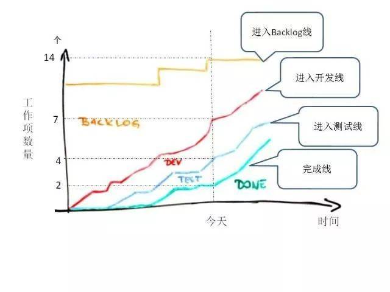

# 增量交付与敏捷合同

在学习了评估价值和为需求排定价值优先级的一些方法之后，我们接下来就看看在迭代或者冲刺中应该注意些什么才能不枉费之前的努力。毕竟前期花了那么大的精力，但是迭代冲刺之后却提交了一个没什么价值的产品，那可不是所有人愿意看到了。如果把之前的操作都看作是计划的话，那么敏捷最主要解决的就是一个 计划赶不上变化 的问题。我们拥抱变化，前提是这些变化确实是对客户有价值的。

## 增量交付

从最早我们接触到敏捷概念开始，就知道敏捷最大的特点就是迭代、增量式的开发。在这里，我们再具体的说一说增量到底增的是什么。其实你也应该猜到了，我们增量增的就是最有价值的那一部分。而价值是如何衡定的呢？相信前面的文章已经说了很多了，在你的大脑里也应该有一些印象了。

我们在每次迭代都会交付产品的一部分，但有时候并不一定每次的制作人工都会是一次完整的交付。我们用什么来确实这次交付之后价值确实会产生？那就是上线，或者说是发布。

### 发布计划

我们的发布计划一般会以一个发布路线图为基准。在这个路线图中，我们会在一个或多个迭代之后进行一次发布。这个发布是以上线为标准的，也就是说，我们要确保发布的质量，确定这次的发布是没有问题的一次发布。

虽然，一次把事情做好是一个好的要求，也是一个好的习惯。但是，我们的发布，特别是最初的发布，往往都充满着不确定性。这些不确定性的由来也是项目会产生各种风险的主要原因。那么，我们有什么方式来解决这个问题呢？

### 最小可行性产品

没错，这里又要引出一个 最小可行性产品 的概念。它的英文简称是 MVP ，这可不是 NBA 球赛中的那个 MVP ，而是 Minimum Viable Product 的简称。它还有一个别名，最小市场特性 MMF 。

这个产品不同于 产品经理 所画的 原型图 或者 线框图 。那些是测试性质的“图”，MVP 是真实可以上线运行的产品，而且是可以导入 种子用户 的产品。这样的产品有什么用处呢？最典型的就是可以“试探”市场，而且是非常快速地进行验证。

很多互联网公司的产品会有 “灰度发布” 这一概念，当然，这是对网站进行大改版时的主要操作。目的就是通过筛选一批种子用户进行测试反馈从而验证新的功能界面是否符合预期。对于老产品中新功能的推出也有类似的例子，比如我们经常会收到一些网站的邀请体验最新的功能。这些，其实都是这些互联网公司的项目开发团队在进行 MVP 的验证。

### 迭代中的价值管理

一般 MVP 的验证会在初始阶段也就是第一次发布实现，而且这个发布是越快越好，越早越好。在通过 MVP 之后，我们就要进入正式的迭代冲刺阶段了。在这个阶段，我们要如何保证每次的迭代冲刺以及发布计划都符合我们的价值交付的理念，这就需要一些敏捷工具的支援。

1. 任务板和看板

通过敏捷框架的学习，我们已经了解过 精益 中的看板和 Scrum 的任务板。其实在这里就不用说太多了。看板的功能是什么？监控进度？不，更重要的是信息可视化。之前就强调过，团队中的所有人都可以看到，都可以思考这个任务到底有没有为项目产品带来价值。在这其中，在制品 WIP 又是一重要的内容。

2. 在制品与在制品限制

在 精益 的学习中，我们就已经接触过 WIP 的概念。我们的任务其实和流水线上的在制品是一样的。还记得 精益 的核心吗？消除浪费。在没有成为一个可交付的产品之前，在制品是消耗着投资方的资本并且没有任何交付反馈的。同时，过多的 WIP 还会降低整个工作流程的效率，同时掩盖这些效率问题。最后，在制品没有解决，带来的就是返工和质量问题的风险。

由于这些问题的存在，敏捷主要关注的就是如何去限制 WIP 的数量。通常的做法就是使用 看板 ，当看板上出现空闲的列时，或者任务过多产生堆积的列时，就表明 WIP 出现了问题。这时，我们就需要关注在这其中最核心的瓶颈事务。消除瓶颈任务，是限制 WIP 的核心。它要解决的问题是优化生产效率而不是优化资源利用。当生产效率问题解决后，产品的价值才能更顺畅的通过增量交付。否则，我们交付的价值可能是充满不确定因素和风险的未知内容。

瓶颈任务有哪些呢？最典型的就像是我们的数据库设计出了问题，或者用户界面有逻辑方面的错误，这些其实都是 非功能性需求 ，而这些需求非常容易产生瓶颈。这时候，往往需要大量的时间来解决。相信团队的力量，及时调整发布计划，尽早解决瓶颈或者将瓶颈移到下一个迭代冲刺中做为最高优先级的任务来解决。这些都是我们可以应用的方法。

想像一条高速公路，它通行最顺畅的时候是我们有计划地限制车流的时候。而在一次迭代冲刺中，限制 WIP 的数量，也是这样的概念。另外，它和 Scrum 中不能修改任务这一条是不冲突的。因为这些往往是不在计划之中的情况，也是我们在一次迭代之后的评审中所要关注的重点问题。

3. 累积流量图

同样也是针对 WIP 的一个工具。我们先来看看这个图长成什么样。

这一张累积流量图可能比较复杂，我们可以看到横轴是时间，纵轴是工作项数量，也就是我们的需求数量。曲线表示各个步骤中所完成的需求数量。核心关注的是开发线和完成线，中间的垂直距离就是我们的在制品数量。

从这个图中，我们可以清晰地看到 WIP 的消耗情况，曲线之间的差距变大则表示 WIP 在增加，效率受到了影响。正常情况下，它们应该是保持恒定并最终与最顶上的 Backlog 线交合到一起。这时，也是项目完成的时间。

它是一个综合的价值流度量方法，可以得到不同维度的信息。让改进更有方向，我们可以缩短周期时间，或者增加迭代周期内的任务数量，所有的手段成功与否，都可以从这张图中清晰地反映出来。

4. 渐进明细

换个说法，滚动式规划。项目中的不可预见因素太多，而且在每次迭代后都可能出现未知的问题和瓶颈。这也正是敏捷中将 可交付的软件 高于 完备的文档的原因。在每次的迭冲刺之后，评审会议就成为了非常重要的一点。就像上面所说的，对于 WIP 中的瓶颈的解决，也是体现在这里。

甚至很多情况下，客户或者用户都不清楚他真正想要的东西是什么，我们尽早交付价值的原因也是让所有人都清楚，我们现在交付的“价值”到底是不是真实的客户所需要的价值。所谓拨开云雾见真章，这也是敏捷的核心思想。因此，敏捷提倡的 客户合作 并不是空穴来风。频繁交付、随时变化、客户合作，似乎我们又重温了一遍敏捷宣言。

## 敏捷合同管理

对于敏捷项目来说，怎么签合同其实是一个挺棘手的问题。如果是传统的项目，在部分情况下由于已经有了固定的工期和前期的成本估算，所以往往都会是一个固定总价合同就搞定了。这也是我们最常见的外包情况。

但是，敏捷对于“固定”这两个字并不友好。因为我们一直在强调敏捷是要拥抱变化的。所以说，传统的固定总价合同明显不适用于敏捷项目。那么成本补偿合同呢？这个合同本身就不多见，因为它比较利好于乙方，如果甲方没有强大的审计能力，那么也不太可能签出这样的项目合同。

那么对于敏捷来说，我们可以使用什么样的合同呢？第一，既然我们一直在讲价值驱动交付，那么我们也可以按照发布以及对应价值的完成来分阶段签定阶段性的固定总价合同。比如说，我们每一个月或两个月会有一次发布，那么我们的合同就以这个发布周期来每次单独进行签定。

除了这种合同之外，还有一种直接 就是对工作包建立固定价格的合同，这种合同就更详细了。其实，上述的两种合同都有点麻烦，因为我们可能会经常来回地去签字。其实，还有一种合同也是不敏捷团队的好选择，那就是固定竞价+变更费用合同。先以类似于传统项目的方式预估一个总价，然后再制定变更费用的条款细则。如果不加钱，那么就根据变更项的优先级砍掉较低优先级的内容。

总之，敏捷合同其实是非常不好签的，如果甲乙两方都是敏捷型的组织，使用工作包合同是相当不错的选择。但如果甲方是一个非常传统的大型企业的话，其实还是固定总价合同更适合。这一块我们就当是简单的了解，不需要太过于深入的研究，毕竟签合同这事，我们所能提供的建议非常有限。

## 核实和验证价值

我们通过几篇文章，几百上千字说了半天的价值相关的内容。但是这些其实都只是计划或者是一种意想的优先级的排序。目的只是为了让我们能够清晰地弄清楚每一个阶段应该做什么。但是当迭代冲刺结束的时候，我们应该要去验证这个迭代冲刺或者是发布时的价值是否和我们的目标一致。所以，就需要我们 频繁地验证和确认 。这也是敏捷的一个核心理念，通过什么呢？测试、检查点和评审。

在敏捷软件开发中，测试驱动开发、探索性测试、MVP 这些其实都是为我们的测试提供的工具。为什么敏捷这么在乎测试，因为测试可以保证我们结果的唯一性。从而让我们很快的就能得到反馈，也方便后续的持续集成。正常来说，一次持续集成就是通过所有测试并且可以进行线上发布的版本。这个版本在未发布前都是可以做为我们的检查点的。在迭代冲刺结束时，评审会议将是我们核对价值实现的一个重要方面。这些内容在之前的敏捷框架中都已经有过说明，如果没有印象了，那就回去再好好看看吧！
 
## 总结

这下我们算是搞清楚增量交付到底是交付的什么，以及真实的客户价值其实就是在一次次的迭代中通过增量的价值交付所找到的。最后我们简单地了解了下敏捷合同以及如何核实和验证交付的价值。可以看到，价值是敏捷中非常重要的东西，而交付价值则是贯穿敏捷原则的一条主线。说白了，敏捷定的宣言、原则，各种框架工具，最终的目的是什么呢？就是为了向客户交付价值。

好了，价值相关的讨论我们就告一段落，接下来我们将学习的是与 客户、领导 或者 甲方打交道的内容，也就是对于 相关方 的规划管理。内容还有很多，精彩还在继续！

参考文档：

《某培训机构教材》

《用户故事与敏捷方法》

《高效通过PMI-ACP考试（第2版）》

《敏捷项目管理与PMI-ACP应试指南》