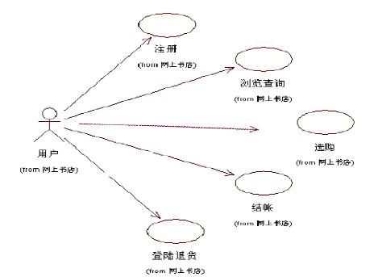
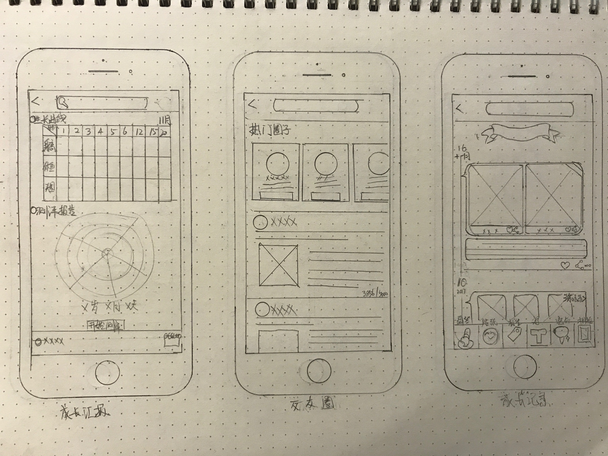

# 敏捷相关方的参与和愿景规划

对于敏捷来说，相关方是可以包括任何与项目有关的人的。也就是说，不管是客户、用户、高层领导、甲方员工，只要是与我们要进行的项目有关联的人都是相关方。在 PMP 的十大知识领域中，有一个 管理相关方 ，但是从敏捷的角度来看，我们与相关方应该是相辅相成的，所以，用 “参与” 会更合适些。

当然，敏捷中强调的是客户合作，其实意思也就是越亲密越好。甚至客户应该直接入驻项目团队中。但是，您也知道事实上这一点是很难办到的。而且更重要的是，相关方或者说甲方团队并不是采用敏捷的，甚至可能反感敏捷。这时候，我们还是要动用一些管理技巧的。因此，今天这篇文章我们先简要地说一说 PMP 中的 管理相关方 都做了些什么。

## PMP 的管理相关方

在 PMP 中，管理相关方这一块原来是在沟通管理中的，在 PHP 第5版之后才单独成为了一个独立的知识领域。从这也可以看出，不管是传统项目管理还是敏捷，和相关方的关系都是决定项目成功失败的一个重要方面。我们也需要将相关方的满意度作为一个关键项目目标来进行管理。

1. 识别相关方

简单来说，就是搞明白哪些人或团队或组织是项目的相关方，并把他们登记在册。主要是这些相关方的重要性和影响程度，以及它们对项目的支持力度。在 PMP 中，相关方分析矩阵、权利或影响/利益矩阵、凸显模型等都是很有效的工具，关于这些东西将来我们在学习 【信管师】 相关的课程时再进行讲解。

在识别相关方的时候，最开始我们需要一个大表格，列出所有和项目有关的相关方。但是，其中一定有许多更为重要的相关方对项目会有重大的影响。这就需要我们对相关方进行有效的规划管理。

2. 规划相关方参与

相关方管理的核心策略就是在整个项目开发过程中，鼓励相关方积极地参与项目。这里面需要注意的是我们要根据相关方的重要程度，使用一些不同的沟通方式，才能达到有效的沟通与组织。我们可以通过对相关方参与级别信息的排序来管理相关方。比如说参与级别有：不知晓；抵制；中立；支持；领导；从这些名词的字面意思就可以看出他们的意思，所以也就不多做解释了。通过各种沟通手段，尽量让相关方达到中立及支持以上的水平。

3. 管理相关方参与

在敏捷中，管理相关方的参与非常地简单，因为前面提过很多次的 客户合作 就是敏捷团队对待相关方的态度。当然，我们也一直在强调，事情总不会那么顺利的，相关方人数众多，都参与到项目来也是不实际的。所以，我们也会采用一些 PMP 比较经典的方法来增强与相关方的沟通，以及处理一些和相关方之间的冲突。这个后面会说到。

4. 监督相关方参与

看起来是监督相关方吗？难道要监督他们的行为做风？不不不，这里的监督是监督整个项目团队与相关方之间的关系，并及时根据情况调整策略。

## 共同的愿景

上面我们一起简单看了看在 PMP 中关于相关方管理的一些内容。敏捷本身也会借鉴许多好的管理实践，特别是同为项目管理的 PMP 实践，作为全世界最大的项目管理培训课程，自然会很很多东西是值得我们学习的。不过先绕回来，看看在敏捷中，我们要如何与相关方建立共同的愿景。

### 敏捷章程

在 PMP 中，我们有 项目章程 。而在敏捷中，我们也有对应的敏捷章程。作用其实也都差不多，正式启动项目的文书，也代表着领导层或者相关方为项目团队赋予权利。但是，敏捷章程对于项目的描述可能会更偏概要一些，项目目标是不可缺少的，收益的预期，验收标准和边界条件，问题和风险等等内容。而更偏敏捷的内容是我们会指定关键的成功要素，制定初始的发布计划（里程碑），更重要的是，在敏捷章程中，我们要强调渐进明细的作用和团队的力量。剩下的内容，其实就和普通的 项目章程 差不多了。

另外，我们还需要制定团队的章程，其实主要就是这个团队如果要走敏捷路线的话，那么还是需要一些统一的理念的。比如说团队的价值观、工作协议、基本规则、团队规范等。这些都是根据各自团队的情况进行制定的。

### 对于完成的定义

DoD ， Definition of Done ，对于完成的定义。这个缩写也是敏捷中非常重要的一个概念。为什么会有这么奇怪的东西，完成了不就是完成了，为什么还要“定义完成”？不知道你有经历过这种事情没，开发做完了，这是他的“完成”。但是 PO 一使用，发现一大堆问题，这个完成在 PO 这里显然还不算是完成。而有的时候，PO 觉得东西做完了，可以发布了，但客户看了一圈，觉得离他预想的发布内容还有不少的差距。很明显吧，大家对于完成的“定义”完全不同。

所以，在团队和相关方的参与中，定义一个统一的对于“完成”的定义是一个重要的工作。比如说，我们对于开发工作的完成定义应该是达到多少的测试覆盖率并且全部通过，代码是否要在迭代评审后再进行人工评审，测试用例要详细到什么程度等等。而在发布前对于功能特性的定义则包括是否有全量测试，是否要进行回归测试，是否应该核对用户故事，上线前的问题是否修复，着重修复哪些级别的问题之类的定义都是要清晰明确的。

此外，还有对于迭代冲刺的过程中，每天的 DoD （代码要提交、测试要运行之类的）；用户故事在核实中以什么标准确定完成的 DoD（是否遵循规则、是否有测试化用例等）等等。

从这里可以看出，完成的定义是非常重要的，而且另一个重要方面是，我们通过完成的定义可以与相关方达到一致。让所有项目的参与人都能明确地知道现在的迭代已经完成了多少工作，还差多少完成，这个完成是大家都明白都一致理解的那个完成。

### 敏捷模型

这里的敏捷模型也是主要针对软件开发的。比如说 用例图 、 数据模型（UML）、界面设计 等。用例图在许多教材中都会说到，特别是后面我们学习 信息系统项目管理师 时会重点记住一大堆图，其中就会有这个 用例图 。

用例图最大的特点就是有左边这个小人。然后它的每一个用例其实都可以看做是一个功能或者模块。这个用例还可以继续再分解下去。

数据模型的话就是纯技术方面的内容了，主要就是面向对象中的 UML 图。界面设计则主要是前端展示的界面草稿。这里就不多说了，有兴趣的同学自己查阅下相关的资料。

### 线框图

线框图对于做过产品经理的同学来说都不在话下。它们就是功能的粗绘展示。可以用于后期的界面设计和高保真原型的制作。最简单的就像是下面这种手绘图。

之前的文章中，我说过 Scrum 中的 PO 是不画原型的（看情况）。不过这种线框图还是非常便于团队以及相关方理解的。我们绝对抵制的是那种非常高保真，花费了很多时间来制作的那种原型。但是线框图这种方便、好用甚至你可以直接在白板上作画的工具还是非常值得推荐的。如果一定要用 Axure 的话，我建议是有基本的链接跳转就可以了，剩下的还是尽量以线框图的形式展示。毕竟，我们要达到一致的是对于功能和界面业务流程的一致。具体的细节应该是界面设计师去抠的。

### 虚拟人物

这也是 产品经理 的一种基本工具，就是建立一个虚拟的人物卡。这种虚拟人物卡可以建立多张，由团队给他们角色和称谓，就像一个真实人物的简历卡一样。主要就是用于在需求分析时从不同用户的角度来查看用户可能关注我们的产品角度。这个一般也是和重要的相关方一起研究商讨的，毕竟，需求就是从他们那里来的。既然是项目管理的课程，那么这些产品经理相关的内容大家还是自己去了解一下吧，毕竟我也不是一名 产品经理 。更重要的是，我接触过的 产品经理 九成以上都只是画原型图的。

## 总结

今天的内容一是说明了下相关方这一块在 PMP 中是如何定义以及管理的。另一方面则是学习了一些可以与相关方建立共同目标愿景的工具。说实话，这些工具更偏 产品经理 的范畴。但是，只要是能与相关方打好关系的东西，我们都应该多了解一些。毕竟，上文中我们也提到过，相关方的满意度对我们的项目来说非常重要。而且，重要的相关方，要么是我们的领导层，要么是我们的金主，要么是我们的上帝。你说，哪个得罪得起。不过在敏捷中，我们只要做好我们的就好了，没有谁高谁低的问题，因此，完成的定义非常重要。今天的内容看似简单、无关，但其实它们是能左右一个项目生死的关键内容。

参考文档：

《某培训机构教材》

《用户故事与敏捷方法》

《高效通过PMI-ACP考试（第2版）》

《敏捷项目管理与PMI-ACP应试指南》
