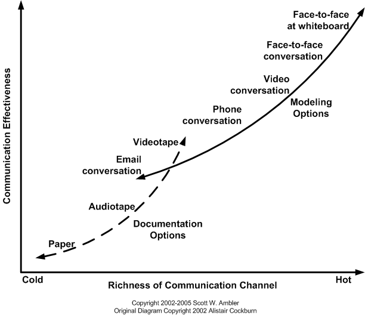
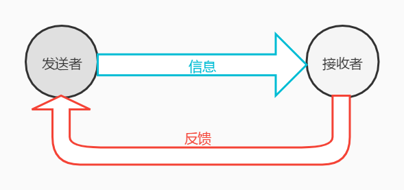

# 相关方的沟通与协同

讨论完相关方参与和愿景规划之后，我们就来到了如何管理相关方参与。前面已经说过，用“管理”这个词在敏捷中是不恰当，当然，你也可以自己认为是恰当的。我们用增强相关方的沟通和协作来说会更好一些。既然是沟通和协作，那么必然就要学习一些工具技术来帮助我们实现增强的目的。今天的文章主要来讲的就是这些工具和技术。

## 沟通工具

沟通工具？你指的是微信？QQ？钉钉？这些当然是工具，而且是非常好用的在线交流工具。但是，注意了，不管是敏捷还是 PMP ，我们都认为最好的交流工具是面对面的沟通。电话、远程视频会议都不是好的沟通工具，更别提只是互相打字语音的沟通了。

### 面对面沟通

为什么面对面沟通是最有效的呢？对于沟通交流的各种实验表明，人们在沟通的时候，肢体动作传达的信息能够达到 55% 以上，而我们熟知的声音音调呢？只有 38% ，剩下的 7% 则是语言带来的效果。可想而知，如果是文字形式的书面沟通，那么其实沟通效率只有 7% ，语音和视频的话能够提升到 45% 左右，而面对面的带有肢体语言的沟通的率才是最佳的沟通方式。当然，敏捷提倡的更加好上加好的是站在白板进行面对面的沟通，就像下面这张图一样。

横轴是沟通的方式的流行程度，纵轴是沟通的效率。很明显地在敏捷中我们最推荐的就是站在白板前的面对面沟通。而文档沟通被视为是效率最差的，也是敏捷所不推荐的。但是，注意这里有但是了。文档、文字沟通是一种非常正式的沟通形式。就像我们去申请网购的退款或者有什么重大的操作时，总会有一封邮件发到你的邮箱里。另外，就像我们上篇文章中说过的 敏捷章程 之类的文档也是非常重要的。

### 双向沟通

看着名词高大上吧？啥叫双向沟通啊？两个人互相说话不就是在双向沟通嘛。其实双向沟通用一个词就可以概括：“反馈”。如果说是工厂里的流水线工人，或者说是在传统 IT 开发中的码农，那都是只要上线分配一个任务，照做就是了，唯一的反馈可能就是“完成”或者“还差点儿”。这样的反馈其实是差点意思的。

敏捷中双向沟通的意思就是我们在扁平化的管理模式下，应该尽量多地与相关方，高层领导进行有效的交互沟通。而不是上级或者金主布置了一个任务，就只是去完成而不问为什么。让信息在上下流动，确认相关方的“完成”的定义和你理解的“完成”的定义是不是一样的就是一个非常好的例子。

### 知识共享

还记得 XP 里的代码集体所有吗？这其实就是 知识共享 的一种体现。但从整个敏捷的角度来，整个项目的知识我们都应该共享，不仅仅限于代码。本身，敏捷这种项目管理方式就是为了管理各种高级知识人才的，特点就是由团队自组织，为什么团队能自组织呢？人才就是很大的一个原因。团队成员在合作的时候，将知识共享给他人，是非常有利于项目的成功的。

为什么这么说呢？最典型的案例，产品经理 和 技术 之间的千古难题。如果我们在团队中能够互相共享知识，那么 产品经理 就能够清楚的知道功能实现的难易程度，而 码农 们也能够从 产品经理 了解到更多业务领域知识从而更好地开发代码。这样，沟通想不顺畅都难。

在现实工作中，领导还很害怕一件事情，那就是某个关键员工的离职对项目带来的重大影响。不用我说你也想到了，知识共享又是解决这个问题的一大法定。通过代码集体所有，技术员工的离职是马上就人可以接班的，而产品经理如果离职了，团队在共享知识中累积的领域业务知识也可以让下一个产品经理快速上手。其它的职位也是类似的情况。

工具呢？文档是一方面，团队 Wiki 确实是一个好工具，但是光写可不行。业务交流会议、冲刺评审会议、代码审查、结对编程 等等面对面的交流工具才是最佳的选择。

### 信息雷达图

信息雷达图是一个敏捷术语，看着又很高大上吧。跟你说，我们一直在说的白板、Scrum 任务板、燃尽图、燃起图，以及我们后面要讲的用户故事地图等等，合在一起，就是 信息雷达图 。够清晰，够明了吧。

## 协同工作

沟通相关的方法工具说完了我们再来看看协同工作的一些方法工具。其实说实话，上面的比较偏理论工具的沟通方式。而协同工作这部分的内容则是比较偏实践的一些团队级的良好应用。也就是说，这些是在团队基础上的比较高层次的一些沟通工具。

### 工作坊

工作坊就是在一个轻松、有趣的环境下，让大家相互对话、沟通、思考，进行调查与分析，提出方案与规划的活动。冲刺回顾会议 就是一个工作坊的典型例子。在回顾会议中，我们会总结本次迭代冲刺的各种问题，让尽可能多的团队成员以及相关方都可以参与进来。这种会议活动有一个主持人就可以了，不要有那种主导人，就是像听领导训话一样的那种会议就绝不是工作坊。工作坊强调的是让团队集体产生想法，让每个人都发言。并且在这个会议上，我们还可以采取一些行动，比如更新待办事项列表，修改用户故事等。

提到 用户故事 ，那么 用户故事工作坊 也是敏捷中非常有代表性的一个活动。主要是用于收集用户故事，并将收集来的用户故事进行整理归纳的过程。而且这个工作坊，也是需要相关方和团队都积极参与并发表意见的。

总之，工作坊就是一种大家都尽量发表意见的会议形式。强调的是团体和相关方的直接对话沟通，是非常有效的一种集体沟通方式。

### 头脑风暴

头脑风暴估计很多人都听说过了，而且估计不少人也经常参加。不知道你所参加的头脑风暴是什么样子的。在敏捷中，或者说在 PMP 中，对于头脑风暴的定义都是一个点子收集大会。也就是说，头脑风暴所要做的就是收集各种想法，在这里，不做评价，不做优先级排序，更不会像工作坊一样可以采取行动。换言之，在头脑风暴会议中，你可以畅所欲言而不需要有任何的顾忌。在头脑风暴中，唯一的行动就是记录。

不管是对于需求的、技术的、设计的、测试的，只要不是那种一听就非常天方夜谭的想法，我们就都应该记录在案。头脑风暴对于创新型的业务和产品有非常好的效果，也能够提升所有与会人员之间的熟悉感，是团队协同合作的一种非常好的工具。

### 协作游戏

协作游戏也可以称作是创新游戏。主要是为了让一些敏捷的相关方在一起能够更好地了解一些复杂或模糊的问题，并在解决方案上能够达成共识。

1. 回想未来

回想未来可不是科幻片。目的是为了理解客户所定义的成功是什么。我们让每个客户都想象一下从现在到未来的某个时间段内（可以是一周、一个月或者任何时间）会发生的事情，会有什么样的产品在他们手中。尽可能详细地写出来，能够真正地让他们高兴的东西。通过这些内容，团队就能够了解到客户真正想要的是什么，即使现在的想法不能代表随时变化的场景，但是，我们很容易通过他们对未来的想法，大致获得一个产品最后应该是什么样的，怎样才算是他们想要的可以交付的产品。

2. 修剪产品树

这个东西就好玩了，我们可以在白板上画图，也可以打印一颗大树出来。然后呢，在树的主干上写下产品的主要功能，在枝叶上写下已经开发的或者计划中的功能，然后再用便签写下很多潜在的远期计划功能以及当时任何相关方可能想到的功能。接下来呢？所有人一起修剪这颗产品树，觉得不太好的或者不想要的功能擦掉或者挡住，然后把感觉好用的期望实现的功能粘上去。这就像是我们一群园丁在修剪大树一样。目的就是为了了解下一个阶段相关方所期望的新的特性是什么，是不是符合市场的要求。

3. 高速游艇或帆船

还是通过白板或者一张大纸，画一只船，用来代表我们现在的系统或者项目。所有人当然都希望这艘船能够快速地驶向远方，但总有一些障碍在阻碍着我们的前进。让相关方或者团队成员画出一些锚或者礁石，代表着不好的特性或者不和谐的内容。然后一起认真讨论去掉多少障碍能够让船更快地行驶并且达到我们想要速度，并且评估这些障碍在系统中的情况，并在下次或后期的迭代中处理掉这些问题。它是 XP 中隐喻的一种实际应用，因为我们可以把各种障碍物隐喻成系统环境中的一类问题。在后期的处理或讨论时，直接说那一块礁石大家可能就马上能明白我们说的是什么问题。这个游戏的目的嘛，当然是找问题咯，而且是相关方非常不满的各种问题。

4. 买特性

首先创建一个待开发项列表，可以是非常粗浅和潜在列表，然后根据开发成本、客户价值或其他维度的相关信息来给这个列表中的每一项定一个价格。然后团队开发人员为相关方发放一些钱用于购买这些特性，并鼓励他们用手里的钱去买重要的特性。当然，这些钱是不能够买下所有特性的。然后呢？当然是统计哪个特性获得的订单最多啦。这个游戏有助于和相关方一起发现哪个特性更重要，从而实现更精准的优先级排序。

5. 性价比

制作一个坐标轴，横轴代表成本，纵轴代表价值，然后还是把一堆特性写在便签纸上。接着就是相关方和团队讨论这些特性应该粘贴在什么地方。产品经理一般会更加关注价值轴，而团队则会更加关心成本轴。当然，这里的成本不止是单纯的金钱成本，还包括开发成本、人力成本等一切的资源成本。这个游戏的目的同样也是为了待开发特性的优先排序，并且可以根据大家粘贴的情况对特性在价值和成本之间的关系有一个更深刻的认识。

## 总结

今天我们学习的内容，说实话挺偏理论的，都知道面对面沟通是最好的，但也有可能某些团队一见面就开始干仗，远程交流反正更和谐有效。不过这都是特例，现实情况下，多多交流对项目的益处还是更多一些，至于怎么交流能更加有效，就是我们下篇文章的内容了。另外上面的这些协作工具，说实话，工作坊你可能参加过类似的会议但你不知道它是属于工作坊这种形式的，而头脑风暴其实很多公司又有很多不同的玩法。剩下的那些协作游戏估计接触过的同学就真的很少了，包括我也从来没有尝试过，不过其实如果你现在的团队成员都比较熟悉而且喜欢尝试新鲜的东西的话，我觉得你真的可以考虑实践实践看看效果怎么样哦！

参考文档：

《某培训机构教材》

《用户故事与敏捷方法》

《高效通过PMI-ACP考试（第2版）》

《敏捷项目管理与PMI-ACP应试指南》