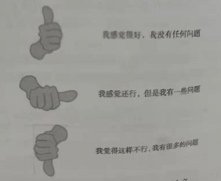
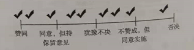

# 相关方的合作技巧

这篇文章的内容我觉得会比较有用，怎么说呢，我们即将学习到的都是可以在日常工作生活中应用到的，而且马上就可以尝试。而且，从我工作这些年的经历来看，会说话，会沟通的人真的是自带光环属性加成的。

估计只要是上过几年班的同学都应该会有这样的感受，团队里技术最牛的大家会尊敬他，这没问题。但是，团队中最活跃的那个，和所有人都关系最好的那个人，即使技术不行，领导也会非常喜欢，甚至在一些升职加薪或者年终表扬的场合都会听到他的名字。不要感觉好像别人只是嘴皮溜，会溜须拍马。其实，他们也是有真本事的，就比如说我们马上要讲到个人沟通技巧。不敢说你能达到那种级别，但对于不爱说话的技术人来，如果能尝试去做，还是会有一些帮助的。

## 个人沟通技巧

个人沟通技巧的锻炼其实有很多书，比如说《非暴力沟通》、《》等等，甚至各大图书网站都有专门的口才频道展示这类书籍的。在项目管理领域呢，不管是敏捷还是 PMP ，我们都会强调沟通的重要作用。但在具体的个沟通技巧上，我们只提两个最核心的东西。剩下的内容，大家可以找找相关的书籍资料好好研究学习。（如果想成为一名优秀的 项目经理 或者 敏捷教练 ，沟通能力真的非常非常重要，甚至要强于你的专业能力）

### 情商

首先我们要说的就是情商这个问题。这东西单拿出来写本书都没问题，所以在这里我们也只能简单地介绍介绍。有一句非常出名的话，我也不知道是谁说的，反正听起来很对就是了 “智商决定下限，情商决定上限”。我们常常一个人的能力有地板和天花板，地板就是由智商和业务能力决定的，或者换句话说，你能吃上什么样的饭。而天花板则是一个人最高的上限，情商会决定你的天花板能达到多高，是 3 米还是 300 米这个差距就很明显了。

对于团队来说，高情商的人能够有感知他人情绪的能力，能够清楚的分析出团队自身的情绪和氛围、外部其他团队、相关方的情绪。通过情绪来判断当前团队是否有困难、沟通是否有问题、是否发生了混乱。在发现问题之后，我们才能通过沟通、协作以及后面要讲的一些社交手段来解决问题。高情商还能够让团队的目标和行为达到高度的统一，也就是让团队的价值最大化。因此，高情商在团队中的作用非常巨大。

另外，对于个人来说，团队中的每个人都应该把情商修炼作为一种额外的技能进行交流分享。因为高情商的人除了感知他人之外，也能够对自己的情绪进行很好的控制，从而就能避免很多不必要的纠纷。毕竟一个巴掌拍不响。

### 积极倾听

对于有效的沟通来说，我们认为积极的倾听是更好的沟通方式，特别是对于 项目经理、 Scrum Master 以及各级管理层来说。这个积极倾听难道不就是正常的听对方说吗？我认认真真的听不就好了，这有什么难的。既然我写在这里了，那么肯定就没有那么简单，你说是不。敏捷中主要是根据一个“收听层次”理论，我们来看看它把倾听都分成了哪些层次。

- 层次一：内心收听

这个内心收听的意思呢，就是我们会很认真的听对方的话，然后我们会用自己的用法来进行解读。这个层次呢，很容易因为自己的解读而导致错过其它更重要的信息。为什么呢？因为我们需要去把对方的话转换成自己理解的内容，所以会容易分心。

- 层次二：专心收听

在这个收听层次上，我们已经和说话人建立了切实的联系，可以设身处地的为他着想，也就是完全专注他的话语本身。关注对方的立场，同时也关注对方的情感。

- 层次三：全心收听

真正的最全心全意的听取说话者所描述的内容，包括说话者的语气、姿势以及整个环境都会结合起来。我们不仅要听出来对方说的内容是什么意思，还要从各种角度看他对待这个问题是一种什么态度，紧张、不安、开心、兴奋都会通过各种肢体动作、面部表情展示出来，这些内容都应该结合在我们的对话中，我们才能做出更好的回应。

## 冲突的解决

团队是由不同的人组成的，每个人都有不同的性格特点，一团和气当然是最好的，但是冲突也会我们在团队中非常常见的。相对来说，团队内部还好解决一些，但是如果和外部相关方产生了冲突，往往解决的难度就会提升很多。在这里，我们也是根据一位大神（彼得·里斯）所提供的冲突框架及解决方案来给大家介绍在敏捷团队中解决冲突的方法。

对于冲突来说，大神给出了五种冲突的级别，分别是：

- 级别1：解决问题

最低的级别，说白了团队成员以及相关方之间都是敞开心扉的，沟通也是顺畅的。即使有一些小误会，也可以通过简单的沟通就能够解决，总的来说，问题不大。

- 级别2：争执

一般争执是怎么产生呢？那当然是感觉到自己的利益受损或者即将受损的时候，这个时候我们都会在语言上出现自我保护的状态。之前善意的玩笑中可能也会夹有一丝的火药味。这个时候用俗话讲的话，开始有问题了哦。

- 级别3：争辩

到争辩阶段了，那么我们就有可能会出现一些严重的话语，同时，也会将一些本来很小的事情特意放大。到这个阶段，尽管我们还是会有理有据，但从语言角度来说，往往会开始使用一些扭曲的词语或者不经意间的攻击。比如说“你怎么总是忘记测试”、“代码规范记不住吗”。这个时候很显示，问题已经呈现在眼前了。

- 级别4：圣战

冲突继续加深就来到了这一级别，而且冲突更具意识形态以及极端化。往往一个非常小的问题可以放大到非常严重的地步。团队成员开始互相失去信任并有可能出现离开团队的情况。团队中间也有可能会出现各种派系，并且小团体之间都会有敌对的情绪。在这个阶段，问题已经很突显了，如果再不介入干预，后面的事情就会越来越麻烦。

- 级别5：世界大战

都世界大战了，还有什么好说的，平常说话都是带刺的了。这时团队成员之间可能根本都已经没什么沟通了，而且看不顺眼的人会赶紧期望他走人。在这种情况下，还想做好项目基本已经是不可能的了，而且想修复成员之间的裂隙也是难上加难。总之，世界大战这词用得没毛病。

既然有这样五种级别存在了，那么当然也有对应的一些冲突处理方法。这回我们反过来从级别5开始看起。

- 级别5：在这个级别，说实话，没啥太多可以操作的东西了，只要不要让大家互相彼此伤害就好了。

- 级别4：再次构建起团队中的安全框架，也就是让给团队成员筑起一道安全防线，任何人不要越线。并且使用“穿梭”外次，把一个派别的想法带给另一个派别，直到他们可以不让冲突继续升级，并且可以采用其他级别的冲突工具。

- 级别3：首先就是迁就，当关系比问题本身更严重时，先接受对方的观点，但不要长期使用。另外就是交涉，如果引起冲突的事情是可以分解的，那么我们就一步步地交涉，但如果问题是围绕个人或团体的价值观问题的话，那么交涉的效果就不明显了。最后就是得到事实，通过搜集有关数据，将事实放在眼前。

- 级别2：在这个级别下面，如果有冲突，那么我们应该支持各方先发表自己的意见并且鼓励为对方给出解决方案。在这个时期，任何事情都以安全为基础，千万不要做刺激冲突升级的事情。如果你是 项目经理 或者是 Scrum Master ，一定要在这个阶段多注意观察团队的情况，不要让不同的意见正式上升到冲突的级别，也不要完全一团和气的容易失去斗志，因为在这个阶段的团队其实是有非常高的创造力的。

- 级别1：其实这个级别没什么特别的冲突问题，大家继续保持沟通，达成共识，一起努力寻求共赢的局面就好了。

## 参与式决策

最后我们再来看一下参与式决策。很明显这就是一个鼓励团队和所有相关方一起参与决策的过程，相对于独裁式的决策，以及一致性的通过表决决策来说，参与式决策是夹在它们中的一种决策方式。很明显，它克服的就是独裁的缺少意见和一致通过速度过慢的缺点。并且发挥组织的创造力和洞察力，也是自组织型团队的一种体现。

一个简单的参与式决策过程大概是这样的：

第一步，清楚地定义问题和解决问题的时间表。

第二步，确定决策者与核准者。决策者可以是一个人，也可以是多个人，但不是全部人。

第三步，为决策小组找一个领导人，这个人汇集所有人的意见，包括赞成、反对以及变通方案等，并做出建议。

第四步，召开决策会议，决策者根据领导人收集的意见和建议宣布决策简报及说明，与会人也可以继续提出问题以及替代的方案，最终形成会议决策。

这里需要注意的是，在决策会议上提出的替代方案是可以替代决策者之前做好的决策的，只这个方案确实是更优秀、更合适的。

在决策会议的过程中，也有一些决策模型供我们使用。

1. 简单投票：没啥好的，举手赞同或者反对就是最简单的投票了。

2. 拇指 上/下/边 这个看下面的图就明白了。

3. 决策分级：将赞同、同意/保留意见、犹豫不定、不赞成但同意实施、否决画在一条线上，然后让所有参与者把他们的投票地放到放到相应的位置上，这样就可以清晰地看出集体意见是什么。然后各位参与者就可以进行提问，了解为什么有人会否决，或者那么多人犹豫不定。

4. 5个手指投票：其实也是一种用手势代表意见的方式。没有指头（握拳）表示绝对支持，一个指头表示支持，两个指头表示支持但有所保留，三个指头表示关注但需要讨论，四个指头表示不赞成需要讨论，五个指头表示反对。

## 总结

今天的内容呢，比较偏工具与技术这一块。而且全部是围绕着团队或者相关方的沟通合作来进行的。从情商和倾听开始，到冲突的解决，最后就是如何进行团队形式的参与式决策。其实说来说去，最根本的就在于沟通，这东西真的说起理论感觉哪个都对，但实践起来真的还是因人而异。沟通，确实是一门艺术。

参考文档：

《某培训机构教材》

《用户故事与敏捷方法》

《高效通过PMI-ACP考试（第2版）》

《敏捷项目管理与PMI-ACP应试指南》