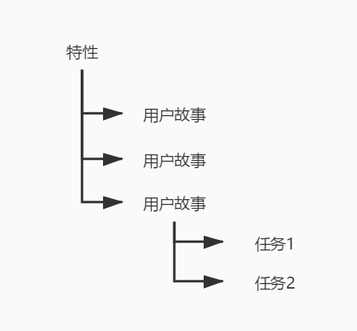
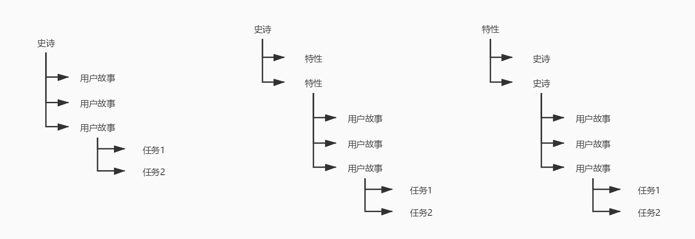
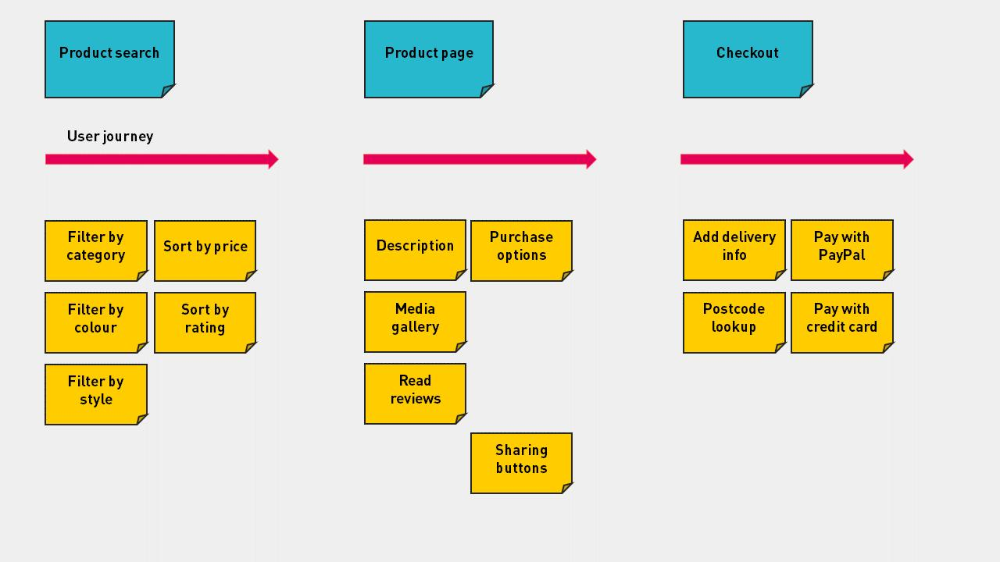
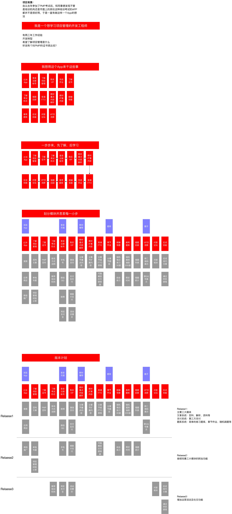

# 用户故事的层次和用户故事地图

经过上一篇的学习，你对用户故事有了一个大概的了解了吗？用户故事这个东西，是需要多多练习的，并且最好是有经验的 Scrum Master 能够带着你一起学习并建立合适的用户故事应用到实际的项目开发中。

对于用户用事来说，我们还有一个层次的概念以及用户故事地图的概念，这两个是我们今天需要了解的内容。不用太担心，今天的内容还是比较简单易懂的。

## 故事层次

一个完整的大项目对于往往是复杂的，而且大量的工作是难以准确预估的。所以，我们的敏捷团队需要将这些故事拆分成为更小的故事，直到可以准确地估算和构建这些工作内容。虽说在敏捷中，用户故事是非常出名的一种需求记录与规划工具，但其实他在敏捷的整体需求中是处于中间的位置。

一般我们会将用户的大概念设定为特性，然后通过对特性的分析来建立用户故事，之后在冲刺计划会议上，我们确定了这次冲刺的用户故事之后，就会由具体的开发人员将用户故事再次分解为任务。因此，用户故事一般就是在中间层级。除了普通的用户故事之外，上篇文章中我们还提到过一个概念，那就是史诗。那么史诗故事应该在什么地方呢？

很抱歉，对于敏捷来说，还没有一个规范是特别声明史诗甚至史诗的定义都非常模糊。我们认为史诗可以是一组故事的超集，也可以完全用来替换特性。当然，它也可以在特性之下或者位于特性之上。这个选择完全是根据团队以及项目的情况来定的，并没有统一的规范，甚至像上面的那张图一样没有史诗也是可以的。

## 用户故事地图

既然是地图，那很明显的就是一张非常大的用户故事板，把所有的待开发的用户故事罗列在上面。我们可以根据用户的重要性、优先级以及模块的切分等进行横纵向的排列。最终的目的就是能够完整地让一个用户通过故事地图来完成一次产品体验。就像我们根据地图找寻目的地一样，用户故事地图也是类似的概念。

用户的产品体验有时候仅靠想象是很难验证的，通过用户故事地图，就可以直观地展现这些信息，并且可以想象单独的用户故事是一堆散乱的枝叶，我们通过故事间的逻辑关系将这些树叶连接起来形成一颗完整的故事树。就像我们之间讲的 修剪产品树 一样，不过地图会比树更全面，因为它还有一层逻辑导向的能力，就像上图中的箭头指向一样。

一个模块下的内容我们也很容易地转换成一次发布计划。这也是用户故事地图的一大亮点。模块内容的用户故事我们可以在一次或多次替代之后完成，形成一个可发布版本。然后发布之后再将地图前进到下一个故事模块中。

用户故事地图的好处包括：

- 更容易看清 Backlog 的全貌

- 为待办事项列表和优先级排序提供更好的工具，帮助做出决策

- 便于使用静默头脑风暴和其它协作方式来产生用户故事

- 帮助开发人员更好地进行迭代增量式开发，同时确保早期的发布可以验证整体的架构和解决方案

- 为传统的项目计划提供了一个更好的替代工具

- 有助于激发讨论和管理项目范围

- 允许从多个维度进行项目规划，并确保不同的想法都可以得到考虑和探讨

- 帮助回忆具体细节

- 预防信息蒸发

对于用户故事地图来说，内容比较多，使用大白板都不一定装得下，所以更推荐使用电脑绘图。比如说下面这个我做过的练习。

图片比较大，如果大家看不清楚的话可以到 Githup 上查看原图。这个用户故事地图是包含发布计划路线图的，是我在学习一个在线项目管理课程时的作业，并且获得了优的成绩。可能离真实的业务开发还有一定的差距，不过也是具有一些参考价值的。

## 梳理待开发项

最后再简单地介绍下我们待开始项的梳理过程，其实也就是我们的 冲刺计划会议 时要进行的工作。主要就是对纳入到这一次冲刺的用户故事进行细化，拆分任务，优先级排序以及测试要点的分析等。具体要进行以下事项：

1. PO 和团队一起讨论用户故事的背景、业务目标、用户角色、场景、业务流程、规则等，保证团队理解充分。

2. PO 和团队一起讨论界面和交互流程，输出线框图或者原型图。

3. PO 和团队讨论用户故事的测试要点、技术实现方案、可能存在的技术风险，必须输出测试要点，这个测试要点其实也就是我们常说的验收标准。PO 可以与一位资深测试人员讨论和整理出要点，也可以与整个团队交流用户故事中的测试要点，最后也可以由团队来讨论初步的实现方案、技术风险。不过要注意，应该先准备好测试要点，避免从0开始讨论，另外现在讨论的还只是初步的估算和技术风险的评估，详细的内容需要在冲刺开发时再讨论。

4. 团队估算出用户故事的规模（故事点数），对于过大的用户故事要拆分成小的。初始的估算由 PO 和 SM 进行，再由 SM 与开发人员进行估算，并组织测试人员估算测试规模，最后集中整合。这个时候的估算不需要团队全体人员参与，应该是 SM 为主并由少数核心人员一起进行。

5. PO 对用户故事排列优先级。优先级只需要 PO 决定即可，其他人的意见应该在前期就提出，在这里 PO 是做最后的汇总决定。

## 总结

对于用户故事来说，其实对于我们这些刚接触的同学，怎么写好用户更为关键。不过如果是在已经 有良好实践的团队中，用户故事地图的作用明显非常强大。它可以起到一个全览总局的效果，也能够让我们很清楚地看到产品的整个业务流程是如何走下去。此外，在 冲刺计划会议 中，我们到底要怎么处理用户故事也给出了具体的建议，可没有放大家鸽子吧，毕竟这些东西写在 Scrum 里就太长了。

参考文档：

《某培训机构教材》

《用户故事与敏捷方法》

《高效通过PMI-ACP考试（第2版）》

《敏捷项目管理与PMI-ACP应试指南》