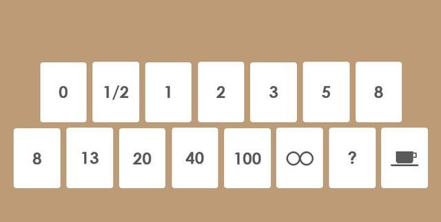

# 敏捷计划的概念与估算

我们已经准备好了用户故事，也了解到了用户故事的一些相关的知识。这个时候，就要开始敏捷计划的制定。我们将学习到一系列的概念和方法用于敏捷中计划的制定。或许他们和 PMP 中关于计划的概念和形式有很大的不同，但这也是敏捷和传统项目管理最典型的区别。

## 敏捷计划

在学习敏捷之前大家往往会有一个误区，认为敏捷是不需要计划的。这个误会可真的就大了，虽说我们强调 拥抱变化 高于 遵循计划 ，但其实我们应对变化的方式就是不停地计划。这个体现在哪里呢？每次迭代之前的计划会议就是在做计划嘛。只不过我们将时间间隔和维度变得很小，每次只做很小的针对这一次迭代的计划，这样我们就能快速的发现问题以及拥抱变化。在敏捷中的计划包含的是以下这些概念。

### 时间盒

时间盒一个短期的，但有固定长度的时间段，在这个时间段中，团队成员要为满足一个特定的目标 做出努力。其实大家很明显的就能感觉到，我们规定的迭代时间就是一个时间盒。

时间盒能够明显地提升生产效率，这也是因为短的时间和 WIP 的限制能够让我们更专注于当下的工作而不用分心去考虑别的问题。这也是应对 心理学 中 “帕金森定律” 的一剂良方。帕金森定律 认为人们无法保持长时间的专注，在项目管理领域，3 周的里程碑的完成情况也明显好于 3 个月的里程碑。

一些规则可以帮助我们制定时间盒，比如：

1. 固定的时间盒长度（千万不要一个迭代两周，一个迭代四周）

2. 时间盒的长度最好是在 40 小时也就是一周的工作时间（两到四周也是可以接受的）

3. 在时间盒周期内，不要增加团队人员（在一个滞后的项目中增加人手只会让项目更滞后）

4. 时间盒的结束日期不可变

5. 时间盒不是用来做绩效考核的

6. 如果一定要在时间盒内增加需求，那么就要把其它的需求挪到后面的时间盒中，如果变化非常大，建议取消这个时间盒重新进行规划

7. 每日同步（每日站会）

8. 拥抱变化不意味着混乱，在持续不断的变化中，一定要有一个稳定的点。时间盒的作用在于控制风险，而不是让团队一直处于变化之中而拥抱混乱

### 渐进明细

这一点在之前的文章中我们也讲过。客户或者用户往往一开始的需求并不是那么明确的，随着一步步的开发，产品越来越详细，估算也越来准确。有一些功能可能需要添加进来，而有一些功能可能会失去价值。因此，我们做项目，做产品，应该是越做越透明，越做越清晰的，通过不断交付可用的产品，让客户发现真正的需求，这也就是渐进明细的意义。关于渐进明细，也是有一些步骤可循的。

1. 对于项目来说首先要确定发布的时间点。这个时间点可以是一周、两周、一个月，需要和迭代时间有机结合起来，比如两个迭代发布一次。

2. 看到需求的概要层级后，团队需要决定在每个发布周期团队可以发布那些故事。不需要过于详细，这还是一个粗糙的发布计划。

3. 在 冲刺规划会议 中，和相关方一起决定在冲刺中要做的事情。这个时候你需要详细的计划，在你所知道的所有东西的基础上做出更详细的计划来。

4. 冲刺结束的时候，也就是 冲刺评审 以及 回顾 会议之后，根据现有的最新信息，更新概要层级信息。

5. 每个冲刺都要重复 3、4 步骤。

渐进明细在很多地方都有其用武之地，比如 计划、估算、风险评估、需求确认、架构设计、验收标准、测试用例 等等。

### 基于价值的分析和拆解

这一块的内容其实在 价值驱动交付 相关的文章中都已经有所提及。价值也是衡量一个项目的优先级的重要方面，在这里也就不多赘述了，小伙伴们可以找到之前的文章再去看看。而价值的拆解，更多地会体现在我们马上要学习的估算这一块，话不多说，直接往下看吧。

## 敏捷估算

对于估算来说，在 PMP 中，我们会有针对进度和成本的估算，也提供了一些估算工具。不过在敏捷中，更多的是在进度方面的估算，我们会把价值融入到用户故事中，并优先实现具有最高价值的故事。因此，对于如何估算用户故事也就成为了敏捷中需要重点关注的内容。

之所以用估算这个词，是因为不管是传统项目管理还是敏捷，我们都无法做出精准的计算。或许我们需要计算挣值，但是这个挣值的计算本身就是一个估算，它看到的是我们的进度和成本超支问题。这也说明在项目开发过程中，超支是很难回避的一个问题。因为估算无法精准，所以在整个项目期间，我们都需要不停的估算。传统项目管理中一般在里程碑阶段会进行详细的重新估算，而在敏捷中，每个迭代开始和结束时，我们都会进行估算，并且是针对拆分好的小的用户故事进行估算。相对来说，敏捷的估算更多，但也会更接近事实。

### 宽带德尔菲

这个技巧主要的目的是把大家的“从众效应”和“光环效应”降到最小。这两个效应是什么意思呢？从众很明显，我们都会跟随大流，也就容易因为一两个人的估算而影响全部人员的估算。另一个光环则是指的如果有权威人士，比如说团队中的主程提出了一个估算，那么很多人也会去跟随他。

宽带德尔菲需要先将问题或需求准备好，然后在团队讨论完问题或需求之后，通过发给每人一个空白纸条进行匿名的估算投票。然后主持人收集结果并进行公示。各位团队成员会看到估算的大概分布范围并根据自身的情况进行调整并继续进行讨论。通过几轮这样的匿名投票估算之后，往往估算结果的分布就会越来越趋同。这就是宽带德尔菲的估算方式。

通常我们建议投票的过程不超过三轮，一般的问题通过三轮投票也都会得到一个分布非常集中的估算值。

### 计划扑克

宽带德尔菲是一种估算的方式，但具体到工具来说，我们后面要讲的几种工具都是可以配合宽带德尔菲进行估算，首先要讲的就是非常出名的计划扑克。

对于没有估算工具的估算来说，我们一般会采用 人/天 这种形式进行估算。但是天数这个东西吧，确实很难估得清楚。一天 8 小时，真正能用在工作上的时间其实是很难确定的，比如突如其来的会议或者从未遇到过的 BUG 就有可能打乱我们一天的计划。因此，敏捷更提倡用一些估计值来代表每个用户故事需要耗费的时间、精力、成本等。注意，这是一种估算值，你可以把它用来代替 人/天 也可以让它来代替一个综合的评价指标。当然，我们更推荐的是一个综合的指标，它只需要有一个相对的大小比较就可以了，这个标准是需要让团队所有成员都清楚明了的。

接下来，为团队成员每人发放一幅扑克，普通的扑克也行，专用的计划扑克也可以。为什么会有专用的计划扑克呢？这是因为我们的估算数值最好不要是顺序的数列比如 1，2，3，4 这样的，而是有间隔的 斐波那契数列 ，就像下面这个一样。

在这个数列中，1/2 需要耗费的精力明显要比 1 要少一半，而 3 需要耗费的精力是比 2 多一些比 5 少一些的。如果感觉故事或任务非常复杂，那么我们就投 40 或 100 或者 无限大 ，这样的故事也就是感觉你是需要再次拆分的。剩下的 0 表示这个故事已经做完了或者这个故事没什么东西。问号 表示对这个故事还有疑问。咖啡杯表示估算进行到现在，我需要休息一会了。

然后呢？结合宽带德尔菲，每次对待估算的任务出牌展示，不过这里稍有不同的，这里的出牌不是匿名的了。而是直接亮出自己的牌。一般和宽带德尔菲一样，在开始的时候估算分布会差别很大，这时，可以让差别最大的两个人分别发表自己的看法，比如团队大部分人给出的估算在5-20之间，但有两个人分别给出了 1 和 40 。这时就请他们描述自己的问题和见解，然后再进行下一次的出牌。这样就类似于德尔菲，在几轮之后，也会有一个分布比较集中的估算值。

### 相对大小估算和故事点

其实计划扑克给出的范围还是有些大的，因为我们需要这么多张牌，而且范围差距也很大。那么有没有更简单的一种估算方式呢？当然有，这就是相对估算。比如说最常见的会使用衣服尺寸，S/M/L/XL/XXL/XXXL 来代表我们上面所说的那些数字度量指标。每一个尺寸都比前面的大一个型号。另外一种就是咖啡杯（搞敏捷的这帮程序员真的很需要咖啡），小杯、中杯、大杯分别代表不同的难易程度。

为什么要把估算尺度放到这么大呢？这是因为大部分人其实对精确的估算是没有概念的，比如说某个地方到你脚下的距离，在大部分情况下你只能说出大概 50 米或者大概 100 米。而对于项目的估算来说也是如此。即使是敏捷扑克的分类尺度可能都会出现很大的误差，更别说传统项目管理中那些精确到天的甘特图。因此，项目延期和超支也是每个项目不可避免的命运。

而相对估算使用的则是一种故事点的形式，上面说过的那些尺寸或者杯子大小就可以看成是故事点的实现。这些故事点可能只有一个非常粗略的含义，但你一定会知道 XL 肯定是要比 S 大的，而且还大了两三个号。因此，故事点是一个非常抽象的概念，它和 人/天 的关系不大，更像 米、千克 这种单位，你只需要有个大概的估计就可以了。

因此，在很多敏捷相关的资料中会说到，我们在这个迭代中需要完成多少故事点，而且每个迭代要完成的故事点也应该是保持恒定的，这个也叫做 速率 。

那么既然是相对的估算，这个故事点总要有一个参照吧。我们通常以整个用户故事地图中最简单的那个故事作为 1 点的故事点，比如定为 S 或者 小杯 。然后以它为参照对其它故事进行估算的时候直接说明和这个故事相对的难度对应的故事点就可以了。比如我们把登录做为 S ，那么一个评论功能可能是 L ，它要比登录难两个级别。

在定义故事点时，有几个问题需要注意：

1. 团队自己定义故事点。可以找你们喜欢的东西，不一定非得是衣服尺寸或者咖啡杯大小。

2. 故事点的估算应该是包含所有时间的，包括设计、架构、测试等。

3. 当分解时，不需要整体匹配。单个故事定义的故事点汇总起来是很可能会超过史诗故事的点数的，这个不用太在意。

4. 规模是相对的。

5. 复杂性、工作量、风险都应该计算在内。

### 亲和估算

亲和估算就是将不同规模大小的用户故事按顺序排列，并贴到墙上，然后将每个故事移动到合适的列上。如果有新的故事，那么就和已有的故事卡进行比较，然后再贴到合适的地方。

亲和估算可以快速和更容易地估算大量的用户故事。如果团队刚刚开始一个项目的时候，或者是在准备发布计划的时候，亲和估算是一个非常有用的工具。

### 理想时间和耗用时间

对于计划来说，我们更容易估算出来的时间其实是理想的时间。也就是假设一天 8 个小时一直在工作的时间算做一个 人/天 。然而事实大家都清楚，总会有各种事件来干扰，而且一个人的专注力也不可能 8 个小时都在一件事上。这个就有一个很好的比喻，足球赛我们都知道是上下半场各 45 分钟，中场休息 15 分钟，但是足球赛都能在 105 分钟内结束吗？很明显，绝对不可能。这也是传统 人/天 估算最大的问题。

而耗用时间则是真实花费掉的时间，只可惜这个时间是一个过去时。也就是不经历的话你是不知道真正准确的要花费多少时间的。这个时间是真正不可估的。

于是乎，在 PMP 就有了管理储备这一说法，其实也就是预留一些缓冲的储备时间。其实也是在计划的基础上根据一些经验加上了我们自认为的一些时间而达到规划耗用时间的目的。敏捷中，对于时间的概念其实一直就是我们之前说过的只会有一个非常粗略的大致估算，甚至是一个非常简单的相对估算。因此，我们需要了解这个理想时间和耗用时间之间的差异，并在合适的时机及时调整。如果说客户或者领导层需要一个理想时间的规划的话，我们需要以下几点假设：

1. 正在估算的这个故事是唯一需要做的工作

2. 当正式开始做时，所有需要的事情都已经准备好了

3. 做的过程中没有任何干扰

## 总结

对于计划和估计来说，它们都是做项目的过程中非常重要的核心内容。所以我们今天的篇幅也非常地长，目的也是希望大家能够一次性地了解在敏捷中进行计划和估算的全貌。当然，今天更重要的内容其实是在 用户故事 以及 故事点 的估算上。最后，也给出 《用户故事与敏捷方法》中对于用户故事估算的建议：

1. 允许我们改变我们的想法，不管我们何时获得了一个故事的新信息。

2. 既为史诗故事也为小用户故事工作。

3. 不要花太多的时间。

4. 为我们前面和后续工作提供可用信息。

5. 包容估算中的不精确。

6. 能够用于发布计划。

参考文档：

《某培训机构教材》

《用户故事与敏捷方法》

《高效通过PMI-ACP考试（第2版）》

《敏捷项目管理与PMI-ACP应试指南》
