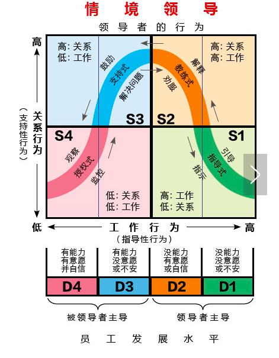
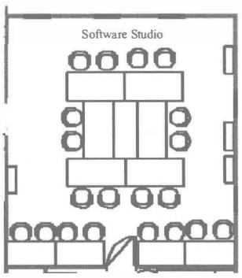

# 团队绩效理念与实践

前面讲了很多东西，是不是都感觉和 PO 有很大的关系。而 SM 也是一直贯穿其中，当然，这也是敏捷中最重要的部分。因为我们要将会有价值的内容给客户，那么如何识别价值，如何与相关方合作，如何进行敏捷规划都是决定一个项目产品的关键。剩下的还有什么呢？别忘了，敏捷中还有非常重要的一点，那就是“人”。而体现这一点，最主要的就是通过团队。

在敏捷中，我们重视每个个体，同时也希望每个个体都发挥最大的能动性，从而实现自组织。而与之相关的，就是我们的团队如何去实现最大的动能。如果按组织来说，就是要获得最优的绩效，而这些，就是我们即将要讨论的问题。

## 团队绩效理念

首先我们通过一些概念了解一下团队绩效理念所包含的内容，第一个就是团队的发展模型。

### 团队发展模型

对于我们的项目来说，产品是一直在开发的，一直会有价值不断交付。个人也会随着项目的进展而获得知识和经验。同样的，由个人组成的团队会也在一直发展。

1. 守、破、离模型（Shi Ha Ri）

这玩意其实一看就能想到是 日本 人的一套理论模型。毕竟之前我们就已经学习过，敏捷的很多思想都是来源于精益。

守，代表是的通过老师的教学，获得知识，完全遵守学习到的东西并熟练掌握。这是最初的一个层次。就像我们在金庸小说中看到独孤求败用得重剑，重剑无锋，大巧不工。当你能熟练的挥起重剑的时候，你就已经是一名武林好手了。

破，是在熟练的基础之后，懂得依据不同的情况随时做出变化。其实也就是你可以在熟练的基础上产生出一些创意，如果应用得好会为带来很好效果，但也有玩坏的可能性。同样，独孤求败的下一把剑就是木剑，千变万化，灵活不拘。这时的你已经可以站在武林之巅了。

离，忘掉原来的一切规则与限制，直接根据外界的环境做出自己的响应，没有刻意要遵守的东西但总能获得最好的效果。不用我说你也猜到了，剑术的最高境界，手中无剑心中有剑，草木皆可为神兵利器。因为这个时候你自己就是那一把神剑了。这个境界想必不我多说了吧。

守、破、离在个人方面的体现会更清晰一些，但放在团队层面上来说，也是一样的道理。当一个团队的成员刚刚认识时，都在自己的规则范围里活动，就是守的阶段；通过一定的磨合开始出现互相的建议，这是破的阶段；最后能够向 PO 、SM 以及客户提出更有价值的想法，这时很明显就进入了离的状态，这样的团队也是非常难得的好团队。

2. Dreyfus 模型

这个模型比较简单，就是把团队分成了 5 个阶段。

1）新手：不用多解释了吧，对于技术可能仅仅是掌握，经验不多，而且学习意愿不强，只是解决手边的工作。

2）高级新手：有经验，而且干活效率明显要快一些。但对于一些复杂的功能或者任务来说，还是有些吃力。这个阶段对于问题的全貌还是没有一个全面性的理解。

3）胜任者：也称为主动积极的员工，能够在脑袋里建立问题领域的概念模型，并且可以通过抽象化的方式来解决问题。解决问题的过程需要详尽的规划和依赖过往的经验，有能力教导新手。但对于没有类似经验的问题来说，还是会有些力不从心。

4）精通者：能够全局思考，可以建立完整的领域模型，具备持续改善和自我反省的能力。同时也能够通过别人的案例来拓展自己的经验。

5）专家：很明显，这已经是非常高级别的人才了。正常来说，这类专家型人才是非常少的，有丰富的经验，而且知道在什么情况下什么什么样的经验工具。能根据直觉工作，擅长观察与问题相关的特征和细节，并忽略那些无关紧要的噪声。

其实这个模型也很偏重于个人的发展。在敏捷团队中呢，我们当然期望是有大部分的成员是精通者或者胜任者。专家一般是可遇不可求的高级人才，而且成本也非常高。新手和高级新手则是团队在培养新人的情况下适当加入一些的。

3. 塔克曼模型

这个模型在 PMP 中非常重要的一个团队模型，在敏捷中也同样非常重要，记下来总是没错的，它同样也是分 5 个阶段，不过这个模型是真正的属于团队的，而不是上面两个模型更偏于个人。

1）形成期：一般是团队刚刚成立，大家刚认识，互相仅能了解到职位和一些基础的信息。这个时期还算比较平和，不会有太大的摩擦，但是生产效率也很低。大家都只会做自己的事，合作的范围也很局限。

2）震荡期：一般是成立一段时间后，互相有了一定的了解也开始了一些合作。这个时候由于互相了解的不深入，而且会有表达自己想法的意愿，所以会出现各种人际冲突、分化等问题。这个时期非常关键，是 SM 需要重点关注的时期，千万不要发生圣战或者世界大战的情况。增加彼此之间的深入了解，可以加强团队成员之间的非正式沟通以及举行一些破冰游戏。

3）规范期：经历过震荡期之后，团队成员之间的了解更进一步，这个时候最大的特点就是有了非常规范的协同工作和团队合作。产品开发效率在这个时期也会步入正轨，驶向康庄大道。

4）成熟期：最佳的团队自组织的标准，成员之间互相依靠，平稳高效地解决问题。这个时期是效率爆发的时期。

5）解散期：完成项目工作之后，团队成员离开团队。在之后的项目中，重新组建团队继续循环。如果是公司内部的团队，在有人离职或者加入新人的时候，一样会有这五个阶段的发展。

### 适应型领导力

所谓适应型的领导力，就是在不同情境之下我们应该对团队有怎样的领导和引导。这个一般配合上面的 塔克曼 模型来看，很明显，在不同的阶段我们对于团队关注的重点肯定是不一样的，要跟随当前团队的情况来使用不同的方案进行领导。我们先来看看情境领导力非常著名的一张图。

在这张图上，我们的横轴是 工作行为 ，或者也可以说是每日导行为，就是做为 SM 我们需要介入的程度。纵轴是 关系行为 也可以称为 支持行为，就是我们可以让团队有多少自主的调控能力，或者说是 SM 提供支持的程度。

S1 对应的就是 形成期 ，在这个时期，我们需要较高的指导，是 SM 主导的协作。这时团队刚刚成立，支持也是非常有限的，因为 SM 也是团队一员，也需要和团队成员一起了解彼此。

S2 对应震荡期，这个时期就像前面说的是非常重要的一个时期，而且团队成员也有了一些相互的了解。在这个时期，SM 需要同样高的指导和支持就像教练一样给予最大的帮忙，让团队能够顺利度过这个非常时期。

S3 对应的是规范期，这个时期教练的指导就开始越来越少了，团队自组织的自我主导开始占据上峰。SM 也开始进入支持型的时期，为团队扫清前进道路上的障碍。

S4 就是成熟期，这个时期的 SM 要把工作和挑战都交给团队自己去解决，用俗话说就是完全放权了，授权式的领导时期。

那么到了 S4 成熟期 SM 就可以高枕无优了吗？不不不，就像我们一直说的，团队是由不同的人组成的，人在，江湖就在。我们不能保证今天成熟期的团队就一定会一直保持在成熟期，很可能一些突发事件又让团队回退到震荡期甚至是形成期。比如说团队成员的离职变动。

因此，SM 需要时刻关注团队的情况，确定团队目前在什么阶段，应该拿出什么样的领导方式以及适应团队的变化，并帮助团队克服各种问题。

### 仆人式领导

关于仆人式的领导，在很早的时候我们就已经提过了。如果没记错的话，应该是在介绍 Scrum Master 的时候提到过我们敏捷教练就是一个为团队扫清各种障碍的仆人式的领导。

对于仆人式的领导，有如下一些要求：

- 倾听：聆听每个人内在的声音，尽力明白一个人身、心、灵的流露，并加以定期反思，这是仆人式领导不可或缺的一个重要要求。

- 说服：在仆人式领导中，没有命令这一说，所以如果需要别人接受你的观点，就需要让人信服的能力。

- 感同身受：理解并体会别人的心意，这也是情商的一个重要体现。

- 省察：从一个统一的角度来看待问题和形势，帮助人们理解有关道德和价值观的问题。

- 致力于员工成长：帮助企业和团队里的每个人成长，不仅是员工的职业成长，还包括其个人成长 和心灵成长。

- 预见力：能够吸取过去的经验教训，了解当前的现实，明白决策可能带来的结果。

- 抽象化：能够从抽象化的角度来分析问题，思考必须超越日常的现实生活和短期目标。

### 培训、教练、辅导

培训：通过实践和指导对一种技能或者知识进行教学。通常由培训师进行，非常格式化，不过能很快地提升较为浅显的知识技能水平。长期的培训则存在成本问题。

教练：通常是一种被协助的流程，帮助大家提升他们的绩效。教练往往就是在边上看着团队，当出现问题的时候，对其进行指正。

辅导：更多的是职业活动，通常是在一定的基础上来解决问题的。

### 团队空间

团队空间就是我们平常办公的场地，最主要的就是体现敏捷中最推崇的面对面沟通。所以，敏捷团队最佳的团队空间就是能够坐在一起，会议室就是一个非常好的团队办公空间，而且最好要有白板，如果没有的话，在墙面可以贴上白纸。

### 谈判

谈判是贯穿于整个敏捷项目中的，特别是讨论需求和优先级的时候。功能和成本之间的平衡点是谈判的要点，对于敏捷的谈判，要允许每个观点或商业论证都有机会得到完全的描述，同时也要注意到正面和反面的不同观点。当所有人都积极参与并且进行有益的讨论时，谈判才会取得好的效果。

## 团队实践

说完理论，我们再来看看基于上述内容的一些良好实践。当然，这些只是构建高绩效团队的一部分，先来看看的主要是围绕团队空间和沟通方面的相关工具应用。

### 共驻点团队

这个就是我们一直在说的集中办公，也就是上面团队空间的延伸。具体的内容就不多说了，不过敏捷中非常推荐一种团队的坐席布局空间 Caves and Commons 。

其中 Caves 表示个人空间，也就是每个人的私密空间。而中间的那一圈 Commons 则是公共的空间，大家可以聚在这里进行讨论。这种布局也是 XP 中非常推荐的一种团队空间模式。

### 渗透式沟通

关于渗透式沟通，我们在之间的文章中也提到过。每天紧密地在一起工作的成员之间的谈话和提问中，就会无时无刻地流动着有用的信息。渗透式沟通意味着信息流入到了团队成员的背景空间中，如果你听到信息不是你所关注的内容，自然也不会在意，比如说有人在说服务器如何部署，而你是一名美工设计师，这条信息对你来说是没用的。但是，运维或者后端人员都会注意到这个提问并且预估服务器可能会有变动。这就是渗透式沟通。

### 分布式团队

对于现代的企业来说，分布式团队绝对不是新鲜事。比如美国的员工下班了，中国的员工开始上班，保证人休息但项目不停。这种情况也是企业利用合理的地缘优势来让利润最大化的呈现。除此之外，利用低价值劳动力换取价差也是分布式团队出现的主要原因。比如印度、中国的外包产业就是如此。对于分布式团队来说，其实是很违反敏捷的规范的，因为敏捷一直强调的就是要在一起办公，这样的沟通、讨论都是最有效率的。不过，如果确实是有远程办公的需求，那也只能尽量选择好的沟通工具，减少沟通成本。

- 视频会议：目前 5G 网络的普及其实大部分情况下都已经是视频会议了。这个没什么多说的，沟通效率自然是所有远程沟通方式中最好的。

- 即时通信（IM）或电话会议：早些年比较流行，现在嘛，小事在一个群里说没问题。不过要是重要的问题那肯定还是视频会议更方便些。而电话会议嘛，已经很少很少了。

- 交互式白板：其实就是我们现在上班时经常用得那些敏捷项目管理工具，比如说 Jira 、Worktile 、Tpad 等等，它们都有在线白板的功能，各地的团队都可以通过这种在线白板查看各种项目信息。

- Wiki 网站：这个主要是作为文档管理、知识管理的工具。

- 网盘和Github：一个是团队的一些资料共享，比如设计资料等，另一个则是代码版本管理工具，我们可以选择 Github 这种在线工具，也可以选择自己搭建 Gitlab 之类的内部代码管理工具。

## 总结

今天学习的内容的重点呢，其实是团队的那几个发展模型。而团队的绩效理念中，除了团队发展模型这个重要的内容之外，还有我们团队应该是适应型的，领导则是以仆人式的领导为主。其中，适应性领导力中的这个情景领导的这张图也是非常有用的一张图，而且是马上就可以在你的团队中尝试去使用的一个工具。最后，我们还学习了一些团队空间和沟通方面的小实践工具。这些内容比较零散，但是却都还挺有意思，大家对有兴趣的方向还可以自己再查阅相关资料进行更加深入的学习。

参考文档：

《某培训机构教材》

《用户故事与敏捷方法》

《高效通过PMI-ACP考试（第2版）》

《敏捷项目管理与PMI-ACP应试指南》