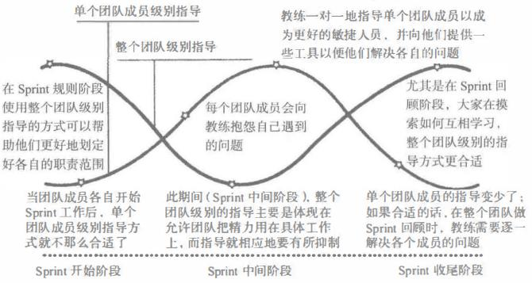

# 教练和指导以及头脑风暴

在敏捷团队中，我们一直会说没有项目经理，而传统的项目经理这个角色，更多的会体现在敏捷教练这个角色中。对于传统的项目管理，项目经理要管理团队成员，管理项目计划。而在敏捷团队中的教练，则更多的是一种服务式的领导，很少有管理成分。当然，并不是说完全没有管理，只是我们认为领导力会更优于管理。同时，作为不参与技术开发的人员来说，计划也尽量放手让团队成员去做，我们只会提供一些意见。另外就是最重要的为团队扫清各种障碍。接下来，要说的就是教练最主要的一个职能，那就是指导。

## 团队的教练和指导

作为教练，我们要掌握好指导的技术，这个技术可以同时完成两个层面的事，一个是个人层面，一个是整个团队层面。我们通过 《如何构建敏捷项目管理团队》 一书中的一张图来展示教练的指导如何贯穿整个冲刺。

在冲刺的边界，也就是冲刺开始和结束的这两边，是团队指导的主战场。冲刺规划时，教练要帮助团队更好地划定各自的职责范围。而在冲刺回顾阶段，要和团队一起摸索如何互相学习。在冲刺的过程中，整个团队的指导主要集中在让团队把精力用在具体的工作上，所以这个时候的指导不会太多。

对于个人的指导，则是在冲刺中会更多一些。团队成员在冲刺中遇到问题，教练都可以为其提供一对一的指导，并且提供工具、知识以及建议为他们排忧解难。在一对一的指导时，我们最主要的就是要保持谈话的坦率性，同时充满积极和尊重。为了解决问题，我们可能需要管理人员合作，建立频繁的汇报机制，并跟踪确保问题已经解决或有所减轻。在冲刺刚刚开始的时候，团队成员陆续投入到自己的工作中，这个时候教练还不需要特别的指导，也不应影响团队成员最开始的状态进入。而在冲刺的回顾阶段，如果有需要的话，教练可以逐一解决各位成员的问题。注意，如果是在迭代中出现的问题，成员没有主动提出，那么这个时候教练最好能尽早解决，不要让团队成员把问题带后下一次的迭代中。

### 指导

在 《如何构建敏捷项目管理团队》，也就是上面那张图的出处中，提到了一对一指导的 4 个前提，我们一起来学习一下。

1. 在超前半步的层次上进行指导。教练不要逼迫团队一开始就获得成功，或者就要达到何种标准。教练需要的是基于指导对象“目前所在”的层次来进行指导，而不是基于团队自己所在的层次，也不是基于我们想要指导对象应该要达到的层次。

2. 转向于充满安全感的环境。这个就是需要敏捷教练来保证我们的团队成员能有一个这样的环境了。本身项目产品开发就是一个探索的过程，我们要不断地尝试和冒险，而敏捷教练除了在外在环境上能够为团队扫清障碍之外，还要在内部鼓励团队成员能够有冒险精神。允许他们犯错、允许报怨，这些也不应该记录在绩效考核中。如果有教练和成员单独的小秘密，教练也应该为其保密。

3. 与管理者们合作。其实，不管是敏捷团队还是传统的项目团队，真正的领导还是直属管理者们。只不过传统的项目经理可能会有一些实权，但敏捷教练一般是完全没有什么实权的。所以教练应该和这些直属管理者建立良好的关系和密切的合作。这样更有利于指导团队成员并进行有效的规划。

4. 创造一种积极的氛围。即使你从自己的内心就不是很喜欢或很支持某个成员，也要控制自己的心态和情绪，帮助他一起成长。不管怎样，都要积极的营造一种良好的、积极向上的氛围。这对教练来说是非常有挑战性的，也是非常考验一个教练的指导水平的。

## 团队头脑风暴

关于头脑风暴，我们在之前的文章中已经介绍过了。这里，再简单的介绍一下头脑风暴在团队中的一些作用。我们使用头脑风暴这项工具，可以确定待定人物的产品角色；为发布版本确认最小市场特性，也就是 MVP ；识别影响项目的风险；制订针对突出问题的解决方案。当然，最后这个找方案是头脑风暴最重要的一项作用。对于头脑风暴来说，可以畅所欲言，也可以有别的方式，比如：

1. 安静地写作。这个貌似很违反常理吧，让团队成员把想法点子安静地写下来。好处就是互不干扰，避免了从众的问题。缺点的话就是可能交互性不够，更像一种匿名投票的感觉。

2. 循环方法。大家轮流提出自己的想法。其实就是最常见的我们进行头脑风暴的方式。优点是可以将想法建立在彼此的观点之上。缺点就是会有从众的问题。因此，团队成员要尽量坦诚地表达自己的想法。

3. 无限制方式。随便说，随便想，但是每一个观点都要记录下来。这种方式对于发散思维非常有用，但是，也可能造成本身就比较内向的成员更不想表达自己的意见。

## 总结

今天的内容非常简单，最主要是内容非常少。到此为止，团队这一块的内容我们也就讲完了。其实，敏捷中最核心的东西我们都已经接触到了。当然，不是说后面的东西不重要了。敏捷认为所有的东西都是相对的，没有绝对的，特别是风险、问题、质量标准这些，要是忽略了他们，即使你的敏捷项目做完了，后期的麻烦也不会少哦！

参考文档：

《某培训机构教材》

《用户故事与敏捷方法》

《高效通过PMI-ACP考试（第2版）》

《敏捷项目管理与PMI-ACP应试指南》

