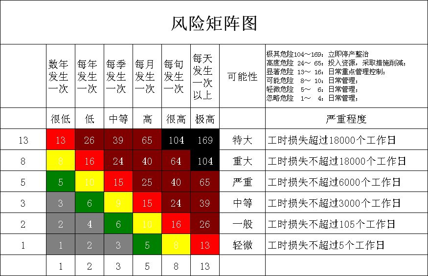
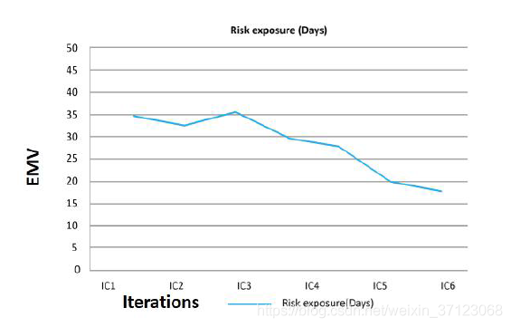
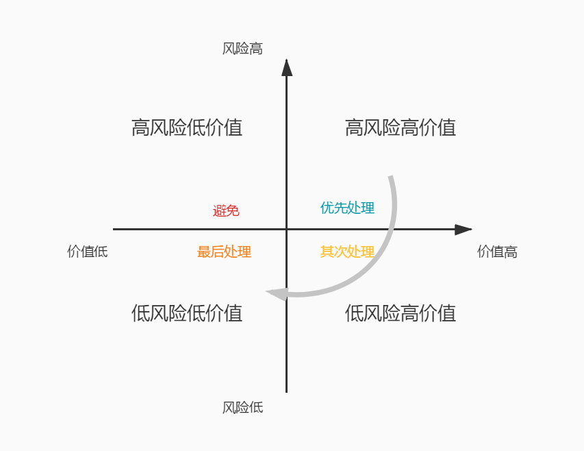

# 风险管理

在 PMP 中，风险是一个重要的章节，并且有许多的过程，比如说我们要识别风险、进行定性定量分析、应对风险等，工具方面也有决策树、敏捷性分析等，最后还有一个风险应对和机会应对（PMP认为风险和机会是对应的）。这些内容其实是相当有意思的，不过这并不是我们在敏捷中学习的重点。

为什么呢？这么自信？

还真是，为啥呢？就是我们前面一直在讲的几个重要的东西并且浓缩成的一句话：“尽早交付有价值的产品”。通过迭代计划，我们选取最有价值的功能来做，然后通过快速的迭代和发布，我们尽早让价值上线使用。如果发现问题，能够灵活地就在下一次迭代马上变更方向。而且，最重要的一点，传统项目之所以风险很高，正是因为它们很难在项目进行中进行变更，而这个，正是传统项目最大的风险之一。变更需要非常复杂的手续，而敏捷是拥抱变化的，没有什么手续，在相关方看到真实可用的产品之后，出现的问题是大家都能看到的，变更自然也是所有人都能接受的。快速的迭代反馈和交付让我们能够马上响应变化的世界。综上所述，当风险发生时，冲刺评审、冲刺回顾以及发布后的回顾都会成为我们发现、总结风险的地方。

因此，我们今天的内容依然很简单，只是来看几个简单的敏捷风险工具而已。

## 风险燃尽图

风险和价值是紧密相关的，我们在编写用户故事，设定优先级的时候，是需要将风险也计算在内的。因此，高风险的故事相对来说也会有一个高的优先级。将项目中的高风险工作放到项目早期是一个明智的做法。同时，在项目进行的过程中，也需要不断地管理风险，并追踪风险管理的成效。

对于风险管理这一块，其实我们可以借鉴 PMP 中的一些技术，比如说 风险概率矩阵 ，它就是根据风险的 等级 和可能出现的 概率 来制作的一张表。

除此之外呢，我们还可以将等级替换成 货币价值 来进行表示。这个东西其实有点偏财务和管理学方面的内容，在之前 **【敏捷3.1】价值与价值驱动交付**[https://mp.weixin.qq.com/s/Dw763UK9Dy_jH8gYthBsZw](https://mp.weixin.qq.com/s/Dw763UK9Dy_jH8gYthBsZw) 这篇文章中有提到过一点。不过这个东西确实不是我们在敏捷中学习的重点，因此，大家还是自己找一些资料来学习一下。

如果我们用风险出现的 概率 和该事件的 货币价值 相乘，就可以得到一个 预期货币价值EMV 。这个东西呀，其实也就是 PMP 的 风险定量分析 中的 决策树 。比如一个风险发生的可能概率是 25%，造成的影响可能是 8000 元，那么它的 EMV 就是 8000*0.25 = 2000 。

然后我们将这些风险 EMV 整理汇总起来，就会有一个风险的总值。当然，这个风险的总 EMV 是不断变化的。而我们在迭代中会不断的通过工作的完成来解决这些风险，于是风险就会像我们之前学习过的燃尽图一样不断下降。这个，就是 风险燃尽图 。

## 基础风险的探针

这个主要是团队在研究一个新的问题时，比如说新的技术或者新的潮流时，没有人有过类似的经验，所有人只能去现学相关的知识。这个时候，使用一个迭代探针用来进行小规模的实验，是能够规避大部分的风险的。如果我们在迭代完成后，发现这个概念的验证是成功的，就可以继续下去，那么自然就把这个问题的风险排除或者将它的等级降低。否则，就需要更进一步的探针测试。当然，这种方式不能一直下去，通常两个迭代还无法解决的问题可以咨询专家、进行培训或者考虑其它的替代方案了。

## 基于风险调整的待开发项

这个呢，从名字就看出来了，就是将应对风险的一些工作任务也包含进一个冲刺或者冲刺的待开发项中。在前面我们讲过在 PMP 中，风险和机会是相对的，因此，如果是一个机会，那么我们会有积极的风险应对策略，比如说 开拓、提高、共享 等。而对于一个消极的纯风险来说，我们可以 规避、缓解以及转移 。这些内容也是 PMP 中的风险规避策略。应用这些策略，并且形成一项工作任务加入到待开发项中，就成为了基于风险调整的待开发项。

我们可以根据前面说过的 EMV 来确定风险的价值，然后同时结合我们对任务本身的各种价值来综合考量待开发项的优先级。比如我们下面要讲到，对于高价值高风险的待开发项来说，应该有更好的优先级。

## 风险的严重程度

其实呢，在敏捷中，风险管理其实是工作进度的一个驱动因素。因为团队会将高风险的活动移到迭代的早期，并将风险的缓解这些活动放入待开发项中。随着项目的开展，团队需要持续的监控风险并跟踪风险的减轻情况。当然，在这其中有一个重要问题就是并不是所有高风险的问题都是值得我们去做的。

那么，我们应该以什么维度来确定这个风险是不是我们应该及早解决的问题呢？答案还是价值。如果说解决一个风险能够带来 3000 EMV ，而另一个风险能够带来 5000 的EMV ，那么很明显，我们应该先解决能够带来 5000 价值的这个高风险任务。按照这这样来说，我们可以以风险的高低和价值的高低来形成一个四象限的坐标图，比如下面这样。

在这张图上，我们能够看到根据风险高低和价值高低分成了四个象限，分别是 高风险高价值 、高风险低价值、低风险低价值 和 低风险高价值 。对于这四种情况，我们当然首先要解决的是高风险高价值的任务事项。

首先这些风险带回的价值最高，其次，这些风险的综合值也非常高，这样就说明不解决这些风险会减少很多价值，而且它们的风险还非常的大。比如说支付功能，如果是电商网站，这个功能就是高风险高价值的一个功能，风险在于涉及现金支付对于安全性要求会比较高，而价值自然不用多说，资金流动性，虽说货到付款也能在前期让项目运转起来，但是资金总归还是没有完全的到自己的帐户中。

接下来，要解决的是 低风险高价值 的问题，这些风险可能出现的频率比较低，或者问题不算严重，但是解决它们可以带来很高的价值。再接下就是 低风险低价值 的任务，这些内容可以在凑故事点数或者项目进行到后期的时候再做。

最后我们要看到 高风险低价值 的内容应该是去尽量避免的，它没有价值，然而却会带来很高的风险。比如说在项目初期我们就规划好超大的机房预计上亿 DAU 的流量，这些至少在目前这个初级阶段真的毫无价值而且风险极高。

## 总结

风险这一块其实要说的也就这么多，在敏捷中我们不会像 PMP 一样做出非常详尽的计划出来。但是，风险其实是一直跟随着我们的迭代并且是持续需要关注的内容的。对于风险来说，我们真的是要做到尽早发现，尽快收集分析，然后评估它的价值以确定价值最高的风险能够及时解决。是不是发现敏捷真的很喜欢以价值来评价工作，即使是风险，我们也要优先解决对于项目来说价值最高的那部分风险。

参考文档：

《某培训机构教材》

《用户故事与敏捷方法》

《高效通过PMI-ACP考试（第2版）》

《敏捷项目管理与PMI-ACP应试指南》