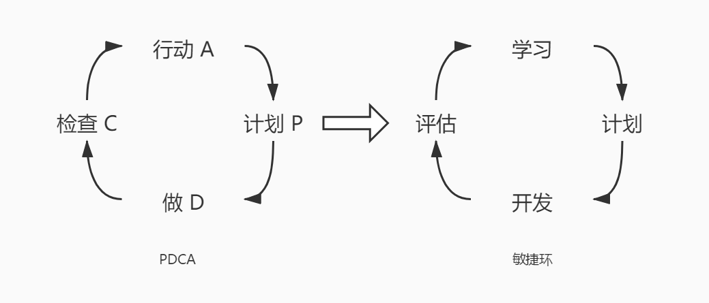
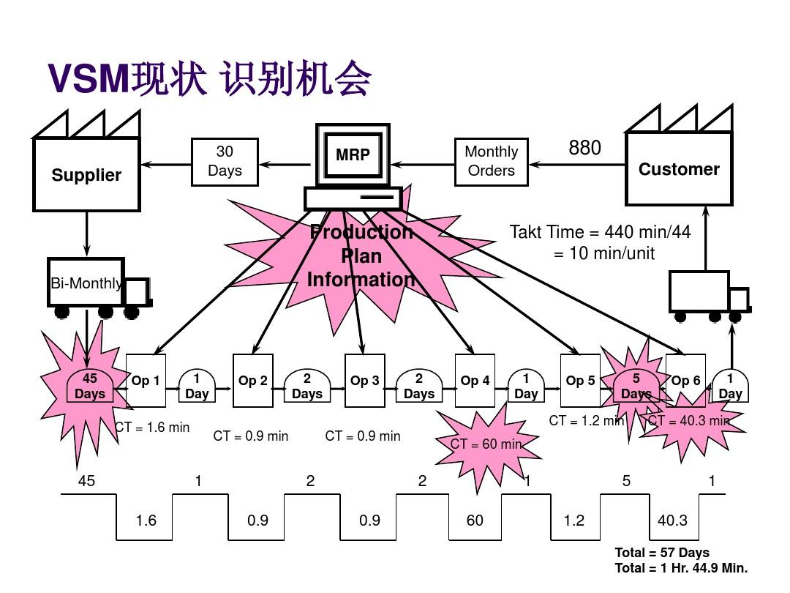

# 解决敏捷中出现的问题

风险，一般来说会是我们预估的，可能会发生的“问题”。而 问题 ，则是已经出现并且放在你面前的麻烦事。其实不管你做任何事，做任何项目，风险有可能发生，也有可能不会发生，但问题，你一定会遇到。有的问题在成为问题之前不一定会是风险，因为可能你都没有察觉到它，它就出现了。因此，我们更要关注问题要如何来解决。

## 持续改进形式的解决问题

在 精益 和 敏捷计划 中，我们都提到过 持续改进 这个东西。它本身就被认为是一种解决问题的有效方式。我们的 迭代冲刺 ，都会在结束的时候有 评审 和 回顾 会议。通过这些会议，我们就能够发现潜在的问题，这样就可以解决在冲刺迭代中临时处理问题的需求。除此之外，这些也是我们保存经验和教训的好工具，通过这些经验教训的学习记录，也可以为我们提供了解自己的长处和短处的一个渠道，可以让我们确保类似的问题不在发生。

### Kaizen

这个词的意思就是“变得更好”。说白了，就是我们讲的 持续改进 的意思。Kaizen 涉及每一个人、每一环节的连续不断的改进，从最高的管理部门、管理人员到工人。Kaizen 实际上也是一种生活哲学，它假设我们应当经常改进我们生活的每个方面。

在团队工作中，我们会关注的是对团队的鼓励——正在做这项工作的人——频繁地实施小的、增量的改进。这种方法其实是基于另一个非常出名的管理学理论 PDCA 循环。

除了 PDCA 之外，我们在它的边上还看到了一个敏捷环。这两个环，PDCA 代表着开发任务的维持，而敏捷环代表着学习与改善。其实每一个迭代，我们都可以看成是在进行着一个 PDCA 和 敏捷环 的循环。甚至可以说，敏捷中的迭代概念就是它们俩的一种实践表现。

每个迭代都有改进的感觉怎么样？不过在敏捷中，一个迭代进行一次持续改进还是太慢了，我们更提倡的是每一天都会进行改进，而不是在一个冲刺之后。通过什么呢？每日站会 以及 知识型团队的自我学习成长。

### 多层级的改进

敏捷的持续改进会在很多个层级上进行，比如说编码层面上的 结对编程 。每日站会 上团队成员对遇到的问题的陈述。冲刺结束之后的评审、回顾会议等等。这些就像下图一样组成了多层级的改进，敏捷就是在这样的一个框架下，不断改进优化的一个项目管理框架。

### 价值流分析

价值这个东西真的已经说得够多了，但是，注意了，在 持续改进 这里我们依然又再次见到了它。想想吧，上篇文章在风险中我们刚说完，在这里就又见到了。价值，真的是敏捷的核心啊。

价值流程图（VSM），就是通过优化每一个流程中的环节，消除浪费，为客户提供更优的价值。它包括如下的步骤：

1. 识别需要分析的产品或服务

2. 创建目前流程的价值流，识别步骤、排序、延迟、信息流

3. 评审找出的流程中的延迟，浪费和约束

4. 为未来流程创建新的价值流，移除和减少延迟、浪费和约束

5. 创建路线图

6. 规划流程进行再次访问，以持续优化

价值流程图来源于传统制造业，有兴趣的同学可以自己查阅相关的资料并尝试绘制我们自己的敏捷价值流程图。

## 问题解决流程

接下来我们来看一套问题的解决流程。这个解决问题的流程是一个比较通用的一般流程，适合于大部分问题的解决。

1. 陈述问题。要清楚明白地说明这个问题，有时间、地点、发生时的环境情况等，当然是越详细越好。

2. 分解问题（问题树）。对于问题来说，有的时候可能会是一个小的原因一步步导致的，也有可能是多种因素共同导致的，尝试分解这个问题形成一颗问题树，看出这个问题中各种关联的因素。

3. 去掉所有非关键问题（漏斗法）。根据上一步的结果，分析分解出来的因素有哪些确实是和问题无关的。

4. 制订详细工作计划。主要是针对问题的分析工具的选择，头脑风暴、决策评估、鱼骨图、德尔菲，或者你觉得对问题分析有帮助的任何工作计划。

5. 进行关键分析。通过上述制定的计划进行关键问题原因的分析。

6. 综合调查结果，并构建论证。对问题的关键因素进行理论验证，最好有数据支撑。

7. 讲述来龙去脉：在沟通文件中将数据及论证联系起来。

经过上述步骤后，我们不仅会对问题的关键因素有一个全面的了解，而且在最后也会对问题记录在册。可以使用敏捷的一些知识工具进行记录，解决过的问题对于团队来说是一个成长进步的重要内容，并且也是项目的宝贵资产。

## 回顾会议

最后我们再来讲讲回顾会议。之前我们就说过，回顾会议是分享好的经验和发现改进点的地方，也是促进团队不断进步的一个非常好的工具。整个迭代会议应该围绕三个点：

- 本次迭代有哪些做得好。

- 本次迭代我们在哪些方面还能做得更好。

- 我们在下次迭代准备在哪些方面改进？

对于开好一个迭代会议，需要注意的也有两点建议：

- 会议气氛：Team 全员参加，气氛宽松自由，畅所欲言，头脑风暴发现问题，共同分析原因。

- 关注重点：Team 共同讨论优先级，将精力放在最需要的地方（只关注几个改进就够了）

- 会议结论要跟踪闭环：可以放入迭代的 Backlog 中。

在会议中，我们可以通过头脑风暴技术来发现上次迭代听问题，这是非常好用的一个工具，而对于原因的分析来说，我们可以尝试使用 力场分析法、5Why法 等，并且使用鱼骨图来进行记录。在决定下次要做什么改进时，可以使用 SMART 来确定目标。这些，都是回顾会议中非常有用的一些工具。

要记住，回顾会议绝对不是一个讨债大会，回顾不是责备，而是针对定性（人的感觉）的和定量的（衡量指标）数据，然后利用这些数据找到问题的根源，设计对策，并制定行动计划。

## 总结

对于项目来说，问题真的是远处不在的。即使是对于我们每个人的工作来说也是一样的。很多时候，其实我们就在自己一次次的解决问题中成长起来的，失败为成功之母，但是并不是说我们要一直失败。当我们碰到一个问题的时候，努力找到解决它的方法，大部分情况下都是可以成功解决它的，这个时候我们就已经获得了成长。而失败则是没有考虑到的问题或者风险被触发了，是带来严重后果影响的问题，解决它们，会收获更大的成长。但是，你也可能付出更大的代价。总之，努力学习，通过学习的方式提前接触问题，了解问题，解决问题，这才是更好的成长之路。

参考文档：

《某培训机构教材》

《用户故事与敏捷方法》

《高效通过PMI-ACP考试（第2版）》

《敏捷项目管理与PMI-ACP应试指南》

