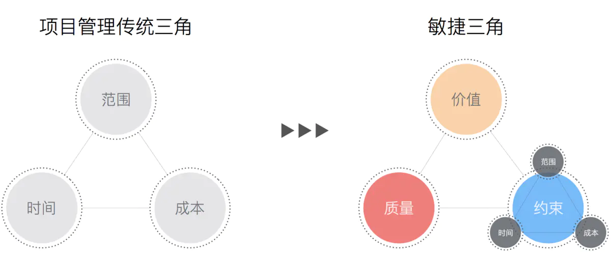

# 缺陷、质量与失败模式

在学习完风险、问题之后，我们再继续学习一个简单的内容，是和 QA 有关的缺陷、质量方面的内容。关于这一点，又要搬出 PMP 了。

在 PMP 中，质量管理也是一个非常重要而且非常大的章节。是范围、成本、进度三大知识领域外最最重要的一个知识领域。还记得在开篇文章中我们讲过 PMP 有个铁三角吗？

在这里，我们把敏捷三角也给出来了。在敏捷中，质量是三角形的一个支点，大家都知道，三角形之所以稳定，就在于它的支点，可见在敏捷中质量的重要性。可是 PMP 的铁三角中我们没有看到质量呀？没错，在 PMP 中，质量不是铁三角的支点，但是，它是贯穿于整个 PMP 项目管理过程中的。因此，有的人将它会画在三角形的中间，而有的人则写在外面，但只要你学习过 PMP ，就一定会了解到 PMP 中质量管理的重要性。

好吧，大家肯定对敏捷三角还是比较感兴趣的，简单讲下吧。价值，不用多说，已经讲过太多了，之前好几篇文章专门讲价值。质量，其实和前两篇的风险、问题以及我们马上要学习的缺陷管理、质量标准等合并在一起，构成了敏捷中的质量支点。约束是什么？就是我们传统项目管理 PMP 的那个三角形。虽然之前一直没讲过，但是，敏捷方法一定也是有时间的，不可能永远迭代下去，也是有范围的，范围来源于用户故事也就是客户的需要，同样，也是有开发成本的。规划分析、估算、监控、适应相关的文章其实讲得就是这一块的内容。当然，如果有兴趣的同学，最好还是去看看 PMP 中这三部分内容是如何讲解的。（也可以继续关注我哦，下一个系列学习《信息系统项目管理师》相关内容的时候就有这些）

另外，这两个三角是吹牛皮的神器，有兴趣的小伙伴一定要记下来。至于神在哪里？思考一下，如果老板让你加快进度，你拿出 PMP 三角形，然后说要保持这个三角形的稳定，一个加那么其它的也要加，对不对，这样的话，加快进度咱们就得修改项目范围并且增加人手成本，要么减需求，要么加钱加人，想白加班？那没门！这可是 PMP 说的，不是我们瞎说的哦，哈哈哈哈！

回到正题吧，今天我们来讲的也就是质量相关内容的最后一块。先来看看缺陷。

## 缺陷

虽然我们有测试流程和测试方法，也有解决问题的一系列工具，并且通过敏捷的迭代能够快速的解决它们，但是，总会有一些问题会被客户或者用户发现。这些，就是缺陷，也被称为 “溜走的缺陷”。即使你的单元测试覆盖达到 100% ，即使你有完整的 用户故事 测试用例。但是，相信只要是做过互联网产品的同学都会承认，没有完美的产品，缺陷一定会出现，只是程度的不同罢了。就算是我们的页面上有一个错别字，不可否认，这也是一个缺陷，只是它可能确实影响不大。

不同的项目，不同的团队，造成的缺陷来源都不尽相同，对于这些缺陷，我们需要进行详细地记录分析，一个一个地找到缺陷遗漏的原因，并通过柱状图或者饼状图来对每个月产生的缺陷数量进行统计，分析原因，以促进后期工作中的改进。具体的原因分析方法可以参考问题解决中相关的方法工具，因为缺陷本身就是一种特殊的问题。

## 质量标准

项目的质量通常是由测试工具，团队来保证的。团队中，可以有专门的测试人员，也可以没有，每个人应该对自己的工作负责，而所有的代码或者内容也都是属于整个团队的，所以，团队应该在回顾、评审时来解决问题，促进质量的提升。我们要确保项目的价值以及质量。

质量标准的实践包含以下内容：

1. 通过测试和客户验收来度量产品质量。

2. 尽可能多地做自动化测试。

3. 确保测试成为每个冲刺的一部分。

4. 在下一个冲刺中至少修复 90% 的缺陷。

5. 鼓励质量控制和质量保证的人员与开发人员、业务人员一起工作，了解每个特性的验收标准。

除此之外，还需要监测和评估所使用的工具，比如说缺陷的指标、方差和趋势分析，还有项目过程的质量分析，如果发现问题，应该尽早找到解决方法并纠正。

项目的质量标准可以形成书面的正式或非正式的指南，放在团队的 Wiki 或者公司组织的 Wiki 中，这些都是将来检查和回顾重要指导，也是组织的宝贵财富。

## 失败模型

之前我们就一直在说，实际的工作中，错误真的是不可避免的，而且是每个人都有可能犯的。这些错误，有的成了问题，有的成了缺陷，有的在质量管控中解决了，而有的可能就出现了失败的情况，在 《敏捷软件开发：合作博弈》 一书中讲解了人们经常失败的 5 种情况：

1. 犯错误。这个吧，出现了，解决它，下次不要再犯。接受现实，总结原因，一定要让错误成为你成长的牵引而不是绊脚石。

2. 宁可失败也要选择保守。这个其实就是很多人会选择保守的进行项目开发，即使失败也会坚持以这样的方式进行下去，不会考虑使用一些冒险的方式来追求成功，比如我们通过探针迭代尝试新技术这种良好实践。

3. 创新而不研究。创新有，但还是利用以前的东西，美其名曰微创新。不去研究真正客户需要的是什么，价值在哪里。往往真正的创新都是隐藏在价值之中的。

4. 不能始终如一。这个就是坚持的力量，随着困难的加剧，很多人或者团队会选择放弃。在敏捷中，要注意将风险最大的任务的优先级提升，优先解决些内容，让团队更加自信。

5. 使用纪律和容忍来应对。在一起工作的过程中，以完全的纪律来要求大家，并为了项目成功而容忍一些不好的事情。在敏捷中如何应对呢？团队自组织，简单的纪律，详细的代码规范，教练的仆人式领导和适应性的团队管理。

有失败模型，也有我们敏捷中的一些工具的应对，不过我们最后也还是再来了解一下相对应的成功模型吧，就当是我们学习的一个扩展。

1. 善于四处寻找：当遇到不正确的事情时，人们有观察、评审的能力。

2. 有学习能力：发现错误之后，想办法解决它，并且更新我们的技能知识。

3. 具有可塑性：有能力改变和接受新的主意和方法。

4. 以工作为自豪：能够在工作范围之外做一些事（当然，不是去增加功能，这叫镀金，不是好事，信管师课会讲），比如修复一些错误或者报告问题之类的。

## 总结

这是质量相关的最后一篇文章，也是我们敏捷课程理论相关的最后一篇文章。缺陷、质量标准以及失败和成功的模型其实不只是在我们的敏捷开发中会用到，这里面提供的理论方法其实对我们每个人的工作都是有用的。有谁不想做出来的东西是更好的，BUG 更少的，更贴近用户的。当然，理论只是一个方面，更多的还是需要实践，特别对于问题解决和缺陷解决这一块，是我们每个人在职场生涯中一生都要修炼的必修课。

参考文档：

《某培训机构教材》

《用户故事与敏捷方法》

《高效通过PMI-ACP考试（第2版）》

《敏捷项目管理与PMI-ACP应试指南》
