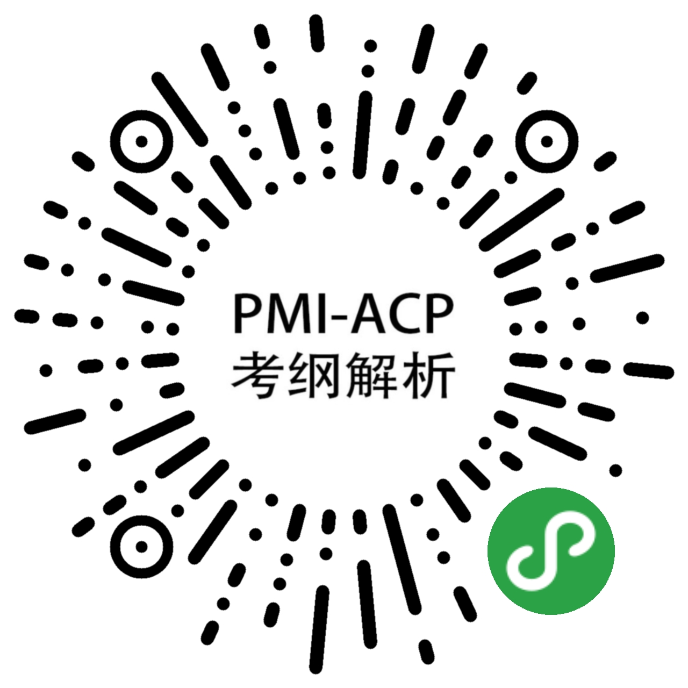
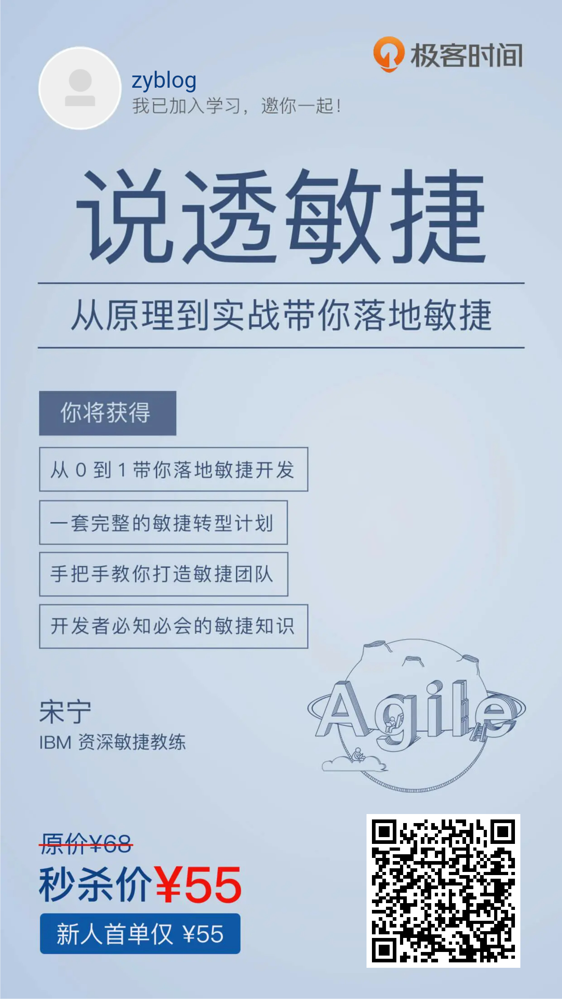

# 结束其实是另一个新的开始

恭喜大家，当然也要一起恭喜我自己，又是一个大型的连载系列完成了。视频还在继续更新中。

前前后后差不多也有半年时间，对比技术类的文章来说，项目管理这类理论学科的内容其实会更难写一些。一是篇幅不像技术类的文章好凑，贴几段代码文章就会显得很长；二呢也是需要参考很多的资料，比如我们每篇文章下面的那几本参考资料，基本都是一起在看的，找出其中一点然后在写文章的时候同时参考其它几本一起看。另外还有一点就是有些例子确实不太好举，在这里也只能尽已所能了。

之前确实带过一个团队实践了一些敏捷的工具，像是 用户故事 、每日站会、回顾和评审会议、迭代计划会议，每天在 Scrum 任务板前进行站会，然后实行的是 2 周为一个时间盒的小迭代。开发的就是一个 O2O 的小程序项目，是的，你没看错，2018年左右，小程序刚出来的时候。在当时的情况下，带领团队用着这个不是很完整也不是很规范的 Scrum 流程，也算是取得了一些小小的成果。后来因为一些其它原因，回到了长沙，也就没有再带过完整的超过 3 个人的团队了。当然，更重要的是工作类型也不是很适合项目型的开发，以维护为主。

因此可以说，我的这一系列的文章教程可能会在很多朋友面前显得非常幼稚可笑，甚至也有很多疏漏以及错误的地方，也希望大家发现了之后能够及时指正。

对于我来说，当时考 PMP 、ACP 、信管师 纯粹是心血来潮，也同时是为了证明自己没学历但是确实能力不差吧。不过说实话，现在 PMP 都已经过期没续了，太贵，而且还要搞 PDU 。当然，如果你的工作本身就是项目经理，而且也一直从事这个工作的话，我觉得 PMP 和 ACP 都应该是要考要续的。

也因为如此，关于敏捷的课程可能也就写完这一个系列就结束了，如果将来的工作中有机会再带一个敏捷团队去用敏捷开发项目的话，那还是会继续分享相关实践的。

对于这个系列的文章来说，最重要的一个参考资料就是 《高效通过 PMI-ACP 考试》（第2版）这本书，这本书是通过 PMI-ACP 考试的一本必备资料。我的章节安排和很多内容都是出自这本书，向作者 问静园 闫林 表示深深的谢意，不仅让我通过了考试，还写下了这个系列的教程。请大家一定支持正版。

我做的WX小程序 **敏捷项目管理ACP考纲解析** 也是一个非常不错的参考资料哦，有兴趣的小伙伴可以去看看，如果是要考试的小伙伴，这里面的内容可是非常重要的哦，建议考试前可以经常查阅复习。

最后，网易云课堂之前的项目管理微专业其实也是非常不错的一门课程，可惜现在貌似没有了，如果后面又上架了大家可以去看一下。这里还有一个当时的美女老师，也是网易的项目管理部总监 雷蓓蓓 老师在极客时间开设的课程。

直接扫码去看一下就行了，还是比较超值的。另外，在极客时间还有一套专门讲 敏捷教练 的课程，也非常值得推荐。

这个就更划算了，而且确实是想要成长为敏捷教练的话，应该要掌握的东西。

## 结束之后是一段新的旅程

好了，最后的话，也不能说再见，只是说对于敏捷这一块的内容我们的学习结束了，告一个段落，紧接着，我们就要准备下一个内容的学习，也就是 【信息系统项目管理师】 这个系列课程的学习。先透露一点，这个考试有技术类的考试，所以学习过程中你会接触到不少软件工程和开发相关的知识。其次，最重要的一点是，信管师课程中项目管理的部分，完全是 PMP 第 5 版的内容，也是最最经典的那一版的内容。所以，我们可以通过这一个课程学习到两块的内容，并且还会介绍这个考试所获得的证书的作用，相信不少码农们一定会很感兴趣哦。还是那四个字。

敬请期待！

PS.所有课程文章已经写完了，不过会在 PHP 的 Laravel 和 Swoole 系列之后开始更新，近 70 篇文章，内容相当丰富，预计要持续更新将近10个月左右。

推荐项目管理类书籍：

《人月神话》

《网易1001夜》

《用户故事与敏捷方法》

