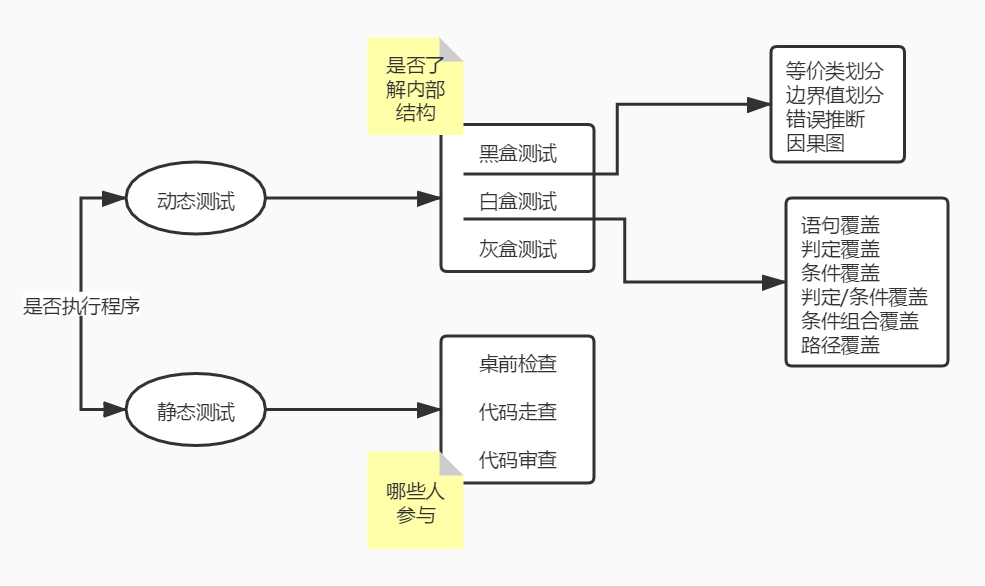
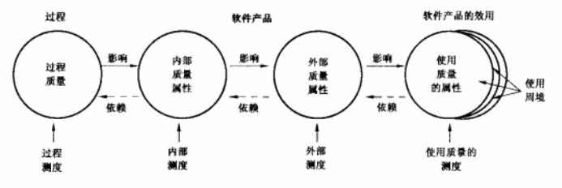
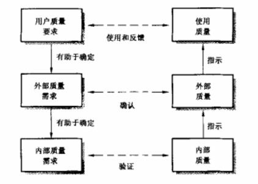

# 软件工程（四）软件测试与质量保证

在之前的敏捷相关的课程中，我们讲过一种开发模式叫做 TDD ，也就是测试驱动开发。这种开发模式是先写单元测试，然后再写代码，代码完成的标准就是通过测试。如果你是在一个需要开发非常高质量产品的团队中，相信这种开发模式一定不会陌生。

测试，对于软件的重要性不言而喻。没有测试的软件相信你也是不敢交到客户手中的，至少我们手动点点点的也得把功能都测试完。当然，就和软件工程中的其它部分一样，测试本身也是一个非常大的知识技能分类，也有专门的测试工程师这一职位，因此，在这里，我们还是只能在入门的水平上略做了解而已。

## 软件测试及管理

软件测试的目的就是验证软件是否满足软件开发合同或项目开发计划、系统/子系统设计文档、SRS、软件设计说明和软件产品说明等规定的软件质量要求。通过测试，我们可以发现软件缺陷，为软件产品的质量测量和评价提供依据。

### 测试方法分类

根据是否运行程序来测试，我们可以将测试分为 静态测试 和 动态测试 两种。很明显，静态测试是不需要我们把代码运行起来的，而动态测试就是程序需要运行起来，跑起来才可以进行的测试。

静态测试主要是对文档、代码进行静态的检查，它又可以分成三种类型，我们一个一个来看看：

- 桌前检查（Desk Checking）：这个就是自己对自己写完的代码进行检查，在提交代码之前完成自查的步骤。不过这个步骤效果一般不会太好，为什么呢？自己写的东西，不管是文章还是代码，都很难检查出问题。这个不怪你粗心，是大部分人都会存在的问题，就像我的很多文章里面都会有错别字，但其实每次我发文章前都会好好看两遍的。

- 代码走查：代码走查就是通过测试小组进行模拟计算机运行的测试。这个是啥？不就是我们常说的 Code Review 嘛。一般会是开发小组一起进行，由一个主持人来挑选除自己以外团队成员的代码一起阅读。大家一起在脑中模拟代码运行的结果，一起发现问题并记录下来。这种效果最好，不过呢，太费时间，而且还要坐在一起开会。

- 代码审查：刚说完的走查，好是好，但效率不行，还耽误大家的事，感觉还是不太合适呀。那么你可以试试代码审查，它是团队成员之间互相审核代码。不用坐在一起开会，就是互相查看团队成员其他人的代码。最典型的就是 Github 的 Pull Request ，可以设置团队中必须多少人审核完成你的代码才能将这段代码合并到主分支中。这种方式，一是可以多人互查，二是大家可以自己安排审查的时间。因此，代码审查是静态测试中比较综合平衡的一种测试方式，也是比较推荐的代码检查方式。

动态测试就是在计算机上实际运行程序进行软件测试，这个时候软件是跑起来的。根据我们测试的工具或者方法是否对业务代码有了解，也可以分为三种类型：

- 白盒测试：白盒的意思就是我们对代码很清楚、很了解，将程序看作是一个白盒，测试人员完全清楚程序的结构和处理算法。一般白盒测试针对的是 单元测试 ，也就是代码级别的测试，通过程序员自己完成。在 单元测试 中，我们需要关注的是覆盖率的问题，也就是有多少代码被测试到了。我们应该尽量追求高的覆盖率，但也不能一味追求 100% 的覆盖率，有的时候将覆盖率从 99% 提升到 99.1% 就需要我们付出 200% 的努力，这样反而是得不偿失的。在覆盖率中，我们会比较关注 语句覆盖、判定覆盖、条件覆盖、判定/条件覆盖、条件组合覆盖、路径覆盖 等。

- 黑盒测试：也称为功能测试，主要是用于 集成测试、确认测试和系统测试 中。黑盒很明显就是和白盒反过来的，将程序看作是一个不透明的黑盒，完全不考虑（或不了解）程序的内部结构和处理算法，一般是 程序员、测试工程师 或项目其它相关人员来进行测试。在黑盒测试中，我们要依据 SRS 所规定的功能来设计测试用例，一般包括 等价类划分（比如将 1-100 的参数值分成 1-50和51-100两部分）、边界值分析（比如 1-100 我们选取 0、2、99、101来测试）、判定表、因果图、随机测试、猜错法 和 正交试验法 等。

- 灰盒测试：灰盒测试，是介于白盒测试与黑盒测试之间的一种测试，灰盒测试多用于集成测试阶段，不仅关注输出、输入的正确性，同时也关注程序内部的情况。灰盒测试不像白盒那样详细、完整，但又比黑盒测试更关注程序的内部逻辑，常常是通过一些表征性的现象、事件、标志来判断内部的运行状态。

上面这一大段我们提到了一堆名词，不知道有没有把你整晕。反正我第一次学的时候真的是晕头转向了。后面我们还会再详细的讲解其中的一部分测试，不过我们先看一张有利于记住这一堆名词的图，这个是我们今天文章的重点之一。

### 测试类型

对于测试的类型，其实我们在上一段就已经全部都提到过了，在这里我们再来简单地挨个说明一下。根据国标 GB/T 15532-2008 ，软件测试可以分为如下几种：

- 单元测试：也称为模块测试，单位最小，是代码中方法、函数级别的测试。目的是检查每个模块能否正确地实现设计说明中的功能、性能、接口和其他设计约束等条件，发现模块内可能存在的各种差错。前面说过，单元测试关注覆盖率，并且是由程序员自己来完成的。

- 集成测试：检查模块之间，以及模块和已集成的软件之间的接口关系，并验证已集成的软件是否符合设计要求。其实它就是在单元测试的基础上测试多个函数接口之间一起联合运行的情况。主要测试的是模块间的接口和通信，一般也是以程序员为主。

- 确认测试：主要是验证软件功能，也称为有效性测试，根据用户的参与程度还有三种类型。内部确认测试，是开发组织内部按照 SRS 进行的测试；Alpha测试和Beta测试，Alpha测试是指由用户在开发环境下测试，而Beta测试则是指用户在真实环境下进行测试；验收测试，针对 SRS ，在交付前以用户为主进行的测试。这一部分的测试一般都在项目开发比较后期的阶段，以测试工程师辅助并通过用户参与为主的测试。

- 系统测试：系统测试的对象是完整的、集成的计算机系统，系统测试的目的是在真实工作环境下，验证完整的软件配置项能否和系统正确连接，并满足系统/子系统文档和软件开发合同规定的要求。在这个阶段，我们应该是软硬件以及系统的所有相关功能组件的联调测试。一般包括 功能测试、健壮性测试、性能测试、用户界面测试、安全性测试、安装与反安装测试 等。主要采用的是 黑盒测试 法。以测试工程师为主，程序员及产品经理等职能部门辅助。

- 配置项测试：测试的对象是软件配置项，目的是检查软件配置项与 SRS 的一致性。这个不太常见，也就不多说了。

- 回归测试：目的是测试软件变更之后，变更部分的正确性和对变更需求的符合性，以及软件原有的、正确的功能、性能和其他规定的要求的不损害性。回归测试非常重要，最简单的一种回归方式就是在修改完程序之后整体全部地运行一遍单元测试。注意，不仅是变更的部分，系统所有的部分都应该进行回归测试以确认变更是否对系统整体有影响。

除了上面 国标 中规定的测试之外，我们再补充两个教材之外的测试知识点。

- 负载测试：模拟实际软件系统所承受的负载条件的系统负荷，通过不断加载（如逐渐增加模拟用户的数量）或其它加载方式来观察不同负载下系统的响应时间和数据吞吐量、系统占用的资源（如CPU、内存）等，以检验系统的行为和特性，以发现系统可能存在的性能瓶颈、内存泄漏、不能实时同步等问题。

- 压力测试：在强负载（大数据量、大量并发用户等）下的测试，查看应用系统在峰值使用情况下的操作行为，从而有效地发现系统的某项功能隐患、系统是否具有良好的容错能力和可恢复能力。

注意它们两个的区别就好了，压力测试是看系统的最大承受能力，要压到系统接近崩溃的水平，并看系统的恢复能力；而负载一般不会给到那么大的压力流量，而是看在常态压力情况下系统的稳定性。

### 测试管理

软件测试的管理包括过程管理、配置管理和评审工作。

- 过程管理：包括测试活动管理和测试资源管理。整个测试过程中的活动有制定测试计划及用例、执行测试、发现并报告缺陷、修正缺陷、重新测试等。而测试资源则包括测试团队的管理、测试计划的管理、错误（缺陷）跟踪管理、测试件管理等。

- 配置管理：按照软件配置要求，将测试过程中产生的各种工作产品纳入配置管理。

- 评审：包括测试就绪评审和测试评审。一个是在测试之前就工具准备情况进行的评审，一个是在测试完成后对测试过程和测试有效性进行的评审。

## 系统运维

运维这个东西吧，往大了说，可以说是整个系统生命周期中最重要的一环。我们可以将软件维护定义为需要提供软件支持的全部活动，这些活动包含在交付前完成的活动，以及交付后完成的活动。交付前完成的活动包括交付后运行的计划和维护计划等，交付后的活动包括软件修改、培训、帮助资料等。在这里，我们了解一下软件维护的 4 种类型。

- 改正性维护：也就是出问题了进行修改，说白了，把出现的 BUG 改好。一般占总维护的 25% 。

- 适应性维护：对于已开发的产品，看看在用户环境下合理不合理，有没有与预期不适应的地方，有的话就得调整修改。这种维护一般占总维护的 20% 。

- 完整性维护：也叫完善性维护，就是增加功能模块，提升性能之类的工作，这个就是我们日常所理解的那种运维操作。如果是运营公司自己的团队运维那肯定是没问题的，如果是外包公司的话，一般的售后是不会包含这个的，这种维护对于外包来说就是一个新的项目，是要加钱的。这种运维占总维护的 50% 。

- 预防性维护：定期备份、检查，为有可能到来的修改变更做好准备。这种维护比较少，一般占总维护的 5% 左右。

大家可以结合自己的实际工作经验和情况，看看我们平常做得最多的是哪种运维，如果不是外包公司的话，那么估计大部分人都是在进行 完整性维护 ，而且这个比例可能比 50% 还要高。

## 软件质量保证与评价

说了半天软件工程，“软件”到底是个啥？其实我们前面有隐约的提到过，**【信管1.5】计算机网络基础（三）网络存储与网络接入** [https://mp.weixin.qq.com/s/dNEnCyL0zNRgs3AMVhGqSA](https://mp.weixin.qq.com/s/dNEnCyL0zNRgs3AMVhGqSA) 中，我们说过程序是怎样运行起来的，其实软件，不就是一个程序嘛。不过，真正软件的定义还是要更宽泛一些。

> 软件是计算机程序及其有关的数据和文档，也包括固化了的程序（比如COMS、BIOS等）。

除了程序外，数据和文档也是软件的一部分。对于软件来说，最重要的是什么？能耗、节约存储、速度、性能？这些确实很重要，但更重要的是质量。也就是说，你得能用，不能出 BUG ，性能在可接受的范围内，那么这款软件可以说是成功的。如果你的速度很快，但是用不了两下就崩溃黑屏直接退出的话，那估计大部分人还是没法授受的。当然，如果速度太慢，慢得你无法忍受，那么这也可以划分到质量问题中。那么，软件质量到底是什么呢？

软件质量，是指软件产品中能满足给定需求的各种特性和总和。这些特性称做质量特性，它包括功能特性、可靠性、时间经济性、资源经济性、可维护性和移植性等。

其实，真正决定质量的，是你和甲方、或者高层领导沟通出来的质量指标。比如说系统的第一版，我们要求系统整体响应能在2秒内，年故障率不能低于 3 个 9 ，所有功能都可以正常使用，兼容主流浏览器等。你只要达到了这些要求，那么这一版你的质量就是合格的。在这样的指标下，我们就可以根据情况选择合适的架构和项目资源。要知道，质量其实是一个相对的指标，大家都会追求最好的质量，但就像性能指标或者单元测试的覆盖率一样，可能最后那几个点就能达到完美的质量指标却需要付出成百上千倍的努力，这样对于一个商业化的项目来说，反而是得不偿失的。

好了，话说回来，软件质量管理过程和我们后面要讲的项目质量管理是有区别的，我们在这里先介绍软件的质量过程。

- 质量保证过程：通过计划制订、实施和完成一组活动提供保证，这些活动保证项目生命周期中的软件产品和过程符合其规定的需求。也就是不管做什么事，我们要遵守一定的程序步骤。

- 验证过程：确定软件开发周期中一个给定阶段的产品是否达到上一阶段确立的需求的过程。这个在敏捷中就是每次迭代冲刺之后的回顾会议，而在传统瀑布式开发中则是每个里程碑总结时的进行的验证。**确保活动的输出产品满足活动的规范说明。**

- 确认过程：在软件开发过程结束时对软件进行评价以确定它是否和软件需求相一致。**确认过程的目的是确保产品满足其特定的目标。**

- 审计过程：评价软件产品和过程对于 **设定规则、标准、流程** 等的遵从性的独立评价。

- 评审过程：对现有的或提出的项目成果所做的正式评估和审查，找出可能会影响项目产品、过程或服务工作的适用性和环境方面的缺陷，并制定补救措施，以及找出在性能、安全性和经济方面的可能的改进。

上面五个过程，记名字和加粗的部分就可以了。其实评审过程还包括两种评审：

- 技术评审：目的是评价产品，看产品是否满足需求，以确定使用意图的适合性。

- 管理评审：目的是监控进展，看的是过程是否满足管理计划，决定计划和进度的状态，或评价用于达到目标所用管理方法的有效性。

同样的，这两种不同的评审要知道它们的区别，一个是从技术产品的角度，一个是从管理过程的角度。

最后，我们再来看两张图，它们是 GB/T 16260.1-2006 质量标准，也就是国标的软件质量模型。

这两张图大家了解一下就好了，第一张图上的四个圈其实就是 开发过程质量、内部质量、验收质量和最终的用户质量。一般来说，开发过程中的质量问题最好解决，内部质量也是比较好解决的，而到了验收时出现的质量问题往往就会影响我们的项目收益，而用户在使用过程中出现的质量问题则有可能带来非常严重的后果。这四个点是需要我们注意一下的。

## 总结

今天的内容其实从段落情况就可以看出，测试部分很重要。测试的分类，不同的测试的概念最好都能记下来。其它的就是系统运营的 5 种维护过程以及软件质量管理的五个过程，不过不需要像测试的那些概念那样记得详细，主要是记一些关键点就可以了。

参考资料：

《信息系统项目管理师教程》

《某机构培训资料》