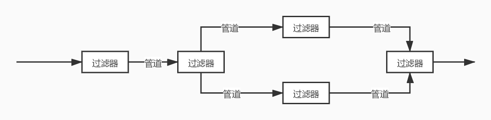
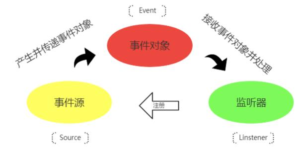
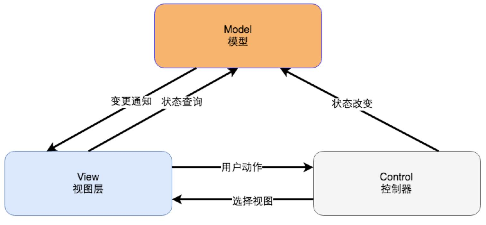
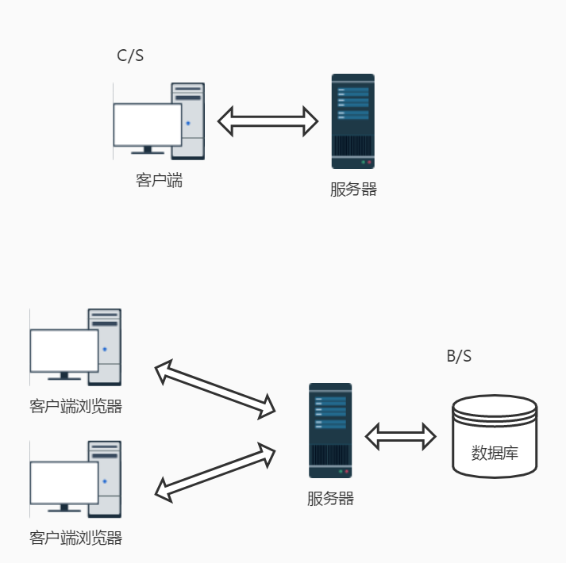
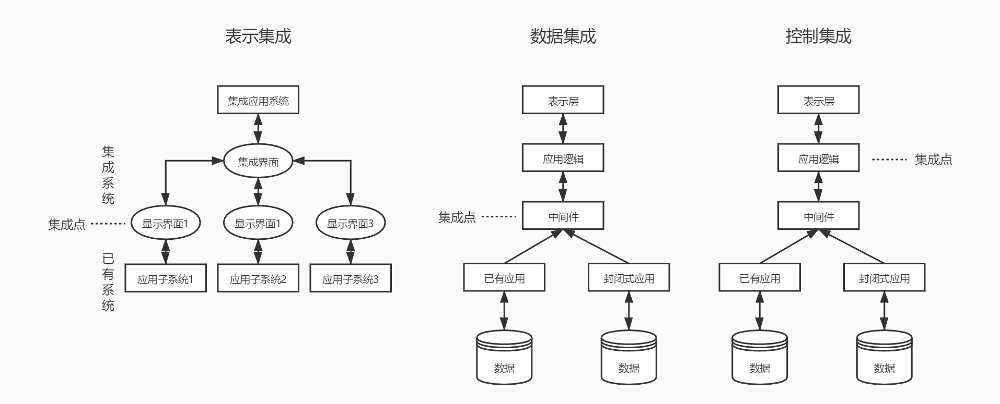

# 软件工程（五）经典架构及扩展知识

最后这一篇的内容是一些补充知识，大家可以放轻松来看咯，内容也不多，主要还是以扩展知识面为主吧。我们将要学习到的是日常开发中程序员们比较熟知的一些系统的经典架构，另外就是软件开发环境和集成技术相关的内容，都只是非常简单地介绍一下而已，全文都不是特别重点哈（只有一个知识点需要了解清楚）。

## 经典系统架构

这部分介绍的经典的系统架构算是对 软件系统架构 部分的一个补充，是我们在实际的业务开发中确实会接触到并且会了解到的知识。除了我们下面要介绍的之外，之前我们讲过的 面向对象设计 和 面向服务方法 也都属于这些经典的系统架构。

### 管道/过滤器

这种模式的体系结构是面向数据流的软件体系结构。它最典型的应用是在编译系统。设计人员将整个系统的输入输出行为理解为单个过滤器行为的叠加与组合；任何两个过滤器,只要它们之间传送的数据遵守共同的规约就可以相连接；新旧过滤器可以方便地替换；支持并发地执行每个过滤器。



说了这么多，其实 Linux 命令行中的那个  | 操作符就是一个管道操作符。而过滤器的定义可能会绕一些：如果一个LInux命令是从标准输入接收它的输入数据，并在标准输出上产生他的输出，这个命令就被称为过滤器。

拿一个最常用的命令来举例。

```php
ps -ef | grep php
```

第一个命令列出所有的进程，然后它的结果通过管道给第二个命令使用，第二个命令在第一个命令结果的基础上过滤出包含 php 名称的进程。这一套操作就是一个过滤器操作。当然，除了 grep 之外，还有我们非常熟悉的 awk、cut、sed 等等，都是过滤器操作函数。

Laravel 中的 Pipeline 、中间件以及设计模式中的责任链模式都有管道过滤器的影子。

### 事件驱动模式

事件驱动模式的基本原理是构件并不直接调用过程，而是触发一个或多个事件。系统中的其他构件可以注册相关的事件，触发一个事件时，系统会自动调用注册了该事件的构件过程，即触发事件会导致另一构件中过程的调用。

事件驱动模式的主要特点是事件的触发者并不知道哪些构件会受到事件的影响，且不能假定构件的处理顺序，甚至不知道会调用哪些过程，使用事件驱动模式的典型系统包括各种图形界面工具。比如说我们在前端页面上的 onclick 这个函数不仅在 HTML ，Android、IOS、.NET 等的开发中都可以看到类似的事件函数。



一个不太形象的比喻就是我们去按电梯，然后这就是一个事件，上下按钮让轿厢执行上行还是下行的操作。在 PHP 的 Laravel 框架中，同样有事件相关的组件。

### 分层模式

分层模式其实就是为了解决问题太大太复杂而出现的一种模式，我们之前已经学习过的而且也是最经典的 OSI 和 TCP/IP 都是分层模式的典型应用。而在软件领域，非常出名的 MVC 就是最典型的一种分层架构设计模式。关于 MVC 的具体内容如果你不是程序员而且有兴趣的话，可以自己了解一下，这个不在我们学习的范围中。除了 MVC 之外，还有 .NET 的三层模式，Android 中比较流行的 MVP 以及现在前端工程化中非常著名的 MVVM ，这些，都是分层模式的架构。可以说，分层模式其实是离我们最近的一种模式，只要你在做软件开发，那么你一定会接触到它。



### 知识库模式

知识库模式采用两种不同的构件：中央数据结构构件说明当前状态，独立构件在中央数据存储上执行，中央数据构件与独立的外部构件间的相互作用是系统中的主要问题。 

知识库模式有两种不同的控制策略：如果输入流触发进程执行韵选择，则为基于传统数据库型的知识库模式；如果中央数据结构的当前状态触发进程执行的选择，则为基于黑板系统的知识库模式。

黑板系统是一种问题求解模型，是组织推理的步骤、控制状态数据和问题求解之领域知识的概念框架，它将问题的解空间组织成一个或多个应用相关的分级结构。

这个嘛，大家了解了解就好，我也不是太清楚这个知识库模式具体是一个什么样的东东，有兴趣的小伙伴可以自己查一下这个黑板模式。

### 客户机/服务器、浏览器/服务器模式

最后就是我们最重要的客户端/服务器模式。这个东西应该是现在所有做开发的同学的入门基础课。

在最早的时候，我们使用电脑，都需要安装软件，比如说 Office、QQ 还有你们最喜欢玩的各种游戏。这个需要安装一个软件才能使用的，并且需要网络的软件，被称为 Client-Server 客户机/服务器 模式，简称 C/S 模式。

而另外一种，比如我们现在使用的后台管理系统、OA 系统、CRM 系统，网页版的 QQ 、微信，页游等，只需要一个浏览器就可以运行的，主要的程序都在服务器端处理的软件架构模式被称为 Brower-Server 也就是 浏览器/服务器 模式，简称 B/S 模式。



其实最简单的理解就是我们使用某个应用是否需要安装一个软件，如果需要安装软件，那么这个基本就是 C/S 模式，而如果我们只需要一个浏览器就可以运行的软件，那就是 B/S 模式。

从这里可以看出，我们的电脑其实在早期是 C/S 一统天下的，而在最近几年，B/S 越来越成为主流。当然，C/S 还是有其应用场景，比如大型游戏、复杂的 PhotoShop 之类的应用，需要充分利用本身电脑的硬件资源的应用肯定都还是 C/S 架构为主的。有好奇的小伙伴要问了，那么我们现在的手机 App 是不是都是 C/S 模式的呢？当然，但是，小程序、小游戏这些东西，就是期望能让微信、支付宝、头条、抖音之类的这些平台变成一个浏览器一样的存在，让程序能在这些 App 的框架下运行，其实它们就都是 B/S 形式的应用。

说了这么多，其实更重要的是我们要能分清楚 B/S 和 C/S 的一些区别特点，这才是最重要的。

- B/S 架构：维护难（需要重新安装软件）、安全性差（有反向编译的可能性）、硬件利用率高

- C/S 架构：维护方便（所有程序都在服务器）、可扩展性强（功能随时由程序员在服务器添加）、客户端要求低（一个浏览器）、安全（主要指没有客户端的问题）、硬件利用率低（必须在浏览器或 App 的壳下运行）

这个是 B/S 和 C/S 模式是我们今天这一课的唯一一个重点知识点。

## 软件复用

软件复用是指利用已有软件的各种有关知识构造新的软件，以缩减软件开发和维护的费用。软件复用是提高软件生产力和质量的一种重要技术。

在开发领域有一个很出名的 DRY 原则，意思是 Don't repeat your self。也就是不要做重复的事情，而代码在维护中最怕的也是同样一段代码，如果要修改需要在很多地方重复去修改。这样做不仅容易效率低下，而且也容易产生各种各样的 Bug 。

设计模式、组件化开发、工具类或工具函数都是为了解决这个复用的问题。在这其中，包括代码的复用、设计的复用、分析的复用、测试信息的复用都是我们需要关注的内容。

## 软件开发环境

软件开发环境也是大家了解一下就好。我这里也是简单地介绍一下。

- 开发工具（IDE）：Idea、VSCode、Sublime、Vim 这些想必不用多介绍了，做开发的都懂，其实就是程序员用得编辑器，就像写文档要用 Word 或者 WPS 一样。

- 代码管理：Git 已经一统天下了，这个无异议吧？即使 SVN 也已经很小众了。这个东西可以想像成 Word 中的历史文档功能，可以让我们写错了代码之后可以快速的恢复，同时也是一个备份。

- 测试工具：LoadRunner、jmeter 这两个是压力、负载测试工具，Selenium、Appium 这两个是网页和App的自动化测试工具，JUnit、PHPUnit 这两个分别是 Java 和 PHP 的单元测试工具，其它语言还有自己对应的类似工具。

- 建模设计：Visio、Rose 还有网页版的（B/S）ProcessOn，能画流程图，能画 UML 图之类的工具也非常多。

## 软件集成技术

在这里我们主要了解一下 企业应用集成（Enterprise Application Integration，EAI）技术。主要是用来消除企业中的信息孤岛，将多个企业系统连接起来，实现无缝集成。

EAI 一般连接的系统包括但不限于 电子商务系统、ERP、CRM、SCM、OA、数据库系统、数据仓库等。EAI 可以包括多个层次和方面：

1. 表示集成，也称界面集成。比较原始浅显但也是最常见的集成方式，将用户界面作为公共的集成点，把各个系统集成到一个统一的新界面中。比如我们模拟各种系统的接口调用，然后统一在一起显示，但实际我们对其它各个系统并不了解，是一种完全黑盒的方式。

2. 数据集成，这个主要就是先对数据和数据库进行标识并编成目录，确定整体的数据元模型，统一数据中心。

3. 控制集成，也称为功能或应用集成，在业务逻辑层上对应用系统进行集成。如果说表示集成是前端页面直接调接口，那么控制集成就是在当前系统的代码内部再去调用远程系统的接口，其实和表示集成是比较类似的。不过我们可以对远程调用的接口有更好控制，并且能够封装一些我们当前系统所需要的新内容进来，起一个代理和装饰的作用。



4. 业务流程集成，也称为过程集成，这种集成必须有统一的信息定义、授权和管理，会有一个业务中心进行数据交换，内部数据4之间还会有严格的格式定义。

5. 企业之间的应用集成。这个其实最好理解，各个开放平台的接口，比如说我们开发的微信、微博登录功能。一般是什么协议呢？OAuth2 授权协议，RESTFul 接口规则，JSON/XML 数据标准格式。

## 总结

说了吧，今天的内容不多也不复杂吧，而且真的只有那一个 B/S 和 C/S 的区别特点是重点内容，其它的都做为了解即可。

到此为止，软件工程这一个大章节也结束了，大家还记得我们讲过哪些内容吗？没事的时候还是要多多复习哦，要不然这些东西过两天很容易就会忘了。接下来，继续沿着我们教材的路径走下去，下一个会是大家非常感兴趣的 新一代信息技术 ，包括有 物联网、智慧城市、云计算、大数据以及移动互联网相关的内容介绍，另外也会顺带聊两句人工智能和区块链，相信你一定不会错过。

参考资料：

《信息系统项目管理师教程》

《某机构培训资料》