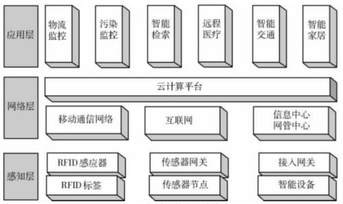
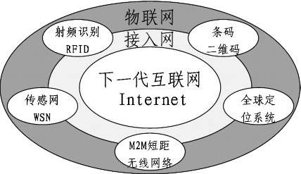
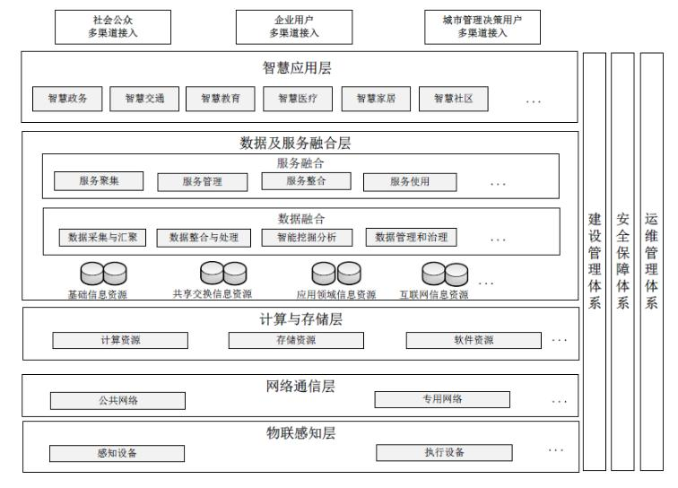

# 新技术（一）物联网与云计算

我们生活在一个和平的年代，这是我们的幸运；我们生活在一个繁荣的年代，这是我们的机遇；我们生活在一个科技爆炸的时代，这是我们见证历史的时刻。还记得刚上初中、高中的时候，BP 机都是可望而不可求的高科技产品，网吧2块钱一个小时都感觉贵得不行，谁家能上网那简直是富二代出身了。可是谁能想到20年后的现在，我们竟然已经无时无刻都不能离开互联网了。现在的情况是你想逃离网络，反而更需要一些勇气和能力。这一切，可以说，都是 IT 技术的发展带来的。

其实，IT 技术，最主要的最重要的能力是让知识能够共享，从而极大地提升了所有行业的知识获取能力。原来需要查很久很厚的文献资料，现在一搜一点就可以找到了。这也反过来进一步促进了各个行业的科技提升。那么，我们就先来说说和各行各业都息息相关的物联网吧。

## 物联网

物联网是指通过信息传感设备，按约定的协议，将任何物品与互联网相连接，进行信息交换和通信。它是实现物物相边的互联网络。这里还有两层意思：第一，物联网的核心和基础仍然是互联网，是在互联网基础上的延伸和扩展的网络；第二，其用户端延伸和扩展到了任何物品与物品之间，进行信息交换和通信。

对于物联网来说，有三个层次，分别是感知层、网络层和应用层。

- **感知层**：主要是识别物体、采集信息，由各种传感器构成，包括温湿度传感器、二维码标签、RFID 标签和读写器、摄像头、GPS等感知终端。

- **网络层**：传递信息与处理信息，由各种网络包括互联网、广电网、网络管理系统和云计算平台等组成，是整个物联网的中枢。

- **应用层**：解决信息处理和人机交互的问题，是物联网和用户的接口，实现物联网的智能应用。

### RFID 与 二维码

射频识别技术 RFID（Radio Frequency IDentification，射频识别），也可以称为电子标签，是物联网中使用的一种传感器技术，可以通过无线电信号识别特定目标并读写相关数据，而无需识别系统与特定目标之间建立机械或光学接触。在这个定义中，我们可以看到，RFID 最基本的组成部分通常包括：标签、阅读器、天线。

二维码，日本发明，中国发扬光大，被称为新四大发明之一的神器。它是用某种特定的几何图形按一定规律在平面（二维方向）分布的黑白相间的图形记录数据符号信息的，在代码编制上巧妙地利用构成计算机内部逻辑基础的“0”和“1”比特流的概念，使用若干个与二进投影相对应的几何形体来表示文字数值信息，通过图象输入设备或光电扫描设备自动识读以及实现信息的自动处理。目前最常用的二维码编制格式为 QR Code ，除此之外还有 PDF417、Datamatrix、Maxicode、Code49、Code 16K 等等。

二维码想必不用我多举例了吧，我们天天都要和它打交道，但其实，RFID 也是我们日常经常使用的，比如 NFC 技术、门禁卡、交通卡等等。在这里，我们再来了解一下 RFID 和 二维码的一些特点比较。

|  RFID  |  二维码 |
|  ----  | ----  |
|  成本高  | 成本低 |
|  阅读器不要求看风标签  | “可视技术” |
|  寿命长、恶劣环境下工作  | 寿命短、不能污染 |
|  读取距离远  | 读取距离近 |
|  容量大 | 容量相对较小 |
|  可以被读写 | 只读 |
|  同时处理多个标签 | 一次只能处理一个标签 |
|  安全性高（数据存取可以设置密码、难复制） | 安全性低（容易被复制） |

上述的差别主要是针对设备的读取和操作来说，比如说二维码虽然可以通过网络发送给很远的人，但是你的读取设备，也就是手机，是不能离开很远来读取的。这部分内容大家了解一下就好，有兴趣的同学也可以在评论里讨论。

### MMM

MMM 可以解释为 **人与人（Man to Man）**、**人与机器（Man to Machine）**、**机器与机器（Machine to Machine）**这三个 M2M 之间的连接和通信，它涵盖了现在人、机器、系统之间建立通信连接的技术和手段。。M2M技术涉及5个重要的技术部分：机器、M2M硬件、通信网络、中间件、应用。基于云计算平台和智能网络，可以依据传感器网络获取的数据进行决策，改变对象的行为进行控制和反馈。

### 传感网

传感网是由随机分布的，集成有传感器（包括温度、湿度、气敏等）、数据处理单元和通信单元的微小节点，通过自组织的方式构成的无线网络。传感网是物联网的一个缩小版，同时也是物联网的一个重要组成部分。

### 云计算

云计算（Cloud Computing），是一种基于互联网的计算方式，通过这种方式，在网络上配置为共享的软件资源、计算资源、存储资源和信息资源都可以按需求提供给网上终端设备和终端用户。“云”是一种抽象的比喻，表示用网络包裹服务或者资源而隐蔽服务或资源共享的实现细节以及资源位置的一种状态。

云计算最大的特点是可以**按需**提供服务并且方便**易扩展**，其实现在大家对云应该都不陌生了。阿里云、腾讯云的各类服务器、数据库资源。对于我来说，近些年基本上已经没有碰过实体服务器了，更别说去机房戴鞋套了。现在企业，特别是中小企业，会更倾向于使用云服务，而且，除了基本的服务器、数据库、Redis等，现在各种大数据资源也非常丰富，完全不用自己再费心费力的去搭建各种开发环境，很多都能做到开箱即用。

云有广义和狭义之分，如果按广义来说，我们常见的网盘、在线Office之类的工具都可以算做是云上产品。而狭义的云资源指的就是类似于阿里云提供的这些 IT 基础设施。另外，根据云的使用范围，还有公有云、私有云和混合云之分。比如说，公司内部自建的云系统，不对外开放的，就是私有云。而面向外部开放的则是公有云。公私合用，就像企业即使用自家私有云的资源，也使用其它平台的公有云资源这就是混合云。

云计算有三种服务类型需要我们掌握：

- **IaaS（基础设施即服务）**，向用户提供计算机能力、存储空间等基础方面服务。最典型的，买一台纯净的云服务器，你需要自己搭环境。

- **PaaS（平台即服务）**，向用户提供虚拟的操作系统、数据库管理系统、Web应用等。你购买的已经安装好整套 LNMP 应用的服务器或者虚拟空间，只需要上传代码就可以使用了。

- **SaaS（软件即服务）**，面向用户提供应用软件（如上面我们说过的网盘、CRM、在线Office等）、组件、工作流等虚拟化软件的服务。这个连代码都不用你写了，直接用就是了。

### 物联网关键技术

通过上面的内容，一套物联网关键技术的图谱就呈现在我们的眼前了。

## 智慧城市

智慧城市是物联网的具体应用，指利用各种信息技术或创新概念，将城市的系统和服务打通、集成，以提升资源运用的效率，优化城市管理和服务，以及改善市民生活质量。智慧城市是把新一代信息技术充分运用在城市中各行各业基于知识社会下一代创新（创新2.0）的城市信息化高级形态，实现信息化、工业化与城镇化深度融合，有助于缓解“大城市病”，提高城镇化质量，实现精细化和动态管理，并提升城市管理成效和改善市民生活质量。

看看下面这张图，你觉得智慧城市很遥远吗？其实很多东西我们现在都已经实现了。

比如说我们可以快速地查到公交到站信息；可以在线挂号或者问诊；身份证挂失被领不用再跑公安局了；水电燃气都已经是智能电表直接网上缴费了。这些生活体验，都是智慧城市建设带来的。

在图中，我们可以看到智慧城市建设包括有依赖关系的五层结构和对建设有约束关系的三个支撑体系。

- 五层结构包括：物联感知层（我们的信息采集设备、传感器、监控摄像、GPS终端、手机等）、通信网络层（互联网、广电网）、计算与存储层（基础软件硬件资源、数据中心）、数据及服务融合层（云计算、大数据）、智慧应用层（终端软件、App、B/S服务）。

- 三个支撑体系包括：安全保障体系（数据安全、统一权限）、运维管理体系、建设管理体系。

## 两化融合与互联网+

这两个都是我们国家对于物联网发展的规划和展望。

两化融合是信息化和工业化的高层次的深度结合， 是指以信息化带动工业化、以工业化促进信息化，走新型工业化道路；两化融合的核心就是信息化支撑，追求可持续发展模式。两化融合有一个主攻方向是 **智能制造** ，也就是 **工业互联网** 。其中 CPS （Cyber PhySical Systems，信息物理系统）又是智能制造的核心。它是一个综合计算、网络和物理环境的多维复杂系统，通过 3C （Computation、Communication、Control）技术的有机融合与深度协作，实现大型工程系统的实时感知、动态控制和信息服务。

互联网+是指在创新2.0（信息时代、知识社会的创新形态）推动下由互联网发展的新业态，也是在知识社会创新2.0推动下由互联网形态演进、催生的经济社会发展新形态。通俗的说，“互联网+”就是“互联网+各个传统行业”，但这并不是简单的两者相加，而是利用信息通信技术以及互联网平台，让互联网与传统行业进行深度融合，创造新的发展生态。“互联网+”是 **两化（信息化和工业化）融合的升级版** ，将互联网作为当前信息化发展的核心特征，提取出来，并与工业、商业、金融业等服务业的全面融合。

互联网+的六大特征是：跨界融合、创新驱动、重塑结构、尊重人性、开放生态、连接一切。

## 总结

今天的内容不算很枯燥吧，有很多东西都是和我们现在的生活息息相关的，比如说 RFID 和 二维码，还有我们也一步步地享受各种 智慧城市 带来的便利。这一切，其实都是基础 物联网 这个最根本的体系，同时也有国家的大力支持，相信我们未来的生活会更美好。

参考资料：

《信息系统项目管理师教程》

《某机构培训资料》