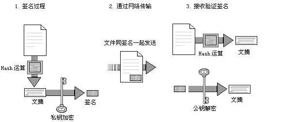
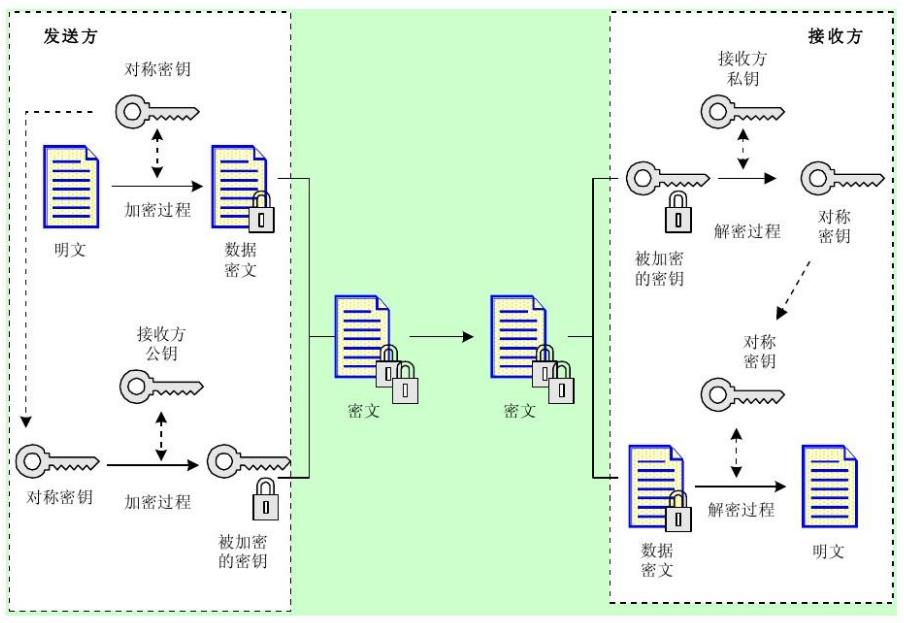

# 安全（二）加解密技术

上一篇课程中我们了解到的是很多关于信息系统安全的概念、等级、分类等内容，今天的部分则更偏向于具体实现的技术。

为了保证信息的安全性（即秘密性、完整性和可用性）需要采用信息加密技术对信息进行伪装，使得信息非法窃取者无法理解信息的真实含义；需要采用加密算法提取信息的特征码（校验码）或特征矢量，并与有关信息封装在一起，信息的合法拥有者可以利用特征码对信息的完整性进行校验；需要采用加密算法对信息使用者的身份进行认证、识别和确认，以对信息的使用进行控制。

其实说白了，就是三件事，一个加密混淆让别人看不懂，另一个加密解密双方能看懂，最后一个权限控制不让别人看。从这三件事可以看出，加解密技术是非常关键的内容。加密就是把明文内容弄成一堆乱七八糟正常人看不懂的数据，然后解密就是把这堆东西再还原回数据明文的过程。在这个过程中，就会牵涉到一系列的算法问题。我们接下来就来看一下比较常见的那些加解密方式，最后我们也会提到一些权限控制方面的内容。

## 对称加密

对称加密采用了对称密码编码技术，特点是文件加密和解密使用相同的密钥，即加密密钥是可以当做解密密钥来使用的。这个和我们下面要说的 非对称加密 都会有一个 密钥 的概念，密钥是一个加密算法中的控制部分，能够控制加密算法最后生成的密文结果，而且往往在解密中也扮演重要的角色。比如说这个对称加密，不管加还是解，都是使用同一套密钥的，如果密钥不对，解密的结果也不会正确。

由于密钥固定，算法简单，对称加密的效率比较高、速度也比较快，但是相对来说可能是不太安全的，因为把解密密钥交给客户终端实际上也等于是将加密密钥给了客户。在这种情况下，很容易通过反编译等手段获得客户端代码中的密钥信息，非常不安全。而且，在下发也就是客户第一次获取密钥的过程中，也可能会有中途被窃取的可能性。

对称加密比较出名的包括：AES、DES、3DES、RC-5、IDEA等算法。相信 AES 和 DES 还是非常普及的，使用过的同学应该也是比较多的，各个编程语言也都有非常简单地实现函数。

## 非对称加密

上面对称加密我们知道是加密方和解密方都持有的是相同的一个密钥用于加解密。那么其实非对称加密你也能够猜到，就是双方持有的是不同的密钥。基本思想是将传统密码的密钥一分为二，也就是我们经常会见到的 公钥 和 私钥 。通常，我们会用公钥加密数据，然后用私钥来解密数据，公钥我们会发送给客户，然后他们传送给我们的信息就是用我们的公钥加密的，只有我们自己能解开并获得明文原文。同样，我们要发给客户的数据，也使用客户给我们的公钥来进行加密，数据发送给他们之后，他们也会使用他们自己的私钥来解密。如果我们使用的不是他们的公钥，那么数据也是无法被他们自己的私钥解密的。

非对称加密是不是感觉非常美好？但是，这个算法优秀的安全性也是由代价换来的，它的计算量大，破解很难，相对的，效率也会比较差，完全无法和对称加密的速度相媲美。

非对称加密最常见的，也是现在基本已经成为事实标准的，就是 RSA 算法。它是一种基于 大合数因子分解困难性 的原理而生成公开密钥密码的方式。我们日常使用的 OpenSSL 生产的公私钥，Linux/Github 的安全公钥登录，还有现在已经完全普及的 HTTPS 等等应用，都是基于 RSA 。

## Hash

哈希算法（Hash）将任意长度报文 M 映射为定长的 Hash 码 h ，也叫做 散列算法 。它的目的主要是生成指定数据、文件或数据块的“系统”，也就是我们的 h 哈希码。最常见的就是 MD5 和 SHA1 这两种算法。这个算法是一种单向算法，也就是说，我们可以加密，但是无法解密。当然，现在有彩虹表这种半人工的 Hash 数据库可以用做 Hash 解密，但只要我们在加密数据的时候略加变化，这个解密就非常难实现了。

哈希算法应用最最常见的场景就是用户密码的加密。这个加密最好还不只是一次简单的 MD5 ，最后还能多套几次 MD5 并且加 SALT 值。嗯，说得可能比较专业，开发同学可能都会明白什么意思，如果您不是开发同学，那这一段不用管它。

## 数字签名

签名，就是证明当事人的身份和数据真实性的一种信息。这个东西我们在很多下载网站都会看到。当你下载某个软件的时候，这个下载页面都会有一个 MD5 校验码，然后你下载的软件可以使用一些 MD5 校验软件获得校验码，如果是一样的，就证明你下载的软件是没有问题的，而且也是完整的，和网站上的是同一款软件。在这个过程中，这个 MD5 校验码其实就是一个双方需要对应的签名。

同理，在信息传输的过程中，如何确保对方和你所接收的数据都没有问题呢？加一个数字签名呗。这个数字签名可以是 MD5 的哈希串，也可以是 RSA 的加密数据，这都没有问题，但目的只有一个，就是你和你通信的对方，你们两个对这个签名可以达成共识。因此，这个数字签名有保证信息传输的完整性、提供发送者的身份验证以及防止交易中的抵赖情况发生的作用。

完整的数字签名需要满足三个条件，分别是：签名者事后不能抵赖自己的签名；任何其他人不能伪造签名；有公正的仲裁解决真伪问题。

### 数字信封

在讲数字签名时，往往还有一个更重要的内容是我们不能错过的，那就是 数字信封 技术。它是将对称密钥通过非对称加密（即：有公钥和私钥两个）的结果分发对称密钥的方法。什么意思呢？其实它就是结合上面我们学习过的对称和非对称加密两种加密方式的特点而形成的一种独特的数据安全传输的方式。

前面我们提到过，对称加密速度快，但是不安全，因为密钥在传输过程中以及在对端不可控都会带来安全隐患。但是，这里需要注意一点，这个对称密钥是我们控制的呀，而且往往这个对称密钥都不会太长，一般会是一些随机的字符串，取 8、16、32、64 位长度的字符串就够了。那么，我们可以用非对称加密来加密这个字符串。非对称加密的特点是安全性高但速度慢，如果数据内容非常少的话，其实它的计算效率还是可以接受的，即使是 128、256、512 个字符的对称密钥其实使用非对称加密速度也是很快的。这样，我们就形成了下图这样一个流程。

- 首先，发送方将 **明文** 数据通过 **对称密钥**  进行加密，变成 **密文** 数据。

- 然后，来到左图的下方，将 **对称密钥**  使用 **对方的公钥**  进行加密，变成一个 **被加密过的密钥**  。

- 接着将 **密文**  和 **被加密的密钥**  一起发送给接收方。

- 接收方首先通过 **自己的私钥**  解密 **被加密的密钥**  ，这样就获得了 **对称密钥**  。

- 最后，使用解密出来的 **对称密钥**  来解密 **密文**  获得原始的 **明文**  数据。

上面这个过程务必要弄清楚，因为它也是我们今天最重要的内容。类似于我们真实的普通信封寄信，普通信封在法律的约束下保证只有收信人才能阅读信的内容；数字信封则采用密码技术保证了只有规定的接收人才能阅读信息的内容。

同样的，如果接收方想要给发送方发送信息，只需要调换它们的位置就好，也就是接收方变成发送方，中间的步骤还是完全一样的。双方都要持有对方的公钥证书，说到这个问题，正好引出我们下面的内容，那就是公钥证书体系。

### PKI公钥体系

公钥基础设施 PKI（Public Key Infrastucture，公开密钥基础设施）是以不对称密钥加密技术为基础，以数据机密性、完整性、身份认证和行为不可抵赖性为安全目的，来实施和提供安全服务的具有普适性的安全基础设施。它包括 数字证书、不对称密钥密码技术、认证中心、证书和密钥的管理、安全代理软件、不可否认性服务、时间邮戳服务、相关信息标准、操作规范等。

PKI 可以实现 CA 和证书的管理，密钥的备份与恢复，证书、加密密钥和签名密钥的分割，支持对数字签名的不可抵赖性，密钥历史的管理等功能。其中，CA 就是 Certification Authority 认证中心的简写。配置过网站  HTTPS 的同学对这个东西一定不会陌生的。前面说过，HTTPS 的基础就是 OpenSSL 生成的加密公私钥，那么我们自己生成的证书为什么不能直接使用配置到我们的网站上呢？其实是可以的，不信你可以试试，但是，我们的浏览器不认啊。你的生成的证书是没有问题，但是我们没有办法相信你，各个浏览器厂商需要有一些中间机构，并且是有信誉资质的中间机构来提供担保，这些机构其实就是实现了 PKI 的公司。而我们在各个域名注册商购买的证书也都是由它们生成的，并且它们还有公钥管理系统负责分配给客户端的公钥。这样，就实现了一个包括第三方认证并且可以做仲裁方的“公证人”机构。

PKI 一般是通过数字证书的方式向客户端或者对端发送公私钥。数字证书其实可以看成是是又一层加密的数据，根据证书规则及相关的设置可以从证书中提取出主体信息、证书序号、有效期、密码算法标识、公私钥信息等内容。常见的证书格式有  X.509系列、PKCS系列、DER、PEM 等，这一块做过开发的同学也不会陌生。

## 数字认证

认证（Authentication），又称为鉴别、确认，它是证实某事是否名副其实或者是否有效的一个过程。认证这个东西也是我们非常常见的，比如说你登录各个网站或者 App 的账号，你的网游账号等等，在这些账号体系中，都会有认证授权功能的存在。比如说，为什么你登录进淘宝看到的是你自己的购物订单，而看不到别人的购物订单。这就是因为你的账号通过了属于你的身份的认证，而没有其他人的身份认证，当然就不能看到别人的订单啦，如果要是能看到那才真是乱了套了。

认证系统常用的参数有口令、标识符、密钥、信物、智能卡、指纹、视网纹等。它与数字签名的区别主要有：

- 认证总是基于某种收发双方共享的保密数据来认证被鉴别对象的真实性，而数字签名中用于验证签名的数据是公开的。

- 认证允许收发双方互相验证其真实性，不准许第三者验证，而数字签名允许收发双方和第三者都能验证。

- 数字签名具有发送方不能抵赖、接收方不能伪造和具有在公证人前解决纠纷的能力，而认证则不一定具备。

### 访问控制

对于访问控制来说，一定是跟登录有关的，如果没有登录过程，那么就无法知道你这个用户应该是有哪些权限，也就无法通过这些权限信息来进行访问的控制。在登录之后，我们常见的网络授权方案包括以下 4 种：

- DAC（Discretionary Access Control）自主访问控制方式：该模型针对每个用户指明能够访问的资源，对于不在指定的资源列表中的对象不允许访问。

- ACL（Access Control List）访问控制列表：该模型是目前应用最多的方式。目标资源拥有访问权限列表，指明允许哪些用户访问。如果某个用户不在访问控制列表中，则不允许该用户访问这个资源。

- MAC（Mandatory Access Control）自主访问控制方式：该模型在军事和安全部门中应用较多，目标具有一个包含等级的安全标签（如：不保密、限制、秘密、机密、绝密）；访问者拥有包含等级列表的许可，其中定义了可以访问哪个级别的目标，例如允许访问秘密级信息，这时秘密级、限制级和不保密级的信息是允许访问的，但机密和绝密级信息不允许访问。

- RBAC（Role-Based Access Control）基于角色的访问控制方式：该模型首先定义一些组织内的角色，如局长、科长、职员，再根据管理规定给这些角色分配相应的权限，最后对组织内的每个人根据具体业务和职位分配一个或多个角色。

其实不用我多说，现在大部分的比较复杂一点的后台管理系统基本都是 RBAC 为主的，而一些小的比如说小网站、官方网站之类的后台，直接使用 ACL 就可以了（就是用户和目录对应上，哪些用户有哪些目录就在右边目录菜单就只展示这些目录这种最简单的权限管理功能）。

## 总结

总算到结尾了，你以为恶梦结束了？不不不，今天的内容基本都是重点。特别是对称和非对称加密、数字信封、PKI 和 访问控制 这四个部分。如果你没有接触过开发，那么这一篇估计是很崩溃的，一点也不亚于之前我们学习的计算机网络相关的内容。即使很多做开发的同学，如果没有接触过类似的加解密以及相关安全网络传输的业务，估计也会有一点慒圈。就和其它的知识一样，光加解密技术就可以写一本厚厚的书，更不用说整个信息安全体系了。所以，我们这才只是入个门，沾了点信息安全的皮毛而已，还是那句话，不管你是考试还是当做谈资，记下来多少还是会有好处的。

如果你有开发经验，可以看一下我之前的 PHP 加解密 相关的系列文章：[https://www.zyblog.com.cn/t/加解密](https://www.zyblog.com.cn/t/加解密)

参考资料：

《信息系统项目管理师教程》

《某机构培训资料》