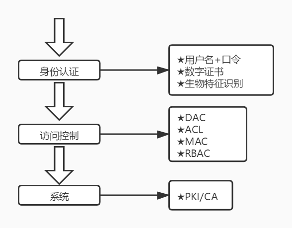
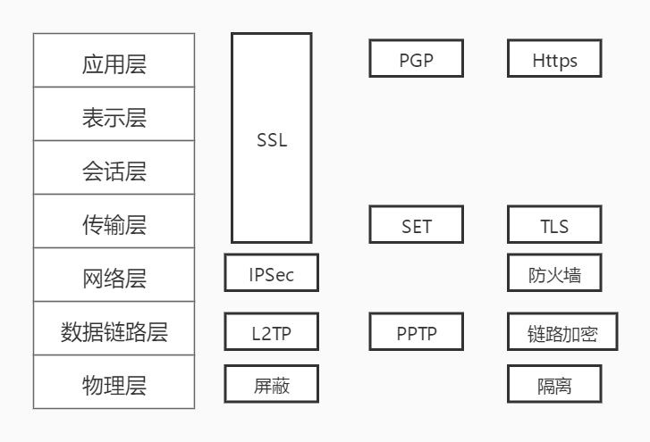
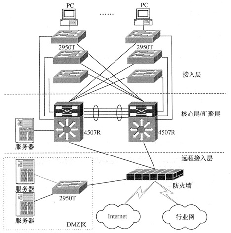
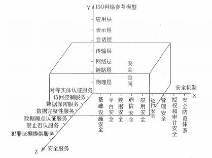
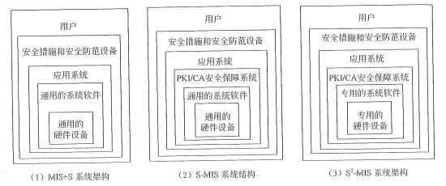

# 安全（三）信息系统安全

上一篇课程的内容大家还记得吗？如果不记得了还是要多多复习一下哦，今天的内容相对来说要略微简单一些，所以大家也不用太紧张啦！今天的内容主要是讲解从技术的各个方向上来构建整个信息安全体系，内容从硬件、网络到病毒木马都会简单地介绍一下，还是比较杂，但并不深入，大家即使不是从事安全行业的也不会对这些知识太过陌生，总体比加解密之类的内容还是要好理解很多。

刚刚说过，复习很重要，那么我们就先来看一下上节课程中的一个总结。

## 安全保障层次

通过上次课程的内容，我们可以构建一个非常基础的信息系统的安全保障层次。其实就是我们上节课所学习的内容，可以方便大家的记忆。

别忘了在 PCI/CA 中还有很重要的对称和非对称加密的概念以及数字信封的概念。这些可以都记在 PKI/CA 下面。什么？你连这些英文是什么意思都不记得了？那赶紧回去再看看吧！

## 信息系统安全保障范围

信息系统一般是由计算机系统、网络系统、操作系统、数据库系统和应用系统组成的。与此对应的是，信息系统安全也包括计算机设备安全、网络安全、操作系统安全、数据库安全和应用系统安全等。

### 物理硬件安全

在物理硬件安全中，我们更关注的是机房服务器的硬件设备安全。现在一般服务器都是托管在运营商机房，所以相对来说我们只要选择信誉较好的供应商就好了。不过就像我们之前说过的，现在使用云服务的情况会更多一些。

对于办公区域来说，办公室的计算机设备都是公司的资产，也是我们要关注的内容。另外，很多公司都会有内部的本地服务器并且存在在办公区域的某个房间中充当本地机房。在这种情况下，本地环境的防火防盗安全就是非常重要的内容。人员进出的录像监控，机房进出权限的控制，防火、水、静电等都是基础的操作。另外还要关注电磁干扰、老鼠、虫子等对线缆的破坏等。

### 网络安全

网络作为信息的主要收集、存储、分配、传输、应用的载体，其安全对整个信息的安全起着至关重要甚至是决定性的作用。

通过这张图，我们可以看出，在 OSI 的不同层次上，我们有各种不同的方式来确保网络信息在各个层级上的安全。我们就挑一些来说，具体的技术实现都非常难，也不是我们学习的重点。

在应用层，SSL 已经是事实上的传输层及以上的加密标准。SSL(Secure Sockets Layer 安全套接字协议),及其继任者传输层安全（Transport Layer Security，TLS）是为网络通信提供安全及数据完整性的一种安全协议。TLS与SSL在传输层与应用层之间对网络连接进行加密。SSL 的会话包括 6 个阶段：第一个阶段，接通阶段，客户机向服务器打招呼；第二个阶段，密码交换阶段（双方之间协商相互认可的密码），一般用 RSA 密码；第三阶段，会谈密码阶段（双方会谈）；第四阶段，验证，客户机检验服务器；第五阶段，认证阶段（服务器验证客户）；第六阶段，结束阶段。

HTTPS （Hypertext Transfer Protocol Secure）安全超文本传输协议，它是 TLS、SSL 的应用层表现，HTTPS 使用 **443** 端口，不同于 HTTP 的 80 端口。现在如果你想开发 App 应用，或者 小程序 之类的应用，没有 HTTPS 可是完全无法上线的哦。

入侵检测系统（IDS）注重的是网络安全状态的监控，通过监视网络或系统资源，寻找违反安全策略的行为或攻击迹象，并发出报警。入侵检测可以基于网络或者基于主机，通过特征检测、异常检测（行为异常日志）、统计检测、专家系统等为系统提供一种被动的防护方式，主要用于**发现问题**和**阻断攻击**，并且留下**攻击证据**，以做为我们之前介绍过的安全审计中的证据资源来源。它的未来发展方向是分布式、智能化的全面安全防御检测。

蜜罐（Honeypot）技术，是一种主动防御技术，是入侵检测的一个重要发展方向，也是一个“诱捕”攻击者的陷阱。它是一个包含漏洞的诈骗系统，通过模拟一个或多个易受攻击的主机和服务，给攻击者提供一个容易攻击的目标。攻击者往往在蜜罐上浪费时间，延缓其对真正目标的攻击。

除了入侵检测系统之外，还有一种入侵防护系统（IPS），它更倾向于提供主动防护，注重对入侵行为的控制。直接对入侵活动和攻击性网络流量进行拦截，避免其造成损失，是一种直接就进行处理的防护方式。

防火墙这个东西相信大家不会陌生，我们的电脑操作系统上就自带防火墙。不过在信息系统中，主要指的则是服务器级别的网络防火墙。这种防火墙有硬件和软件之分，能阻挡对网络的非法访问和不安全数据的传递，使得本地网络每户免受外部网络的威胁。它也是实现网络安全的主要策略，不管是公司内网还是服务器机房内网，防火墙都是非常核心的安全策略。还记得我们在讲网络设计时的那张网络分层设计图吗？里面就是防火墙的身影。

最后我们再来看看 VPN 。VPN（Virtual Private Network，虚拟专用网络），它是依靠 ISP （Internet服务提供商）和其他 NSP （网络服务提供商），在公用网络中建立专用的、安全的数据通信通道的技术。其实 VPN 想必也是各位在互联网公司常用的一个工具之一。VPN 的连接是建立在公网上的，通过一种称为“隧道”的技术作为传输介质。VPN 是加密和认证技术在网络传输中的结合应用。常见的隧道技术包括：点对点隧道协议（PPTP）、第2层隧道协议（L2TP）和 IP安全协议（IPSec）。相信你的公司所使用的应该是这三种协议之一，最常见的应该是前两种。

### 病毒木马

在操作系统层面上，我们主要面临的威胁就是病毒和木马的问题。老码农们还记得当年那个横扫全国的熊猫烧香吗？

计算机病毒：编制或者在计算机程序中插入的破坏计算机功能或者**破坏**数据，影响计算机使用并且能够自我复制的一组对计算机指令或者程序代码。

木马：利用计算机程序漏洞侵入后**窃取**文件的程序被秒钟为木马。它是一种具有隐藏性的、自发性的可被用来进行恶意行为的程序，多不会直接对电脑造成危害，而是以控制为主。

看出来它俩的差别了吧，病毒会破坏我们的电脑系统甚至是影响硬件，而木马则是以控制窃取为主。在早期来说，病毒更加的流行，而最近这些年，木马更为流行。当然，大环境下，电脑上的病毒和木马中招的几率其实是一直在降低的，我们现在更要关注的是移动互联网中针对手机的各种木马或者钓鱼程序。

不管是病毒还是木马，我们在防范的过程中，一是要及时更新操作系统的补丁，二是要杀毒安全之类的软件还是要安装一些的，第三点也是最重要的一点是下载的软件、文档、资料、图片、音视频一定要确认其来源可信。软件最好到官网下载，来路不明的软件、文档一定要先查杀再使用。手机也是同理，一般来说，IOS 尽量不要越狱，Android 也尽量从手机品牌自带的官方应用商店来下载 App 。

另外多说一嘴，现在网络诈骗其实比病毒木马更厉害。往往这类的诈骗都都是伴随着钓鱼网站、钓鱼APP或者钓鱼短信一起的。什么叫钓鱼，就是模仿的非常像正规网站的一些假网站，用于套取你的信息。比如说做一个假的支付宝页面，然后诈骗你点击支付之后通知你出现了什么异常，或者触犯了什么法律，参与了什么涉黑活动之类的，接着就会让你汇款转账。面对这些情况，年轻人还好说，但我们一定要提醒自己的亲朋好友不要上当。确保不转账、不汇款，实在搞不明白的找警察叔叔或者银行工作人员帮忙，千万不要马上就冲动转账。

## 信息安全系统架构体系

整个安全体系我们可以用下面这个三维坐标图来表示。

可以看到在网络层的背景下，通过安全服务和安全机制来为我们构建一个安全有效的业务应用信息系统，并且保障它的稳定运行是多么复杂和庞大的工程。信息安全系统是客观的、独立于业务应用信息系统而存在的信息系统，它可以有自己的架构模式，不需要业务应用系统参与但却作用于其中。

信息安全系统大体划分为三种架构体系：MIS+S系统、S-MIS系统和S2-MIS系统。

- MIS+S（Management Information System + Security）系统为“初级安全保障系统”或“基本信息安全保障系统”。它的特点是业务应用系统 **基本不变** ，硬件和系统软件 **通用** ，安全设备基本 **不带密码** 。

- S-MIS（Security - Management Information System）系统为“标准信息安全保障系统”。它是一种涉密系统，特点包括硬件和系统软件 **通用** ，PKI/CA安全保障系统必须 **带密码** ，业务应用系统必须 **根本改变** ，主要的通用的硬件、软件也要通过 PKI/CA 认证。

- S2-MIS（Super Security - Management Information System）系统被称为“超安全的信息安全保障系统”。它是建立在“绝对的”安全的信息安全基础设施下的，特点包括硬件和系统软件都 **专用** ，PKI/CA 安全基础设施 **必须带密码** ，业务应用系统必须 **根本改变** 。

这三种系统的安全级别不同，建设难度和投资水平也完全不同，企业应该根据自己的实际情况选择合适的信息安全保障系统架构。对于这三个内容，记住它们之间的区别，就是上面我们加粗的部分。

## 总结

在教材中，还介绍了 数据库安全 和 应用系统安全 方面的内容，其中 应用系统安全 方面的内容主要就是 Web 安全 。这两方面的内容考试似乎不是很重点，而且内容也非常多，这里我就不多说了，简单聊两句就算了。

数据库安全，SQL注入问题，密码权限问题。整个数据库无外乎就是这两个问题。尽量不要让外网能访问数据库，至少也有个 VPN 或者 IP 白名单。用户密码多加密几道，小心撞库攻击。重要数据，像交易订单、账单之类的一定要有日志。多备份。

Web 应用，不信任你所接收到的任何数据参数，如果要入库、转存、展示，一定要过滤，另外就是上传的文件一定一定要控制好权限。

好了，信息安全相关的话题我们也学习完了。恭喜你，技术这一关其实我们已经完成得差不多咯。后面还有一些内容，也不是说不重要，但是都只是一些纯概念和记相关的内容了。不像是我们之前学过的网络、软件工程、新技术以及安全这里这么多的专业词汇。如果你是以考试为目的的学习，那么还是不能放松的，而如果你是以了解为目的的学习的话，在项目管理相关内容正式开始前，可以稍微轻松一点点咯！

参考资料：

《信息系统项目管理师教程》

《某机构培训资料》