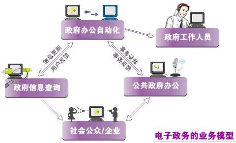
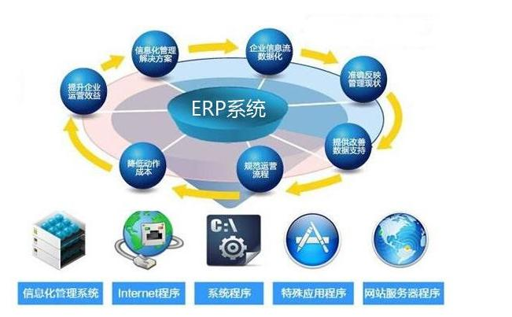
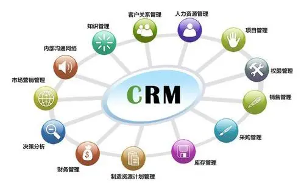
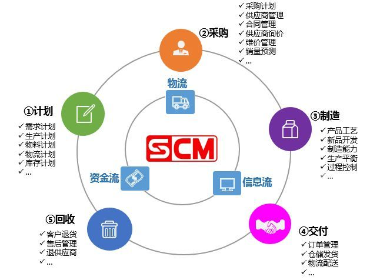

# 信息化发展

信息技术和产业是我国进行信息化建设的基础。从我们前面的文章就已经了解过的两化融合、智慧城市等等，都是在政府的大力支持下才得以实现的。随着我国国民经济快速持续的发展和信息化进程的不断加快，各行各业对信息基础设施、信息产品与软件产品、信息技术和信息服务的需求急剧增长，这也为信息产业的发展提供了巨大的市场空间。

## 信息化发展方向

在我们国家的“十三五”规划纲要中，将培育人工智能、移动智能终端、第五代移动通信（5G）、先进传感器等作为新一代信息技术产业创新的重点发展方向，拓展新兴产业发展的空间。信息技术发展趋势和新技术应用主要包括以下几个方面：

1. 高速度大容量。速度与容量的紧密联系，离不开的就是大数据的支持。

2. 集成化和平台化。以行业应用为基础的，综合领域应用模型（算法）、云计算、大数据分析、少量存储、信息安全、依托移动互联网的集成化信息技术的综合应用。

3. 智能化。以“智能制造”为标签的各种软件硬件应用将为各行各业的各类产品带来“换代式”的飞跃甚至是“革命”。

4. 虚拟计算。一种以虚拟化、网络、云计算等技术的融合为核心的一种计算平台、存储平台和应用系统的共享管理技术。虚拟计算是云计算的基础，也是云计算应用的是一个主要表现。

5. 通信技术。包括光通信、4G、5G 技术已经极大地影响了人们的工作和生活方式。

6. 遥感和传感技术。传感技术与计算机技术和通信技术一起被称为信息技术的三大支柱。传感在与交互控制在工业、交通、医疗、农业、环保等方面的应用将更加深入，可以说，传感和识别技术是“物联网”应用的重要基础。

7. 移动智能终端。无线网络技术，移动 4/5G 技术，以及不断飞速发展的手机芯片技术，让智能手机完全具备了移动智能终端的处理能力。

8. 以人为本。信息技术已经开始真正地面向普通公众，为人所用。各种交互方式和手段已经在各种信息系统中大量出现，人们在使用各类信息系统时可以完全模仿人与真实世界的交互方式，获得非常完美的用户体验。

9. 信息安全。计算机和网络在各行各业中已经渗透到人们生活的方方面面，我们对计算机和网络的依赖越来越大，如果计算机和网络系统的信息安全受到危害将导致整个社会层面的混乱和巨大的损失。信息安全关乎国防安全、政治安全、经济安全、社会安全以及民生个人，是我们 IT 从业人员必需时刻关注的内容。

## 电子政务

电子政务是政府机构应用现代信息和通信技术，将管理的服务通过网络技术进行集成，在网络上实现政府组织结构和工作流程的优化重组，超越时间、空间与部门分隔的限制，全方位地向社会提供优质、规范、透明、符合国际水准的管理和服务。

在之前的文章中我们就提到过，现在如果不是第一次办身份证，或者是想换身份证照片，都已经不需要去公安局了，我们直接就可以在网上办理。同样的，企业缴税、个人退税、电子身份证、电子驾照、交通违章处理、国家电网等等。你还觉得电子政务相关的工程离你很远吗？

电子政务的建设原则需要遵循：统一规划；需求主导；整合资源；统一标准。它的主要应用模式包括四种：

- **政府对政府（Government to Government，G2G）**，主要是政府上下级、不同地区和不同职能部门之间实现的电子政务活动，包括人口信息、地理信息、资源信息等，应用于社会经济统计、公安、国防等领域。

- **政府对企业（Government to Business，G2B）**，是政府向企业提供的各种公共服务，主要包括政府向企事业单位发布的各种方针、政策、法规等。

- **政府对公众（Goverment to Citizen，G2C）**，就是前面说的各种便民工具和系统，提供的各类服务。

- **政府对公务员（Government to Employee，G2E）**，指政府内部的电子化管理（如OA系统等），也是 G2G、G2B和G2C的基础。

从这张图中可以看出，政府办公自动化，也就是 G2E 是整个电子政务的核心所有。另外在我们的第一节课程中，也就是 **【信管1.1】信息系统与信息化** [https://mp.weixin.qq.com/s/-zYr7LO9OaeZfIEfziflpg](https://mp.weixin.qq.com/s/-zYr7LO9OaeZfIEfziflpg) 中提到的 “两网、一站、四库、十二金” 就是电子政务的一个典型规划和应用。

## 电子商务

电子商务是利用计算机技术、网络技术和远程通信技术，实现整个商务过程的电子化、数字化和网络化。完整的电子商务可不是我们去淘宝、京东买个东西这么简单，当然，对于我们这些普通用户来说确实是简单，但是对于整个电子商务体系来说，会涉及到买家、卖家、银行、金融机构、政府机构、认证机构、配送中心等等。

电子商务也有四种应用模式，而且这四种模式相信是大家非常熟悉的。

- **B2B（Business To Business）**，就是企业和企业之间通过互联网进行产品、服务及信息的交换。阿里巴巴、慧聪网等，这个我们普通百姓可能接触的不多，但阿里确实是通过 B2B 起家的，他们是先做的阿里巴巴，之后才做的淘宝。

- **B2C（Business To Consumer）**，企业和消费者个人之间的电子商务，一般以零售业为代表。典型的就是天猫、京东、苏宁、当当等等。

- **C2C（Consumer To Consumer）**，消费者与消费者之间通过电子商务交易平台进行交易的一种商务模式。这个就是淘宝、拼多多以及国外的 ebay 的典型模式。

- **O2O（Online To Offline）**，含义是线上购买线下消费商品和服务，实体店提货或者享受服务过程。曾经有过非常火爆的千团大战，也就是团购业务兴起时，是 O2O 的最高潮时期。之后在市场冷静下来以后，现在的美团、饿了么、按摩美甲、旅游短租类的应用其实都是 O2O 的主战场。

国内的电商市场其实不用我多说大家也清楚，每年的双11、618都刷新着看不懂的消费记录。最偏远的山区也能通过网购买到全世界的商品，更是促使中国直接跳过了发达国家的便利店时代和信用卡时代，直接进入了网购时代和移动支付时代。总之，电商行业确实在近十多年来为我们的生活带来了翻天覆地的变化。

## 信息系统服务

最后咱们再看一些经典的信息系统服务应用。说不定不少小伙伴的公司正在使用这些应用服务，更有甚者说不定就正在开发这些应用。

### ERP

ERP（企业资源计划）是指建立在信息技术基础上，集信息技术与先进管理思想于一身，以系统化的管理思想，为企业员工及决策层提供决策手段的管理平台。核心思想是供应链管理，它跳出了传统企业边界，从供应链范围去优化企业的资源，优化了现代企业的运行模式，反映了市场对企业合理调配资源的要求。它对于改善企业业务流程、提高企业核心竞争力具有显著作用。

ERP 所体现的是一种 **三分产品，七分管理** 的企业资源管理方式，大部分情况下会通过一个 B/S 系统来进行管理。依据企业的业务情况，ERP 可能包含许多功能，但有几项功能可能是大部分 ERP 都会有的。

- **财会管理**：通过会计核算（总账、应收账、应付账、现金、固定资产、多币制）和财务管理（财务计划、控制、分析、预测）来实现企业的财务信息化管理。

- **物流管理**：物流管理模块主要对物流成本把握，它利用物流要素之间的效益关系，科学、合理组织物流活动，通过有效的erp选型，可控制物流活动费用支出，降低物流总成本，提高企业和社会经济效益。erp系统物流管理模块包含：主生产计划、物料需求计划、能力需求计划、车间控制、制造标准等。

- **生产控制管理**：生产控制管理模块是收银软件系统的核心所在，它将企业的整个生产过程有机地结合，使企业有效地降低库存，提高效率。企业针对自身发展需要，完成ERP选型，连接进销存系统，使得生产流程连贯。企业在erp选型时，应注意到erp系统生产控制管理模块。

- **人力资源管理**：随着企业人力资源的发展，人力资源管理成为独立的模块，被加入ERP系统中，和财务、生产系统组成了高效、高度集成的企业资源系统。 erp系统人力资源管理模块包含：人力资源规划的辅助决策体系、招聘管理、工资核算、工时管理、差旅核算等。

### CRM

CRM 客户关系管理是指企业为提高核心竞争力，利用相应的信息技术以及互联网技术协调企业与顾客间在销售、营销和服务上的交互，从而提升其管理方式，向客户提供创新式的个性化的客户交互和服务的过程。其最终目标是吸引新客户、保留老客户以及将已有客户转为忠实客户，增加市场。

CRM 系统建立在坚持以客户为中心的理念的基础上，就是利用软件、硬件和网络技术，为企业建立的一个客户信息收集、管理、分析、利用的信息系统，其目的是能够改进客户满意度、增加客户忠诚度。

**市场营销** 和 **客户服务** 是 CRM 的支柱性功能。这些是客户与企业联系的主要领域，无论这些联系发生在售前、售中还是售后。共享的客户资料库把市场营销和客户服务连接起来，集成整个企业的客户信息会使企业从部门化的客户联络提高到与客户协调一致的高度。

一般说来，CRM 由两部分构成，即 **触发中心** 和 **挖掘中心** ，前者指客户和 CRM 通过电话、传真、Web、E-mail等多种方式“触发”进行沟通；挖掘中心则是指对 CRM 记录交流沟通的信息进行智能分析。其中包括客户的 **描述性数据、促销性数据 和 交易性数据** 。

### SCM

SCM 供应链管理是一种集成的管理思想和方法，它执行供应链中从供应商到最终用户的物流的计划和控制等职能。从单一的企业角度来看，是指企业通过改善上、下游供应链关系，整合和优化供应链中的信息流、物流、资金流，以获得企业的竞争优势。

供应链管理是企业的有效性管理，表现了企业在战略和战术上对企业整个作业流程的优化。整合并优化了供应商、制造商、零售商的业务效率，使商品以 **正确的数量、在正确的地点、以正确的时间**、最佳的成本进行生产和销售。（三个正确）

供应链系统的设计原则包括：自顶向下和自底向上相结合的设计原则；简洁性原则；取长补短原则；动态性原则；合作性原则；创新性原则；战略性原则；

SCM 的核心理念是降低运营成本，提高客户满意度，SCM 是建立在产业链基础上的系统。

### BI

商业智能（Business Intelligence，简称：BI），又称商业智慧或商务智能，指用现代数据仓库技术、线上分析处理技术、数据挖掘和数据展现技术进行数据分析以实现商业价值。BI 的核心就是 数据仓库+数据挖掘+联机分析处理+数据备份（恢复）。其实就是我们大数据那一套东西。

它的实施步骤也和大数据分析的步骤是类似的，包括需求分析、数据仓库建模、数据抽取、建立商业智能分析报表、用户培训和数据模拟测试、系统改进和完善。

### OA

办公自动化（Office Automation，简称OA）是将现代化办公和计算机技术结合起来的一种新型的办公方式。办公自动化没有统一的定义，凡是在传统的办公室中采用各种新技术、新机器、新设备从事办公业务，都属于办公自动化的领域。 通过实现办公自动化，或者说实现数字化办公，可以优化现有的管理组织结构，调整管理体制，在提高效率的基础上，增加协同办公能力，强化决策的一致性。

OA 其实主要解决的是工作流的问题，工作流也可以叫做信息流，就是工作流程的计算模型，即将工作流程中的工作如何前后组织在一起的逻辑和规则在计算机中以恰当的模型进行表示并对其实施计算。

工作流要解决的主要问题是：为实现某个业务目标，在多个参与者之间，利用计算机，按某种预定规则自动传递文档、信息或者任务。而 OA 这样的工作流管理系统的主要功能就是通过计算机技术的支持去定义、执行和管理工作流，协调工作流执行过程中工作之间以及群体成员之间的信息交互。

##　总结

今天我们学习的内容中，电子政务和电子商务的那几个类型是比较重要的，剩下的就是这些应用系统大概是干什么的了解一下就可以了。内容不多，不过还是比较有意思的，也和我们的工作生活非常贴近，相信大家还是能够比较轻松掌握的。

参考资料：

《信息系统项目管理师教程》

《某机构培训资料》