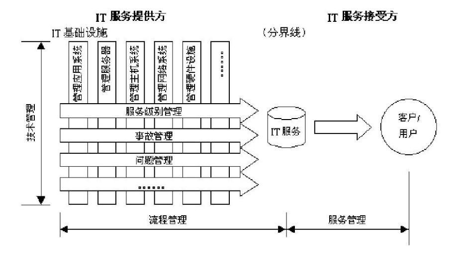
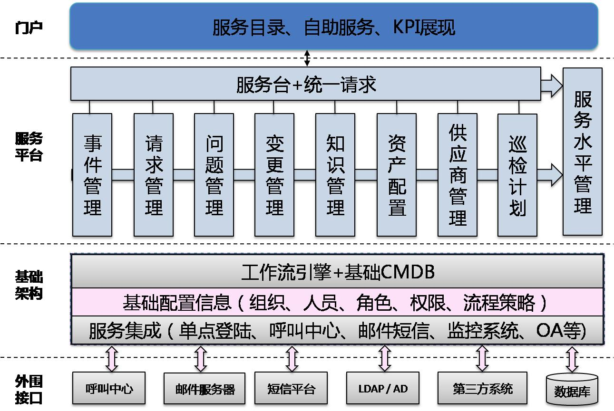
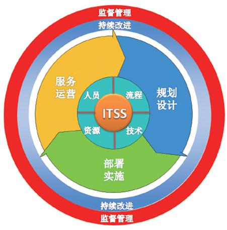

# IT服务管理与监理

对于传统制造或房产行业来说，服务管理和监理都是工程项目不可缺失的部分。但是在 IT 项目中，这一块其实大家接触得会非常少，或许只有在非常大的项目或者政府相关的大型项目中才会出现服务管理和监理的情况。因此，今天的内容我们了解一下即可，全部都不是重点。（看到这个是不是非常开心）

## IT服务管理

ITSM (IT Service Management，IT服务管理 )，它是一套帮助企业对IT系统的规划、研发、实施和运营进行有效管理的高质量方法。它结合了高质量服务不可缺少的流程、人员和技术三大要素。标准流程负责监控IT服务的运行状况，人员素质关系到服务质量的高低，技术则保证服务的质量和效率。这三大关键性要素的整合使ITSM 成为企业IT管理人员管理企业IT系统的法宝和利器。"IT服务管理"是一套面向过程、以客户为中心的规范的管理方法，它通过集成IT服务和业务，协助企业提高其IT服务提供和支持能力。

实施ITSM的根本目标有三个：以客户为中心提供IT服务；提供高质量、低成本的服务；提供的服务是可准确计价的。

在这张 IT 运维系统的工作流程中，我们需要了解的是中间的服务平台，也就是我们的 ITSM 的工作流程。其中的几个管理术语今天所有内容中相对重要一点的。

- 事件：非服务标准操作的组成部分，并导致或可能导致服务中断或服务质量下降的任何事态。负责记录、归类和安排专家处理事件并监督整个处理过程直至事件得到解决和终止。

- 问题：一个或多个事件到目前为止的潜在原因。

- 变更请求：用于记录变更服务或基础设施内的任何配置项的具体信息表单。

- 服务台：直接面向客户的支持小组一，是整个支持工作的重要部分。

- 服务级别协议：服务提供方和客户之间签订的书面协议，该协议规定了服务内容和商定的服务等级。包括品质、水准、性能等方面所达成的双方共同认可的协议或契约。

IT 服务管理的商业价值包括：

- 确保IT服务管理流程支业务流程、整体提高业务运营质量。

- 提高客户及业务人员的生产率。

- 通过实践管理流程、变更管理和服务台等提供了更可靠的业务支持。

- 提高客户满意度。

- 提供更加及时有效的业务连续服务。

### ITSS

ITSS 指的是信息技术服务标准，其是英文InformationTechnologyService Standards的缩写。ITSS 的生命周期主要包含五个阶段，第一个阶段是规划设计阶段，主要是负责对IT服务进行全方位的规划与设计，第二个阶段是部署实施阶段，即根据第一阶段的规划设计建立相应的管理体系，对IT服务的构成元素进行合理分配，并且提出服务解决措施，第三个阶段是服务运营阶段，即通过全方位的过程管理，确保业务具备持续性，让客户的运营与IT服务的运营结合到一起，第四个阶段是持续改进阶段，即定期进行检查和评审，及时发现IT服务过程当中出现的问题，及时进行改进，以便于提升IT服务质量，第五个阶段是监督管理阶段，即按照ITSS相关质量评价标准，进行相关服务的考核，评价在IT服务过程中的服务质量情况，监督服务交付的过程与结果，并且进行考核与评估。

ITSS 定义了IT服务由人员、过程、技术和资源组成，并对这些IT服务的组成要素进行标准化。另外，就IT服务而言，通常情况下是由具备匹配的知识、技能和经验的人员，合理运用资源，并通过规定流程向客户提供IT服务。其实也就是我们圆环中间的那四个重要的核心要素。

- 人员：主要是正确选人，需要有知识、技能、经验。

- 流程：指的就是正确做事，包括简洁、高效、协调地做事。

- 技术：流程确保正确做事，而技术确保的就是高效地做事，包括专业的能力、先进的标准以及安全的原则。

- 资源：资源所代表的就是有保障地做事，能够科学合理地完成要做的事情，并且获得配套的支持。

## IT监理

信息系统工程监理指 **依法** 设立且具备相应 资质 的信息系统工程监理单位（监理单位），受业主单位（建设单位）委托，依据国家有关法律法规、技术标准和信息系统工程监理合同，对信息系统工程项目实施的监督管理。

信息系统监理的主要内容是我们今天要关注的内容：

- 投资控制

- 进度控制

- 质量控制

- 变更控制

- 合同管理

- 信息管理

- 安全管理

- 沟通协调

这八项内容是我们要记下来并且能够达到背诵的，我们可以这样记 “四控三管一协调” ，也可以这么记 “投进质变 安信合 协调” 。总之，这些内容都 IT 监理的工作内容。同时，监理的工作范围包括：

- 国家级、省部级、地市级的信息系统工程。

- 使用国家政策性银行或者国有商业银行贷款，规定需要实施监理的信息系统工程。

- 使用国家财政性资金银行或者国有商业银行贷款，规定需要实施监理的信息系统工程。

- 涉及国家安全、生产安全和信息系统工程。

- 国家法律、法规规定的应当实施监理的其他信息系统工程。

### 总监理工程师及其表

对于信息系统监理来说，我们国家实施的是总监负责制，也就是说，由总监理工程师来全面负责监理合同的实施，总监理工程师的职责包括：

- 确定项目监理机构人员的分工和岗位职责

- 主持编写项目监理规划、审批项目监理实施细则并负责管理项目监理机构的日常工作

- 审查分包单位的资质并提出审查意见

- 检查和监督监理人员的工作根据工程项目的进展情况可进行人员调配对不称职的人员应调换其工作

- 主持监理工作会议签发项目监理机构的文件和指令

- 审定承包单位提交的开工报告、施工组织设计、技术方案、进度计划 

- 审核签署承包单位的申请、支付证书和竣工结算

- 审查和处理工程变更

- 主持或参与工程质量事故的调查

- 调解建设单位与承包单位的合同争议、处理索赔、审批工程延期

- 组织编写并签发监理月报、监理工作阶段报告、专题报告和项目监理工作总结

- 审核签认分部工程和单位工程的质量检验评定资料审查承包单位的竣工申请组织监理人员对待验收的工程项目进行质量检查参与工程项目的竣工验收

- 主持整理工程项目的监理资料

这一部分内容非常多，大家了解一下即可，比较重要的是大家记住总监负责制这个事情就好了。另外除了总监理工程师之外，还有总监理工程师代表这一职位，其实也就是普通的监理工程师。就像一建二建的不同职责分工一样，这个普通职位的职责是：

- 负责总监理工程师指定或交办的监理工作

- 形式授权范围内的总监理工程师的职责和权力

对于总监来说，下面这些内容是不能委托给总监代理工程师代表来处理的，其实也就是与项目有关的非常重要的事都是不能让别人代办的：

- 主持编写项目监理规划，审批项目监理实施细则

- 签发工程开工、复工报审表、工程暂停令、监理通知、工程款支付证书、工程竣工监理报告

- 审查签认竣工结算

- 调解建设单位与承包单位的合同争议、处理索赔、审批工程延期

- 根据工程项目的进展情况进行监理人员的调配、调换不称职的监理人员

对于总监不能委托的这些事，也是非常重要的内容，在考试的时候可能经常会问总监代表能不能做什么事情，以这几条为参考就可以了。

### 监理文档

在监理过程中，有三个文档是我们需要重点关注的。主要关注的是这个文档是由谁负责的或者谁批准的。

监理大纲，由总监工程师主持编写，经技术负责人审核，由单位法人代表批准。（总监写、技术审、法人批）

监理规划，由总监工程师主持制定，监理单位技术负责人审核批准，建设单位批准。（总监制定、监理技术审、建设方批）。监理规划主要包括的内容有：工程项目情况；监理的范围、内容和目标；监理项目部的组织结构与人员配备；监理依据、程序、措施及制度；监理工具和设施等。

监理实施细则，在总监理工程师的指导/主持下，由监理工程师分别编写，经总监理工程师批准。（监理写、总监批）。监理实施细则的内容包括：作为指导监理单位监理项目部全面开展监理工作的行动纲领；作为信息系统服务管理主管部门对监理单位实施监理管理的重要依据；作为建设单位确认监理单位是否全面认真履行监理委托合同的重要依据；作为监理单位和建设单位重要的存档资料。

上面这三大段内容不太好记忆吧，那么我们就用一个表格来梳理一下。

<table>
    <tr>
        <th>名称</th>
        <th>编制对象</th>
        <th>负责人</th>
        <th>编制时间</th>
        <th>编制目的</th>
        <th>编制作用</th>
        <th colspan="3">编制内容</th>
    </tr>
    <tr>
         <th>监理大纲</th>
         <td>项目整体</td>
         <td>公司总监</td>
         <td>监理招标阶段</td>
         <td>供建设单位审查监理能力</td>
         <td>增强监理任务中标的可能性</td>
         <td>重点</td>
         <td>一般</td>
         <td>无</td>
    </tr>
    <tr>
         <th>监理规则</th>
         <td>项目整体</td>
         <td>项目总监</td>
         <td>监理委托合同签订后</td>
         <td>项目监理的工作纲领</td>
         <td>对监理自身工作的指导、考核</td>
         <td>一般</td>
         <td>重点</td>
         <td>重点</td>
    </tr>
     <tr>
         <th>监理实施细则</th>
         <td>某项专业监理工作</td>
         <td>专业监理工程师</td>
         <td>监理项目部建立、责任明确后</td>
         <td>专业监理实施的操作指南</td>
         <td>规定专业监理程序、方法、标准、使监理工作规范化</td>
         <td>无</td>
         <td>一般</td>
         <td>重点</td>
    </tr>
</table>

## 总结

今天的内容其实对我来说是很陌生的，我估计对不少人来说都是如此。不过确实是有专门的信息系统服务相关的职位以及信息系统监理这类的员工存在的。而且在很多大型项目以及国企项目中这些都是必须的，比如说必须要有几个总监，多少监理，其实非常类似于房地产开发。另外像企业需要评一些资质，承接一些项目，也都需要这些岗位的存在。存在即是道理，如果确实没有接触过，那么只需要了解就好，其中 IT 运维系统的工作流程、ITSS 的核心四要素、监理工程师不可以委托的职责 以及 四个监理文档 ，这些内容是我们需要重点关注的。

## 彩蛋

恭喜大家，我们教材的第一章的内容学完了。技术这一块的内容 90% 以上就已经完成了。为什么说是 90% 呢？因为我们后面还有一点点东西，主要是一些政策法则、专利权利、软件开发模型相关的内容。这些内容我们在后面会慢慢的接触到。接下来我们就要开始 项目管理 相关知识的学习。不过别急，趁着现在刚刚结束，我们再回忆一下之前我们都学了什么：

- 信息系统、信息化还记得什么？面向对象是什么还记得吗？

- 计算机网络怎么分层的？有哪些协议？网络存储和磁盘存储有哪些？综合布线是什么？

- 需求有哪些类型？UML里面最常见的那些图是什么图？面向对象的原则有哪些？

- 软件测试包含哪些类型？软件的质量过程有哪些？

- 经典的软件设计架构有哪些？特别是 B/S 和 C/S 的区别是什么？

- 计算机信息系统安全保护等级 和 信息安全等级 分别是什么？加密技术有哪些，怎么分类的？网络安全怎么防护？

- 大数据、物联网、云计算、智慧城市还记得是什么内容吗？移动互联网、区块链还有印象吗？

- 信息化未来的发展以及信息化的应用有哪些？

- 最后就是今天的内容都有哪些是重点啦！

惊不惊喜，意不意外，如果你大部分都知道了，那么恭喜你，早上考试的那 75 道选择题问题不大了。如果你还没掌握的话也没关系，当你学习完这些内容之后，你也已经掌握了非常多的技术方面的知识，至少下次再和技术团队的小伙伴交流的时候，他们一定会非常惊讶你的成长。

当然，我也只是一名普通的程序员，信管师在技术知识方面的内容非常宽泛，所以可能有很多的知识并不一定完全准确，大家还是以教材为主，对于不太清楚的知识点多多查阅网上的相关资料。接下来，我们就一起进入 项目管理 内容的学习吧。

参考资料：

《信息系统项目管理师教程》

《某机构培训资料》