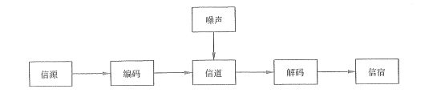
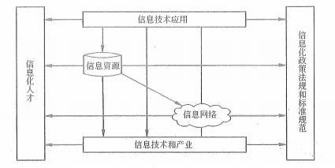
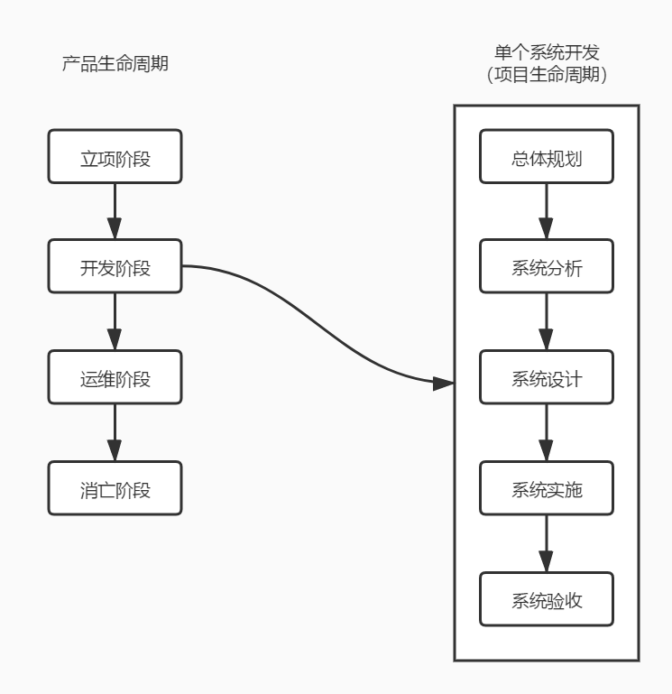
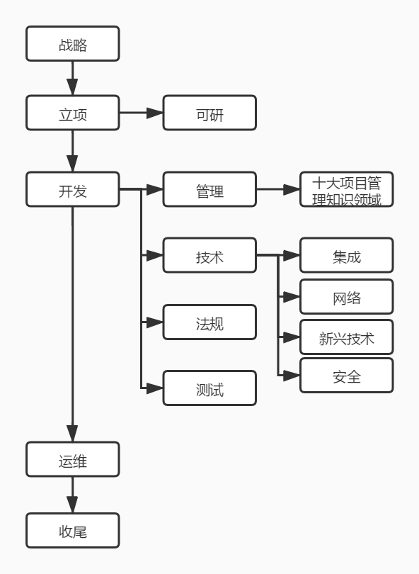

# 信息系统与信息化

首先我们来看下 IT 是什么意思，中文读法叫“挨踢”，就是天天被人踢的职业。当然，这个是玩笑话，做为 20 世纪末 21 世纪初成长最快的行业，IT 行业也被认为是衡量一个国家综合实力的体现。因为，IT 的真正意思是 Internet Technology ，也就是 互联网技术 的意思。

我们接下来要学习的 信息系统项目管理师 相关课程中的 技术 部分，其实也就是 IT 的基础，也就是 信息技术 。不管你在 IT 行业是从事什么职位，都或多或少会接触到一系列的信息系统，包括一个小小的官网后台，或者一个巨大且复杂的 ERP 系统，它们都属于 信息系统 。

## 信息的概念

控制论的创建人 维纳 指出，信息就是信息，既不是物质也不是能量，是客观事物的基本存在形式之一。这个是对于信息这个概念相对早期的一种理解。其实如果从物理学的角度来说，信息应该是一种能量，一种能被我们感知的能量。这是我个人的理解哦，因为我也比较喜欢看一些科幻和科普方面的东西。比如说一个物体，或者说一朵花。它带给我们什么信息呢？有颜色，这是光的反射，而光是一种波粒二象性的物质，同时因为波的存在，所以也有能量。另外还有味道，味道一定也是分子散发出来被我们的嗅觉器官所感知的。因此，信息的接收者似乎在信息系统中有着重要的角色，这也体现了一种 人存原理 。也就是说，如果我们不存在，没有人感知信息，那么信息还存在吗？这也有点想薛定谔的猫的意思。这个话题扯的有点远了，我的意见仅供参考，还是听大佬的比较靠谱。毕竟你考试的时候，这种定义的题只会考你大佬们是如何定义的。

信息论的创始人 香农 博士认为：“信息，是有另于物质与能量的第三种东西，是对事物运动状态或存在方式的不确定性的描述。”对于这个概念我比较认同，因为就像上面我说的，除了物质和能量之外，第三种东西其实就可以想像为是我们 人存 的思想。而物理学也早已提示，整个宇宙都是动态的，并且是充满不确定性的。

香农 博士不仅给出了信息的定义，还给出了信息的单位，也就是我们非常熟悉的 bit 比特。1 比特的信息量，在变异度为 2 的最简单的情况下，就是能消除非此即彼的不确定性所需要的信息量。这里的“变异度”指的是事物的变化状态空间为 2 ，例如：大小、高低、快慢等。

同时，香农 博士还将热力学第二定律中的“熵”的概念引入到了信息论中。不知道大家有没有看过 诺兰 大导演的 《信条》 ，这部电影整个就是在讲 “熵” 。在物理学和热力学中，有一个 “熵增” 的概念，熵代表的事物无序程序的度量，也就是事物的混乱情况。而 墒增 的意思就是事物朝着越来越无序，越来越混乱的状态发展。整体宇宙都是这样。在电影中，穿越时间其实就是做一个与熵增相反的事情，也就是熵减，并以此来解释如何回到过去。同样的，在信息论中，比特所代表的就是一个 熵减 的概念。在上面的定义中，变异度就是熵增的情况，而消除这些不确定性所需要要的信息量就是比特。

比特这个单位，在信息论中的这个定义其实是很让人懵圈的。但如果在计算机中，就非常好理解了，1 bit 就是一个位，用于表示 0 或者 1 。而一个字节是 8 bit 也就 8 位。同时，现代 CPU 的 32位 或者 64 位表示的是 CPU 一次处理多少位的数据。

## 信息的传输模型

在这个传输模型中，我们拿一个网站来举例。信源是产生信息的实体，这个可以看作是服务器。信宿是信息的归宿或者接收者，可以看作是我们的眼睛和大脑。信道是信息传送的通道，这个就比较多了，服务器通过网线、路由将信息发送到电脑，然后电脑接收到信息再通过浏览器和显示器让我们看到，中间的这一串就是信道。编码是将数据进行有利于传输的编码，而解码则是将编码还原成信息的过程。在网络传输中，我们编写的网站代码会变成二进制编码的数据进行传输，然后在通过电脑端的调制解调器解码成电脑浏览器可以读取展示的数据。噪声可以理解为干扰，比如网络卡顿，图片或者视频无法加载。

再以一个说话的例子来说明这个信息的传输。当前在说话的人就是信源，听他说话的人就是信宿，空气是信道，大脑是我们的编码和解码器，语言内容是信息本身，如果周围的环境很嘈杂，那么就是噪声。

## 信息系统

信息系统就是输入数据，通过加工处理，产生信息的系统。以计算机为基础的信息系统可以定义为：结合管理理论和方法，应用信息技术解决管理问题，提高生产效率，为生产或信息化过程以及管理和决策提供支撑的系统。

信息系统的组成部分包括硬件、软件、数据库、网络、存储设备、感知设备、外设、人员以及把数据处理成信息的规程等。其实，我们只要记住软件、硬件、人和制度就可以了。信息系统的类型主要可以从两个角度进行分类：

- 数据环境分类：主要是以数据的性质来分类，包括数据文件、应用数据库、主题数据库、信息检索系统

- 应用层次分类：这个是以用户的权限来进行分类的，包括战略级（企业最高管理层）系统、战术级（企业中层经理及其管理部门）系统、操作级系统（服务开型企业的业务部门）、事物级（企业的管理业务人员）系统

## 信息化的基本概念

信息化主要体现的内容包括计算机通信和网络技术现代化，让信息产业占主导，从工业社会转向信息社会。这里有一个关键的东西就是我们这个证书颁发的部门 工业与信息化部 。这个部门可以说是整个 IT 行业甚至是整个电子科技领域的主管部门。国家对于信息化的重视程度想必不用多说大家也能体会到，在全世界范围来说，电子支付已经成了我国的一大亮点。各种政务的在线办理也是我们信息化的重要体现，现在身份证、户口、护照等很多东西在线都可以自己办了，各地各级政府各部门也都有在线问政系统以及市长邮箱等。另外像和我们每个人息息相关的火车票 12306 系统，也是全世界最能抗瞬时并发的超级系统。这一切，都可以看出来国家对信息化的重视。要建设成为现在化的社会主义强国，富国，信息化是非常重要的一个方面，也因此，国家提出了 “两网、一站、四库、十二金” 的国家级信息系统，这个大家了解一下，十二金比较难记，选择题有可能出。

- 两网：政务内网和政务外网。

- 一站：政府门户网站。

- 四库：人口、法人单位、空间地理和自然资源、宏观经济等四个基础数据库

- 十二金：分为三类，第一类是对加强监管、提高效率和推进公共服务起到核心作用的办公业务资源系统、宏观经济管理系统建设（金宏）；第二类是增强政府收入能力、保证公共支出合理性的金税、金关、金财、金融监管（含金卡）、金审 5 个业务系统建设；第三类是保障社会秩序、为国民经济和社会发展打下坚实基础的金盾、金保、金农、金水、金质 5 个业务系统建设。

国家在信息化建设的体系中，包括信息技术应用、信息资源、信息网络、信息技术和产业、信息化人才、信息化政策法规和标准规范 6 个要求。这 6 个要素可以组成一张关系图，这个图和下面的解释非常重要！！

- 1）信息资源：信息资源的开发和利用是是国家信息化的核心任务，是取得实效的 **关键** ，也是我国信息的 **薄弱环节** 。

- 2）信息网络：是信息资源开发和利用的 **基础设施** 。

- 3）信息技术应用：是信息化六要素中的 **龙头** ，是国家信息化建设的 **主阵地** ，体现了国家信息化建设的 **需求和效益** 。

- 4）信息技术和产业：信息产业是信息化的 **物质基础** 。

- 5）信息化人才：人才是信息化的 **成功之本** ，合理的人才结构更多是信息化人才的 **核心** 和 **关键** 。

- 6）信息化政策法规和标准规范：是国家信息化快速、有序、健康和持续发展的 **保障** 。

## 信息系统生命周期

信息系统的生命周期可以简化为立项（系统规划）、开发（系统分析、系统设计、系统实施）运维及消亡四个阶段。

在这个图中，我们可以看到，信息系统的生命周期也可以说是一个产品的生命周期。而在一个产品的开发阶段，又可以划分出一系列步骤，变成一个项目的生命周期。产品和项目的关系一般可以说成是一个产品至少会是一个项目，但不仅限于一个项目。比如说，我们要开发一个电商网站，这是一个产品。而最基础的订单、商品功能等可以看做是第一期项目要开发的内容，而会员折扣、团购拼团之类的可以分别以不同的项目来进行开发。

我们先来看看右边的信息系统（产品）生命周期。立项阶段其实就是进行战略分析、组成团队并且获得可行性研究报告。开发阶段就是系统开发的阶段，从箭头就可以看出，这个阶段就是一个项目开发阶段。运维阶段主要是在验收和移交之后，是售后和维护的阶段。最后的消亡阶段不要害怕，正常的产品都有其巅峰和消失的阶段，在这个时期可以进行更新改造、功能扩展和报废重建。关于这个产品生命周期，大家可以自行搜索学习一下 产品经理 相关知识中对于 产品生命周期 的定义。

接下来在项目生命周期中，总体规划阶段也是一个可行性研究分析的阶段，在这个阶段要制定开发计划。然后系统分析阶段就是进行需求分析。系统设计阶段主要是进行概要设计和详细设计，用软件术语来说是搭架构的阶段。系统实施就是我们进行开发、测试和部署的阶段，这个阶段一般是项目的核心开发阶段。最后的系统运行和维护阶段，一是要验收产品，二是对后续的系统进行运行维护和控制，出现问题也要及时修正。

最后我们再来看一张比较完整的产品项目开发流程，也是串联我们这个 信息系统项目管理师 整个知识领域的非常有用的一张图。

## 总结

在第一篇文章中，我们学习了信息的概念，也学习到了信息系统以及信息系统生命周期的内容。更重要的是，我们也学习到了国家对于信息化的重视程度，这也是鼓励我们 IT 从业人员继续努力奋斗的一个重要政策支持。相信学习完这一篇之后，你也对 信管师 这个证有了更多的兴趣，那么我们就继续坚持学习下去吧，这只是开场，后头好玩的东西还有很多哦！

参考资料：

《信息系统项目管理师教程》

《某机构培训资料》

