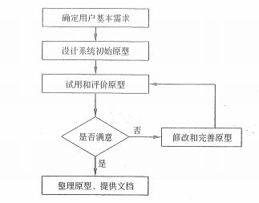

# 信息系统开发方法

信息系统是一个极为复杂的人机交互系统，它不仅包含了计算机技术、通信技术和网络技术，以及其他的工程技术，而且，它还是一个复杂的管理系统，它也需要管理理论和方法的支持。因此，与其他的工程项目相比，信息系统工程项目的开发和管理显得更加地复杂，所面临的风险也是越大的。

我们平常所使用的各种后台管理系统，各种在线软件，比如说淘宝、微信这些，往大了说都可以是一个信息系统。因为他们具备了我们前面所说过的信息的特征。因此，信息系统涵盖的范围其实非常广泛。人们常说，现在是一个信息爆炸的时代，从微博到朋友圈再到抖音，信息的更新速度、传播速度以及传播方式都是飞快发展的。为了应对这样一个时代，在开发信息系统时，除了技术、管理等因素外，系统开发方法也起着很重要的作用。

常用的开发方法包括结构化方法、面向对象方法、原型方法、面向服务方法等。我们今天主要就来说说这几个方法。

## 结构化方法

结构是指系统内各个组成要素之间的相互联系、相互作用的框架。因此，结构化方法是一种非常传统的方法，也是一种工程化的方法，也称为生命周期法。它由结构化分析（Structured Analysis, SA）、结构化设计（Structured Design, SD）和结构化程序设计（Structured Programming, SP）三个部分组合而成，其精髓是自顶向下、逐步求精和模块化设计。

其实这个方法也是就是我们最常见也最传统的那种软件开发方式。对应的是我们后面要讲的 软件工程中的 结构化设计 以及信息系统项目典型生命周期模板中的 瀑布模型 和 V模型 。大家先不要着急，现在我们只需要知道这个结构化的一些特点就好，等到后面学习完了 瀑布模型 之后，再回来看这一块的内容，就非常好理解了。

结构化方法有 4 个主要的特点，它们分别是：

1. 开发目标清晰化。在这其中，最主要的是 **“用户第一”** 的原则，用一句俗语说，就是用户就是上帝，我们一定要和用户好好地沟通，保持联系，充分理解。

2. 开发工作阶段化。严格区分工作的阶段，每个阶段都有任务与成果。比如说我们在设计阶段，就只做设计阶段的事，在设计阶段结束的时候，一定要有设计稿或者设计文档产出。

3. 开发文档规范化。所有的文档资料都必须是非常标准化的，每个阶段结束都要有文档留存。

4. 设计方法结构化。从从整体和全局考虑，自顶向下地分解任务，逐步求精的开发过程。

从这些特点，我们可以看出，结构化方法适用用数据处理领域的问题，但不适应于规模较大、比较复杂的系统开发。注意，划重点，我们的 PMP 也就是后面要讲到的项目管理理论部分（PMP5），其实是非常偏向于这个结构化开发的模型的。对于需求明确、成熟、稳定，并且有类似成功经验的项目来说，结构化方法相当适用。在最后，我们也来简单地了解下结构化设计的 3 个主要的不足和局限性。

1. 开发周期长。直到系统实施阶段结束后，用户才能使用到系统。

2. 难以适应需求变化。结构化方法要求分析师在系统分析阶段充分掌握和理解用户需求。

3. 很少考虑数据结构。比较注重系统功能的分解与抽象，兼顾数据结构的方面不多。从 SA 阶段的数据流图到 SD 阶段的模块结构图的转变也比较困难。

相信跟过我们之前的敏捷课程的，一定对第 1 点和第 2 点深有感触，因为我们在敏捷中主要解决的就是这两个问题。敏捷是什么还记得吗？通过短时间的迭代来快速交付具有价值的产品。正好，对应的就是这两点。在这套课程中，我们也会提到敏捷，但是，真正的主角其实反而是这套 结构化 的开发方法。毕竟，它的优点也是不可忽视的，而且现在的大潮流其实是各种项目管理方法的融合，在很多大厂，你既可以看到敏捷实践的应用，也可以看到传统项目管理工具的应用。总之一句话，对客户有价值，对组织有好处，对项目有效果的实践和方法工具，都是我们值得学习的。

## 面向对象方法

对于学习过软件开发的同学来说，这个面向对象方法肯定就会非常熟悉了，甚至可以跳过这一块的学习直接看后面的内容。面向对象（Obejct-Oriented，OO）认为 ，客观世界都是由各种对象组成的，任何事物都是对象，每一个对象都有自己的运动规律和内部状态，都属于某个对象类，是该对象类的一个元素。我们先来认识面向对象中的一些名词。

类：相同属性、相同操作的对象的集合。一系列相似对象的抽象。

对象：描述客观对象的一个实体。现实世界的一个抽象。

实例：类中的每个对象类，是创建对象的模板。**对象是类的实例，类是对象的抽象。**

属性：对象的静态特征。

操作：方法 或服务，规定对象的行为。

继承：一个类可以继承另一个类的特征或行为，这个类叫做子类，被继承的类叫做父类。

泛化：和继承相反，由父类来抽象出子类。

这些东西如果你没有接触过的话可能理解起来比较困难，不过不用着急，在后面我们学习 软件工程 中的 UML类图 和 软件设计 的 面向对象设计 时还会接触到。当然，更好的方法是如果身边有程序员同事的话，问问他们，让他们用代码把上面的概念写出来，相信你一定就会明白了。到后面要讲这些内容的时候我就不会再重复这些名词了，不记得的小伙伴记得过来查哦。

面向对象方法构造的系统具有更好的 **复用性** ，其关键在于建立一个全面的、合理的、统一的模型。OO 方法也是划分阶段的，分别是 系统分析、系统设计 和 系统实现 三个阶段，但是和 结构化方法 不同的是它们三个阶段的界限不是很明确。某一个工作即可以在前一个阶段完成，也可以在后一个阶段补充。

在今天学习的最后，我补充了用代码实现面向对象这几个概念的内容，大家可以了解一下。不过前提是，你最好还是有一点点基础，哪怕是大学上过 C 语言的课也好。如果实现理解不了，那么只能是硬背概念了。

## 原型化方法

原型化方法的一个最大的特点是在系统开发初期必须明确系统的功能需求，确定系统边界。它也叫做快速原型法，根据用户初步的需求，快速地建立一个系统模型直接展示给用户，在此基础上与用户交流并加以改进，最终实现用户需求的信息系统快速开发的方法。 

根据原型是否实现功能来分，可以划分为 水平原型 和 垂直原型 。水平原型也称为行为原型，用于探索预期系统的一些特定行为，并达到细化需求的目的。水平原型通常是功能的导航，不会实现真实的功能。垂直原型也称为结构化原型，实现了一部分功能，主要用在复杂的算法实现上。

从原型的最终结果来分，可以分为 **抛弃式原型** 和 **演化式原型** 。抛弃式原型也称为探索式原型，是每日达到预期的目的后，原型本身被抛弃。抛弃式原型主要用在解决需求不确定性、二义性、不完整性、含糊性等。深化式原型为开发增量式产品提供 基础，逐步将原型深化成最终系统。主要用在必须易于升级和优化的场合，特别适用于 Web 项目。

从这两种原型的划分来看，各位有想到我们企业中的 产品经理 画的原型图是属于哪种类型的吗？没错，相信大家已经看出来了，原型图是没有功能的，或者只有简单的跳转类的功能用于演示，因此它是水平原型。然后大部分情况下，原型会被抛弃，虽然也有演化式的大型项目的原型图会持续更新，但等到项目结束后一般都会结束原型图的维护。如果需要在项目结束后再添加功能之类的，往往也会以单独的功能点来绘制原型图。因此，我们产品经理画的图一般来说就是 水平抛弃型 的原型。

在另一方面，也是我们之前在讲敏捷时学习过的 MVP（最小可行性产品），这个其实是有点类似于演化式原型的，要知道，MVP 是用于快速验证产品可行性的一个可以正式使用的产品，如果确实可行并且对客户有价值的话，那么我们在敏捷中会基于这个 MVP 继续迭代增量开发的。因此，MVP 是属于一个 垂直深化式 的例子。

当然，上面的两种例子都并不是非常固定，但在大部分情况下确实还是比较符合原型的分类情况的。原型法的开发过程我们就简单地通过下面这张图了解一下即可，不是特别重点的内容，相信产品经理们都非常懂这张图的流程。



对于原型法来说，有其优势，也有其限制，我们先来看看原型法的优势：

- 原型法可以使系统开发的周期缩短、成本和风险降低、速度加快，获得较高的综合开发效益。

- **原型法以用户为中心，用户参与程度大大提高，开发的系统符合用户的需求。**

- 用户的参与度的提高，会让用户对系统的功能和结构更加容易理解和接受，有利于系统的移交和维护。

优势不用多说，其实总结起来就是中间那一条，用户参与度很高。而它的限制其实也在这里。

- 开发的环境要求高。开发人员和用户的能力水平要求都比较高。

- 管理水平要求高。如何控制对系统原型的修改次数、如何确定用户的满意度都是非常难协调的问题。

因此，原型法非常适用于那些需求不明确的系统开发。其实很多小伙伴们已经看出来了吧，敏捷 和 原型法 有着千丝万缕的关系，都是针对需求不明确的、容易变动的项目的。而且，就像上面我们说的 MVP 一样，确实在 敏捷 中是有原型法的应用的。

## 面向服务的方法

如果你听说过 微服务 ，那么面向服务的方法你肯定也不会陌生了。同样的，需要一个服务中心，然后通过将相关对象进行业务功能分组，形成构件（Component），将这些构件以接口的形式暴露出来，这就是面向服务的开发方法（Service-Oriented，SO）。

从这个定义就可以看出来，微服务其实是它的一个子集，同时也是在面向服务的基础上形成的。在现代化的框架中，服务中心、服务注册、服务发现都是面向服务开发的必备功能，而微服务更典型的特点是应用了 远程过程调用 RPC 这个技术，其实就是利用网络特性来暴露接口。比如我们最常用的 HTTP 接口就是可以做微服务，当然，它的性能是比较惨的，所以也会有许多 Socket 的长连接 RPC 框架可以供我们使用。这部分内容作为扩展知识，大家自己去查阅相关的资料吧。如果你做过微服务相关的开发应该就很清楚了，如果你没有做过相关的开发或者没有代码经验的话，记住上面那一段的定义就可以了。

## 补充：代码表示面向对象中的概念

码农们请跳过这一部分。

```php
class Color {  // 类
    public $color = ''; // 属性
    public function show(){ // 操作
        if($this->color){
            echo '现在是', $this->color, '色', PHP_EOL;
        }else{
            echo '还没有定义颜色';
        }
    }
}

$c = new Color(); // 实例化
// $c 就是对象
$c->color = '红'; // 为 $c 对象的属性赋值
$c->show(); // 调用 $c 的方法
// 输出结果为：现在是红色

class BlueColor extends Color{ // 继承自 color 类
    public $color = '蓝';
}

$b = new BlueColor;
$b->show();
// 现在是蓝色
```

上面这一段是 PHP 的代码。如果你学习过 C 语言的话应该还是很容易看懂的，不过纯 C 语言不是面向对象的，所以最好是有 C++ 或者 Java 的基础。

在这段代码中 Color 是一个 **类** ，也就是一个模板，我们可以将它看成是对 颜色 的抽象。在这个类模板中，有一个 **属性** $color 用于记录表明当前这个类应该是什么颜色，这个属性其实是一个变量，变量是保存在内存中的一段数据。然后 show() 是一个 **操作** 方法，也可以叫做函数，主要是执行一段代码段的。在这个方法中，我们使用条件判断语句 if 来输出不同的内容。

在类的外部，我们通过 new 关键字来 **实例化** 一个类模板，获得的结果放到 $c 变量中，现在这个 $c 就是一个 **对象** 。其实从这里我们就可以看出，类作为模板定义了基本的属性方法，然后在对象使用的时候是可以灵活调用这些属性方法的，我们也可以再实例化一个类，然后设置它的 $color 属性为别的颜色。看出面向对象 **复用性** 的特点了吧！

接下来我们定义了一个 **子类** BlueColor 继承自 Color 类，然后我们 **重写** 了父类的 $color 属性，同时它也继承了父类的 show() 方法。这时我们直接实例化这个 BlueColor 获得一个对象，直接调用对象的 show() 方法就可以输出内容。至于为什么这里不用再去给 $color 赋值了，相信大家已经看出来了，通过重写父类的属性，当前子类中的这个 $color 不是空的，已经被设置为 蓝 这个字符了，所以我们的 show() 是可以正常输出的。

如果你确实对代码没有任何概念的话，可以去 [w3school](https://www.w3school.com.cn) 这个网站学习一下基础的几个语言，比较推荐的是 Python、PHP 这类相对来说比较容易上手的语言。然后只要了解基础的语法和对应语言的面向对象相关的内容就可以了。

## 总结

今天我们学习的内容还是理论为主，不过已经有一些技术范了吧，接下来，我们就要正式开始学习一大堆纯技术方面的东西了。做好准备了吗？千万不要怕，虽然东西多，但都只是点到为止，并没有很深入的研究。因此，如果你只是想通过考试的话，了解一下，然后硬背一下，能达到通过考试的水平就够了。相信即使你是硬背的，但是将来你在和程序员们交流的时候，有这些知识垫底，也一定会让他们对你刮目相看。

参考资料：

《信息系统项目管理师教程》

《某机构培训资料》