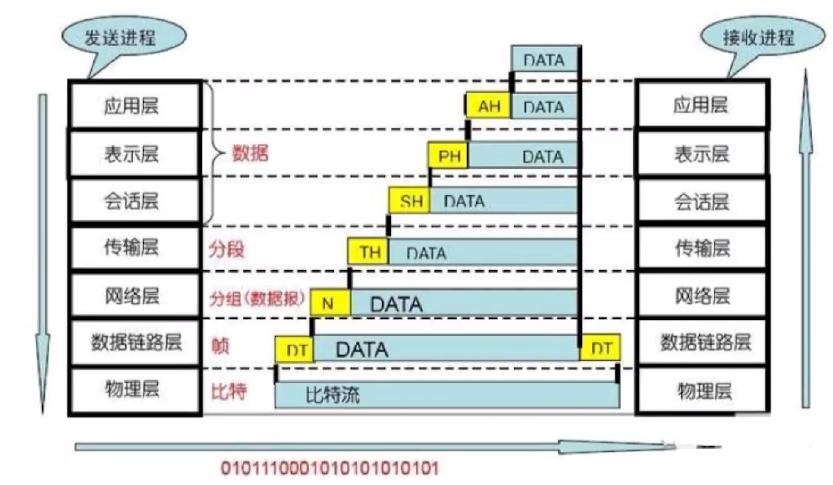
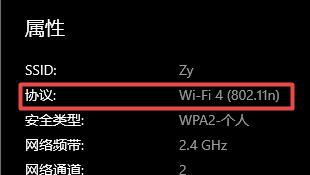

# 计算机网络基础（一）网络标准与协议

问问你身边的运维吧，网络协议这个东西随便说说就是能写一本跟字典一样的书的。不要被吓到了，这是真事。不仅仅是运维，包括网络管理员以及我们这些 Web 开发工程师来说，网络协议都是基础中的基础课程。只要你是在 IT 行业，那么必然就要和网络打交道，多少了解一点也是没毛病的。

今天的内容，网络工程专业、运维工程师、计算机专业正常上过课靠自己实力过了网络考试的同学可以不用看了。如果有兴趣的话欢迎批评指正，估计很多内容是入不了各位大佬的法眼的。在这里，仅以一个不太懂网络为了通过考试为目的的初学者的视角进行讲解。

## OSI协议

OSI（Open System Interconnect，OSI）的意思是 开放系统互连参考模型 ，它的目的是为了不同各类的计算机互连提供一个共同的标准和框架，并为保持相关标准的一致性和兼容性提供共同的参考。

不同的种类的计算机？不对呀，我们看到的计算机不都一样的嘛？关于这个东西嘛，大家可以了解一下计算机相关的历史，在早期来说，计算机还真不是我们现在看到的统一的 PC 机样式。就拿现在来说，苹果电脑 和 PC 电脑其实在很多方面都不是兼容的，特别是操作系统。为了解决不同的网卡、操作系统之间的互连互通问题，国际标准化组织 ISO 和 国际电报电话咨询委员会 CCITT 共同制定了这个 OSI 协议。它是一个分层协议，一共分为七层。

- 1）物理层。就是我们看到的网线、中继器、集线器之类的，在它们的内部所有的数据都通过 二进制 在传输。光纤或者网线的亮和灭就是代表的 1 和 0 ，这个就是物理信号的传输，想象用一个发光二极管的开关做与非门的逻辑运算。虽不严谨，但大体就是这个意思。

- 2）数据链路层。控制网络层与物理层之间的通信，将二进制数据转换成 帧 。常见的设备包括网桥、交换机、网卡，常见的协议有 PPTP、L2TP、SLIP、PPP、CSMA/CD、ToingRing 等。交换机这个名词经常听说吧，PPTP/L2TP 是我们搭建内网 VPN 常用的协议，PPP 是点对点传输协议，一般用于拨号建立连接进行数据收发。

- 3）网络层。主要是将 网络地址（如IP）转换成物理地址（如网卡地址 MAC），并且决定如何将数据从发送方路由到接收方。这一层非常重要，为什么呢？最出名的协议 IP 就在这一层，最出名的网络设备 路由器 也是工作在这一层。除此之外，还有 ARP、ICMP、IGMP、IPX 协议也都是这一层的。注意，三层交换机 ，也就是带路由功能的交换机，也是这一层的设备。而普通的交换机则是第二层数据链路层的。

- 4）传输层。这一层主要是负责确保数据安全可靠、顺序、无错地从 A 点传输到 B 点。主要就是提供建立、维护和拆除传送连接的功能。没错，我们非常熟悉的 TCP/IP 协议中的 TCP 协议就是工作在这一层，另外还包括 UDP 、SPX 协议。这一层主要是提供端到端的传输控制。

- 5）会话层。主要负责网络中两节点之间建立和维持通信，以及提供交互会话的管理功能。比较典型的协议有 RPC（远程过程调用）、SQL（数据库）、NFS（网络文件系统）。从这几个协议也能看出，Sockets 也是工作在这一层的。

- 6）表示层。数据将按照网络能理解的方案进行格式化。表示层管理数据的解密加密、数据转换、格式化和文本压缩。常见的有 JPEG、ASC2、GIF、DES、MPEG，另外我们做后端开发非常熟悉的 Gzip 也是在这里。

- 7）应用层。这一层就是对软件提供接口以使程序能使用网络服务，比如 HTTP、Telnet、FTP、SMTP 等。

从我们的电脑来看，操作系统是最高的层级，它会管理硬件以及这些服务端口协议。比如说，我们的浏览器，需要访问某个网址的 80 端口，这就是浏览器通过应用层调用 HTTP ，然后 HTTP 会向下依次通过表示、会话层，到达传输层后开始使用 TCP/IP 协议，然后通过电脑上的二层设备网卡转换成二进制数据发送给最近的路由器。路由器通过路由表不停地转发数据，直到转发到指定的网站，网站服务器通过一个反向的操作，也就是从底层到高层的一层层数据解包，获得客户端发来的数据。有一张图非常形象地解释了这个过程。

虽说我们的考试中不会考这个过程，但是这个图其实是我们互联网能够正常运行的一个最最基础的一个过程，所以我觉得大家能够了解一下会更好。在发送的过程中，我们每一层都会向数据增加一些头信息，然后在接收方，会逐一地再处理并摘离这些信息，这就是非常典型的一个网络收发包的过程。当然，更详细的内容，大家可以自己再找找相关的知识去了解一下，对于 信管师考试 来说，记住这七个层的名字以及它们大概的功能就可以了，主要以下面这个表为主。

<table>
    <tr>
        <th>层次</th>
        <th>名称</th>
        <th>主要功能</th>
        <th>主要设备及协议</th>
    </tr>
    <tr>
        <td>7</td>
        <td>应用层</td>
        <td>实现具体的应用功能</td>
        <td rowspan="3">POP3、FTP、HTTP、Telnet、SMTP、DHCP、TFTP、SNMP、DNS</td>
    </tr>
    <tr>
        <td>6</td>
        <td>表示层</td>
        <td>数据的格式与表达、加密、压缩</td>
    </tr>
    <tr>
        <td>5</td>
        <td>会话层</td>
        <td>监理、管理和终止会话</td>
    </tr>
    <tr>
        <td>4</td>
        <td>传输层</td>
        <td>端到端的连接</td>
        <td>TCP、UDP</td>
    </tr>
    <tr>
        <td>3</td>
        <td>网络层</td>
        <td>分组传输和路由选择</td>
        <td>IP、ARP、RARP、三层交换机、路由器、ICMP、IGMP</td>
    </tr>
    <tr>
        <td>2</td>
        <td>数据链路层</td>
        <td>传送以帧为单位的信息</td>
        <td>PPTP、L2TP、SLIP、PPP、CSMA/CD、TokingRing、网桥、交换机、网卡</td>
    </tr>
    <tr>
        <td>1</td>
        <td>物理层</td>
        <td>二进制传输</td>
        <td>中继器、集线器</td>
    </tr>
</table>

最后，对于这种东西来说，口诀是不能少的，记住每个层级的第一个字然后不停地重复就好啦！

 **“物数网传会表应”**

## 网络协议和标准

上面我们说过，OSI 是一种标准模型框架，主要是网络数据的传输规范。而另一个 IEEE 802 规范则是定义了网卡如何访问传输介质（如光缆、双绞线、无线等），以及如何在传输介质上传输数据的方法，还定义了传输信息的网络设备之间建立、维护和拆除的途径。在这个协议中，有两个非常出名的协议，一个是 802.3（以太网的 CSMA/CD 载波监听多路访问/冲突检测协议），另一个是 802.11（无线局域网 WLAN 标准协议）。打开你的电脑或者手机，查看连接属性里面的协议，就能看到，比如说我的电脑就是下图这个 802.11n 。

在这里，我们先了解一下以太网的 802.3 协议，这也是我们的有线局域网协议，后面的文章在讲 网络接入技术 的时候我们还会再来说说 802.11 WLAN 的相关协议信息。802.3 主要包括：

|  协议   | 名称  |  速度   | 介质  |
|  ----  | ----  | ----  | ----  |
| IEEE 802.3  | 标准以太网 |  10Mb/s   | 同轴电缆  |
| IEEE 802.3u  | 快速以太网 |  100Mb/s   | 双绞线  |
| IEEE 802.3z  | 千兆以太网 |  1000Mb/s   | 光纤或双绞线  |

现在我们家里或者公司基本都是千兆以太网了，这个东西和交换机接口、路由接口以及网线质量都有关系，有可能质量差的网线或者没有切好的水晶头就会导致千兆变成百兆。这一块的内容切过网线玩过交换机的同学们一定不会陌生啦！我们后面讲 网络接入技术 的时候还会讲相关的内容，大家可以先预习了解下。

## TCP/IP

到了重头戏了。如果说，OSI 七层协议是整个网络的基础，那么 TCP/IP 就是整个互联网的基础。当然，OSI 还是更底层一些，TCP/IP 我们在学习 OSI 的时候也看出来了，它是位于 3、4 层的协议。

我们先来简单了解下 TCP 和 UDP ，这俩货是传输层的核心协议，对于我们做后端的码农们来说，TCP 和 UDP 的区别可以说是面试常考题目前三名的。

TCP 是有连接的，保证传输接收稳定，需要三次握手四次挥手来建立和断开连接，面向单播传输，比较可靠，面向字节流。

UDP 是无连接的，不一定稳定，但是速度快，面向报文，可以单播（一对一视频聊天）、多播（多人视频聊天）、广播（在线教学）， 不可靠可能会丢包。

大家看出来了吗？传统的网站、APP、在线聊天这些基础应用，都是 TCP 的，而现在非常火的直播、视频网站、在线课堂之类的应用，都是 UDP 的。其实也就是充分运用它们两个的特点，UDP 对于大文件的实时推流效果非常好，平常我们看直播的时候卡顿了其实就是 UDP 丢包了。而正常的网站、APP 应用，我们每一次的请求都是需要有一个确定的结果返回的，如果中间发生丢包或者请求失败了，那么这整个请求就会是失败的。比如说我们网站打不开白屏了，或者报出了 404、500 之类的错误。记住，要使用 UDP 的应用是可以容忍这些偶尔丢包无连接的情况的，而 TCP 是绝对不允许的。

我们在这里，更重要的还是要了解一些 TCP 基础上的应用，UDP 方向的上直播推流之类的协议大家可以自己去了解一下。在 TCP/IP 协议中，其实也是分了层的。

<table>
    <tr>
        <th>TCP/IP</th>
        <th>OSI</th>
    </tr>
    <tr>
        <td rowspan="3">应用层</td>
        <td>应用层</td>
    </tr>
    <tr>
        <td>表示层</td>
    </tr>
    <tr>
        <td>会话层</td>
    </tr>
    <tr>
        <td>传输层</td>
        <td>传输层</td>
    </tr>
    <tr>
        <td>网络层</td>
        <td>网络层</td>
    </tr>
    <tr>
        <td rowspan="2">网络接口层</td>
        <td>数据链路层</td>
    </tr>
    <tr>
        <td>物理层</td>
    </tr>
</table>

其实就是把 OSI 的七层进行一些合并重组形成了一个 TCP/IP 的四层协议模型。接下来我们就一个一个的看看在 TCP/IP 协议中每一层都有什么应用协议。

### 应用层

在应用层中，最主要就是要实现操作系统中相关软件服务的调用，也就是这一层的协议是面对客户端软件的。比如说最典型的就是我们的浏览器。大家举手回答，网站用得是什么协议？

- HTTP （Hypertext Transfer Protocol，超文本传输协议），你看到的网站，你现在看到的这篇文章，就是通过 HTTP 传输给你看到的。甚至你用的 APP 的后端接口、你玩的游戏的接口，全都是 HTTP 实现的。WWW 就是它的代名词，够不够高大上！HTTP 是 TCP 应用，一次 HTTP 请求就会建立 TCP 连接（当然，现在也有长连接和连接复用等技术，这些不在我们的学习范围内）。

- SMTP（Simple Mail Transfer Protocol，简单邮件传输协议），电子邮件全是走的这个协议，EMAIL其实对于我们来说还好，但在国外的话，EMAIL就非常重要了，合同、帐单、发票都是通过 EMAIL 发送的，目前我们的电子发票不也都是邮件来留存的嘛。

- FTP（File Transport Protocol，文件传输协议），早期有一些下载网站就会给你一个 ftp:// 开头文件地址让你自己去下载文件，或者我们早前做开发往服务器或者虚拟空间上传代码的时候也经常会用这个 FTP ，另外还有小公司的内网搭建共享文件空间也可以使用 FTP ，非常简单方便。FTP 还有一个兄弟 TFTP（Trivial File Transfer Protocol，简单文件传输协议），它是基于 UDP 的，这个协议会有什么问题呢？数据传输不可靠，没有认证与授权机制，但是速度可以，适合大量零散小程序的快速传输。

- DHCP（Dynamic Host Configuration Protocol，动态主机配置协议），建立在 UDP 之上，用来管理 IP 地址的，在路由配置的时候你肯定见过它。它可以用来为你的局域网中的设备自动分配 IP 地址。这个协议是你在局域网中能不能上网的一个关键的协议。

- Telnet（远程登录协议），这个嘛，也是做 Web 开发的同学多少都会用过的，一般用它来测端口的连接情况。如果不是做开发的同学嘛，记住意思就好了，有兴趣的自己查一下吧。

- DNS（Domain Name System，域名系统），域名其实就是与服务器IP地址对应的一个好记的名称。比如说在我这里访问百度的 IP 地址是 112.80.248.76 ，这玩意谁记得住啊，而且不同地区的人访问的服务器可能还不一样（负载均衡与CDN技术）。这时候，只需要将 www.baidu.com 和这个 112.80.248.76 绑定上就好了，我们只需要记住这个非常简单的域名地址就可以了。这个就是 DNS 的作用。在操作系统的连接配置里可以动态的修改 DNS 解析服务器的地址，比如修改成腾讯的公共 DNS 地址或者阿里的公共 DNS 地址，如果不修改的话就是默认会走我们买的宽带供应商的 DNS 解析服务器。这个设置主要就是有可能有些网站或者玩某些游戏的时候，使用一些特定的 DNS 解析服务器速度会更快一些。

- SNMP（Simple Network Managment Protocol，简单网络管理协议），这个主要是与路由相关的协议，可以在 IP 、IPX 等传输协议上使用。它是一系列网络管理规范的集合，大多数网络管理系统和平台都是基于 SNMP 的。这个东西就比较专业了，主要是帮助企业网络管理人员更方便了解网络性能、发现并解决网络问题、规划网络用得，具体的内容我也不是太了解，有接触过的特别是网络工程相关专业的同学可以在留言区讲解讲解哦！

### 传输层

这里就是两个，TCP 和 UDP ，UDP/IP 其实和 TCP/IP 是一样的，只不过我们通常说标准的时候只会说 TCP/IP 。它们俩具体的区别和联系在前面已经说过了，这里就不在重复了。

### 网络层协议

网络层的协议主要处理信息的路由和主机地址解析，包括：

- IP 提供端到端的分组分发能力。关于 IP 地址，我们都知道每个主机或者说连网设备都会有一个，我们连接的宽带会有一个动态的 IP 地址，在重新拨号之后都会发生变化。而网站服务器之类的则会是一个静态的 IP 地址。我们访问某个网站就是通过 DNS 服务器解析为对应的 IP 地址，然后通过中转路由不断地跳到指定的 IP 地址服务器，然后服务器将响应再传输回来，当响应到达你的路由时，再由你的路由的局域网路由表指定到你的电脑，然后数据就回到了你的电脑上。IP 与 电脑网卡 的绑定，也就是和 MAC 地址的绑定是通过下面另一个协议来完成的。

- ARP动态地址绑定协议，完成 IP 地址向物理地址的转换，这个物理地址就是我们常说的网卡的那个 MAC 地址。每块网卡的 MAC 地址都是不同的，全球唯一。MAC 地址是一个 16进制 格式的地址信息。另外还有一个 RARP 协议是 ARP 协议的反向协议，就是从 MAC 地址向 IP 地址转换的。有一个非常出名的攻击，也是现在各种安全软件都会带的一个防护，就是 ARP 地址欺骗，有兴趣的同学可以自己了解一下哦。

- ICPM 是一个专门用于发送差错报文的协议，IGMP 计算机用做向多目路由报告多目组成员的协议。这两个了解一下就好了，因为我也不懂，而且貌似也不太会考。

好了，TCP/IP 最主要的一些协议就是这些了，为什么没有最后一层 网络接口层 的？别忘了，TCP/IP 是建立在 OSI 的第三层以上的协议，网络接口层 是 OSI 的第一、二层，这时还没 TCP 它们啥事儿呢。说白了，那已经不是 TCP/IP 能管到的地方了。

最后，我们将 TCP/IP 相关的知识再总结成一张表，这张表也是一个重点要记忆的地方。

<table>
    <tr>
        <th>重要协议</th>
        <th>TCP/IP</th>
        <th>OSI</th>
    </tr>
    <tr>
        <td rowspan="3">HTTP、FTP、SMTP、DHCP、SNMP、DNS</td>
        <td rowspan="3">应用层</td>
        <td>应用层</td>
    </tr>
    <tr>
        <td>表示层</td>
    </tr>
    <tr>
        <td>会话层</td>
    </tr>
    <tr>
        <td>TCP、UDP</td>
        <td>传输层</td>
        <td>传输层</td>
    </tr>
    <tr>
        <td>IP、ARP、RARP</td>
        <td>网络层</td>
        <td>网络层</td>
    </tr>
    <tr>
        <td rowspan="2">网络硬件那些，以太网什么的</td>
        <td rowspan="2">网络接口层</td>
        <td>数据链路层</td>
    </tr>
    <tr>
        <td>物理层</td>
    </tr>
</table>
## 总结

对于信息系统来说，网络就是基础中的基础，没有网络信息便无法传递。今天我们学习的内容又是基础中的基础，也是一切可以实现的核心。对于计算机专业毕业的，或者从事代码开发的同学来说这一块还是比较好理解的。如果是完全没有接触过这一块内容的同学，如果不是着急考试的话，可以再找一套计算机网络相关的教程好好系统学习一下，如果是准备马上要考试的话，那么没别的办法了，背下来吧！

参考资料：

《信息系统项目管理师教程》

《某机构培训资料》

