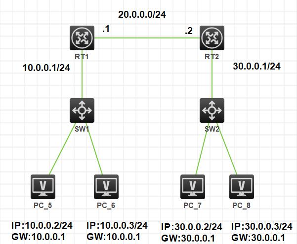

# 计算机网络基础（二）IP地址和网络服务器

上篇文章我们学习了计算机网络中非常基础的一部分知识，也就是 OSI 和 TCP/IP 相关的内容。今天我们的学习相对来说会更进一步，我们要继续学习 IP 地址相关的知识以及一些网络设备和服务器相关的知识。放心，内容都并不是很深，还是点到为止的水平。

## IP地址

对于 IP 地址来说，应该是我们在接触网络接触到最多的一个东西。不管你在家还是在公司，查看电脑上的 IP 地址大都会是一个 192.168.xxx.xxx 这样格式的数字。接下来，我们就来讲讲为什么会是这样一个格式。

一个 IP 地址，其实就是 32 Bit 的一段数据，一个 8 Bit 的数据表示一个字节，因此，IP 地址其实是由 4 个字节组成的。每一个 Bit 在第一篇文章我们就说过，它能表示两种状态，分别是 0 和 1 ，这样的话，其实我们每一个字节就可以表示从 11111111 到 00000000 的范围。转换成 十进制 也就是 255 到 0 。

相信聪明的你已经想到了，IP 地址的范围是 255.255.255.255 到 0.0.0.0 ，这种带点的 十进制 写法也叫做 点分十进制 。就拿我们最常见的局域网地址来说， 192.168.1.0 到 192.168.1.255 就表明当前这个网段可以有 255 个 IP 地址。如果设备超过了 255 台呢？那么我们可以再增加网段，比如说 192.168.2.XXX 这样。

IP 地址是有一定的结构分类的，一般来说会分为 A 至 E 共五类地址。

|   说明  | A类地址  |  B类地址   | C类地址  | D类地址  | E类地址  |
|  ----  | ----  | ----  | ----  |----  |----  |
| 地址格式  | N.H.H.H |  N.H.H.H   | N.H.H.H  | N/A  | N/A 
| 适用范围  | 大型组织 |  中型组织   | 小型组织  | 多目广播  | 保留  |
| 高位数字 | 0 | 10 | 110  | 1110  | 1111  |
| 地址范围  | 1.0.0.0 - 126.0.0.0 |  128.0.0.0 - 191.254.0.0  | 192.0.0.0 - 223.266.254.0  | 224.0.0.0 - 239.255.255.255 |240.0.0.0 - 254.255.255.255  |

除了这个表格之外呢，还有一些私有 IP 地址。

- A类 10.0.0.0 - 10.255.255.255

- B类 172.16.0.0 - 172.31.255.255

- C类 192.168.0.0 - 192.168.255.255

另外还有一个地址 127.0.0.1 是一个回环地址，你可以认为这个地址就是指向自己的这台电脑的。

好了，关于 IP 的内容就是这些，其实上面两个表格了解一下就好了。这一块的知识不是特别重点的内容。不像真正的 网络工程师 的考试，需要考察的全是这方面的内容，而且还有 子网掩码 和 IP 地址的计算之类的内容。这个 网络工程师 也是我们这个系列考试中的一门 中级资格 的考试。如果你是从事网管、运维之类的工作，可以考虑去尝试一下哦！

## IPV4 和 IPV6

上面学习到的 IP 地址其实就是我们最常见的 IPv4 形式的地址。应该很多人听说过，这个 IPv4 的地址不够用了，所以之后又出现了 IPv6 地址。那么为什么 IPv4 会不够用呢？其实从上面关于 IP 地址和二进制的转换我们就可以看出，32 Bit 的 IPv4 可以有 40 多亿个地址。但是，我们在 IPv4 中还划分了五类，后两类都是有特殊用途的，所以真正能够使用的 IPv4 的地址其实只有 30亿 个左右，也就是只包括 A类、B类和C类 的地址。看着还是很多吧？你再琢磨一下，一台手机要上网是不是要一个 IP 地址，一个家庭宽带也需要一个，更别说企业里面了。然后呢？光中国就有 14 亿人口啊，不敢说电脑人手一台，但现在手机真的已经普遍得不行了。你觉得 IPv4 的地址还够用吗？咱们还没算别的各种终端呢，POS机、ATM、手持互联网设备、工业互联网设备，想想都恐怖吧！

还好，大佬们通过各种技术解决了这个问题，比如说我们回家连上 Wifi ，所有出口 IP 都成了宽带的那个，而且当我们重新拨号了之后，这个 IP 还会变动，之前的可能会被回收给别的地方使用。另外，大部分企业也会有类似的情况，也包括我们的网站服务器等，都会采用一些内网编组减少出口和入口 IP 的方式来解决 IPv4 地址不够用的问题。

也正因为 IPv4 的这些问题，于是出现了 IPv6 这个新的协议。它的长度可就比 IPv4 大的多多了。IPv4 一共有 232 个 IP ，而 IPv6 采用的是 128 Bit ，也就是能达到 2128 个 IP ，你算算有多少。

约 3.4×1038 ！

是不是很嗨呀！据说比地球上的沙子还多，当然，这个东西我们也没法数到底是沙子多还是 IPv6 的地址多。这时，又会有一个问题，如果用 点分十进制 表示这个 IPv6 的话，也有点不合适了，这个数据会非常长。于是，IPv6 的表示方式就换成了 16 进制的。这也是 IPv6 最被诟病的一点，我们先来看一下 IPv6 的地址是什么样的。

fe80::8c78:6cef:b1a7:d16d%10

这不是乱码，这就是我的电脑上的 IPv6 地址。Oh My God！如果我们的运维或者网管用这玩意来组网，估计会崩溃的。也正因为如此，IPv6 目前还是在我们看不见的地方已经悄然普及了，但是，在家庭或者公司业务组网的时候，普遍的还是使用 IPv4 更为方便一些。除些之外，IPv6 还有一些别的特点，大家可以了解一下（仅了解即可）：

- 1）灵活的 IP 报文头部格式。使用一系列固定格式的扩展头部取代了 IPv4 中可变长度的选项字段。IPv6 中选项部分的出现方式也有所变化，使路由器可以简单路过选项而不做任何处理，加快了报文处理速度。

- 2）IPv6 简化了报文头部格式，字段只有 8 个，加快报文转发，提高了吞吐量。

- 3）提高安全性。身份认证和隐私权是 IPv6 的关键特性。

- 4）支持更多的服务类型。

- 5） 允许协议继续演变，增加新的功能，使之适应未来技术的发展。

## 网络设备

网络设备其实也是我们经常接触到的，主要工作在二、三层的硬件设备，比如说路由器和交换机。交换机有二层和三层两种，三层交换机是有一定路由功能的交换机。其实所谓的路由功能就是在这个硬件设备中有一个路由转发表，可以将指定的数据进行指定的转发。而普通的二层交换机是没这种功能的，也就是你只要把网线随便插在交换机的哪个口上，数据都可以互相传输，是一种广播形式的。

这张图是一个比较典型的组网图，RT 表示的是路由，SW 表示的交换机，PC 表示的是电脑或者各种终端。可以看到，一般情况下，我们的网线是接 路由 上的，然后 路由 转发给 交换机 ，交换机 的端口一般会比路由多很多，如果设备很多的话，可能还会有多层的 交换机 。这是使用 H3C 模拟器进行虚拟组网练习的工具，大家有兴趣的话可以自己去玩一玩，叫做 H3C Cloud Lab 。

现在，除了普通的路由之外，无线路由 也很普及了，也就是我们常说的 Wifi 。而在企业中，无线 AP 也是一个比较常见的设备，一般会挂在房顶或者墙上。它是 Access Point 访问节点的意思，其实也可以看做是一个 无线版的交换机 ，或者是 Wifi 的信号放大器。

除了 路由器 和 交换机 之外，物理层的中继器、集线器（Hub），数据链路层的网桥等，大家可以自己查阅下相关的资料。下面我们再来说一下与这些设备有关的一个数据交换形式的问题。

### 数据交换方式

在我们的互联网中，通信子网是由一些网络节点和链路按照一定的拓扑结构连接起来的。在这些网络节点中会有很多交换设备，它们不处理流经的数据，而只是简单地把数据从一个交换设备传送到另一个交换设备，直到达到目的地。在这个过程中，包括有几种非常典型的交换方式：

- 电路交换：分配固定带宽通信线路，线路利用率低，我们的电话线就是这种。

- 报文交换：存储转发方式，用于报文短、实时性要求较你的业务，比如电报、语音、传真等。

- 分组交换：存储转发式，在报文交换的基础上，分割分组传输，利用率比较高，它会将数据进行固定长度的切割。分组交换又演化出来了 帧中继 和 ATM 两种交换形式，ATM 是一种一步传输的数据传输方式，用于高速数据传输，价格相对来说也比较高，也是一种标记式传输，它和银行那个 ATM 机不是一回事哦！

除了这三种经典的数据交换方式外，还有两种技术我们了解一下：

- IP电话技术：使用 IP 技术传送语音业务，使用 H.323 系列协议，就是插网线的那种电话，企业里已经很普遍啦。

- 软交换技术：将呼叫控制功能从媒体网关（传输层）中分离出来，通过软件实现基本呼叫控制功能。

## 网络服务器

在比较早期的时候，我们都会将我们做好的网站程序放到一台真实的硬件服务器上，这个硬件服务器实际上就是一台比较贵的，比较吵的，而且比较抗造的电脑。然后这台电脑上一般会装有 Linux 或者是 Windows Server 这些服务器操作系统，并且配有一些 IIS、Apache、Tomcat、Nginx 之类的服务器软件，它们的作用就是运行我们写好的服务器代码，并且监听指定的服务提供端口，用于提供网站的服务。比如说，你现在访问的任何一个网站，基本上都是某一台服务器上运行的服务器软件所返回的内容，然后经过浏览器解析后变成了你看到的内容。

上述内容其实就是一个典型的 应用服务器 。除此之外呢，我们还有专门提供数据库功能的 数据库服务器 ，提供缓存功能的 缓存服务器 ，提供文件存储功能的 文件服务器 等等。

硬件服务器一般是需要寄存在机房，成本非常高，在当年来说成本其实还是不低的。如果出了问题还需要去机房解决，或者联系机房的运维帮忙查看情况，反正就是非常麻烦。而随着时代的进步，现在 云服务器 已经非常成熟了，成本低、方便维护、强大的技术支持，让云服务器成为了我们日常项目开发的首选。关于 云 的内容，我们后面还会再说。

一般来说，服务器的管理、运行、维护一般也是 网络工程师 的工作，或者现在比较通用的叫做 运维工程师 。

## 网络基础命令

最后，我们再来了解几个非常简单的网络命令。真的只是了解一下而已，我们不做过多的介绍，毕竟都是 Linux/Windows Server 中的常用命令，会的自然不用多说，不会的知道是什么意思就好啦。

- ping 这个命令很多人会用来测网络通不能，比如说我们最常用的就是直接去 ping www.baidu.com ，然后查看当前网络状态有没有丢包什么的。

- ipconfig 这个是 Windows 下面查看网络和网卡情况的，在 Linux 底下是 ifconfig 。

- nslookup 这个是查看域名 DNS 解析是否正常的命令。

- tracert 跟踪路由中转的命令，可以查看到目标中间跳转了多少个路由节点。

- netstat 这个主要是 Linux 下查看网络信息的命令，如网络连接、路由表、端口占用情况等。

## 总结

今天的内容其实重点不多，比较重要的是了解一下 IPv4 和 IPv6 的格式问题以及它们的区别。另外就是网络设备中 交换机 和 路由器 的区别，知道它们是工作在 OSI 中的哪一层就可以了。这些知识说实话，对于做开发的同学来说应该都是很基础的知道了。如果你不是开发人员，但是又特别想和开发人员搞好关系，了解这些术语会非常有助于让你和他们打成一片哦！

参考资料：

《信息系统项目管理师教程》

《某机构培训资料》
