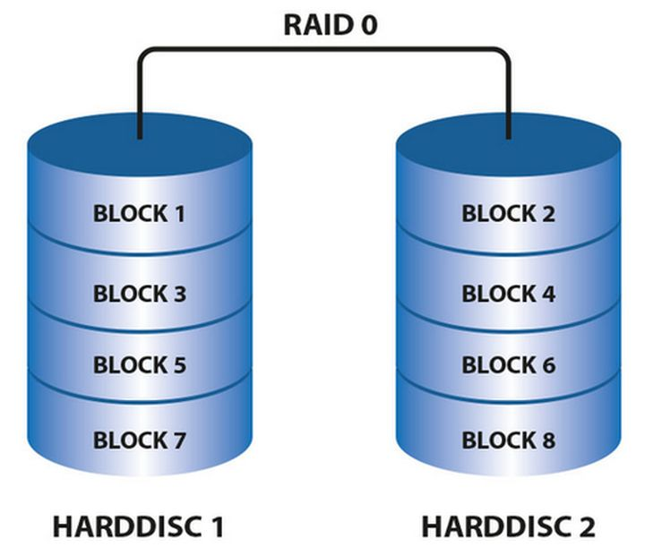
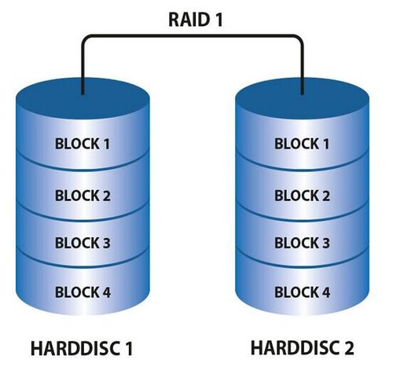
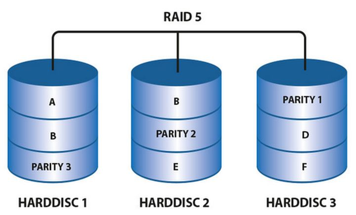
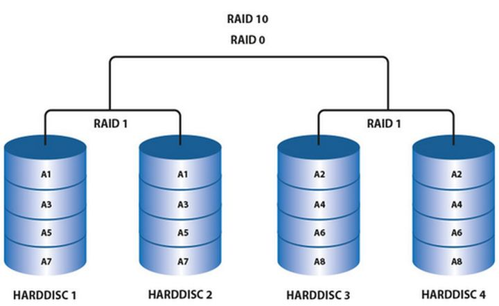
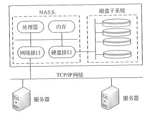
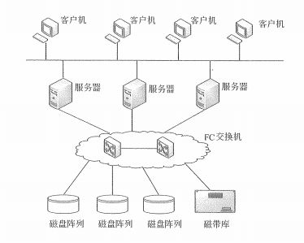

# 计算机网络基础（三）网络存储与网络接入 

大家不要急，网络这一块是非常重要的内容，所以我们的学习还要继续。在上一篇文章中们简单地学习到了 IP 的一些基础知识。其实最网络中最底层也是最核心的东西我们就已经学完了。后面将要学习的内容其实都是比较偏应用一些了。今天，我们先来学习一下存储和网络接入技术这两个部分的内容。

## 网络存储

提到存储，其实我们并不陌生，电脑里的硬盘、手机的内存，办公时的移动硬盘、U盘等等。这些都是存储设备。其实对于服务器来说也一样，我们的代码，我们的数据，最终都要落到硬盘上。

补充一个小知识：程序是怎样运行的？其实程序就是一些可以执行的命令，我们运行程序的过程是事先将硬盘上的文件加载到内存中，然后由 CPU 来进行调度执行。这个解释其实是过于简单了，但是可以让你一下就能搞清楚 硬盘、内存、CPU 这三大件之间的关系。知道为什么我们配电脑内存越大越好了吧，内存越大程序能加载缓存的内容越多，硬盘的读写就越少，自然会快一些。这些其实又牵涉到计算机相关的知识了，CPU 最快、完了是一、二、三级缓存、之后是内存，硬盘即使是现在的固态硬盘，读写速度和内存也是完全没法比的。关于这些内容，有兴趣的同学可以再去了解 计算机组成原理 和 操作系统 相关的知识。这些内容 信管师 不会考哦，了解一下就好。

在讲网络存储技术之前，我们先来了解一下非常基础的硬盘磁盘阵列的知识。这个也是比较基础的，主要记住几种阵列类型和它们的特点就好啦。

### 磁盘阵列技术

在单机时代，采用单块磁盘进行数据存储和读写的方式，由于寻址和读写的时间消耗，导致I/O性能非常低，且存储容量还会受到限制。另外，单块磁盘极其容易出现物理故障，经常导致数据的丢失。因此大家就在想，有没有一种办法将多块独立的磁盘结合在一起组成一个技术方案，来提高数据的可靠性和I/O性。在这种情况之下，RAID 技术就出现了。

RAID （ Redundant Array of Independent Disks ）即独立磁盘冗余阵列，简称为 磁盘阵列 ，其实就是用多个独立的磁盘组成在一起形成一个大的磁盘系统，从而实现比单块磁盘更好的存储性能和更高的可靠性。这主要包括：

1. RAID0

这种磁盘阵列是没有备份的，数据就是直接往两边的磁盘里存。下图中，BLOCK 就是数据块，可以看到这个就是一路向下存储下去的。它的执行效率比较高，因为数据是可以在阵列中同步向多个磁盘写入遥，所以会比单块磁盘的速度快。但是会有我们前面说的数据丢失的问题，如果有一块磁盘坏了，数据就丢失了。因此，RAID0 比较适合的是对可靠性要求不高的，对读写性能要求高的场景。它的磁盘利用率是 N 。

2. RAID1

RAID1 是有备份的存储方式，左右两边存储的 BLOCK 是完全一样的。这种方式有个啥问题呢？它的数据是确保能一个备份了，但是好像有点浪费资源呀，没错，资源利用率降低到了 50 %，同时速度也降低回去了。这是一种比较奢侈的方案，但是能确保数据的可靠性，所以它的适用场景正好和 RAID0 是相反的，适合于可靠性要求高，读写性能要求低的场景。它的磁盘利用率是 2N 。

3. RAID5

在上面的 RAID0 和 RAID1 是两种截然不同的方案，接下来要讲的呢，很明显就是要综合它们的方案，比如说这个 RAID5 。在这个模式中，备份校验不是一对一的，而是通过一定的算法采用奇偶校验的方式将数据并发地写到不同的磁盘上。从下面的图中，我们可以看出，数据会被分散出来，我们最少需要三块磁盘，这样可以允许坏一块磁盘，这块磁盘上的数据可以从其它另外两块磁盘上恢复回来。当然，如果同时坏了两块的话，那就无法恢复数据了。相对来说，它比 RAID0 有保障一些，同时又比 RAID1 稍微节省一点空间。因此，RAID5 是目前使用比较多的一种将存储性能、数据安全、存储成本都比较兼顾的方案。它的磁盘利用率是 (N-1)/N 。

4. RAID10

最后我们再来看的是 RAID10 ，也有的地方叫做 是 RAID1+0 ，看出来什么情况了吧。它是结合 RAID1 和 RAID0 ，比如下面这个图，我们是先做小的 RAID1 ，然后把两组 RAID1 再组合成 RAID0 。这货要说功能、性能、安全都没毛病，但最大的问题在哪里？贵呀！至少 4 块磁盘起步。

要是不差钱的话，RAID10 这货确实是最佳的选择，当然，还是要看具体的场景来分析。比如说，我们要是数据库服务器，那么数据的安全性和读取速度都非常重要，在不计成本的情况下，RAID10 肯定是最好的选择，否则的话，RAID5 也是不错的选择。而对于应用服务器或者缓存服务器来说，其实 RAID0 就可以用了，因为我们的代码一般都会多地保存，而且也会在代码服务器上存一份。所以说，对于 RAID 的选择，我们还是要根据实际的业务情况来说的。这一块了解一下就好，我也没做过这么复杂的，也都只是听说和看过相关的资料，有不正确的地方也欢迎大家补充。

### 网络存储技术

接下来就是网络存储技术。上面是物理磁盘相关的阵列技术，再往上，也就是到服务器级别，也会有相应的跨主机的网络存储技术。我们一个一个来了解下。

- 1）DAS 直连式存储

这个非常好理解，存储和计算放在一起。就像我们的个人 PC ，CPU 和 硬盘 都在我们的机箱里，DAS 就是这个意思。对于我们个人来说，换硬盘还好说，但是对于服务器来说，要换硬盘可就非常麻烦了，所以 DAS 的问题就在于如果需要增加容量时，会很难扩展。另外，当服务器压力大时，也会波及存储数据，因此，DAS 在服务器方面来说，已经越来越少使用了。

- 2）NAS 网络附加存储

NAS 网络附加存储其实就是一个专用的文件服务器，比如我们常见的网盘，或者做开发时经常会用的 OSS ，另外还有通过 NFS 之类的技术搭建的内网共享服务等。这种服务器以数据为中心，将存储与服务器分离。好处就是让计算和存储分离，保护数据，同时也可以实现即插即用的效果，通过远程挂载或者接口就可以快速地实现操作，非常简单，成本也会比直接上硬件更低。缺点呢，就是可能会有不安全的因素，特别是如果是远程的 NAS 服务器。另外就是会占用比较大的带宽，当然这也是针对外网来说的，不过内网带宽也是不能忽视的。

现在很多人会使用一些比较高端的路由也都会带一些简单的 NAS 功能，可以方便地让我们搭建一个非常简单的家庭 NAS 系统。其实就相当于一个网盘，这些路由可以外接硬盘，然后实现智能下载、远程上传等功能，相当于一个无时无刻都能使用的随身 U 盘。有兴趣的小伙伴可以了解一下哦。

- 3）SAN 存储区域网络

SAN 是通过专用高速网络将一个或多个网络存储设备和服务器连接起来的专用存储系统，它将存储设备从传统的以太网中分离了出来，成为独立的区域存储结构。

中间这个 FC 交换机呢，实际是一组 光纤 交换通道。因此，它的速度非常快，而且不是像 NAS 一样走 TCP/IP ，而是自建的通道，稳定性和安全性也有所保障。本身 SAN 就是一大组非常庞大的存储区域。在 SAN 中，又有几种分类：

FC SAN ：就是上图这种架构，通过接口（SCSI、FC）、连接设备（交换机、路由器）和协议（IP、SCSI）三个组件再加上附加的存储设备和服务器就组成了 SAN 系统。它的特点是热插拔性、高带带宽、远程连接、连接设备数量大。缺点嘛就是成本和复杂性。光纤设备可不便宜呀，不过它是单独的光纤通道，不占用普通局域网带宽，速度也是最快的。

IP SAN ：主要是指 iSCSI（Internet SCSI），其实就是使用了 TCP/IP 协议的 SAN ，通过在 IP 网络上运行 SCSI 协议，就可以既具备 IP 网络配置和管理简单的优势，又提供了 SAN 架构所拥有的强大功能和扩展性。

IB SAN ：InfiniBand 无限带宽，是一种交换结构 I/O 技术，其设计思路是通过一套中心机构（IB交换机）在远程存储器、网络以及服务器等设备之间建立一个单一的连接链路，并由IB交换机来指挥流量。这个大家了解一下即可。

网络存储的目的都是为了扩大存储能力，提高存储性能。这些存储方式都可以集中化地进行数据存储并有效提取文件；支持跨平台和多用户；NAS 和 SAN 更能让存储和计算应用分离，保证数据的高可用性。在实际的业务开发过程中，还是要根据实际情况选择合适的网络存储方式，就和前面讲的那几种 RAID 一样，没有最好的，只有最合适的。

## 网络接入

网络接入技术指的呢，就是我们怎么上网的方式。哇塞，这东西还需要学？不是叫电信或者联通的过来就搞定了，我们只交个钱就行了。 好吧，也没毛病，不过考虑的时候可不会问你哪家的宽带便宜。网络接入技术呢，其实我们都会多少听过一点，比如说最早的拨号上网，然后 ADSL ，再到现在普遍的光纤，我们一个一个来看看。

1. PSTN 接入

Public Switching Telephone Network ，公用交换电话网络，很明显，利用电话线拨号接入 Internet，通过计算机需要安装一个 Modem（调制解调器，猫），拨号的时候会发出像打电话拨号的声音。早些年上网的同学们一定接触过，比如说当年上初中的时候给我老妈干掉了 200 块的电话费，01、02年左右的 200 块哦！这玩意现在已经淘汰了，速度太慢，一般不会超过 64Kb/s ，仅仅只有一些传真或者POS机会使用，不过也越来越少了，传真和 POS 机现在都已经是走网络的了。

2. ISDN 接入

Integrated Services Digital Network，综合业务数字网，也是在电话网络的基础上构造的通信，不过是纯数字网络，能够为用户提供语音、数据、图像和传真等一系列的综合业务。速度比纯电话接入有所提升，最快能达到 2Mb/s 。

3. ADSL 接入

Asymmetrical Digital Subscriber Loop，非对称数字用户线路，使用了时分利用的技术，也是我们最早称为 “宽带” 的网络。当时说拉条宽带基本上都是指的这个 ADSL 网络。它的速率可以达到最快 8Mb/s 的下行速率和 1.5Mb/s 的上行速率。这个可以说是在我们国内的网络时代占据了非常长的时候，而且，我们现在熟知的 BAT 等巨头都是在 ADSL 时代正式崛起的。

4. FTTx+LA 接入

FTTx 是光纤，LAN 是局域网，这个技术也就是 光纤+局域网技术，也就是我们现在比较普遍的光纤上网方式。速度不用说了，最高下行可以达到千兆也就是 1000Mb/s ，所以我们现在去办都会是 100M 或者 200M 的宽带。使用的线也是非常细的那种光纤线，大家可以仔细看看自己家里现在的猫接的都是什么样的线哦。

根据光纤深入用户的程度可以分为五种，分别是 FTTC（Fiber To The Curb，光纤到路边）、FTTZ（Fiber To The Zone，光纤到小区）、FTTB（Fiber To The Building，光纤到楼）、FTTF（Fiber To The Floor，光纤到楼层）、FTTH（Fiber To The Home，光纤到户）。

5. HFC 接入

这个呀，说实话用得人会少些，不过确实还真的有。它利用的是我们的有线电视网络，也就是那个圆圆的粗粗的电视线，这个现在也已经发展为 光纤同轴电缆 了，所以它也是可以提供到 光纤 网络的接入水平的速率。在我们国内，只有去找有线电视服务商才能这种网络提供，比如北京的歌华有线当时就问过我们家是不是需要办这个网络套餐。相对来说，普及率没有三大运营商的光纤网络高。最最主要的问题是，三大运营商现在办宽带都送电视盒了，这玩意对有线电视网络打击很大呀！

6. 无线接入

无线网络我们在前面讲过 Wifi ，当时提到过 802.11 这个协议也就是我们的无线网络协议，然后在那里看了一下有线的 802.3 的几个小的协议分类。在这里，我们再补上 802.11 的几个小的网络分类，比如上次截图中我的电脑上的 802.11n 。

|  协议     |  速度   | 工作频率（无线信道）  |
|  ----  | ----  | ----  |
| IEEE 802.11a  |  54Mb/s   | 5GHz  |
| IEEE 802.11b  |  11Mb/s   | 2.4GHz  |
| IEEE 802.11g  |  54Mb/s   | 2.4GHz  |
| IEEE 802.11n  |  600Mb/s   | 2.4GHz、5GHz  |
| IEEE 802.11ac  |  1000Mb/s   | 2.4GHz、5GHz  |
| IEEE 802.11ax  |  4800Mb/s   | 2.4GHz、5GHz  |

我们买无线路由的时候，常常会有商家说我这是第几代路由，看上面这张图，大家就能看出来，现在最新的 802.11ax 就是传说中的第六代路由协议，理论速度可以达到局域网内 4.8G 的传输速率。而我的路由是大概三年前 2019 年买的小米路由，使用的是 802.11n 的四代协议。

至于无线信道这个 2.4GHz 和 5GHz 的概念，大家可以自己去百度了解下，一般来说，2.4GHz 范围更广，5GHz 速度更快。当然，这只是一般来说有这么个说法而已。具体应该如何选择信道其实是挺复杂的一门学问，大家在家里日常使用的话，无所谓啦！

无线网络加密，也就是我们无线 Wifi 的密码通常是什么 WEP、WPA 和 WPA2 这三种方式，同样的，了解一下，有兴趣的自己查查。一般来现在比较流行的是 WPA/WPA2 混合加密这种形式。这个一般在路由设置界面都可以自己设置的。

接下来，我们再简单聊聊移动网络。没错，就是现在最火的什么 4G 、5G 这些。

## 移动网络

最后我们再单独讲一下这个移动网络。相信不少同学都经历过 2G、3G、4G 的网络时代，现在也总算来到了 5G 时代，我们就一起来回顾一下这一步步走来的经历。

首先是最早的电话网络时代，其实也就是大哥大时代，能打电话就不错了，手机更是奢侈品。当手机普及后，信号也进入了数字时代，这个就是我们最早的 2G 网络，一般也就 10Kb/s 的速率，最高能到 100Kb/s 。之后，GPRS 出现了，GPRS 的中文名称为通用无线分组业务，是一种基于GSM系统的无线分组交换技术，提供端到端的、广域的无线IP连接。它是一种 2.5G 的技术，是迈向 3G 通信的重要一步，速率没有显著的提升。在 2.5G 中，还有一个很重要的分支，也就是当年的小灵通，属于的是 CDMA 网络，这个网络和后面的 3G 网络也有很大的关系。

3G 网络可以说是移动网络发展的一个分水岭，为什么这么说呢？因为 3G 网络彻底打开了移动互联网时代。3G 网络的速率最高能达到 2Mb/s 。并且更重要的是，在 3G 领域有了我们自己的技术，也就是 TD-CDMA 。当年，中国移动使用的是 TD-CDMA ，联通是 WCDMA ，电信是 CDMA2000 ，这三种技术也是 3G 网络的三种国际通用技术标准。

到了 4G 网络时代， 传输的速率最高可以达到 100Mb/s ，这个时代又开启了一个什么时代呢？没错，就是我们现在的小视频和短视频时代。移动网络已经可以达到和有线网络差不多的速度水平，也就意味着很多事情真的完全可以用手机来完成了。4G 的核心技术是正交频分利用（OFDM），典型的国际通用标准包括：LTE、WIMAX、HSPA+ 以及我们中国的 TD-LTE 。

最后就是现在的 5G 时代，相信各位已经有不少人的手机都已经换到 5G 手机了吧。5G 的理论最大速率可以达到 10Gb/s 以上，用户体验速率可以达到 1Gb/s 。是不是非常吓人，我们每一次的网络技术的进步都是以非常夸张的形式在加快，那么 5G 能为我们带来什么改变呢？智能汽车、工业互联网、智能制造，未来无限可能。

## 总结

这一节我们学习了两个非常大的内容，一个是网络存储，一个是互联网接入技术。在网络存储中，我们还介绍了一个 磁盘阵列 RAID 相关的知识，这一块是需要大家能说出这几种 RAID 的区别联系的。同样地，那几种网络存储内容也有一定的了解，起码看到 DAS、NAS、SAN 这些能马上明白什么意思。网络接入技术中，也是几个名词 ADSL、光纤、Wifi 以及 3G、4G 网络这些的含义。

其实今天的内容都没有很复杂的东西，就是一大堆名词而已。实在没接触过的还是那句话，硬记下来吧！

关于 RAID 相关的内容，下面的链接有更详细的说明，大家可以去看看。

参考资料：

RAID磁盘阵列是什么（一看就懂）：[https://zhuanlan.zhihu.com/p/51170719](https://zhuanlan.zhihu.com/p/51170719)

《信息系统项目管理师教程》

《某机构培训资料》

