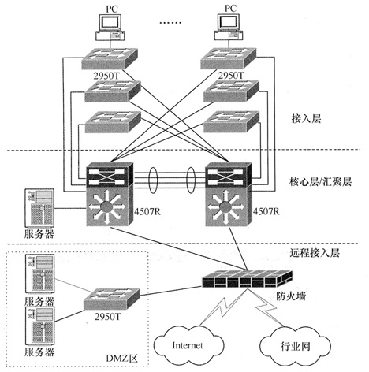

# 计算机网络基础（四）网络规划与数据软件

在之前的课程中，我们已经学习了基础的网络知识，IP地址的知识，网络存储和网络接入相关的知识。是感觉到意犹未尽呢？还是想赶紧远离这个大魔王赶紧学习其它的内容呢？别急，我们还差最后的一点东西没说完。

## 数据系统

上回我们已经介绍过了专门的文件服务器也就是 NAS ，接下来我们就先来了解一下数据库相关的知识。其实对于一个信息系统来说，NAS 和 SAN 都不是最核心的，因为我们直接使用硬盘 DAS 形式来存储数据也是没有任何问题的。而数据库肯定是要存在的，另外后面我们要讲的中间件也就是一些程序代码服务器也是必需的。有了这两个东西，才能说一个可互联的信息系统才是成立的。

### 数据库系统

对于数据库系统来说，如果你不是做开发的同学，那么就把他想象成一个 Excel 表格，只不过是非常庞大的 Excel ，有着很高的稳定性和安全性。现代的主要数据库都是关系型数据库，比较出名的包括 Oracle 、MySQL 和 SQLServer 三个。Oracle 公司除了拥有 Oracle 数据库这个产品外，还拥有 MySQL 这个开源数据库以及 Java 编程语言。而 SQLServer 则是微软公司的产品。在普及率方面来说，因为 MySQL 的开源免费优势，普及率是最高的，而 SQLServer 和 Oracle 一般会用于政府及银行系统，毕竟收费的提供的服务以及安全和稳定性会更胜一筹。

除了传统的关系型数据库外，现在还有比较流行的键值数据库 Redis ，还有文档型数据库如 MongogDB ，大数据处理的列式数据库 HBase 等等。

### 数据仓库技术

前面我们已经提到了一个列式数据数 HBase ，这种数据库对于聚合查询运算相较于普通的关系型数据库有非常明显的优势。啥叫聚合运算？就是 SUM、AVG、COUNT 这一类的查询。因此，这一类数据库也经常会用于 数据仓库 技术中。学过大数据开发的同学可以跳过这一节。

在了解 数据仓库 是一个什么概念前，我们先来了解一些名词。

- ETL（Extract/Transformation/Load，清洗/转换/加载）：从数据源抽取出所需要的数据，经过清洗、转换，按照定义好的数仓模型加载到 数据仓库 中。其实这个过程就是将数据从异构转为同构的过程，比如在大数据开发中我们的数据源有日志、数据库、缓存等不同的源，就需要将它们统一成一致的格式放到数仓中。

- 元数据：有关数据源目标定义，转换等相关的关键数据，包括数据仓库表的结构、数据仓库表的属性等等。

- 粒度：保存数据的细化或综合程度的级别。

- 分割：结构相同的数据被分成多个数据物理单元。

- 数据集市：小型的，面向部门或工作组级数据仓库。

- ODS（Operation Data Store，操作数据存储）：能支持企业日常的全局应用的数据集合，是不同于 DB 数据库的一种新的数据环境。

- 数据模型：逻辑数据结构。

- 人工关系：在决策支持系统环境中用于表示参照完整性的一种设计技术。

了解了这些名词之后，我们再来看一下 数据仓库 的含义。数据仓库是一个面向主题的、集成的、非易失的、且随时间变化的数据集合。它专门用于支持管理决策。其实说白了，就是我们现在最流行的大数据系统。另外，上面的这四个单词，面向主题的、集成的、非易失的、随时间变化的，比较重要，可以记下来。

对于数据仓库，下面这张图是不得不说的。

- 1）数据源：我们前面就说过，数据源的来源可以有很多，而且数据源是整个数据仓库系统的基础。数据来源包括但不限于日志、数据库、缓存、外部采集、数据爬虫等等。ETL 在大数据里有很出名的日志收集方案 ELK （Elasticsearch+Logstash+Kibana）  

- 2）数据的存储与管理：这个就是我们在经过 ETL 之后保存下来的格式化之后的数据，也就是图中中间那个圆柱的位置。除了统一的数据仓库外，还可以根据部门或者业务所需的数据不同再拆分成小的部门级的数据仓库，也称数据集市。非常典型的就是 HBase 。

- 3）OLAP 服务器：对分析需要的数据进行有效集成，按多种模型予以组织，以便进行多角度、多层次的分析，并发现趋势。这一步就是我们前面说的聚合计算的过程。这个也不多介绍，Spark、Flink 。

- 4）前端工具：主要包括各种查询工具、报表工具、分析工具、数据挖掘工具以及各种基于数据仓库或数据集市的应用开发工具。例如 Hive 、Pig 、前端echarts 等等。

这张图很重要，图中每个部分的概念也很重要，我举的例子不重要，这些是现在大数据中的一些开发框架和工具，教材里是没有提及的。

## 中间件技术

这里的中间件不是我们经常说的代码中的那种中间件，当然，代码框架中的也算。这里的中间件的范围更广一些，指的是一种独立的系统软件或服务程序，分布式应用软件借助这种软件在不同的技术之间共享资源，中间件位于客户机服务器的操作系统之上，管理计算资源和网络通信。它有几种类型，一看到下面这些类型的描述，如果是做过开发的同学一定马上就能明白了。

- 1）底层型中间件，包括 JVM（Java虚拟机）、CLR（.NET 需要的公共语言运行库）、JDBC（这玩意还需要解释？）、ODBC（.NET 阵营对应JDBC的存在）

- 2）通用型中间件，包括 J2EE、COM 等。

- 3）集成型中间件，包括 WebLogic、WebSphere 等。

如果你不是开发人员，也没关系，稍微了解一下就好，这一块并不是特别重点的地方。

## 网络规划

接下来我们就要说说网络规划这一块了。这里要讲的可不是我们家里简单地接个路由就好了，而是比较偏企业的网络规划和布线。首先，我们来看看网络规划包括哪些内容。

需求分析。调查用户网络建设的背景、必要性、上网的人数和信息量等，然后进行纵向的、更加深入地需求分析与调研，在确定地形、设备类型、网络容量、网络现状等基础信息的基础上形成分析报告，为后续网络设计提供依据。

可行性分析。通常从技术可靠性、经济可行性、操作可行性等方面进行论证。

对现在网络的分析与描述。如果是在现有网络基础上进行升级，那就要对现有网络系统进行调研，类似于上述的需求分析。

### 网络设计

进行完网络规划之后，我们就进入到了网络设计的步骤中，在这里，我们一般会对网络采取一种 **分层** 形式的设计。主要是引入三种关键层的概念，分别是 **核心层**、**汇聚层** 和 **接入层** 。

网络中直接面向用户连接或访问网络的部分称为接入层，允许终端用户连接到网络。在图中的 PC 和 服务器 都是这一层。

汇聚层是 核心层 和 接入层 的分界面，完成网络访问策略控制、数据包处理、**过滤**、寻址，以及其他数据处理的任务。汇聚层需要更高的性能，更少的接口和更高的交换效率。

核心层的主要目的在于通过高速转发通信，提供优化、可靠的骨干传输结构，核心层交换应拥有更高的可靠性，性能和吞吐量。

分层设计是网络设计的一个主要概念，在图中，我们可以看到有个 DMZ 区，一般称为 “隔离区” 或者 “非军事化区” 。它是为了解决安装防火墙后外部网络的访问用户不能访问内部网络服务器的问题，而设立的一个非安全系统与安全系统之间的缓冲区。也就是说，我们外网用户要访问公司内网数据服务时，需要通过这个 DMZ 区来确认安全情况。

上述层次设计只是整个网络设计工作中的一部分，整个网络设计还包括：

- 1）网络拓扑结构设计。物理拓扑结构的选择往往和地理环境分布、传输介质与距离、网络传输可靠性等因素紧密相关。

- 2）主干网络（核心层）设计。主干网技术的选择，根据需求分析中用户方网络规模大小、网上传输信息的种类和用户方可投入的资金等因素来考虑。

- 3）汇聚层和接入层设计。

- 4）广域网连接与远程访问设计。根据网络规模大小、网络用户的数量，来选择对外连接通道的技术和带宽。

- 5）无线网络设计。

- 6）网络安全设计。机密性、完整性、可用性、可控性、可审核性。

- 7）设备选型。

### 综合布线

书上关于网络规划的内容其实就是上述那些，不过很多教辅资料以及辅导课程都会讲到一个综合布线系统。最主要的就是下面这张图。

我们依次来看这一大堆的子系统是干嘛用的。

建筑群子系统。这个就是我们办公大楼的设备间，其实对应我们上一篇课程中的光纤接入类型来说就是 FTTB （光纤入楼）。

设备间子系统就是我们所说的机房。我们的入网接入，猫、路由、核心交换机之类的设备可能都会放在这里。

垂直干线，很明显，就是垂直连接各个楼层的线路。从设备间的核心设备出发，达到各楼层的管理间。

管理间子系统，这个其实就是每个楼层对应的小机房，可能会放当前楼层的交换机。通过管理间再将网线拉到各个办公区。

水平干线子系统，也叫水平布线，从楼层管理间交换机中水平拉出的网线。可能达到各个办公区的末端交换机上，或者直接连接终端。

工作区子系统，最后要连接到终端电脑上的最后一步，也就是你的工位下的网线。

这六个子系统很重要，需要记下来，特别是它们的作用和顺序。这个图也是比较重要的，整个综合布线这一块最好都能记住。不过在现实中，我们很少会有这么大规模的布线，很多情况下，中小型企业可能也就是一层楼的办公室或者很小的办公区，远没有这么复杂。所以大部分情况下可能我们是直接从建筑群到设备间（机房）然后就直接到水平干线或者工作区了。

### 机房分类

电子信息系统机房应划分为 ABC 三级，这个了解一下就可以了，其中：

A类：对计算机机房的安全有严格的要求，有完善的计算机机房安全措施。

B类：对计算机机房的安全有较严格的要求，有较完善的计算机机房安全措施。

C类：对计算机机房的安全有基本的要求，有基本的计算机机房安全措施。

### 高可用性和高可靠性的规划与设计

可用性（availability）是系统能够正常运行的时间比例。可靠性（reliability）是软件系统在应用或在系统错误面前，在意外或错误使用的情况下维持软件系统的功能特性的基本能力。高可用性（High Availability）通常用来描述一个系统经过专门的设计，从而减少停工时间，保持其服务的高度可用性。

计算机系统的可用性用平均无故障时间（MTFF）来度量，即计算机系统平均能够正常运行多长时间，才发生一次故障。这个值对于做开发的同学其实并不陌生，就是我们常说的几个 9 ，比如说年故障率 4 个 9 就是 ，0.9999 的概率出故障。可维护性用平均维修时间（MTTR）来度量，即系统发生故障后维修和重新恢复正常运行平均花费的时间。计算机的可用性最终可定义为：MTTF/(MTTF+MTTR)*100% 。

想要提高一个系统的可用性，要么提升系统的正常工作的时长，要么减少故障修复时间。常见的可用性战术如下：

- 错误检测：用于错误检测的战术包括命令/响应、心跳和异常。

- 错误恢复：用于错误恢复的战术包括表决、主动冗余、被动冗余。

- 错误预防：用于错误预防的战术包括把可能出错的组件从服务中删除、引入进程监视器。

## 总结

今天的内容主要是了解一下数据库、数据仓库和中间件，以及网络规划相关的内容。数据仓库和那张图以及网络综合布线这两块是比较重点的内容。网络设计中的分层设计的这三层也是需要记忆的内容，其它的内容了解一下就可以了。

恭喜各位，计算机网络相关的内容我们在这篇文章就介绍得差不多了。接下来就准备迎接我们的另一个大魔王：软件工程。相信你的坚持一定会有所收获，即使不是为了考试，我们学习过的这些内容也一定会为你扩展出更多的知识边界，继续加油努力吧。

参考资料：

《信息系统项目管理师教程》

《某机构培训资料》