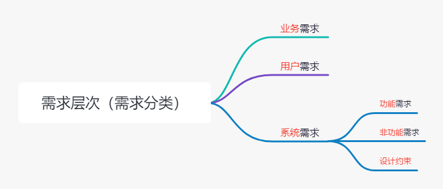
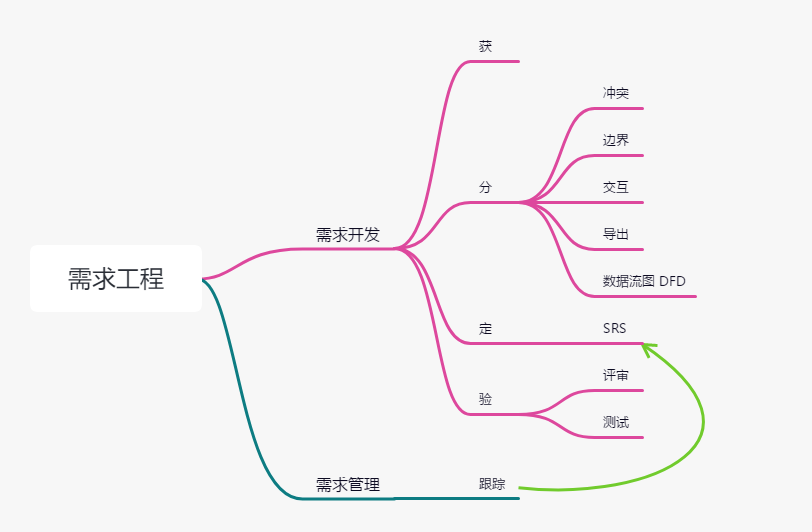

# 软件工程（一）需求工程

在软件工程的第一课中，我们要学习的就是需求。需求这个东西太重要了，因为在大部分失败的项目中，需求有误都是最主要的一个失败原因。具体的需求问题可能包含方方面面，可能是客户都搞不清楚他们想要什么，也可能是开发团队的理解有误，也有可能是技术实现问题。总之，需求非常重要。传统的软件工程中，需求都是非常重要的一个章节。不过在现在的真实业务开发中，需求这一块更多是由 产品经理 来把控，项目经理或者技术人员往往是和产品经理来进行沟通的。虽说可能需求分析对于现在的我们来说接触得比较少了，但是，对于软件工程这个学科来说，依然是一个核心的内容。因此，今天整篇文章的内容都是重点！

我们先来看一下需求的定义：

**软件需求是指用户对新系统在功能、行为、性能、设计约束等方面的期望。要满足合同、标准、规范或其他正式规定文档所需具有的条件或能力。**

这个定义还是比较官方的，不过考试可不就是考这种官方的内容嘛。同样的，需要记住定义中的中间那几个关键点。

## 需求的层次

说完定义，我们就来看看需求的层次。需求是多层次的，包括：

- 1）业务需求。指反映企业或客户对系统高层次的目标要求。通过功能、性能、设计的定义来回答软件中的 “为什么” 。

- 2）用户需求。描述的是用户的具体目标，或用户要求系统必须能完成的任务。用户需求描述了用户能使用系统来做些什么。

- 3）系统需求。从系统的角度来说明软件的需求，包括功能需求、非功能需求和设计约束。功能需求是必须在系统中实现的软件功能；非功能需求是系统必须具备的属性或品质（可维护性、效率等）；设计约束也称为限制条件或补充规约，通常是对系统的一些约束说明。

这张图和上述的概念定义务必记住，没有为什么，考试重点，不考试的嘛，了解一下咯，对于我们真实的业务开发也是很有用的。比如说我们就可以区分出哪些需求是功能性的，哪些是非功能性的，在开发过程中可以根据这些区分进行更好的需求排序和安排。

## 质量功能部署

质量功能部署（Quality Function Deployment，QFD）是一种将用户要求转化成软件需求的技术，其目的是最大限度地提升软件工程过程中的用户满意度。为了达到这个目标，QFD将软件需求分为三类，分别是常规需求、期望需求和意外需求。

如果学习过之前我的敏捷系列的文章，一定会记得有一个 Kano 分析。QFD 跟这个 Kano 分析 基本上是一个意思，大家可以过去看看哦！**【敏捷3.3】价值的优先级** [https://mp.weixin.qq.com/s/E0kayc8pFbZDGuRpzyH18w](https://mp.weixin.qq.com/s/E0kayc8pFbZDGuRpzyH18w)

## 需求开发

需求工程最主要的就是 需求开发 和 需求管理 两个方面。需求管理其实没有太多好说的，就是持续追踪 需求开发 中生成的 需求规格说明书（SRS） 里面的需求情况。因此，我们重点要看的就是 需求开发 相关的内容。它包含下面这四个步骤。

### 需求获取

需求获取是一个确定和理解不同的项目干系人的需求和约束的过程。主要的获取方法包括用户访谈、问卷调查、采样、情节串联板、联合需求计划、现场观察、历史文档等等。需求获取是一件看起来简单但做起来很难的事情，需要与用户进行有效的合作才能成功。

### 需求分析

我们通过需求获取拿到的用户需求是很杂乱的，是用户对系统的期望和要求，这些要求有重复或者矛盾的地方，是不能作为软件设计的基础的。因此，我们就需要需求分析的步骤，用来获取完整、一致、可测试、确定、必要的需求，这个过程就是需求分析。一般会使用实例关系图（E-R图）表示数据模型，描述实体、属性；数据流图（Data Flow Diagram，DFD）表示功能模型，描述系统内各个部件的功能和数据传递情况；用状态转换图（State Transform Diagram，STD）表示行为模型，描述系统的状态和引起系统状态转换的事件行为。这三个图中，大家要记住 数据流图 是在需求分析中使用的就可以了，有兴趣的同学可以自己去搜一下这三种图长什么样子的。

需求分析最主要的作用包括：

- 检测和解决需求之间的 **冲突**。

- 发现软件 **边界** ，以及软件与其环境如何 **交互** 。

- 详细描述系统需求，以 **导出** 软件需求。

### 需求定义

需求定义最主要的工作就是要编制一个 软件需求规格说明书（Software Requirement Specification，SRS），这个是需求开发活动的产物，让所有相关方对需求都有一个一致的理解，并且这个 SRS 会成为整个开发工作的基础。SRS 也是我们前面提到的 需求管理 的依据。

根据国家标准 GB/T 8567-2006 标准，SRS 应该包括：范围、引用文件、需求、合格性规定、需求可追踪性、尚未解决的问题、注解、附录等方面的内容。至于我们的实际业务中，还是看组织、公司和团队的具体情况吧，适合自己的才是最好的。 

### 需求验证

最后就是需求验证，在这一步中，最主要的就是  需求评审 和 需求测试 这两个工作。需求评审就是对 SRS 进行技术评审，消除有问题的二义性需求。需求测试则是查漏补缺，及早发现问题的过程。

## 总结

在课程文章的开头我们就已经说过，今天的内容全部都是重点。所以就不要抱侥幸心理了，都记下来吧。最核心的其实是需求的层次，也就是需求的分类，另外还有需求开发的四个步骤，我们可以用 “获分定验” 来快速记忆。同时，也可以借助下面这个思维导图来记住需求开发的重点。

参考资料：

《信息系统项目管理师教程》

《某机构培训资料》