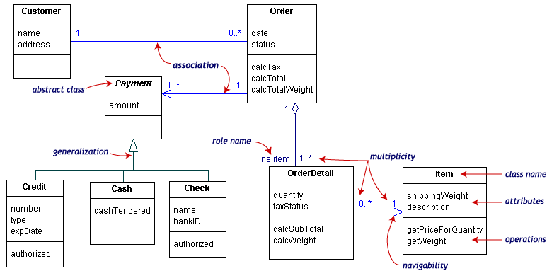
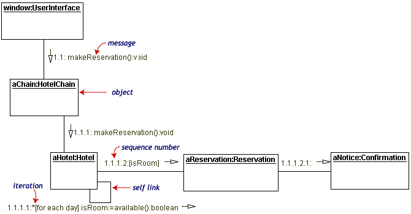
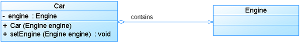

# 软件工程（二）UML与面向对象分析

软件工程的第二篇文章，依然还是跟需求相关的内容，依然也全部都是重点。而且这一部分的内容会更偏技术一些。在需求采集分析结束之后，形成了 SRS ，接下来就是再将需求转化成开发人员的需求，也就是技术语言描述的需求。在这里，我们会使用 UML 这种图形语言进行系统的描述，同时 UML 也是面向对象的，因此，紧接着我们就可以进行面向对象的分析，从而为系统架构的搭建做好准备。

## UML

UML 是一种定义良好、易于表达、功能强大且普遍适用的建模语言，它的作用不仅限于支持 OOA 和 OOD ，还支持从需求分析开始的软件开发的全过程。从总体上看，UML 包括构造块、规则和公共机制三个部分。其中在构造块中，包括事物（thing）、关系（relationship）、和图（diagram）。

### 事物

主要就是对现实世界的抽象，也称为建模元素，包括结构事物、行为事物、分组事物和注释事物。其实事物就是我们要操作的对象，包括类、接口、协作、用例、活动、构件、节点等，也包括交互和状态机。（了解即可）

### 关系

UML 用关系把事物结合在一起，主要有下列四种关系：

- 1）依赖（dependency）：一个事物的发生变化会影响另一个事物的语义。

- 2）关联（association）：描述一对对象之间的连接结构关系，也是语义上的联系。

- 3）泛化（generalization）：描述特殊元素的对象可以替换一般元素的对象。其实就是 继承 的一种反关系。之前我们就说过，子类继承父类，父类泛化子类。

- 4）实现（realization）：类之间的语义关系，一个类指定了由另一个类保证执行的契约。一般我们会说子类实现了父类的抽象方法，或者说类实现了接口方法。

### 图

UML 主要的表现形式就是各种各样的图，从图的动静表示来看，可以分为 动态 和 静态 两种类型的图。

#### 1. 静态图包括如下 7 种。

**类图**：给出了系统的静态设计视图。在系统建模中，最常见的就是类图，主要是描述一组类、接口、协作和它们之间的关系。

**对象图**：给出系统的静态设计视图或静态进程视图。对象图就是不显示方法属性的类图。

包图：描述由模型本身分解而成的组织单元，以及它们之间的依赖关系，比如类图更细。

组合结构图：描述结构化类的内部结构，用于画出结构化类的内部内容。

构件图：描述一个封闭的类和它的接口、端口，以及由内嵌的构件和连接件构成的内部结构。用于表示系统的静态设计实现视图。

**部署图**：描述对运行时的处理节点及在其中生存的构件的配置。在下图中，大框内部带在左侧带两个小长方形的就是 构件图 ，整个一起就是 部署图 。

制品图：描述计算机中一个系统的物理结构。

#### 2. 动态图包括以下 7 种。

**用例图**：描述一组用例、参与者与它们之间的关系。给出系统的静态用例视图。描述需求。用例图最明显的特征是里面一定有小人，然后用例都是椭圆形的。

**顺序图/序列图**：是一种交互图，展现了一种交互，由一组对象或参与者以及它们之间可能发送的消息构成，是强调消息的时间次序的交互图。顺序图肯定有消息从左向右传递的过程，有很多图也会有消息从右向左返回的过程。微信、支付宝的支付接入文档中都有这个时序图的展现。

**通信图/协作图**：也是一种交互图，强调收发消息的对象或参与者的结构组织。它与通信图的区别就是没有顺序的概念，而是一种对象之间的组织结构。

定时图：一种交互图，强调消息跨越不同对象或参与者的实际时间，而不仅仅只是关心消息的相对顺序。

**状态图**：描述一个状态机，它由状态、转移、事件和活动组成，给出了对象的视力，强调事件导致的对象行为，这非常有助于对反应式系统建模。在状态图中，我们会看到当前的状态、以后的状态，以及触发的条件。

**活动图**：将进程或其他计算结构展示为计算内部一步步的控制流和数据流，专注于系统的动态视图。活动图其实非常类似于 产品经理 或者我们在进行业务分析时画的的 流程图 。

交互概览图：是活动图和顺序图的混合物。

以上 14 种 UML 相关的图，我们给出了图示的都是重点要关注的，要能够看到类似的图就知道它是什么图。其它的只需要了解它是属于静态还是动态图就好了。

### UML 视图

UML 对系统架构的定义是系统的组织结构，包括系统分解的组成部分，以及它们的关联性、交互机制和指导原则等提供系统设计的信息。具体来说，就是指以下 5 个系统视图：

1）逻辑视图，即类、子系统、包和用例实现的子集。

2）进程视图：它是逻辑视图的一次执行实例，描述了并发与同步结构。

3）实现视图：对组成基于系统的物理代码的文件和构件进行建模。

4）部署视图：把构件部署到一组物理节点上，表示软件到硬件的映射和分布结构。

5）用例视图：最基本的需求分析模型。

## 面向对象分析

OOA，面向对象分析，它的基本任务是运用 OO 方法，对问题域进行分析和理解，正确认识其中的事物及它们之间的关系，找出描述问题域和系统功能所需的类和对象，定义它们的属性和职责，以及它们之间的各种联系。核心工作也是两个，建立系统使用的 用例模型 和 分析模型 。

### 用例模型

用例方法是一种动态的需求合成技术，先获取需求，记录下来，然后从这些零散的要求和期望中进行整理与提炼，从而建立用例模型。用例模型以 用例图 为主要表现形式。它包括四个阶段：识别参与者、合并需求获得用例、细化用例描述、调整用例模型。其中前三个阶段是必需的，但是第四个阶段有一个很重要的概念，就是用例之间的关系，它包括以下三种关系。

- 包含关系（include）。当可以从两个或两个以上的用例中提取公共行为时，应该使用包含关系。

- 扩展关系（extend）。如果一个用例明显地混合了两种或两种以上的不同场景，即根据情况可能发生多种分支，则可以将这个用例分为一个基本用例和一个或多个扩展用例。

- 泛化关系。当多个用例共同拥有一种类似的结构和行为的时候，可以将它们的共性抽象成为父用命，其他的用例作为泛化关系中的子用例。

泛化关系我们在后面的分析模型中还会看到，在用例图中展示泛化关系的情况还是比较少的，如果需要展示的话，连接线和我们下面看到的类图中的泛化关系的连接线是一致的。

### 分析模型

分析模型通过静态的方式描述系统的基本软件结构，展现类和对象如何组成系统，以及它们如何保持通信，实现系统行为。分析 模型以 类图 为主要表现形式。建立分析模型的过程包括：定义概念类、确定类之间的关系、为类添加职责、建立交互图等，其中可以将前三个步骤统称为 CRC（） 建模。在这里，确定类之间的关系是分析模型中的重点内容，类之间的关系包括以下六种。

- 关联关系：关联关系表示的是对象和类之间的关系，而不是类与类之间的关系。（类与对象）

- 依赖关系：两个类 A 和 B ，如果 B 的变化可能会引起 A 的变化，则称类 A 依赖于类 B 。（一起变化）

- 泛化关系：一般事物与该事物中的特殊种类之间的关系，也就是父类与子类的关系，是继承的反关系，父类是子类的泛化。（父泛子）

- 共享聚集（聚合关系）：表示类之间的整体与部分的关系，其含义是“部分”可能同时属于多个“整体”，“部分”与“整体”的生命周期可以不相同。（整体部分可分离）

- 组合聚集：也是表示类之间整体与部分关系的。不过这里的“部分”只属性一个“整体”，“部分”与“整体”是同呼吸共患难的。（整体部分不可分）

- 实现关系：将说明和实现联系起来。说明就是我们程序代码中的接口，只有方法定义没有方法体的，而实现就是实现了接口的类，必须去实现具体的接口方法。（类和接口）

注意到上述六个图示的连接线是不同的，这个也是要关注的内容，除了定义之外，要能看图就知道当前的类图表示的是哪种关系。

## 总结

今天的内容，如果没猜错的话，应该是整个系列的文章教程中图片最多的，而且也是记忆量最大的。UML 14 个图的概念含义，其中重点的几个图形；用例图的关系的含义及图形表示；类图的六种关系的含义及连接线的表示。这三大块的内容，说实话，即使你在大学的时候尝过软件工程，如果上班以后没有接触过的话，那估计用不了两三年也能忘得差不多了。在文章开头也说过，这一篇也是整篇都是重点内容，是需要我们深入学习理解并记忆的。

关于 UML 相关的内容可以通过下方参考链接中的内容继续去深入地学习。就像之前网络中的 TCP/IP 之类的知识点一点，UML 以及 面向对象分析 随随便便都是可以写一本书的，而我们学习的内容，其实都只是皮毛，或者说是它们最浅显的核心知识点而已。没别的，硬记下来吧，而且这部分知识对各位不管是做开发的小伙伴，还是期望和开发人员沟通的好基友们，都是非常有用的。

参考资料：

UML实践详细经典教程----用例图、顺序图、状态图、类图、包图、协作图：[http://www.uml.org.cn/oobject/201609092.asp](http://www.uml.org.cn/oobject/201609092.asp)

UML图中类之间的关系:依赖,泛化,关联,聚合,组合,实现：[http://www.uml.org.cn/oobject/201409232.asp](http://www.uml.org.cn/oobject/201409232.asp)

UML用例图之泛化(generalization)、扩展(extend)和包含(include)关系：[http://www.uml.org.cn/oobject/201104211.asp](http://www.uml.org.cn/oobject/201104211.asp)

《信息系统项目管理师教程》

《某机构培训资料》