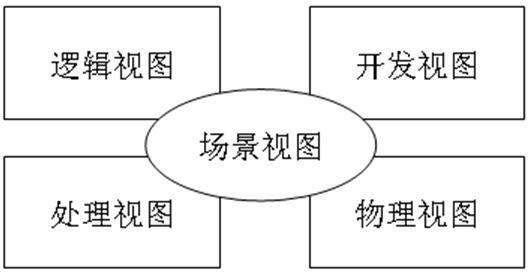
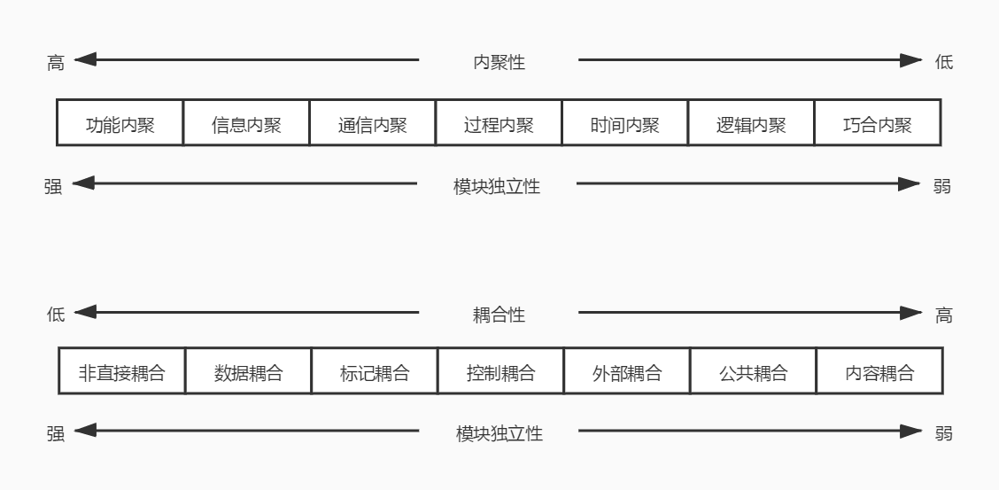

# 软件工程（三）软件设计与过程管理

需求相关的内容我们用了两个篇幅去阐述，可见需求在软件工程中是有多么重要的地位。不过这也和这个考试的情况有关，毕竟还有很多不是做开发的同学也会来参加这个考试，所以在软件工程这一大章节中，真正涉及软件设计方面的内容反而并不多，大家总算可以稍微放松一下了。那么，话不多说，我们马上进入今天的学习吧。

## 软件架构设计

其实软件的架构设计和开发语言有很大的关系，即使是跨语言的大型架构方案，也会有不同语言框架的作用及结构的展示。因此，这一块的内容其实还是非常偏技术向的，所以教材中也只是简单的写了一些理论风格之类的内容，并没有详细深入到代码架构方面的讲解。

软件架构为软件系统提供了一个结构、行为和属性的高级抽象，由构件的描述、构件的相互作用（连接件）、指导构件集成的模式以及这些模式的约束组成。说白话就是描述软件系统的子系统和组件，以及它们之间相互关系的过程。其实就是将满足职责的需求分析到对应的组件上。

Garlan 和 Shaw 对通用软件风格进行了分类，将软件架构分为 数据流风格、调用/返回风格、独立构件风格、虚拟机风格、仓库风格。架构风格反映了领域中众多系统所共有的结构和语义特性，并指导如何将各个构件有效地组织成一个完整的系统。

对于软件架构的评估来说，可以归纳为三类主要的评估方式，分别是基于调查问卷（或检查表）的方式、基于场景的方式和基于度量的方式。其中，基于场景的方式最常用，主要的方式包括：架构权衡分析法（ATAM）、软件架构分析法（SAAM）、成本效益法（CBAM）。在架构评估中，一般采用刺激（stimulus）、环境（environment）和响应（response）三方面来对场景进行描述。刺激是场景中解释或描述项目干系人怎样引发与系统的交互部分，环境描述的是刺激发生时的情况，响应是指系统是如何通过架构对刺激作出反应的。

在这里我们需要了解到的一点就是架构设计往往都是非常宏观的，所以它的设计可能不会那么详细。最终我们获得的会是一个完整的架构视图。一个架构视图是对于从某一视角或某一点上看到的系统所做的简化描述，描述中涵盖了系统的某一特定方面，而省略了与此方面无关的实体。这里有一个 Philippe Kruchten 的 4+1 视图可以供我们参考。

我们来看看这五个视图。

- 场景视图：4个视图的转换规则，也相当于是一个说明书。可以使用 用例图、活动图、状态图、交互图 来表示。

- 逻辑视图：面向用户的，主要是展示可以满足的功能需求。当使用面向对象方式开发时，逻辑视图表示的就是对象模型。可以使用 类图、对象图、活动图、状态图、交互图 来表示。

- 开发视图：面向开发人员的，描述软件在开发环境下的静态组织，可以使用 类图、组件图 来表示。在它的下面还可以再细分为 过程视图（并发问题）、组件视图（实现问题）、部署视图（分布问题） 三个视图。

- 处理视图：主要面向系统分析师，描述系统的并发和同步方面的设计以及设计约束，可以用 类图、活动图、交互图、状态图 来表示。

- 物理视图：主要是部署运维人员，描述软件如何映射到硬件，反映系统在分布方面的设计，可以用 部署图、活动图、状态图、交互图 来表示。

## 软件设计

软件设计是需求分析的延伸与拓展。需求分析解决的是“为什么”的问题，软件设计则解决“怎么做”的问题。同时，软件设计也是后续开发和实施的基础，合理的软件设计方案可以保证系统的质量，提高开发效率。从方法上来说，软件设计目前主要就是两种，一是 结构化设计 ，二是 面向对象设计 。

### 结构化设计 SD

结构化设计就是最传统的面向过程的代码编写方式，现在其实已经很少了，当然，如果你是做底层的 C 开发的那么就还是以面向过程为主的。结构化设计是一个自顶向下、逐步求精和模块化的过程。基本思想是将软件设计成由相对独立且具有单一功能组成的结构，分为概要设计和详细设计两个阶段。

概要设计又称总体结构设计，主要是将系统的功能需求分配给软件模块，确定每个模块的功能和调用关系，形成软件的模块结构图，即系统结构图。

在概要设计中，将系统开发的总任务分解成许多基本的、具体的任务，而为每个具体任务选择适当的技术手段和处理方法的过程称为详细设计。详细设计是一个比较微观的设计，在这里，会出现具体的算法、用户界面、安全可靠性、输入输出等等方面的设计。

在 SD 中，需要遵循一个非常重要的基本原则：高内聚，低耦合。

- 高内聚：内聚表示模块内部各成分之间的联系程度，一个好的内聚模块应当恰好做目标单一的一件事。

- 低耦合：耦合表示模块之间的联系的程度。低耦合或者说松散耦合就是表示模块之间的联系比较弱，一个模块的变动不会影响到另一个模块或者只有很小的影响。

从它们两个的定义可以看出，高内聚低耦合的目的就是为了让模块能够更加独立，这样我们就可以在不同的场景中不断地复用已有的模块，从而节省开发资源提高开发效率。关于内聚和耦合还有下面这张图，表示的是各种内聚和耦合的类型，了解一下就好，可以记每个类型的第一个字，比如耦合有 “非数标控外功内” ，而内聚有 “巧逻时过通信功” 。

综合来说，SD 结构化设计有三个最主要的特点：

1. 自顶向下，逐步求精。

2. 信息隐蔽。

3. 模块独立：高内聚、低耦合。

### 面向对象设计 OOD

又见到 面向对象 这四个字了吧。聪明的你已经马上明白了，又是 类 和 对象 之间的那些东西呗。没错，面向对象设计 OOD 是建立在我们之前学过的 面向对象分析 OOA 的基础之上的。在我们学习编程的时候，以及新手在面试的时候，经常会接触到一个概念，那就是面向对象的三大特性是什么？先别着急看下一行，想想看！

一般我们讲的 封装、继承、多态 就是 OO 的三大特性。不过教程中更详细些，它把 OO 的基本思想解释为 抽象、封装和可扩展性 ，其中可扩展性主要通过继承和多态来实现。这些东西我想应该不再需要我多解释了吧，不过毕竟学习我们这套课程的还是有非开发人员，所以还是简单地讲一下吧。

- 封装：就是编程语言中的类修饰符的主要功能，private 私有的只能类自己看，protected 受保护的只能类自己和继承的子类看到，public 公共的，所有实例化的对象都可以看到。这里的看到的意思指的就是从对象的角度，也就是实例化之后的角度我们能够获取到类内部的什么属性和方法。封装可以保护数据。

- 继承：之前讲 UML 和 OOA 的时候已经说过很多次啦。

- 多态：一个方法，可以通过不同的参数或者不同的返回值来产生不同的执行结果，这就是多态。多态中有两个重要的概念就是方法的 重写 和 重载 。重写的意思是子类重写父类的方法，而重载则是在同一个类中通过不同的参数或返回值来重载同名的函数。

- 抽象：客观事物的抽象，一个事物一定有属性和方法，我们需要把它抽象成一个类。第二篇文章中关于 面向对象开发 中就已经讲过这些内容。

关于 OO 的概念其实就是这些，包括之前我们讲过 类、对象、属性、行为（方法） 这些的概念。而在 OOD 也就是面向对象的设计中，我们更关注的是一些面向对象的设计原则。这些原则也会影响到我们后面紧接着要讲到的设计模式。因此，这一块是一个比较重要的地方（对于开发来说）。如果你不是开发人员，了解一下就好。因为后面要推我的 PHP 设计模式系列的课程呀！

1. 单一职责原则：设计功能目的单一的类。一个类应该只是一种具体事物的抽象，比如说动物类不应该有能发电生火之类的方法。

2. 开放-封闭原则：对扩展开放，对修改封闭。如何扩展？继承、接口、组合。修改则是指的类编写完成后，应该尽可能的不要再回来修改类内部的内容。

3. 里氏（Liskov）替换原则：子类可以替换父类。其实就是在实例化的时候，用子类实例化和用父类实例化对于对象的调用来说没有影响。

4. 依赖倒置原则：要依赖于抽象，而不是具体的实现。用流行点的话说就是要针对接口编程，不要针对实现编程。

5. 接口隔离原则：使用多个专门的接口比使用单一的总接口好。就是接口或方法的单一职责原则，接口要尽量小，不要让一个接口或方法提供一大堆的功能。不过也不是一定要非常小非常细节才好，这里也是有一个度的，具体的把握还是要看业务情况以及开发人员的经验。

6. 组合重用原则：要尽量使用组合，而不是继承关系达到重用目的。组合其实就是我们在 UML 中的 include ，而继承是 extend 。组合更好的原因是，如果父类要变动，很多情况下，子类也需要跟着变动，这样就很容易违背第 2 条原则，也就是开放封闭的原则。

7. 迪米特法则（demeter）（最少知识法则）：一个对象应当对其他对象有尽可能少的了解。这个原则和 SD 中的低耦合原则是一致的。为什么呢？知道的越少，依赖的越少，依赖越少，修改越少。

### 设计模式

设计模式其实就是在特定的环境下，如果遇到了特定类型的问题，就可以采用一些他人已经使用过的一些成功的解决方案。这些解决方案在积累汇总后，就形成了一系列的设计模式。这个东西吧，也是各位开发小伙伴在面试的时候会经常遇到的问题。设计模式一般可以分为三类，分别是 创建型、结构型 和 行为型。

创建型设计模式包括 工厂方法模式、抽象工厂模式、原型模式、单例模式和建造者模式。

结构型设计模式包括 适配器模式、桥接模式、组合模式、装饰模式、外观模式、享元模式和代理模式。

行为型设计模式包括 职责链模式、命令模式、解释器模式、迭代器模式、中介者模式、备忘录模式、观察者模式、状态模式、策略模式、模板方法模式、访问者模式。

关于这 23 个设计模式，相信一直跟着我一起学习的同学们一定不会陌生。【PHP设计模式系列】是我非常早期的文章了，视频也早就有了，B站和公众号都有，B站上也有合集，大家自己去找一下吧！

## 软件工程的过程管理

软件过程是软件生命周期中的一系列相关活动，即用于开发和维护软件及相关产品的一系列活动。软件产品的质量取决于软件过程，具有良好软件过程的组织能够开发出高质量的软件产品。

在软件过程管理方面，最著名的就是 能力成熟度模型集成（Capability Maturity Model Integration，CMMI），它融合了多种模型，主要目的是消除不同模型之间的不一致和重复，降低基于模型进行改进的成本。CMMI两种模型，分别是阶段式模型和连续式模型。

首先是阶段式模型，这个相对来说重要一些，可以记忆一下。主要也是记忆那四个成熟度等级就可以了，后面的过程域就不要求啦。

|  成熟度等级     |  过程域 |
|  ----  | ----  |
| 可管理级  |  需求管理、项目计划、配置管理、项目监督与控制、供应商合同管理、度量和分析、过程和产品质量保证  |
| 已定义级  |  需求开发、技术解决方案、产品集成、验证、确认、组织级过程焦点、组织级过程定义、组织级培训、集成项目管理、风险管理、集成化的团队、决策分析和解决方案、组织级集成管理  |
| 量化管理级  |  组织级过程性能、定量项目管理  |
| 优化管理级  |  组织级改革与实施、因果分析和解决方案  |

然后就是连续式模型的过程域分组，这个表格了解一下就好。

|  成熟度等级     |  过程域 |
|  ----  | ----  |
| 过程管理  |  组织级过程焦点、组织级过程定义、组织级培训、组织级过程性能、组织改革与实施  |
| 项目管理  |  项目计划、项目监督与控制、供应商合同管理、集成项目管理、风险管理、集成化的团队、定量项目管理  |
| 工程  |  需求管理、需求开发、技术解决方案、产品集成、验证、确认  |
| 支持  |  配置管理、度量和分析、过程和产品质量保证、决策分析和解决方案、组织级集成环境、因果分析和解决方案  |

可以看出，这两个表格的过程域其实都是一样的，只是一个是按阶段划分的，一个是按功能划分的。CMMI 非常出名，有很多企业也会去考这个 CMMI 等级认证。目前国内大部分拥有 CMMI 资格的公司都是 已定义级 或 量化管理级 的，优化管理级的本身在全世界就非常少。有兴趣的小伙伴可以再深入的研究一下。

## 总结

今天的内容，相对前两篇来说并不是特别的重点，其中软件架构设计中的 4+1 视图，软件设计中 SD 的 高内聚低耦合 ，OO 的设计原则 这几个部分可以重点了解下。CMMI 的阶段式模型也可以多了解一下，只需要记住那四个阶段就好了。

下一篇，就是非常重要的软件测试和质量相关的内容，另外在软件工程的最后一篇文章中，我们还会补充一些软件设计典型的架构模式以及软件复用、集成技术之类的相关介绍。

参考资料：

《信息系统项目管理师教程》

《某机构培训资料》