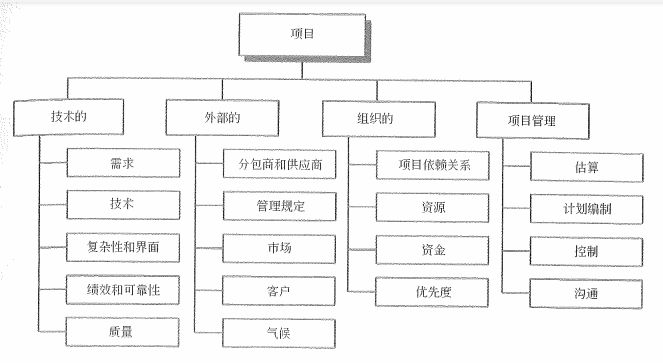

# 规划识别风险及定性分析

了解完风险相关的知识以及项目风险的管理过程之后，我们就进入到每个风险过程的学习。风险管理过程的内容并不算少，直逼范围、进度、成本、质量四大核心模块，也是我们需要重点关注的内容。当年的论文我写得就是风险管理通过的，其实相对来说，这样的管理过程更适合写论文，因为工具内容多。如果是干系人的话，反而更不好凑字数。话不多说，我们一个一个来看看。

## 规划风险管理

认真、明确地进行规划，可提高其他5个风险管理过程的成本概率。规划风险管理的重要性还在于为风险管理活动安排充足的资源和时间，并为评估风险奠定一个共同认可的基础。规划风险管理过程在项目构思阶段就应开始，并在项目规划结算早期完成。

在这个过程中，我们主要关注的它的输出，也就是一个风险管理计划。它的内容主要包括：

- 方法论：确定实施项目风险管理可使用的方法、工具及数据来源。

- 角色与职责：确定风险管理计划中每项活动的领导、支援与风险管理团队的成员组成，为这些分解分配人员并澄清其职责。

- 预算：分配资源，并估算风险管理所需成本，将之纳入项目成本基准。制定应急储备和管理储备的使用方案。

- 时间安排：确定在项目整个生命期中实施风险管理过程的次数和频率，并确定应纳入项目进度计划的风险管理活动。

- 风险类别：主要是生成一个 风险分解结构（RBS） ，还有一个 RBS 还记得是什么吗？我们之前在项目人力资源管理中讲过的 资源分解结构也是叫 RBS 。

- 风险概率和影响的定义。为确保定性风险分析过程的质量和可信度，要求界定不同层次的风险概率和影响。这里主要就是生成一个概率和影响矩阵。

- 风险概率与影响矩阵。我们在下面会专门讲这个东西。

- 修改的项目干系人承受度：对项目干系人的承受度进行修订。

- 报告格式：阐述风险登记册的内容和格式，以及所需的任何其他风险报告。界定如何对风险管理过程的成果进行记录、分析沟通。

- 跟踪：说明如何记录风险活动的各个方面。

### RBS

使用这个 RBS 主要就是进行风险的简单分类，类似于组织结构图一样的树形分类方式，可以为确保系统、持续、详细和一致地进行风险识别，并为保证风险识别的效力和质量的风险管理工作提供了一个框架。

这两种方式的 RBS 分别是 信管师教材 上的，以及 PMBOK 第六版中的 RBS 示例。不局限于形式，只要是分类整理的即可。

### 概率与影响

在规划风险的过程中，通用的风险概率水平和影响水平的界定将依据个别项目的具体情况进行调整。我们可以用“非常可能”、“几乎可能”，当然更好的是使用一些常规比例（0.1、0.3、0.5、0.7、0.9）这样数值来衡量风险的影响及概率。

上述内容是通过 范围、进度、成本、质量 四项项目目标的风险影响比例的确定。这只是一个示例，我们需要根据不同的项目情况进行不同的定义分析。

通过定义之后的风险概率与影响的数值，我们就可以在概率和影响矩阵中获得这个风险情况的具体信息。

比如说，一个 风险A ，我们认定它是一个威胁，发生的概率是 0.7 ，对目标的影响是 0.8 ，那么他的风险等级就是 高风险，对应图中的深灰色的 0.56 这个数值。从图中我们可以看出，中间偏上深灰色的部分都是高风险区域，两边扩散开来的最浅的灰色区域是中风险区域，而两侧靠左右下方的灰色区域是低风险区域。

一般这里的题目会给出图，或者直接就是计算一个风险等级，如果给图了可能会问你风险等级。如果没给图可能就只是让你算一下风险等级的数值，也就是发生概率*影响概率。

## 识别风险

识别风险指的是确定哪些风险会影响项目，将将其特性记载成文。识别风险过程是风险分析和跟踪的基础。识别风险的内容包括：

- 识别并确定项目有哪些潜在的风险

- 识别引起这些风险的主要因素

- 识别项目风险可能引起的后果

在进行风险识别的时候，要注意识别风险的全员性、系统性、动态性、信息依赖性以及综合性这些特性。代表的就是识别风险不是一两个人的事，而是团队整体的事情，并且应该系统性地，不断地进行风险地识别。在这里，我们再扩展一个知识点，那就是 IT 项目常见的风险有哪些：

- 需求风险

- 技术风险

- 团队风险

- 关键人员风险

- 预算风险

- 范围风险

- 商业风险

具体这几个风险的原因就不多说了，各位只要是在互联网公司工作的，或者参与信息系统开发建设的同学对这些风险都不会陌生。

对于识别风险来说，我们主要关心的是它的工具与技术以及输出的风险登记册。

### 工具与技术

文档审查：包括对项目文档进行系统和结构性的审查，项目需求和假设条件的符合程度也是我们审查内容，它们均可表现为项目中的风险指示器。

信息收集技术，主要包括：头脑风暴、德尔菲技术、访谈、根据原因识别等。前面三个之前已经学习过就不用多说了，根本原因识别就是对项目风险的根本原因进行调查，通过识别根本原因来完善风险定义并按照成因对风险进行分类。通过考虑风险的根本原因，就能够制订有效的风险应对措施。

核对表分析：根据历史资料，以往类似项目所积累的知识，以及其他信息来源着手制订。也可以将 RBS 的最底层用作为风险核对表。优点是风险识别过程迅速简便。缺点是所制订的核对表不可能包罗万象。所以应该注意探讨标准核对表上未列出的事项。在项目收尾过程中，应对风险核对表进行审核、改进，以供将来项目使用。

假设分析：根据一套假定、设想或假设进行构思与制订的，检查假设有效性的一种技术。辨认不精确、不一致、不完整的假设对项目所造成的风险。

图解技术：因果图；系统或过程流程图，显示系统各要素之间如何相互联系，以及因果传导机制；影响图，变量与结果之间的其他关系的图解表示法。

SWOT分析：下文中有详细介绍。

### 输出：风险登记册

风险识别过程主要的成果就是风险登记册，它是项目管理计划中风险登记册的最初记录。通过收集资料，对风险形式的评估以及根据直接或间接的症状将潜在的风险识别出来，从而形成的风险列表。包括：

- 已识别风险清单

- 潜在应对措施清单

- 风险根本原因

- 风险类别更新

风险登记册始于风险识别过程，然后供其它风险管理过程和项目管理过程使用，所以说它是整个项目管理计划的一部分。在定性风险分析和定量风险分析中都会进一步完善。

- 风险识别：风险登记册包括的主要信息有已识别的风险清单、潜在应对清单等，就是上面刚刚说过的那四条内容。

- 定性风险分析：更新项目风险的相对排序或优先级清单、按类别分类的风险、风险成因或需特别关注的项目领域、近期就需要应对的风险清单、需进一步分析与应对的风险清单、低优先级风险观察清单、定性风险分析结果的趋势。

- 定量风险分析：更新的内容有项目的概率分析、实现成本和时间目标的概率、量化风险优先级清单、定量风险分析结果的趋势。

### SWOT分析

其实这个 SWOT 也是非常流行的一种优势分析技术了，不仅可以运用在项目管理上，在生活和工作的方方面面都可以用上它。比如说我之前的朋友就为别的朋友做过工作选择的 SWOT 分析，也就是同时拿到了几个 offer ，然后使用 SWOT 来选择最后去哪一家。

其实 SWOT 代表的就是优势（Strength）、劣势（Weakness）、机会（Opportunity）、威胁（Threat）出发，对项目进行考察，把产生于内部的风险都包括在内，从而更全面地考虑风险。首先，从项目组织或更大业务范围的角度，识别组织的优势和劣势，经常可用头脑风暴法。然后，在识别出产生于组织优势的各种项目机会，以及产生于组织劣势和各种威胁。也可用 SWOT 分析来考察组织优势可以抵消威胁的程度，以及机会可以克服劣势的程度。

上面这个表格的意思其实就是我们将不同的内容进行合并来寻找突破点。比如说通过合并优势和机会，就形成了 SO 战略，那么我们就要抓住机遇，发挥当前的优势。下面是一个这种 SWOT 分析矩阵的例子。

## 实施定性风险分析

实施定性风险分析是通过评估单个项目风险发生的概率和影响以及其他特征，对风险进行优先级排序，从而为后续分析或行动提供基础的过程。在这里，**优先级排序** 是定性风险分析的最主要特征，它通常是为风险应对规划过程确立优先级的一种经济、有效和快捷的方法，并为后面的定量风险分析（如果需要该过程）奠定基础。

在这个过程中，我们主要关心的同样也是它的工具和技术。

### 工具与技术

风险概率与影响评估：风险概率评估系指调查每项具体风险发生的可能性。风险影响评估旨在调查风险对项目目标（如时间、成本、范围或质量）的潜在影响，既包括消极影响或威胁，也包括积极影响或机会。

概率和影响矩阵：基于风险等级，对风险进行优先排序，便于进一步的定量分析和风险应对。和我们之前规划风险管理中的概率和影响矩阵是一样的，这里会更加完善，并加入优先排序，最后也会更新到识别风险的风险登记册中。

风险数据质量评估：评估有关风险的数据对风险管理的有用程度的一种技术。它包括检查人们对风险的理解程度，以及风险数据的精确性、质量、可靠性和完整性。

风险分类：可按照风险来源（使用风险分解矩阵），受影响的项目区域（使用工作分解结构），或其他分类标准（如项目阶段），对项目风险进行分类，以确定受不确定性影响最大的项目区域。根据共同的根本原因对风险进行分类可有助于制订有效的风险应对措施。

风险紧迫性评估：需要近期采取应对措施的风险可被视为亟需解决的风险。实施风险应对措施所需的时间、风险征兆、警告和风险等级等都可作为确定风险优先级或紧迫性的指标。

## 总结

今天我们学习了项目风险管理的前三个过程，分别是规划风险管理、识别风险和实施定性风险分析。在这其中，概率与影响矩阵、SWOT矩阵这两个矩阵是重点内容，另外风险登记册会在多个过程之中流转也是重点内容。还需要知道的就是定性分析最重要的内容就是为风险进行排序。剩下的内容就是各个过程的工具与技术了，多少都要清楚每个过程有哪些工具与技术。

下次课我们将学习的是项目风险管理的后三个过程，其中定量分析和风险应对都非常有意思，不过相对来说重点也更多一些哦！

参考资料：

《信息系统项目管理师教程》 

《某机构培训资料》

《项目管理知识体系指南 PMBOK》第六版