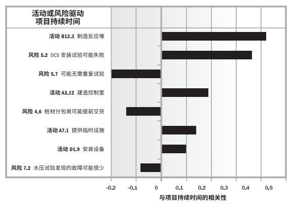
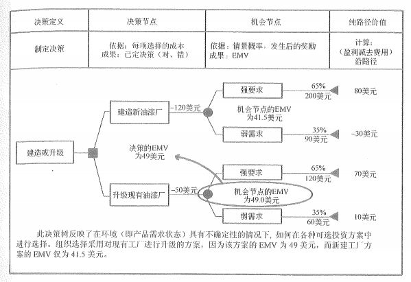
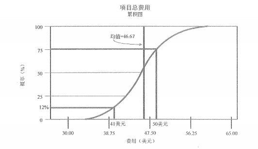

# 风险定量分析及应对监控

通过前三个过程，我们已经有了风险登记册，也就是一个所有识别出来的风险情况。然后可以通过定性风险分析来进行分类和排序。接下来我们要继续通过定量，也就是数据的手段来继续完善风险登记册。只有有了详尽的风险登记册，我们才能在后续继续进行风险的应对以及控制。这些就是我们今天要学习的内容。

## 实施风险定量分析

定量风险分析过程是对这些风险事件的影响进行分析，并就风险分配一个数值。它对项目结果以及实现项目结果的概率进行量化，是一种进行项目决策的 量化 方法。最终评估的是具体项目目标完成的概率。

通过量化各项风险对项目总体风险的影响，确定需要特别重视的风险。在考虑项目风险的情况下，确定可以实现的切合实际的成本、进度或范围目标。在某些条件或结果不确定时，确定最佳的项目管理决策。这些都是实施定量分析工具的主要内容。

实施定量分析的结果输出也是去更新风险登记册以及概率与影响矩阵。它的工具与技术主要包括数据收集技术和表示技术以及定量风险分析和建模技术。其中，数据收集技术又包括：访谈、概率分布、专家判断。而定量风险分析和建模技术中又包括：敏感性分析、预期货币价值分析、决策树分析以及模型和模拟。我们重点要学习的是定量风险分析和建模技术中的这些工具。

### 敏感性分析

敏感性分析有助于确定哪些风险对项目具有最大的潜在影响。最常用的显示方式是 龙卷风图 。这个大家知道有这个东西了，并且看到下面的这个图知道是 龙卷风图 就可以了。

### 预期货币价值与决策树分析

预期货币价值分析（EMV）是一个统计概念，用于计算在将来某种情况发生或不发生情况下的平均结果。它也是和 ROI 、投资回报率 之类的一样，是管理学的必学内容。这个分析其实就是当我们面临多种选择时，怎样选择最好的那条路线。

机会的预期货币价值一般表示为正数，而风险的预期货币价值一般表示为负数。每个可能结果的数值与其发生概率相乘之后加总，即得出预期货币价值。

预期货币价值通常是以上面这种决策树的方式来展现的。这也是经常会出现的题目。上面这个图是怎么算出来的呢？我们来分析一下它。

首先是假设有一个决策需要我们来决定。分别是通过 建造新厂 和 升级旧厂 两种方式来提升产能。

建造新厂预计需要花费 120 美元（图上标示为 -120）。在需求量大，也就是市场好的情况下，新厂房可以带来的回报为 200 美元；在需求一般，也就是市场不好的情况下可以带来 90 美元的回报。它们的比例分别为 65% 和 35% ，表示的是有 65% 的可能市场比较好，35% 的可能市场一般。那么，上面建造新厂的最终 EMV 的公式就是：（最好收益-投资）* 概率+（最差收益-投资）* 概率 = (200-120) * 0.65+(90-120) * 0.35 = 80 * 0.65 + -30 * 0.35 = 52-10.5 = 41.5 。

升级现有厂房的 EMV 计算和公式也是类似的，我们直接用数字代入计算。（120-50） * 0.65+（60-50 * 0.35）= 70 * 0.65+10 * 0.35 = 45.5 + 3.5 = 49 。

两个结果一对比，明显升级旧厂的 EMV 更高一些，我们应该选择升级现有油漆厂这个方向。

上面的这个计算步骤就是决策树的计算。在做题时，大家一定要记住，每条路径收益花费的汇总，加收益、减花费，最后乘以可能性比率，就是这条路径的 EMV 值。如果有分支路径，将分支路径相加汇总后就成为了上级路径的 EMV 。最后选 EMV 最大的，也就是预期能够带来最大货币价值的那条路径。

### 模型和模拟

在这里就是使用模型来模拟项目风险和其他不确定性来源的综合影响。需要我们关注的就是通常模拟会使用一个叫做 蒙特卡洛分析 的分析技术。另外，还需要知道下面这个项目总成本累积图也是在定量风险分析中通过模型和模拟获得的。

## 规划风险应对

规划风险应对指为项目目标增加实现机会，减少失败或威胁而制订方案，决定应采取对策的过程。包括确认与指派相关个人或多人（简称“风险应对负责人”），对已得到认可并有资金支持的风险应对措施担负起职责。规划风险应对过程根据风险的优先级水平处理风险，在需要时，将在预算、进度计划和项目管理计划中加入资源和活动。

我们在这个过程将要拟定的风险应对措施与风险的重要性相匹配，能经济有效地应对挑战，能获得全体相关方的统一，并由一名责任人具体负责。风险应对措施也必须要及时，我们经常需要从几个备选方案中选择一项最佳的风险应对措施。

在这个过程中，我们需要重点关注三个工具与技术，它们分别就是消极风险或威胁的应对策略、积极风险或机会的风险应对策略以及应急应对策略。根据之前我们在风险分类中学习过的内容可知，风险不一定全是不好的，也有可能是机会风险，对于不好的风险有一套处理方式，而对于积极风险，我们也要有一套相应的处理方式。

### 消极风险或威胁的应对策略

对于不好的风险来说，我们能怎么处理？当然是要么回避躲开它，要么转移去别人那里，要么减轻影响，最后实在不行了就只能接受这个风险了。我们一个一个具体来看看：

- 回避：指改变项目计划，以排除风险或条件，或者保护项目目标，使其不受影响，或对受到威胁的一些目标放松要求。回避最典型的例子就是担心什么事就不要去做这件事，比如你怕卡鱼刺，那就别吃鱼呗，或者吃没有刺的鱼。

- 转移：转移风险指设法将风险的后果连同应对的责任转移到第三方身上。转移是将风险管理责任推给另一方，而并非将其排除。最典型的例子就是买保险，不管是企业还是我们个人，保险都是将我们的风险转移给了保险公司。但是，即使有保险公司来管理风险，假如出事的话还是我们倒霉，风险依然是发生了，但是我们要承担的内容很少甚至不承担什么后果。

- 减轻：指的就是设法把不利的风险事件的概率或后果降低到一个可接受的临界值。这个好解释，为了能多活几年，戒烟、戒酒、运动、喝枸杞都是我们的减轻策略。对于项目来说，详尽的测试、调试也是一种减轻策略。

- 接受：这个就是指项目团队决定接受风险的存在，而且不采取任何措施。它就是在上面其它三个方法不可能使用时使用的，或者其他方法不具备经济性。通常来说，未知-未知的风险大部分情况下我们只能授受了，因为我们对这个风险一无所知呀，发生了才知道，这时候就只能授受了再去想办法。

### 积极风险或机会的应对策略

积极的风险通常都是一些机会，如果把握住了会为我们带来许多益处。那么对于积极的风险，我们要么扩大价值去争取，要么寻求合作获利，要么提高它的出现或成功概率，要么也可以不做任何操作地接受。一个一个地来看看：

- 开拓：通过确保机会肯定实现而消除与特定积极风险相关的不确定性。简言之，通过分配更多的资源扩大风险事件的价值，让更多人关注并且尽量保证这种风险的实现。投融资领域常见这类开拓技术的应用。
- 分享：指将风险的责任分配给最能为项目的利益获取机会的第三方，包括建立风险分享合作关系，或专门为机会管理形成项目团队。如果说上面的开拓是自己有实力拿下，那么分享就是可能自己实力不够，那就联合第三方一起来保证拿下机会。
- 提高：通过提高积极风险的概率或其积极影响，识别并最大程度发挥这些积极风险的驱动因素，致力于改变机会的“大小”。这个就是不一定能完全吃下所有的机会，那么就提升机会出现或把握的概率。
- 接受：同样的，我们在积极风险和机会中也可以选择接受的方案。因此，授受是同时适用于积极和消极风险应对的。

### 应急应对策略

可以针对某些特定事件，专门设计一些应对措施。对于有些风险，项目团队可以制定应急应对策略，即只有在某些预定条件发生时才能实施的应对计划。如果确信风险的发生会有充分的预警信号，就应该制定应急应对策略。采用这一技术制订的风险应对方案，通常称为应急计划或弹回计划，其中包括已识别的、用于启动计划的触发事件。

## 控制风险

在项目生命期实施项目管理计划包含的风险应对措施时，应持续对项目工作进行监督以寻找新风险和变化的风险。

风险监测与控制指识别、分析和规划新生风险，追踪已识别风险和“观察清单”中的风险，重新分析现有风险，监测应急计划的触发条件，监测残余风险，审查风险应对策略的实施并评估其效力的过程。

一般应围绕项目风险的基本问题，制定科学的风险监控标准，采用系统的管理方法，建立有效的风险预警系统，做好应急计划，实施高效的项目风险监控。

### 工具与技术

风险再评估：对新风险进行识别，对旧风险进行重新评估。我们应安排定期进行项目风险的再评估。重复的内容和详细程度取决于项目相对于目标的绩效情况。

风险审计：是检查并记录风险应对措施在处理已识别风险及其根源方面的有效性，以及风险管理过程的有效性。

偏差和趋势分析：很多控制过程都会借助偏差分析来比较计划结果与实际结果。为了控制风险，应该利用绩效信息对项目执行的趋势进行审查。可以使用挣值分析及项目偏差与趋势分析的其他方法，对项目总体绩效进行监控。这些分析的结果可以揭示项目在未完成时可能偏离成本和进度目标的程度。与基准计划的偏差可能表明威胁或机会的潜在影响。

技术绩效测量：它是把项目执行期间所取得的技术成果与关于取得技术成果的计划进行比较。它要求定义关于绩效的客观的、量化的测量指标，以便据此比较实际结果与计划要求。这些技术绩效测量指标可包括重要性、处理时间、缺陷数量和存储容量等。偏差值（如在某里程碑时点实现了比计划更多或更少的功能）有助于预测项目范围方面的成功程度。

储备分析：在项目实施过程中可能会发生一些对预算或进度应急储备造成积极或消极影响的风险。储备分析指在项目的任何时点将剩余的储备与任务风险量进行比较，以确定剩余的储备是否仍旧充足。

### 输出

在监控风险的输出中，主要输出的是变更的请求，也就是发现或者发生风险之后要产生变更来应对风险。在这其中有个名词需要我们了解一下，那就是权变措施。

权变措施：是针对以往未曾识别或被动接受的、目前正在发生的风险而采取的、未经事先计划的应对措施。

## 补充资料：信息系统的风险相关内容

最后我们再补充一点关于信息系统以及软件开发项目中相关的风险知识。大家了解一下即可。

### 硬件集成项目风险产生的原因

- 产品的日趋复杂性

- 依赖多个厂家的支持和技术来源

- 采用产品组合和功能交叉的方法

- 项目管理与企业战略的紧密结合

- 产品更新周期的缩短

- 满足顾客需求

- 市场的激烈竞争

- 参与者的利益不同

- 多方面与专业技术的集成

- 依赖更复杂的工具

### 软件项目的主要风险

- 项目规模风险

- 需求风险

- 外部因素风险

- 内部管理风险

- 技术风险

### 软件项目风险产生的原因

- 产品定位错误（包括市场定位）

- 人员流动

- 项目管理失败

- 开发目标不明确或摇摆不定

- 开发计划执行受到严重影响

- 技术方案有缺陷

- 项目经费超支或不足

- 开发环境及过程管理混乱

- 产品质量低劣

- 需求发生变化

### 软件项目经常遇到的 15 种可预料（包括已知的）风险及其预防措施

- 合同风险：预防办法是项目建设之初项目经理就需要全面准确地了解合同各条款的内容、尽早告知合同各方就模糊或不明确的条款签订补充协议。

- 需求变更风险：预防办法是项目建设初就和用户书面约定好需求变更控制流程、记录并归档用户的需求变更申请。

- 沟通不良风险：预防办法是项目建设之初就和项目各干系方约定好沟通的渠道和方式、项目建设过程中多和项目各干系方交流和沟通、注意培养和锻炼自身的沟通技巧。

- 缺乏领导支持风险：预防办法是主动争取领导对项目的重视、确保和领导的沟通渠道畅通、经常汇报工作进展。

- 进度风险：预防办法是分阶段交付产品、增加项目监控的频度和力度、多运用可行的办法保证工作质量避免返工。

- 质量风险：预防办法一般是经常和用户交流工作成果、采用符合要求的开发流程、认真组织对产出物的检查和评审、计划和组织严格的独立测试等。

- 系统性能风险：预防办法一般是在进行项目开发之前先设计和构建出系统的基础架构并进行性能测试，确保架构符合性能指标后再进行后续工作。

- 工具风险：预防办法一般是在项目的启动阶段就落实好各项工具的来源或可能的替代工具，在这些工具需要使用之前（一般需要提前一个月左右）跟踪并落实工具的到位事宜。

- 技术风险：预防办法是选用项目所必须的技术、在技术应用之前，针对相关人员开展好技术培训工作。

- 团队成员能力和素质风险：预防办法是在用人之前先选对人、开展有针对性的培训、将合适的人安排到合适的岗位上。

- 团队成员协作风险：预防办法是项目在建设之初项目经理就需要将项目目标、工作任务等和项目成员沟通清楚，采用公平、公正、公开的绩效考评制度，倡导团结互助的工作风尚等。

- 人员流动风险：预防办法是尽可能将项目的核心工作分派给多人（而不要集中在个别人身上）、加强同类型人才的培养和储备。

- 工作环境风险：预防办法是在项目建设之前就选择和建设好适合满足项目成员期望的办公环境、在项目的建设过程中不断培育和调整出和谐的人文环境。

- 系统运行环境风险：预防办法是和用户签定相关的协议、跟进系统集成部分的实施进度、及时提醒用户等。

- 分包商风险：预防办法一般是指定分包经理全程监控分包商活动、让分包商采用经认可的开发流程、督促分包商及时提交和汇报工作成果、及时审计分包商工作成果等。

## 总结

今天的内容不少吧，我们重点需要关注的是预期货币价值、EMV 相关的计算，积极和消极风险的应对策略。其实重点内容并不多，但其它的内容也希望大家能多多了解，至少能一个印象。

风险管理相关的内容就结束了，之后我们将进入最后一个项目管理知识领域的学习，也就是 项目采购管理 。胜利就在眼前啦，大家再加把劲哦！

参考资料：

《信息系统项目管理师教程》 

《某机构培训资料》

《项目管理知识体系指南 PMBOK》第六版