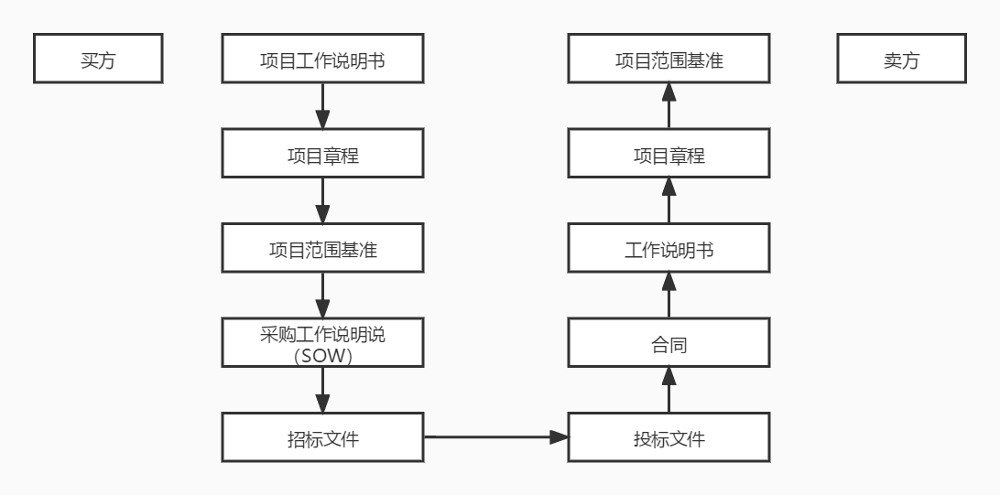

# 项目采购管理过程

在了解了一些周边知识，并且看过项目采购管理全部过程的简介之后，我们进入到每一个过程的详细学习中。其实采购相关的知识过程并不复杂，但一些工具与技术都涉及不少周边知识，特别是合同管理这一块，我们将在后面专门讲述合同管理的内容。相关的法律法规除了上节课的简单了解之外，也会在之后有详细的汇总。

## 规划采购

规划采购过程识别哪些项目需求最好或必须通过从项目组织外部外购产品、服务或成果来实现，或哪些项目需求可由项目团队自行完成。在规划采购过程中，要决定是否需要取得外部支持。如果需要，则还要决定采购什么、如何采购、采购多少，以及何时采购。如果项目需要从执行组织外采购所需的产品、服务和成果，则每次采购都要经历从规划采购到结束采购的各个过程。

项目进度计划会对规划采购过程中的采购策略制定产生重要影响。在编制采购管理计划过程中所作出的决定也会影响项目进度计划。应该把采购管理计划编制工作与制定进度计划、估算活动资源和自制或外购决策等整合起来。

在规划采购过程中，要考虑每个自制或外购决策所涉及的风险，也要审查为减轻风险（有时向卖方转移风险）而拟使用的合同类型。

上面来回说了几篇自制外购决策什么的，其实它就是规划采购的一个工具与技术。除了工具与技术外，规划采购的输出也是非常值得我们关注的，接下来我们就先看一下工具与技术，再看看输出的内容。

### 工具与技术

自制与外购分析：确定我们需要的产品、服务或成果，或者是某些工具，到底是我们自己开发实现，还是通过采购的方式从外部获得。在做自制与外购分析时，要综合考虑所有成本，包括直接与间接的各种成本。除了成本之外，还可以看需要的内容是否符合企业或项目战略，符合战略的应该自制，不符合战略的则外包。

市场调研：主要包括考察行业情况和潜在供应商。项目的采购团队可以综合考虑从网络上的在线评论、展销会等各种渠道得到的信息，来了解市场情况。同时可能也需要考虑有能力提供所需材料或服务的潜在供应商的范围，权衡与之有关的风险，并优化具体的采购目标，尽可能利用成熟的技术。

合同类型的选择：其实合同类型应该是规划采购的输入，属于组织过程资产的一部分。但是在规划的时候我们就应该确定好合同类型的选择，所以在这里也可以将它视为规划采购的一个工具与技术。根据合同的内容合同包括：总承包合同、单项承包合同、分包合同这几种。而根据价格分可以分为总价合同（固定总价、总价加激励费用、总价加经济价格调整）、成本补偿合同（成本加固定费用、成本加激励费用、成本加奖励费用）、工料合同。关于合同的内容我们将在下一课详细说明，是非常重点的内容。

### 输出：采购管理计划

采购管理计划描述的是从形成采购文件到合同收尾的全部的采购过程计划。主要解释采购什么、采购的时机、采购的方式、采购的数量、采购成本的制约因素等。具体来说包括：

- 采用的合同类型

- 是否采用独立估算作为评估标准，由谁来准备独立估算，何时进行独立估算

- 如果项目的执行组织设有采购、合同或者发包部门，项目管理团队本身能采取哪些行动

- 标准的采购文件（如果需要的话）

- 管理多个供应商

- 协调采购与项目的其他方面，例如确定进度与绩效报告

- 能对计划的采购造成影响的任何约束和假定

- 处理从卖方购买产品所需要的提前订货期，并与他们一起协调项目进度制定过程

- 进行“自制/外购”决策，并与活动资源估算过程、制定进度计划过程联系起来

- 确定合同中规定的每个可交付成果的日期安排，并与进度制定过程和进度控制过程相协调

- 确定履约保证金或者保险合同，以减轻项目的风险

- 为卖方提供指导，以帮助其制定与维护WBS

- 确定用于采购或合同工作说明书的形式和格式

- 确定通过资格预审的卖方

- 管理合同和评估卖方的衡量指标

### 输出：采购工作说明书

采购工作说明书（SOW），是一份对于所购买的产品、成果或服务的详细说明。一般采购工作说明书都来自 项目范围基准 。它一般会包括任何所需的间接服务。例如，对于所采购项目提供的绩效报表或项目后期的运作支持。它的所有说明必须清晰、完整、简洁明了，以便潜在卖方确定是否有能力提供此类产品、服务或成果。当然，具体的详略程度与采购品的性质、买方的需求、合同形式等有关，并没有统一的标准。具体包括：前言、项目工作范围、项目工作方法、假设条件、工作期限和工作量估计、双方角色和责任、可交付成果、完成以及验收标准、服务人员、聘用条件、收费和付款方式、变更管理、承诺、保密等内容。

### 输出：采购文件

采购文件用来得到潜在卖方的报价建议书，一般包括规定的应答格式、相关的采购工作说明书，以及所需要的合同条款等。具体的内容包括：采购活动记录、采购预算、招标文件、评标标准、评估报告、合同文体、验收证明、质疑答复等其它有关文件、资料等。在这其中，比较重要的一些其它的文件资料包括：信息邀请书（RFI）、投标邀请书（IFB）、建议邀请书（RFP）、报价邀请书（RFQ）、投标通知、谈判通知、谈判邀请书、承建单位初始应答邀请书等。在这一堆文件中，前面那四个邀请书和它们的英文简称是需要大家记住的哦。

在这里，我们也通过采购过程总结一下项目管理中的一些重要文件的流转过程，下面这张图大家可以了解一下。

## 实施采购

实施采购就是获取卖方应答、选择卖方、授予合同，达成协议，使内、外干系人的期望一致的过程。其实说白了，它就是如果决定要采购的话，招投标的过程。为什么这么说呢？因为它的输出就是选中的卖方和合同这两项。选中的卖方不用多说了，就是按照供方选择标准，对各个卖方的建议书或投标书进行评价之后，选出的最合适的一个或多个卖方。选好了就是按我们之前规划过程中的合同类型来签订合同或协议了。这个合同或协议只要签订了，那么它的内容只要不是违法的，双方必须履行合同中约定的权利和义务。一般合同或协议中会包括：采购工作说明书或主要的可交付成果；定价和支付条款；检查、质量和验收标准；终止条款和替代争议解决方法等。

对于实施采购来说，重点也是在工具与技术上：

- 投标人会议：也称为发包会、承包商会议、供应商会议、投标前会议或竞标会议。它是用来确保所有潜在供应商对采购目的（如技术要求和合同要求等）有一个清晰、共同的理解。对供应商问题的答复可能作为修订条款包含到采购文件中。在投标人会议上，所有潜在供应商都应得到同等对待，以保证一个好的招标结果。

- 分析审查：通过审查供应商以往的表现，项目团队可以发现风险较多、需要密切监督的领域，以确保项目的成功。

- 建议书评价技术：对于复杂的采购，如果要基于卖方对既定加权标准的响应情况来选择卖方，则应该根据买方的采购政策，按正式的建议书评审流程对各个潜在卖方的建议书进行评价，建议书评价委员会将做出他们的选择，在授予合同之前，还要报管理层批准。

- 独立估算：采购组织能够进行独立的估算以检查卖方建议书中的报价。如果报价与估算成本有很大差异，则可能表明合同工作说明书不适当、或者潜在卖方误解或者没能完全理解和答复工作说明书、或者市场已经发生了变化。

剩下的还有广告（发布招标信息）、搜索（查找潜在供应商）、采购谈判（签订合同前的最后确认谈判）等工具，大家可以参考教材中的内容说明。

## 控制采购

控制采购是管理采购关系、监督合同执行情况，并根据需要实施变更和采取措施的过程。它要确保买方可以按合同条款去执行，并保证产品及服务质量的控制。

买方和卖方都出于相似的目的而管理采购合同。有多个供应商的较大项目，合同管理的一个重要方面就是管理各个供应商之间的界限。由于组织结构的不同，许多组织有把合同管理与项目组织相分离的一种管理职能。虽然采购管理员可以是项目团队成员，但他通常向另一个部门的经理报告。

在控制采购过程中，应该根据合同来审查和记录卖方当前的绩效或截至目前的绩效水平，并在必要时采取纠正措施。可以通过绩效审查，考查卖方在未来项目中实施类似工作的能力。在需要确认卖方未履行合同义务，并且买方认为应该采取纠正措施时，也应进行类似的审查。

控制采购还包括根据合同终止条款来管理合同工作的提前终止（因成本或违约）。在合同收尾前，经双方共同协商，可以随时根据合同的变更控制条款对合同进行修改。这种修改并不总是同样有利于买卖双方。

综上所述，在控制采购中，合同管理、违约处理是非常重要的内容。这些其实也就构成了控制采购的工具技术，它们主要包括：合同变更控制流程、采购绩效审查、检查与审计、绩效报告、支付系统、索赔管理、记录管理系统等。其中，合同相关内容和索赔管理相关的内容我们将在下次课中进行详细的讲解。

最后，控制采购过程输出的其实就是工作绩效的信息，以及可能出现的变更请求了。

## 结束采购

结束采购是完结本次采购的过程，把合同和相关文件归档以备将来参考。这是什么？很明显就是在更新组织过程资产了。其实他主要就是一些行政工作需要处理，比如索赔资料整理、更新记录、信息的存档，以及一些未决争议（诉讼、合同结束程度等等）。

在结束采购过程中的工具与技术主要是下面这三个：

- 采购审计：采购审计是指对从规划采购过程到管理采购过程的所有采购过程进行结构化审查，其目的是找出可在本项目其他采购合同或执行组织内其他项目借鉴的成功经验与失败教训。

- 采购谈判（协商解决）：在每个采购关系中，通过谈判公正地解决全部未决事项、索赔和争议。如果通过直接谈判无法解决，则可以尝试替代争议解决（ADR）方法。

- 记录管理系统：项目经理采用记录管理系统来管理合同、采购文件和相关记录。它包含一套特定的流程、相关的控制功能以及作为项目管理信息系统一部分的自动化工具。该系统中包含可检查的合同文件的往来函件档案。

## 总结

在今天学习的内容中，我们其实主要关心的是这几个采购过程的工具与技术，能够了解清楚它们的概念定义就可以了。然后就是规划采购管理过程中输出的采购管理计划、采购工作说明书以及采购文件这三个文件的相关内容。不过，今天的内容都不是特别重要的内容，因为在采购过程中，最重要的内容其实是合同相关的内容。我们将在下次课中再详细全面地来学习。

参考资料：

《信息系统项目管理师教程》 

《某机构培训资料》

《项目管理知识体系指南 PMBOK》第六版