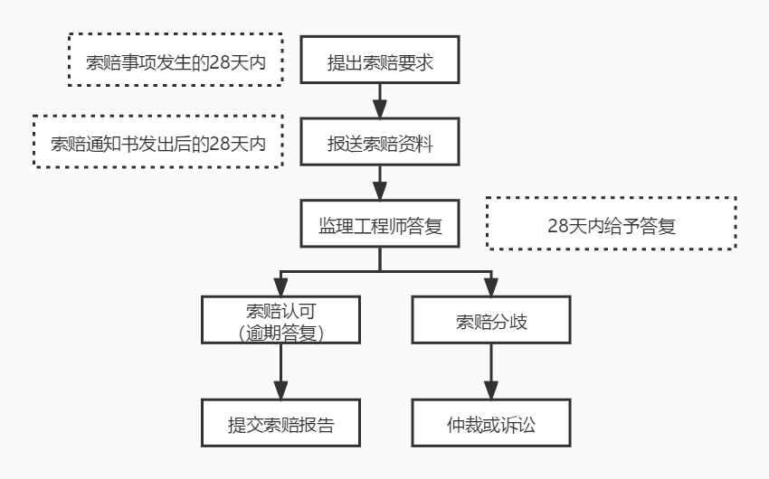

# 合同及合同管理过程（二）

合同管理过程不属于项目管理过程中的知识域，所以它也不是 PMP 中的内容。其实截止到这里，整个 PMP 中的相关知识你已经学完了。如果抛开我们第一大章信息化和信息管理相关的内容，你就可以直接去参加 PMP 考试了，开心不开心？但是，信管师相关的内容可还没有完成呢，除了合同管理我们后面还有不少内容，好消息是重点内容已经不太多了，大家继续坚持吧。

## 合同管理过程

合同管理过程主要是为了提高合同水平，减少合同纠纷，加强和改善建设单位和承建单位的经营管理水平，最终目标是提高经济效益。所以说，合同管理不管对于甲方还是乙方来说，都是很值得学习的内容。

### 合同签订管理

合同的签订管理主要是确定各方的民事权利、行为和能力，确定合同的类型是使用书面、口头还是其它形式的合同。在签订的时候最主要的就是确定双方能够在合同的基础上达成互信。为了使签约各方对合同有一致的理解，建议如下：

- 使用国家或行业标准的合同格式。

- 为避免因条款的不完备或歧义而引起合同纠纷，卖方应认真审阅买方拟订的合同条款。除了法律的强制性规定外，其他合同条款都应与买方在充分协商并达成一致的基础上进行约定。

- 对合同中质量条款应具体写清规格、型号、适用的标准等。

- 对于合同中需要变更、转让、解除等内容也应详细说明。

- 如果合同有附件，要保持与主合同一致，不要相互之间产生矛盾。

- 对于既有投标书，又有正式合同书、附件等包含多项内容的合同，要在条款中列明适用顺序。

- 为避免合同纠纷，保证合同订立的合法性、有效性，可以进行公证。

- 避免方案变更导致工程变更，从而引发新的误解。

- 注意合同内容的前后一致性。

### 合同履行管理

合同的履行管理包括对合同的履行情况进行跟踪管理，主要指对合同当事人按合同规定履行应尽的义务和应尽的职责进行检查，及时、合理地处理和解决合同履行过程中出现的问题，包括合同争议、合同违约和合同索赔等事宜。

如果约定了仲裁且约定了仲裁裁决的终局性，就不能向法院提诉讼。一般我们解决争议的途径顺序是：谈判（协商）、调解、仲裁、诉讼。

### 合同变更管理

合同变更指由于一定的法律事实而改变合同的内容的法律行为，其一般特征如下：

- 项目合同的双方当事人必须协商一致

- 改变了合同的内容

- 变更的法律后果是将产生新的债权和债务关系

### 合同档案管理

合同档案管理（文本管理）是整个合同的基础，主要就是对合同文件进行记录和管理。在这里我们为了限制执行人员随时修改合同，一般要求采用电脑打印文本，手写的旁注和修改等 不具有 法律效力。

## 合同违约索赔管理

合同违约索赔管理是今天的重点内容，其实它也是合同管理的一部分，不过内容会略多一些，所以我们拿出来单独说一下。

合同违约是项目合同当事人一方或双方不履行或不适当履行合同义务，应承担因此给对方造成的经济损失赔偿责任。

合同索赔是指在项目合同的履行过程中，由于当事人一方未能履行合同所规定的义务而导致另一方遭受损失时，受损失方向过失方提出赔偿的权利要求。正常来说，索赔只是索要经济赔偿，而不是对某一方的惩罚。我们将卖方向买方的索赔称为合同索赔，而买方向过卖方的索赔称为合同反索赔。

## 索赔分类

索赔可以从不同的角度、按不同的标准进行分类。常见的有以下几种：

- 按索赔的目的分类：工期索赔，主要是延长项目工期；费用索赔，主要是补偿损失费用。

- 按索赔的依据分类：合同规定的索赔，涉及的内容在合同文件中能够找到依据；非合同规定的索赔，在合同文件中没有专门的文字描述，但可以根据合同条款推论出一定的索赔权。

- 按索赔的业务性质：工程索赔，因施工条件、技术、范围等变化引起的索赔；商务索赔，因设备采购、运输、保管等方面引起的索赔事项。

- 按索赔的处理方式分类：单项索赔，采取一事一索赔的方式；总索赔，又称为综合索赔或一揽子索赔，对整个项目中所发生的数起索赔，综合在一起进行索赔。

### 索赔的依据和原则

索赔的依据无外乎法律、工程标准、项目合同文件、相关凭证、其他相关文件等。而索赔在实践中应该遵循的原则主要包括：

- 索赔必须以合同为依据。

- 必须注意资料的积累。

- 及时、合理地处理索赔。

- 加强索赔的前瞻性，有效地避免过多索赔事件的发生。

### 合同索赔流程

合同的索赔流程是整个合同和合同管理相关内容的第二大重点内容。下面的这一系列流程是需要大家深入了解并记忆的。

- 提出索赔要求。当出现索赔事项时，索赔方以书面的索赔通知书形式，在索赔事项发生后的 28 天以内，向监理工程师正式提出索赔意向通知。

- 报送索赔材料。在索赔通知书发出后的 28 天内，向监理工程师提出延长工期和（或）补偿经济损失的索赔报告及有关资料。

- 监理工程师答复。监理工程师在收到送交的索赔报告有关资料后，于 28 天内给予答复，或要求索赔方进一步补充索赔理由和证据。

- 监理工程师逾期答复后果。监理工程师在收到承包人送交的索赔报告的有关资料后 28 天未予答复或未对承包人作进一步要求，视为该项索赔已经认可。

- 持续索赔。当索赔事件持续进行时，索赔方应当阶段性向监理工程师发出索赔意向，在索赔事件终了 28 天内，向监理工程师送交索赔的有关资料和最终索赔报告，监理工程师应在 28 天内给予答复或要求索赔方进一步补充索赔理由和证据。逾期未答复，视为该项索赔成立。

- 仲裁与诉讼。监理工程师对索赔的答复，索赔方或发包人不能接受，即进入仲裁或诉讼程序。

关于索赔的这几步，其实并不是顺序执行的，我们可以根据下面这张图进行记忆。

## 总结

合同相关的内容到这里就全部结束了。在今天的内容中，索赔流程是一个重点内容，不仅要记住每个步骤的作用，还要记住一个数字，那就是 28 。你可以看到，和索赔有关的时间节点全是 28 天。

好了，整个项目管理相关的内容我就全部都讲完了。剩下还有一些内容，是关于配置管理、组织项目管理等相关的信息，对于考试来说很重要，对于了解相关知识的同学来说，也有很多非常有用的内容，千万不要错过哦。

参考资料：

《信息系统项目管理师教程》 

《某机构培训资料》

《项目管理知识体系指南 PMBOK》第六版