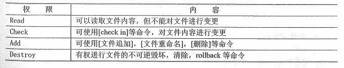
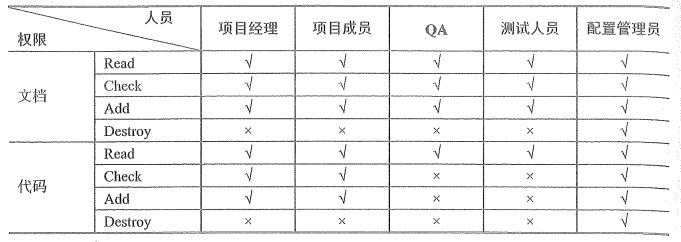
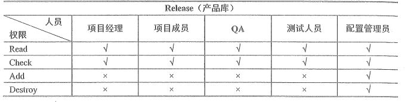
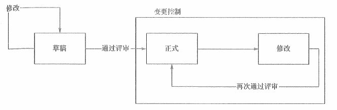

# 信息文档管理与配置管理

对于项目管理来说，文档非常重要，如果是传统的工程行业项目的话，仅仅标书就是几百上千页的。相对来说，其实信息系统开发项目已经好很多了。另外就是配置项，它是比文档更大的一个概念，项目文档是包含在配置项中的，除了文档之外，它还包括源程序、计划、报告等。今天我们就主要来看一看在信息系统项目中的这些文档和配置项相关的内容。今天的内容比较长，但是只是说明项比较多，重点内容其实还好。其它的相关了解知识也都是非常有用的内容，大家可以好好看看哦。

## 信息系统项目相关文档

软件系统相关的文档一般分为三类，包括 **开发文档**、**产品文档**、**管理文档** 。

### 开发文档

开发文档用于描述 开发过程本身 ，基本的开发文档包括：

- 可行性研究报告和项目任务书

- 需求规格说明

- 功能规格说明

- 设计规格说明，包括程序和数据规格说明

- 开发计划

- 软件集成和测试计划

- 质量保证计划

- 安全和测试信息

### 产品文档

产品文档主要是描述 开发过程的产物 ，包括产品使用、维护、增强、转换、传输方面的内容，这些文档包括：

- 培训手册

- 参考手册和用户指南

- 软件支持手册

- 产品手册和信息广告

### 管理文档

管理文档记录项目管理的信息，例如：

- 开发过程的每个阶段的进度和进度变更的记录

- 软件变更情况的记录

- 开发团队的职责定义

- 项目计划、项目阶段报告

- 配置管理计划

### 文档的质量

文档的质量可以分为四级：

- 1）**最低限度文档（1级文档）**，适合开发工作量低于一个人月的开发者自用程序。该文档应包含程序清单、开发记录、测试数据和程序简介。

- 2）**内部文档（2级文档）**，可用于没有与其他用户共享资源的专用程序。除1级文档提供的信息外，2级文档还包括程序清单内足够的注释以帮助用户安装和使用程序。

- 3）**工作文档（3级文档）**，适合于同一单位内若干人联合开发的程序，或可被其他单位使用的程序。

- 4）**正式文档（4级文档）**，适合那些要正式发行供普遍使用的软件产品。关键性程序或具有重复管理应用性质（如工资计算）的程序需要4级文档。4级文档遵守 GB/T8567-2006 的有关规定。

## 配置管理

配置管理是为了系统地控制配置变更，在系统的整个生命周期中维持配置的完整性和可跟踪性，而标识系统在不同时间点上配置的学科。在 GB/T 11457-2006 中，将配置管理定义为：“应用技术的和管理的指导和监控方法以标识和说明配置项的功能和物理特性，控制这些特征的变更，记录和报告变更处理和实现状态并验证与规定的需求的遵循性。”

其实，从上面的定义中，我们就可以看出，配置管理实际是为了解决多重维护、同时修改以及丢失版本或不知版本的问题。它包括 6 个主要的活动：制订配置管理计划、配置标识、配置控制、配置状态报告、配置审计、发布管理和交付。而 CMMI 定义的配置管理主要包含制定配置管理计划、识别配置项、建立配置管理系统、创建或发行基线、跟踪变更、控制变更、建立配置管理记录、执行配置审核、版本控制这些步骤。

### 配置管理计划

配置管理计划的主要内容包括配置管理软硬件资源、配置项计划、基线计划、交付计划、备份计划、配置审核和评审、变更管理等，由 CCB（变更控制委员会）审批该计划。制定配置管理计划，便于配置管理员按计划开展配置管理工作，并保持配置管理工作的一致性。制定配置管理计划的步骤包括：

- 建立并维护配置管理的组织方针

- 确定配置管理需使用的资源

- 分配责任

- 培训计划

- 确定配置管理的项目干系人，并确定其介入时机

- 制定识别配置项的准则

- 制定配置管理软件资源

- 制定基线计划

- 制定配置库备份计划

- 制定变更控制流程

- 制定审批计划

### 配置项

GB/T 11457-2006 中对配置项的定义为：“为配置管理设计的硬件、软件或二者的集合，在配置管理过程中作为一个单个实体来对待。”可以作为配置项的有：外部交付的软件产品和数据、指定的内部软件工作产品和数据、指定的用于创建或支持软件产品的支持工具、供方/供应商提供的软件和客户提供的设备/软件。典型配置项包括项目计划书、需求文档、设计文档、源代码、可执行代码、测试用例、运行软件所需的各种数据，它们经评审和检查通过后进入配置管理。

在识别配置项的过程中，要遵循下列步骤：

- 识别配置项

- 为每个配置项指定唯一的标识号

- 确定每个配置项的重要特征

- 确定配置项进入配置管理的时间

- 确定每个配置项拥有者的责任

- 填写《配置项管理表》

- 审批《配置项管理表》

需要加以控制的配置项可以分为基线配置和非基线配置项两类，基线配置可能包括所有的设计文档和源程序等；非基线配置可能包括项目的各类计划和报告等。所有配置项的操作权限应由CMO（配置管理员）严格管理，基本原则是：基线配置项向开发人员开放读取权限；非基线配置项向 PM、CCB 及相关人员开放。这个我们后面还会说。

### 建立配置管理系统

配置管理系统用于控制工作产品的配置管理和变更管理。该系统包括存储媒体、规程和访问配置系统的工具，用于记录和访问变更请求的工具。CMO（配置管理员）建立并维护用于控制工作产品的配置管理系统和变更管理系统。建立配置管理系统的步骤包括：

- 建立使用于多控制等级配置管理的管理机制

- 存储和检索配置项

- 共享和转换配置项

- 存储和复原配置项的归档版本

- 存储、更新和检索配置管理记录

- 创建配置管理报告

- 保护配置管理系统的内容

- 权限分配

### 配置库

配置库是用于记录与配置的所有信息，是配置管理的有力工具，利用库中的工具可评价变更的后果，这对变更控制有重要意义。从库中还可以提取各种配置管理过程的管理信息，可利用库中的信息查询回答许多配置管理的问题。

配置库可以分为三种类型：

- **开发库**（Development Library），也称为动态库、程序员库、动态系统、开发系统、工作空间或工作库，用于保存开发人员当前正在开发的配置实体。无需对其进行配置控制。主要供开发人员使用，修改频繁，控制宽松。

- **受控库**（Controlled Library），也称为主库、系统库、主系统、受控系统，包含当前基线加上对基线的变更。受控库中的配置项被置于完全的配置管理之下，保存生存期内某一阶段结束时发布的阶段性产品。

- **产品库**（Product Library），也称为静态库、发行库、软件仓库、备份库、静态系统等。包含已发布使用的各种基线的存档，被置于完全的配置管理之下。在开发的信息系统产品完成系统测试之后，作为最终产品存入产品库内，等待交付用户或现场安装。

配置库的建库模式有两种：

- 按配置项的类型分类建库。这种形式适用于产品的继承性较强，工作比较统一，对并行开发有一定的需求。优点是有利于对配置项的统一管理和控制，同时也能提高编译和发布的效率。缺点是由于这样的库结构并不是面向各个开发团队的开发任务，所以可能会造成开发人员的工作目录结构过于复杂，带来一些不必要的麻烦。

- 按开发任务建库。也可以说是按项目建立相应的配置库。适用于专业软件相关的研发组织，优点在于设置策略灵活，缺点则是不利于对配置项的统一管理和控制。

配置库的权限管理非常重要，我们主要通过三个表格来看一下：

这三个表格其实很清楚了，第一个表格说明的是四种操作权限所代表的含义。后两个表格说明的则是不同的角色在不同的库中所拥有的权限。这两个表格大家可以用心多看几遍，选择题有可能就冷不丁的来一个项目经理在产品库有没有追加权限之类的问题。

### 版本控制

配置项的状态可以分为“草稿（Draft）”、“正式发布（Released）”和“正在修改（Changing）”三种。配置项刚建立时，其状态为“草稿”。配置项通过评审后，其状态变为“正式”。此后若更改配置项，则其状态变为“修改”。当配置项修改完毕并重新通过评审时，其状态又变为“正式”。这三种状态变化的过程可以参考下图加深理解。

配置项的版本号规则与配置项的状态相关：

- 处于“**草稿**”状态的配置项的版本号格式为 0.YZ ，YZ的数字范围为01-99。随着草稿的修正，YZ的取值应递增。YZ的初值和增幅由用户自己把握。

- 处于“**正式**”状态的配置项的版本号格式为X.Y，X为主版本号，取值范围为1-9，Y为次版本号，取值范围为0-9.

- 处于“**修改**”状态的配置项的版本号格式为X.YZ。配置项正在修改时，一般只增大Z值，X.Y值保持不变。当配置项修改完毕，状态成为“正式”时，将Z值设置为0，增加X.Y值。

一般来说，配置项的版本控制流程是先创建配置项，然后修改处于“草稿”状态的配置项 0.YZ 的或者“发布”状态的 X.YZ 变成“修改”状态，版本号变成 X.Y 。然后通过技术评审或领导审批，成为正式“发布”版本，版本号也转为 X.Y 。之后进行的变更就继续重复上述的流程即可。

### 配置基线

之前我们一直提到了一个名词：基线。不知道大家有没有印象，其实基线（配置基线）就是一组经过正式审查并且达成一致的规范或工作产品，是开发工作的基础。基线由一组配置项组成，这些配置项构成了一个相对稳定的逻辑实体。基线通常对应于开发过程中的里程碑，一个产品可以有多个基线，也可以只有一个基线。基线的主要属性有：名称、标示符、版本、日期等。

对于基线来说，有几种不同的角度可以划分出许多不同的基线。

- 国家标准：功能基线（系统规格说明）、分配基线（需求规格说明书）、产品基线（软件产品所有配置项规格说明）

- 实际工作：需求基线、设计基线、测试基线、产品基线

- 对内对外：发行基线（交付给外部客户）、构造基线（企业内部使用）

上面的这几种基线类型的划分也是很容易出选择题的内容哦。建立配置基线的步骤可以概括为以下几步：获得CCB授权、创建构造基线或发行基线、形成文件、使基线可用。

### 配置审核

配置审核主要是对配置项的处理是否有背离初始的规格说明或已批准的变更请求的现象。配置审核的目的就是为了确保项目配置管理的有效性。具体来说包括：防止不适用的产品；发现不完善的地方；找出各配置项之间不匹配的地方；确认配置项已在所要求的质量控制审查之后作为基线入库保存；确认记录和文档保持着可追溯性。

对于配置审核也有两个分类：

- **功能配置审核**：功能配置审核主要是针对验收的，着重与功能和文档性的完备。包括：检查配置项的 开发 是否已圆满 完成 ；配置项是否 已达 到规定的 性能 和 功能 特定特性；配置项的运行和支持 文档 是否完成，是否符合要求。

- **物理配置审核**：物理配置审核其实主要就是针对开发过程是否正确的审核。包括：每个构建的配置项是否符合相应的技术文档（系统规格说明书、需求文档、编码标准等）；配置项与配置状态报告中的信息是否相对应。

### 配置状态报告

配置状态报告详细记录了开发过程中的每一项变更，反映了开发活动的历史情况，从而达到提高所有开发人员之间的通信能力，避免出现不一致和冲突的目的。它的内容包括：变更内容、变更原因、变更请求人和实施人、变更发生时间、变更影响分析。其实配置状态报告记录的都是变更相关的内容，毕竟没有变更状态也就不会发生变化，也就没有报告记录的必要，后面我们还有一课是专门讲项目变更的。配置状态报告的任务是有效记录和报告管理配置所需要的信息。它的目的是及时、准确地将软件配置项的当前状况，供相关人员了解，以加强配置管理工作。

### 配置管理中的角色分工

最后我们再简单地了解一下配置管理中的角色和分工情况。配置管理过程中有几个重要的角色，分别是项目经理、配置控制委员会、配置管理员、开发人员。

项目经理（PM）是整个信息系统开发和维护活动的负责人，他根据配置控制委员会的建议，批准配置管理的各项活动并控制它们的进程。其具体工作职责如下：

- 制定项目的组织结构和配置管理策略

- 批准、发布配置管理计划

- 决定项目起始基线和软件开发工作里程碑

- 接受并审阅配置控制委员会的报告

配置控制委员会（CCB）负责指导和控制配置管理的各项具体活动的进行，为项目经理的决策提供建议。其具体工作职责包括：

- 批准配置项的标志以及软件基线的建立

- 制定访问控制策略

- 建立、更改基线的设置、审核变更申请

- 根据配置管理员的报告决定相应的对策

配置管理员（CMO），根据配置管理计划执行各项管理任务，定期向 CCB 提交报告，并列席 CCB 的例会。他们的具体工作职责包括：

- 软件配置管理工具的日常管理与维护

- 提交配置管理计划

- 各配置项的管理与维护

- 执行版本控制和变更控制方案

- 完成配置审计并提交报告

- 对开发人员进行相关的培训

- 识别开发过程中存在的问题并制定解决方案

开发人员（Dev），他们的职责就是根据项目组织确定的配置管理计划和相关规定，按照配置管理工具的使用模型来完成开发任务。

## 总结

看着感觉非常多吧？其实重点需要我们关注的内容并不是特别多，包括文档分类、文档等级、配置库、版本号、配置审核分类这几块，在上面也都加粗或者标红了。其它的内容其实就像开头说过的一样，也都是非常有意思的内容，有兴趣的同学可以查阅相关的资料继续深入学习哦。

参考资料：

《信息系统项目管理师教程》 

《某机构培训资料》

《项目管理知识体系指南 PMBOK》第六版