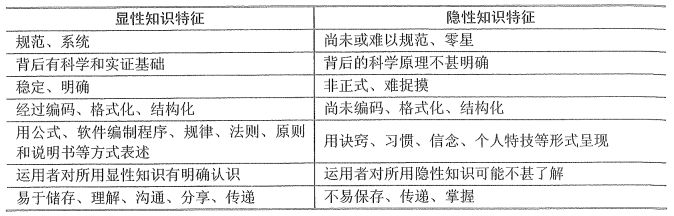

# 知识管理与知识产权

想必你对知识的概念多少都会有一些自己的理解，毕竟我们经过了那么多年的教育，学来学去可不都学习的是“知识”嘛。在今天的学习中，内容还是会比较多，因为除了知识管理相关的内容之外，还有知识产权相关的法律法规的学习，这里必须都是原样摘抄的，所以后面的内容会比较多。不过也不用太过于担心，大家只要把握关键点进行记忆就可以啦！

## 知识与知识管理

知识是符合文明方向的，人类对物质世界以及精神世界探索的结果总和。知识，也没有一个统一而明确的界定。但知识的价值判断标准在于实用性，以能否让人类创造新物质，得到力量和权力等等为考量。

以上是关于知识这个概念在百科中的定义。看着还是比较抽象的吧。其实知识就是一种数据，根据一定的范式组合成的包含一些特定领域相关的信息认知。它来源于实践，反作用于实践，指导实践，是解决问题的结构化信息。

### 知识管理

知识管理就是对有价值的信息进行管理，包括知识的识别、获取、分解、储存、传递、共享、价值评判和保护，以及知识的资本化和产品化。知识管理主要涉及的工作包括：自上而下地监测、推动与知识有关的活动；创造和维护知识基础设施；更新组织和转化知识资产；使用知识以提高其价值。知识管理在知识资产管理、学习型组织、人力资源和信息化四个方面进行深化和突破。同时，知识管理应有外部化、内部化、中介化和认知化四种功能。知识管理的目标包括：

- 知识发布，以使一个组织内的所有成员都能应用知识

- 确保知识在需要时是可得的

- 推进新知识的有效开发

- 支持从外部获取知识

- 确保知识、新知识在组织内的扩散

- 确保组织内部的人知道所需的知识在何处

对于信息系统项目来说，知识管理的必要性也是非常显而易见，比较官方的归纳一下的话大致包括：

- 项目的设计开发过程可以看作是知识转化过程，即将用户需求、技术知识转化进信息系统与技术方案设计

- 信息系统项目的本质要求以有效的方法分享知识和有效管理相关的信息

- 项目过程需要交流，而交流建立在知识、技能和经验的基础之上

信息系统项目知识管理还有一些特点是需要我们了解一下，当然这部分算不上是重点，大家看看了解一下就好。

- 通过对知识的更有效利用来提高项目组织创造价值的能力

- 将知识视为项目团队最重要的战略资源，把最大限度地掌握和利用知识作为提高团队设计开发能力的关键

- 将存在于项目中的人力资源的不同方面知识和技术、乃至项目战略等协调统一起来，创造出整体大于局部之和的效果

- 内涵于组织的发展进程，并寻求将信息技术所提供的对数据和信息的处理能力与人的发明和创新能力进行有机结合

- 为使项目团队及成员适应现代科技复杂多变的环境，知识管理应起到辅助工具的作用

### 知识管理的分类

知识可以分为两类，分别是显性知识（explicit knowledge）与隐性知识（tacit knowledge）。显性知识是能以文字与数字来表达，而且以资料、科学法则、特定规格及手册等形式展现出来的知识；隐性知识则是很难用公式或文字来加以说明，难以流传或与人分享，个人洞察力、直觉与预感等皆属隐性知识。关于这两种知识分类的具体特征和区别联系，可以参考下图中的这个表格。

在知识管理的过程，积累、共享和交流是三个基本的原则，这三个原则不管对于显性知识还是隐性知识来说都是通用的。但就像上表中展示的那样，显性和隐性知识还是有许多不同的，所以我们还有专门针对显性知识和隐性知识的管理。接下来就一一了解一下。

### 显性知识管理

显性知识管理有五个步骤是必须的，分别是：采集、过滤、组织、传播和应用。它们能够保证显性知识被有效管理。同时，在信息系统集成项目中，项目组织在制度平台的建设上有4点也是必须做到的，分别是：

- 创建更多的团队成员之间的交流机会

- 建立显性知识索引

- 组织高层的参与和支持

- 与绩效评估体系的结合

### 隐性知识管理

隐性知识是指难以表达、隐含于过程和行动中的非结构化知识，是知窍（Know-how，技能知识）和知人（Know-who，人力知识）两方面的知识，具体表现为个人的技能、经验诀窍、心智模型、解决问题的方式和组织惯例。

隐性知识分布在整体组织中，在不同层次的知识主体之中都存在，主要包括：团队成员个体、群体（项目团队、部门）、组织、组织外部这四种不同的层次。在这些层次中共享知识的方法则主要包括：编码化、面对面交流、人员轮换、网络等。

隐性知识共享的途径主要包括：创建学习型组织，充分发挥知识团队的作用；构建项目组织内部的信任机制；项目组织隐性知识的编码化；设立知识主管，加强隐性知识学习与共享；项目组织内部建立限制知识垄断的机制；通过利益驱动，促进隐性知识的共享；创建以人为本的组织文化。

隐性知识共享的步骤包括：忘却片面的假设和观念；评价项目中隐性知识共享的必要性与可行性；制订项目中隐性知识共享计划；小范围的试验；隐性知识共享方法的推广；学习效果评估与反馈；项目中隐性知识经验的积累与推广。

### 知识管理的工具

知识管理工具是实现知识的生成、编码和转移（传送）的集合。一般包括三类：

- 知识生成工具：具有知识获取、知识合成和知识创新三大功能，具体工具包括搜索引擎、数据挖掘等。

- 知识编码工具：通过标准的形式表现知识，使知识能够方便地被共享和交流。

- 知识转移工具：使知识能够在企业内传播和分享。在知识流动的过程中，存在许多障碍，使知识不能毫无阻力地任意流动。这些障碍可分为三类，分别是时间差异、空间差异、社会差异。

### 学习型组织

学习型组织（Learning Organization）是一个能熟练地创造、获取和传递知识的组织，同时也要善于修正自身的行为，以适应新的知识和见解。当今社会中的组织主要就是两种类型，一类是等级权力控制型，另一类是非等级权力控制型，这种就是学习型组织。

学习型组织的要素包括：建立共同愿景；团队学习；改变心智模式；自我超越；系统思考。

学习型组织的特征包括 8 点：

- 组织成员拥有一个共同的愿景

- 组织由多个创造性个体组成

- 善于不断学习

- 扁平式结构

- 自主管理

- 组织的边界将被重新界定

- 家庭与事业的平衡

- 领导者的新角色

学习型组织的意义包括：

- 解决了传统组织的缺陷

- 为组织创新提供了一种操作性比较强的技术手段

- 解决了组织生命活力问题

- 提升了组织的核心竞争力

## 知识产权

知识产权方面相关的内容我们会介绍到著作权法、计算机软件保护条例、商标法、专利法、不正当竞争法这五部分的内容。关于法规方面的内容，抓住核心知识点进行记忆，没有别的办法，而且要非常仔细认真地记忆。如果你接触过国家司法考试，那么一定了解过法律知识都必须是要求严谨的，所以我们也要以严谨的态度来对待这些相关的法规内容的学习。不过限于篇幅，我们只摘取比较重要的部分，这些内容在书上都有，大家可以做好记录多多复习。

### 著作权法

著作权法中的客体主要指的是受保护的作品。包括文学、艺术、自然科学、社会科学和工程技术领域内具有独创性并能以某种有形形式复制的智力成果。在这其中，为完成单位工作任务所创作的作品，称为职务作品。

著作权法主体指的是著作权关系人，通常包括著作权人和受让者两种。著作权人又称为原始著作权人，是根据创作的事实进行确定的，依法取得著作权资格的创作、开发者；受让者又称为后继著作权人，是指没有参与创作，通过著作权转移活动而享有著作权的人。

著作权人对作品享有以下五种权利：

- 发表权：决定作品是否公之于众的权利。

- 署名权：表明作者身份，在作品上署名的权利。

- 修改权：修改或授权他人修改作品的权利。

- 保护作品完整权：保护作品不受歪曲、篡改的权利。

- 使用权、使用许可权和获取报酬权、转让权：以复制、表演、播放、展览、发行、摄制电影、电视、录像，或者改编、翻译、注释和编辑等方式使用作品的权利，以及许可他人以上述方式使用作品，并由此获得报酬的权利。

根据著作权法的相关规定，著作权的保护是有一定期限的，具体规定如下：

- 著作权属于公民。署名权、修改权、保护作品完整权的保护期没有任何限制，永远受法律保护；发表权、使用权和获得报酬权的保护期为作者终生及其死亡后的50年（第50年的12月31日）。作者死亡后，著作权依照继承法进行转移（多人合作的，按最后一位去世的计算）。

- 著作权属于单位。发表权、使用权和获得报酬权的保护期为50年（首次发表后的第50年的12月31日），若50年内未发表的，不予保护。但单位变更、终止后，其著作权由承受其权利义务的单位享有。

不算是侵犯著作权的行为：为个人学习、研究或欣赏（很多D版电影或软件都会说是为个人研究学习）；为介绍、评论某一个作品或说明某一个问题（抖音、B站的那些影视自媒体什么的）；报纸、期刊等评论；国家机关执行公务；免费表演已经发表的作品；对公共作品的临摹、录像；将作品翻译成少数民族文字或盲文等。

其实对于侵权的判断有一个很简单的标准，那就是你拿这个作品是不是去赚钱了。上述内容其实都是学习、公益、公务方向的使用，所以它们都是不侵权的。

### 计算机软件保护条例

由于计算机软件也属于著作权法保护的范围，因此，在具体实施时，首先适用于保护条例的条文规定，若是在保护条例中没有规定适用条文的情况下，才依据著作权法的原则和条文执行规定。

保护条例的客体是计算机软件，计算机软件是指计算机程序及其相关文档。对软件著作权的保护只是针对程序和文档，并不包括开发软件所用的思想、处理过程、操作方法或数学概念等。

关于著作权人的确定，我们可以分成三种情况来看一下：

- 合作开发：由两个或两个以上的开发者或组织合作开发的软件，著作权的归属根据合同约定确定。若无合同，则共享著作权。若合作开发的软件可以分割使用，则开发者对自己开发的部分单独享有著作权，可以在不破坏整体著作权的基础上行使。

- 职务开发：如果开发者在单位或组织中任职期间，所开发的软件符合以下条件，则软件著作权应归单位或组织所有：针对本职工作中明确规定的开发目标所开发的软件；开发出的软件属于从事本职工作活动的结果；使用了单位或组织的资金、专用设备、未公开的信息等物质、技术条件，并由单位或组织承担责任的软件。

- 委托开发：如果是接受他人委托而进行开发的软件，其著作权的归属应由委托人与受托人签订书面合同约定；如果没有签订合同，或合同中未规定的，则其著作权由受托人享有。由国家机关下达任务开发的软件，著作权的归属由项目任务书或合同规定，若未明确规定，其著作权应归任务接受方所有。

软件著作权享有几种权利，分别是发表权、署名权、修改权、复制权、发行权、出租权、信息网络传播权、翻译权、使用许可权、获得报酬权、转让权。软件著作权自软件开发完成之日起生效，有效期的规定如下：

- 著作权属于公民。著作权的保护期为作者终生及其死亡后的50年（第50年的12月31日），对于合作开发的，则以最后死亡的作者为准。

- 著作权属于单位。著作权的保护期为50年（首次发表后的第50年的12月31日），若50年内未发表的，不予保护。单位变更、终止后，其著作权由承受其权利义务的单位享有。

当得到软件著作权人的许可，获得了合法的计算机软件复制品后，复制品的所有人享有以下权利：

- 根据使用的需求，将该计算机软件安装到设备中（包括电脑、手持设备等）。

- 制作复制品的备份，以防止复制品损坏，但这些复制品不得通过任何方式转给其他人使用。

- 根据实际的应用环境，对其进行功能、性能等方面的修改。但未经软件著作权人许可，不得向任何第三方提供修改后的软件。

如果使用者只是为了学习、研究软件中包含的设计思想、原理，而以安装、显示和存储软件等方式使用软件，可以不经软件著作权人的许可，不向其支付报酬。

### 商标法

商标是指生产者和经营者为使自己的商品或服务与他人的商品或服务相区别，而使用在商品及其包装上或服务标记上的由文字、图形、字母、数字、三维标志和颜色组织，以及上述要素的组合所构成的一种可视性标志。有一些东西是不能当作商标的哦，比如说：国家、政府、国际组织标识；包含民族歧视、社会道德相关内容的标识；县级以上行政区划或外国地名。

两个或者两个以上的申请人，在同一种商品或者类似商品上，分别以相同或者近似的商标在同一天申请注册的，各申请人应当自收到商标局通知之日起30日内提交其申请注册前先使用该商标的证据。同日使用或者均未使用的，各申请人可以自收到商标局通知之日起30日内自行协商，并将书面协议报送商标局；不愿协商或者协商不成的，商标局通知各申请人以抽签的方式确定一个申请人，驳回其他人的注册申请。商标局已经通知但申请人未参加抽签的，视为放弃申请，商标局应当书面通知未参加抽签的申请人。

注册商标的有效期限为10年，自核准注册之日起计算。注册商标有效期满，需要继续使用的，应当在期满前6个月内申请续展注册；在此期间未能提出申请的，可以给予6个月的宽展期。宽展期满仍未提出申请的，注销其注册商标。每次续展注册的有效期为10年。

### 专利法

专利法的客体是发明创造，发明创造是指发明、实用新型和外观设计：

- 发明：是指对产品、方法或者其改进所提出的新的技术方案。

- 实用新型：是指对产品的形状、构造及其组合，提出的实用的新的技术方案。

- 外观设计：对产品的开关、图案及其组合，以及色彩与形状、图案的结合所做出的富有美感并适用于工业应用的新设计。

一份专利申请文件只能就一项发明创造提出专利申请。一项发明只授予一项专利，赋闲的发明申请专利，则按照申请时间的先后决定授予给谁。两个以上的申请人在同一日分别就同样的发明创造申请专利的，应当在收到国务院专利行政部门的通知后自行协商确定申请人。

发明专利保护期限为20年，实用新型和外观设计专利权的期限为10年，均从申请日开始计算。在保护期内，专利权人应该按时缴纳年费。在专利权保护期限内，如果专利权人没有按规定缴纳年费，或者以书面声明放弃其专利权，专利权可以在期满前终止。

### 不正当竞争法

不正当竞争是指经营者违反规定，损害其他经营者的合法权益，扰乱社会经济秩序的行为。不正当竞争行为包括十个方面，我们只简单了解其中几个方面即可。

- 假冒他人注册商标；擅自使用与知名商品相同或相近的名称、包装，混淆消费者；在商品上伪造认证标志、名优标志、产地等信息，从而达到损害其他经营者的目的。

- 以低于成本价进行销售，以排挤竞争对手。

- 捏造、散布虚拟事实，损害对手商誉。

- 串通投标，排挤对手。

## 总结

今天学习的内容中，显性知识和隐性知识相关的内容、学习型组织都是非常重要的内容。而在知识产权相关的知识中，时间、年限之类的概念很重要，比如说著作权相关的都和 50 年这个年份有关系，而商标的有效期则是 10 年。其它的概念性质的内容大家也可以多了解一下，虽说确实很难记，但是学法懂法怎么说都不会是一件吃亏的事。

参考资料：

《信息系统项目管理师教程》 

《某机构培训资料》

《项目管理知识体系指南 PMBOK》第六版