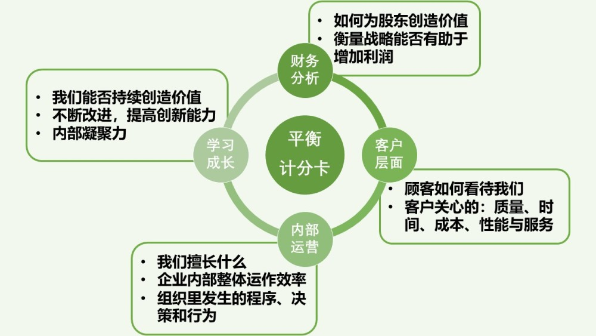
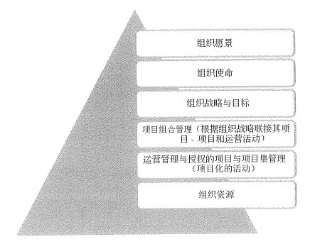
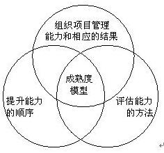
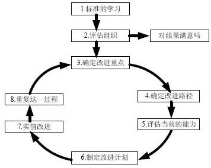
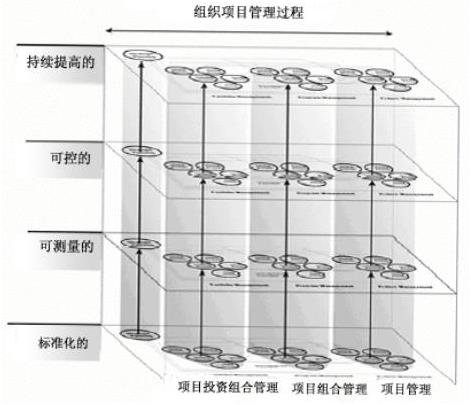

# 战略管理与组织级项目管理

战略这个词看着很高大上吧？不过千万不要以为只有董事长啊、总经理呀才需要战略眼光和战略管理。项目经理作为一个项目的第一负责人，也是需要有一定的战略思维的，而且所有的项目都是为组织的大战略服务的，所以，要想做好项目，战略思维也是不可或缺的。另外组织级的项目管理比我们针对单一项目的管理更高一层，也更复杂一些，多多了解一些也能让你在项目经理的道路上能够走得更远。

## 战略管理

企业战略是企业面对激烈变化、严峻挑战的环境，为求得长期生存和不断发展而进行的总体性谋划。长期计划是根据外推法得来的，是用于稳定的环境和可预期的环境，而战略计划可应对环境的改变。

组织战略规划是指依据组织外部环境和自身条件及其变化来制定和实施战略，并根据实施过程与结果的评价和反馈来调整，重新制定新战略的一个循环过程。战略管理是一个组织在一定时间内对其全局性、长远的发展方向、目标、任务和政策，以及对组织资源调配等方面做出的相应决策，以及对这些决策进行跟踪、监督、变更等方面的管理工作。战略管理的规划方式包括：自下而上的方法、自上而下的方法、上下结合的方法、设立特别小组法等。目前组织战略规划已经逐渐演变为需要组织高层随时拥有的一种常态性战略意识。

### 内容和实施

组织战略通常由以下几个因素组成：

- 战略目标：组织战略行动所要达到的预期结果。

- 战略方针：在特点阶段指导组织全局的方针，是指导组织行动的纲领（原则）。

- 战略实施能力：组织战略实施的物质基础（人才、资金）。

- 战略措施：为准备和进行战略管理而实行的具有全局意义的实施战略的重要保障。

说完组织战略的内容，我们再来看看战略实施。战略实施是一个自上而下的动态管理过程。所谓“自上而下”主要是指，战略目标在组织高层达成一致后，再向中下层传达。所谓“动态”主要是指战略实施的过程中，常常需要在“分析-决策-执行-反馈-再分析-再决策-再执行”的不断循环中达成战略目标。战略实施包括四个阶段：

- 战略启动阶段：领导层要研究如何将组织战略的愿景转变为组织员工的实际行动，调动起员工实现战略目标的积极性。

- 战略计划实施阶段：将组织战略分解为几个战略实施阶段，每个阶段都有相应的目标、政策、策略以及落实方针。

- 组织战略动作阶段：组织战略在组织内外部全面落实的阶段，与六个因素有关，即：各级领导人员的素质和价值观念；企业的组织结构；企业深层次文化；组织资源储备与分配；信息沟通；控制及激励等企业的各种组织制度。

- 组织战略的控制与评估：主要内容是组织建立的战略控制系统、绩效监控系统、对监控偏差的评估、控制及纠正方面的工作。

### 组织战略类型与层次

一般来说，组织面临的战略问题主要包括事业问题、工程问题和行政问题三类问题。其中事业问题主要关注组织如何管理市场占有率方面的问题；工程问题主要解决组织如何执行事业问题解决方案方面的问题，为事业问题解决提供工程方面的支持；行政问题是解决组织应该如何架构以适应解决前两方面问题的需要，解决的是组织的授权、沟通和具体实施架构方面的问题。

首先我们来看组织事业战略类型，它可以进一步细分为以下四种战略类型：

- **防御者战略（Defender）**。作为 相对成熟行业中的成熟组织，组织内部产品线较窄，同时组织高层也不愿意积极探索熟知领域以外的机会。除非顾客有紧迫的需要，否则高层不愿意就运作方法和组织的结构做出较大程度和范围的调整。组织努力的方向主要是提高组织的运行效率。国内可以参考联想，国外最典型的就是当年的诺基亚。

- **探索者战略（Prospector）**。主要致力于组织发现和发掘新产品、新技术和新市场可能为组织提供的发展机会，组织的核心技能是市场能力和研发能力，它可以拥有较多的技术类型和较长的产品线。这种公司是现在的主流，做得好很容易成为巨头，国内的小米，国外的超级巨头苹果。但前面也说过了，要做得好是要有天时、地利、人和的，所以探索者类型的公司失败得也很多。

- **分析者战略（Aanlyser）**。主要是保证组织在规避风险的同时，又能够提供创新产品和服务。主要应用于两种市场有效动作的组织类型：一类是在较稳定的环境，另一类是在变化较快的环境。前者强调规范化和高效率运作，后者强调关注竞争对手的动态并迅速作出有利的调整。这类公司比较典型的是华为和近些年的微软。之前的微软其实是防御型的，甚至有点退化到反应型的公司了。但是最近这两年它的战略出现了极大的调整，又重回世界顶级。在这其中，战略成功的作用非常明显。

- **反应者战略（Reactor）**。主要是指对外部环境缺乏控制，它既缺乏适应外部竞争的能力，又缺乏有效的内部控制机能。没有一个系统化的战略设计与组织规划。除非迫不得已，组织不会就外部环境的变化作出调整。这种就不多说了，传统夕阳行业、大多数小公司都是这样。

上面的组织事业战略类型主要是从事业问题的角度来进行的战略类型分类，我们还可以从行政问题的角度，以战略组织的结构来进行分类，从这个角度又可以包括以下五种类型：

- **指挥型战略组织模式**。适合一把手决策，战略简单，高度集权的组织。

- **变革型战略组织模式**。通过利用新组织机构或参谋人员来向全体成员传递战略重点，需要一个中间代理人。

- **合作型战略组织模式**。要求组织高层要与其他高层管理人员分担相关的战略责任，发挥集体智慧，以高层决策为主。

- **文化型战略组织模式**。运用组织文化手段，不断向全体成员传播战略思想，在组织内部建立起共同的价值观和行为准则。

- **增长型战略组织模式**。通过自下而上的推动，认真对待所有一般管理人员提出的一切有利组织发展的方案，鼓励成员的首创精神。

通过面向事业问题的组织事业战略类型划分和面向行政问题的战略组织类型划分，我们就可以清晰地了解到目前公司组织所处的事业类型或组织类型，也可以向上级提出一些意见建议去追求当前阶段更好的类型方案。除了战略类型之外，我们再了解一下组织的战略层次，它一般包括三个层次，分别是：

- **目标层**。介绍和说明组织的战略目标，包括组织层战略目标、事业层战略目标和职能层的战略目标。

- **方针层**。说明了在组织目标达成过程中，组织应该坚持的主要原则。

- **行为层**。在具体的执行层面，为了落实组织的战略目标和方针所采取的行动。

### 目标分解与项目管理

在组织战略的目标分解中，我们简单地了解一下 平衡计分卡（Balanced Score Card） 的概念。它是一种绩效评价体系，其本来的目的主要是找出超越传统以财务量度为主的组织绩效评价模式，以使组织的战略能够更加有效地转变为行动。

平衡计分卡主要通过财务、客户、内部运营、学习成长为指标来评价组织的绩效，根据组织生命周期的不同阶段的实际情况和采取的具体战略措施，为每一方面设计出适当的评价指标，实现了从抽象的、定性的战略到具体的、定量的目标的转化。

关于平衡计分卡更多的内容，大家可以自行查阅相关的资料，接下来我们就看看组织战略与项目管理相关的内容。

组织希望拥有的管理结构以实现组织的持续健康发展，而组织战略在某种程度上就是一个目标计划、政策、能力和行动等构成的综合体，为组织各个层面的发展提供整体的方向性指导，因此从项目管理的角度来看，项目组合、项目集和单项目就是在组织的各个层面进行对组织的战略进行细化和落实，保证组织战略目标的实现。

上面这个图展示的是组织结构与项目组合管理之前的关系。可以看到，组织资源是最低层的基础，向上的运营管理与单项目和项目集构成了组织中主要的产品产出，是整个组织运行的后勤保障，再向上的项目组合管理则是承上启下的桥梁，也是组织中连接战略与实施的核心。自上而下，是一个组织从愿景到资源的落地：愿景转化为使命，使命分解为战略和目标，项目组合管理生成项目、项目集和运营活动，运营与单项目产出产品，依靠产品发展继续扩展组织资源。而自下而上则是组织中利用基础资源实现组织愿景的方向：利用资源基础建设项目，形成项目组合实现组织战略，根据战略达成完成组织使命和愿景。

很明显，项目组合管理在上面这张图中有非常重要的连接作用。将项目组合管理与组织战略联系在一起的目标是在组织内部建立平衡、可执行的计划，帮助组织实现战略目标，并对组织战略形成一定的影响。项目组织计划对战略的影响主要体现在六个方面：

- 维持项目组合的一致性

- 分配财务资源

- 分配人力资源

- 分配材料或设备资源

- 测量项目组合组件绩效

- 管理风险

## 组织级项目管理

组织级项目管理是指在组织战略的指导下，具体落实组织的战略运行，从业务管理、组织架构、人员配置等多方面对组织进行项目化的管理。具体来说，就是要立足组织管理，从实现组织运营价值最大化的目标出发，考虑如何筹建组织级的项目管理体系，实现组织资源优化整合、提高项目成功率，并在项目立项和执行过程中及时把控市场和客户需求的变化，帮助组织快速调整经营目标和经营战略，有效地实现组织的战略目标的组织体系。

组织级项目管理是组织在其内部搭建起项目组织管理、项目集管理和单项目管理的各个领域，以及在这些领域之间支持实现最佳实践而提供的一个组织全局项目管理的框架体系。组织级项目管理识别出在组织中发挥重大影响的关键支撑点，包括组织治理、组织战略执行与单项目、项目集和项目组合交付之间的因果关系链条。其中，项目治理就是通过各项目组合、项目集和单项目系统地追踪组织的战略目标，并获得组织期望的成果。

在组织生命期中，组织不仅制定战略、实施战略，而且还需要根据战略执行的需要将相关资源分配到项目投资组合。组织级项目管理主要包括以下三个方面的目的：

- 指导组织的投资决策和恰当的投资组合，实现组织资源的最优化配置。

- 提供透明的组织决策机制，使组织项目管理的流程合理化和规范化。

- 提高实现期望投资回报率的可能性，加强对组织项目管控的系统性和科学性。

### 组织级项目管理内容

组织级项目管理内容由三部分组成，包括：

- 最佳实践。主要分为两类：一类是组织级项目管理 SMCI （标准化、度量、控制和持续改进）；另一类是组织运行潜能方面的最佳实践，实际上就是组织所能提供的条件支撑。

- 组织能力。也就是组织的资格素质。

- 成果。一般通过关键绩效指标（KPI）来进行度量。

### 组织级项目管理成熟度模型

项目管理成熟度是指一个组织（通常是一个企业）具有的按照预定目标和条件成功地、可靠地实施项目的能力。严格地讲，项目管理成熟度应该指的是项目管理过程成熟度。常见的项目管理成熟度模型包括：SEI提出的CMM模型（CMMI）、PMI提出的OPM3模型、Harold Kerzner提出的K-PMMM模型、FM solution提出的FMS-PMMM模型等。

在这些模型中，CMMI 我们之前在 【信管1.9】软件工程（三）软件设计与过程管理 就已经学习过了，在这里也就不在重复赘述了。小伙伴们如果忘了 CMMI 讲的是啥，可以回去再看看。我们先来简单了解一下 K-PMMM ，它包括以下几方面的内容：

- 通用术语：在组织的各层次、各部门使用共同的管理术语。

- 通用过程：在一个项目上成功应用的管理过程，可重复用于其他项目。

- 单一方法：组织认识到了把公司所有方法结合成一个单一方法所产生的协同效应，其核心就是项目管理。用项目管理来综合TQM、风险管理、变革管理、协调设计等各种管理方法。

- 基准比较：组织认识到，为了保持竞争优势，过程改进是必要的。将自己与其他企业及其管理因素进行比较，提取比较信息，用项目办公室来支持这些工作。

- 持续改进：从基准比较中获得的信息建立经验学习文档，组织经验交流，在项目办公室的指导下改进项目管理战略规划。

接下来，我们着重看一下 OPM3 模型。

### OPM3模型

组织级项目管理 OPM3 是一个战略执行框架，利用项目组合、项目集项目管理及组织运行潜能实践，自始至终地、可预测地交付组织战略，以产生更好的绩效、更好的结果和持续的竞争优势。OPM3 是人员、知识和过程的集成。

从 OPM3 的应用过程可以看出，它是一个循环改进的过程，其实和 PDCA 这种执行循环非常像，但 OPM3 是针对于组织的项目管理方面的执行模型。在这个图中，你可以发现 知识、评估、改进 这三个重要的内容。同时，它也是一个三维模型。

第一维是成熟度的四个梯级，包括：标准化、可测量的、可控的、持续改进的。

第二维是项目管理的十个领域和五个基本过程，也就是我们之前学习过的 PMP 中的内容，包括：启动过程组、计划过程组、执行过程组、监控过程组、收尾过程组，然后是十大知识领域，整体管理、范围管理、进度管理、成本管理、质量管理、人力资源管理、沟通管理、干系人管理、风险管理、采购管理。

第三维是组织项目级项目管理的三个版图层次，也就是单个项目管理、项目组合管理和项目投资组合管理。

## 总结

今天的内容其实是比较偏高层一些的管理知识，需要重点关注的是组织战略类型与层次以及OPM3相关的内容。其它的内容大家了解一下即可。对于项目经理来说，这些知识其实在日常的工作中也是非常有用的，特别是对于组织战略的分解其实就是分解成一个个的项目。所以，PM 们，有时间还是多学习学习高层战略相关的管理知识，能够搞明白老板的想法，站在老板的角度去思考问题，理清当前组织的战略类型，这样对你带项目会有更大的帮助。

参考资料：

《信息系统项目管理师教程》 

《某机构培训资料》

《项目管理知识体系指南 PMBOK》第六版