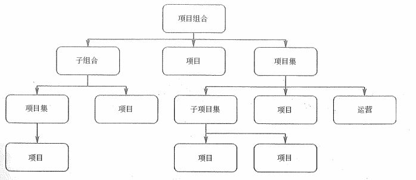

# 项目集与项目组合管理

之前学习的 PMP 相关的项目管理知识，其实都是针对一个项目的管理过程。但是，在一个组织企业中，往往不止一个项目，可能会有多个相关联的项目，这种情况就叫做项目集。另外，多个项目一起完成一个战略目标的这种情况，则叫做项目组合。今天，我们就来看一看项目集和项目组合管理相关的内容。

## 项目集管理

项目管理协会 PMI 将项目集定义为：经过协商管理以获取单独管理所无法取得的收益的一组相关联的项目、子项目集和项目集活动。项目集内的所有项目通过共同的目标相关联，也就是说项目集中的项目是彼此相互依赖的。

如果项目集各干系人有不同的目标，并且这些目标不具有有协调收益的交付特征，只是在资金、技能、干系人等方面存在关联，则这些最好通过项目组合，而不是使用项目集方法来对这些组件进行管理。

项目集管理的标准内容包括以下几个概念：

- 其他工作：是指若干面向项目集活动，由项目集经理履行，但不直接属于任何项目集内单个子项目集或项目的活动。

- 组件：指项目集中一个或多个工作内容，如单个项目、子项目集、其他工作。

- 项目集活动：在项目期间执行的、清晰的、已安排好的工作组成部分。

- 子项目集：作为一个项目集的组成部分而被管理的一个项目集。

项目集管理中涉及到的角色包括：项目经理、项目集经理、项目集管理团队成员、项目组合经理、干系人、发起人和受益人。

项目集管理的过程域包括项目集管理绩效域与项目集管理支持域。项目集管理绩效域中包含有项目集战略一致性管理；项目集收益管理；项目集干系人管理；项目集治理；项目集生命周期管理。项目集管理支持域包含的就是 PMP 中的十大知识领域，也就是整体、范围、进度、成本、质量、人力资源、干系人、沟通、风险、采购相关的内容。下面我们集中看一看项目集管理中的管理过程，其中项目集治理和项目集生命周期管理我们会单独说，其它的则包含在项目集管理的小节中。

### 项目集管理过程

在项目集管理过程中，我们主要关注三个方面的内容，分别是项目集与组织战略的一致性、项目集愿景和计划、项目集路线图。

项目集与组织战略一致性指的就是项目集的商业论证，即对项目集的可行性研究。它的输入包括：市场机遇、客户或合作伙伴需求、股东建议、政府规章、竞争对手的行动、组织内部的战略发展的需求、事业环境因素。它的工具与技术包括：市场的比较优势分析、组织内外部的可行性分析、SWOT分析、假设分析、历史信息。最后是它的输出有：项目集初始方案、对初始方案进行调整后组建项目集、拒绝项目集的初始方案以及要求相关人员和组织提供更详细的方案。

项目集愿景和计划指的是在项目集的生命周期不断演进的过程中，计划会滚动式地演进发展。这个过程的输入包括有：项目集商业论证及评审意见、组织战略、重要干系人需求、相关合同、合作协议、前期项目集文件、事业环境因素、项目集资源储备、国家政策和市场变化、相关标准与规范、相关历史信息。它的工具与技术包括：项目集管理信息系统、专家判断、焦点小组、引导技术、意见领袖、情景分析、头脑风暴、进度和成本的参考模型等。最后它的输出就是项目集整体计划和各子计划。

项目路线图是按照时间顺序以图形化的方式展现项目集预期发展方向，并在每个时间顺序事件建立系列的文档化标准，同时建立了项目集活动与预期收益之间的关系，以及项目集里程碑之间的关键依赖，传递业务战略与规划的优先级之间的连接。它与项目集进度计划类似，勾勒出项目集事件，也可以看作是项目集关键里程碑计划。

### 项目集治理

项目集治理涵盖了由发起组织对项目集战略进行定义、授权、监督和支持的体系和方法，是项目集发起组织确保项目集被有效和持续管理而执行的实践和流程。对于项目集的治理，具体包括：

- 项目集指导委员会的建立

- 项目集指导委员会的职责界定

- 项目集治理和项目集管理之间的关系

- 与项目集治理相关的个人角色

- 项目集作为治理主体——项目集组件治理

- 其他支持项目集管理的治理活动

项目集指导委员会也称为项目集治理委员会、项目集董事会、监督委员会，其职责主要是负责定义并执行恰当的项目集治理体系和方法，保证项目集执行与组织的战略目标保持一致，并为指导项目集的正常管理提供支持。项目集指导委员会成员通常由决策层干系人组成，能够为实现项目集目标收益提供足够的资源。特定项目可以建立多个指导委员会。项目集指导委员会的角色包括：项目集发起人、项目集治理委员会成员、项目集经理、组件经理、项目集团队成员。项目管理委员会的职责有：

- 保证项目集与组织愿景和目标的一致性

- 项目集批准和启动

- 确保项目集获得必要的资金支持

除了项目集指导委员会外，项目集治理还包括一些其他活动：

- 项目管理办公室（PMO）：项目集一般规模较大，管理工作繁杂，所以会成立项目管理办公室来承担相关的管理职能。可以有正式或非正式的 PMO ，也可以建立多个 PMO 。可能负有向某一项目组合内不同的项目集提供集中的、一致的项目集管理专业知识的任务。PMO 可能仅仅负责实施某一个或多个关键的项目集任务，如关于技术方面的任务，关于沟通协调方面的任务。

- 项目集管理信息系统。

- 项目集知识管理：包括跨项目集的知识收集与共享、掌握项目集具体知识内容的个人和主题专家知识的挖掘和整理、存储收集项目集知识和项目集构件的项目管理信息系统建设。

- 项目集管理审计：内外部人员审计均可。

- 项目集管理资源池。

- 项目集管理教育和培训。

### 项目集生命周期管理

根据项目集收益的实现情况将项目集生命周期划分为项目集定义阶段、项目集收益交付阶段和项目集收尾阶段。一般情况下，项目集开始于资金被批准或项目集经理得到任命，该过程及在该过程之前进行的大量相关前期准备工作属于项目集的定义阶段。项目集收益交付阶段则主要是指组件得到批准、计划和执行的过程，在该过程中项目集相关收益也得以交付。在期望收益实现时，或者由于其他原因导致项目集及相关组件关闭时，则进入项目集收尾阶段。

项目集定义阶段实际上就是项目的立项、启动和准备阶段。它包括：

- 构建项目集：获得项目集资金；进行范围、资源和成本的初始研究和估算；进行项目集初始风险评估；开发项目集章程及项目集路线图。

- 项目集准备：建立项目集治理结构、组件初始的项目集组织、制订项目集管理计划。

项目集收益交付阶段，主要就是组件的一些管理过程，包括：组件规划和授权、组件监管和整合、组件移交和收尾。

项目集收尾阶段则是对所有内部组件的收尾，包括项目集移交和项目集关闭两个操作。

## 项目组合管理

项目组合是将项目、项目集，以及其他方面的工作内容组合起来进行有效管理，以保证满足组织的战略性的业务目标。这些组件是可量化的，也就是说可以被度量、排序以及分优先级。

从上图中可以看出，项目组合是包含项目集、项目、项目组合子集以及日常运作业务的，其目的在于通过组合管理的方式来实现组织的战略目标。下面这个表的内容大家可以详细地了解一下。

项目组合管理就是对一组或多组项目组合进行管理，以达成组织的战略目标的过程。

### 项目组合管理与组织级项目管理和组织战略的关系

组织级项目管理是一种战略执行方案，它借助于项目组合管理、项目集管理、项目管理以及其他管理实践途径，以持续的、可预测的方式执行组织战略，以便获得更好的绩效、更好的结果以及可持续的竞争优势。在组织级项目管理中，要求项目组合、项目集及项目与组织的战略方向保持一致；另一方面，三者为实现战略目标所做出的贡献又各有不同。

项目组合通过选择正确的项目集和项目、设定工作的优先级别并提供必需的资源的方式来促成组织的战略实现；项目集管理则是对所包括的项目子集和项目的依赖关系进行有效管理，从而实现项目集的特定利益；项目管理通过制定和实施集合来完成特定的工作范围，支持项目集和项目组合目标的实现，最终确保组织战略得以实现。

项目组合计划与组织战略环境的关系可以参考下面这张图。

组织的战略目标向下就是项目组合的管理，反过来说，项目组合管理实际上就是实现组织战略目标的一种工具与技术。项目组合计划在以下六个方面与组织战略高度相关：

- 维护项目组合与战略的一致性

- 分配财务资源

- 分配人力资源

- 分配物料或设备资源

- 度量项目组合中的模块绩效

- 管理风险

### 项目组合组件

项目组合组件包括项目集管理、项目管理、日常运作管理（运营）、项目组合治理。其中项目组合治理的管理过程又包括：

- 制订项目组合治理计划

- 定义项目组合

- 优化项目组合

- 批准项目组合

- 执行项目组合监督

### 项目组合管理过程实施

项目组合管理过程实施主要包括：评估项目组合管理过程的当前状态；定义项目组合管理的愿景和计划；实施项目组合管理过程；改进项目组合管理过程这四个方面。项目组合管理是一个持续的过程（不像项目或项目集管理有计划好的开始和结束），某些活动可能循环发生，真正有效的项目组合管理必须是一个动态、反复、交互的系统。

### 项目组合管理过程组

从上表中可以看出，项目组合管理的过程组有三个，分别是定义、调整、授权与控制三个过程组。其中包含的过程有战略、治理、绩效、沟通、风险管理五个方面。

这张图展示的是项目组合管理过程组和组织战略与目标的关系，以及能够影响项目组合管理环境的组织过程。大家了解一下即可。在项目组合管理过程的五个过程中，使用到的很多工具与技术都是我们之前学习过的工具，比如在风险管理中会用到风险评估（概率与影响矩阵）等等。在这里我们还要注意的是，单个项目是自下而上的管理方式，而项目组合管理是自上而下的管理方式。

最后我们再来看一下项目组合管理的作用主要体现在以下几个方面：

- 在组织内引进统一的项目评估与选择机制

- 实现项目的财务和非财务收益，保持竞争优势

- 对组织中所有的项目平衡

- 在组织范围内为项目分配资源，保证高优先项目的资源分配

## 总结

今天我们主要学习的就是项目集和项目组合管理相关的知识，可以看出，它们都是单个项目管理的上级应用。重点内容在于要搞清楚项目集管理、项目组合管理相关的概念、区别。另外就是这些相关管理中的一些过程、工具相关的概念。这一块其实非常容易搞混，大家要注意区分哦！

参考资料：

《信息系统项目管理师教程》 

《某机构培训资料》

《项目管理知识体系指南 PMBOK》第六版