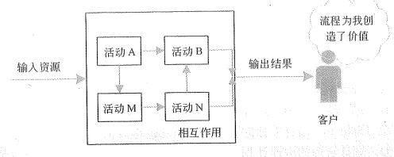
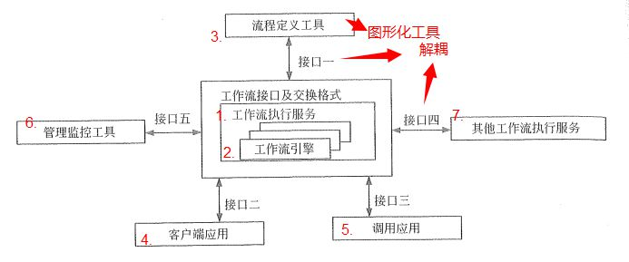
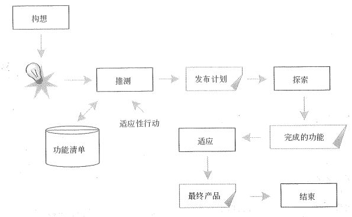

# 流程与量化项目管理

恭喜大家，总算到了整个 信管师 核心课程的最后一课了，开心不？激动不？能坚持到这里说明你已经突破了自己，少年，很看好你哟。好了，不瞎扯了，回归正题，流程管理主要管理的其实就是我们的活动。项目管理十大知识领域中的各项内容其实就是各种活动，一会我们在流程的定义特点中就能看出来。而量化项目管理则是以数据的手段来对项目进行管理。这两方面的内容还算是比较简单的，最后一课了，加油坚持哦！

## 流程管理

业务流程，就是将一级输入转化为输出的相互关联或相互作用的活动。流程包含六个要素，分别是：输入资源、活动、活动的相互作用（即结构）、输出结果、顾客、价值。

流程的特点也有四个：活动是可定义的、可测量和已结构化的；流程的目的是为客户创造价值；流程通常有一个或多个输入资源；依据规定将输入资源恰当地转化为输出。

怎么样，对于流程我们是不是早就已经非常熟悉了。在每个项目管理知识领域中，都有各种流程工作需要我们完成，每个工作都是根据一定的输入转化成一定的输出。另外流程还包括四个层次，分别是：生产流程层、动作层、计划层和战略层。这四个名字大家了解一下就可以了。

业务流程管理（Business Process Management，BPM）是将生产流程、业务流程、各类行政申请流程、财务审批流程、人事处理流程、质量控制及客服流程等 70% 以上需要两人以上协作实施的任务全部或部分由计算机处理，并使其简化、自动化的业务过程。BPM 是一种以规范化的构造端到端的卓越业务流程为中心，以持续的提高组织业务绩效为目的的系统化方法。业务流程管理的步骤（流程规划前开始）包括：流程分析、流程设计、流程执行、流程评估、流程改进这五步。

### 业务流程分析

业务流程分析的方法主要包括以下几种方法：

- 价值链分析法：找出或设计出哪些能够使顾客满意，实现顾客价值最大化的业务流程。这种价值分析活动可分为两种类型：基本活动（产生价值），涉及产品的物质创造及其销售、服务、营销等；辅助活动（不产生价值），辅助基本活动并通过提供外购投入、技术、人力资源以及各种职能进行支持等。

- 客户关系分析法：对应的系统一般是 CRM 系统。

- 供应链分析法：对应的系统一般是 SCM 系统。

- 基于 ERP 的分析法：不用多说了，ERP 系统。

- 业务流程重构。

业务流程分析的工具主要包括：业务流程图（TFD）、业务活动图（BAM）、UML活动图、标杆瞄准、IDEF、DEMO、Petri网、业务流程建模语言这几种

### 业务流程设计：工作流

工作流是一类能够完全或者部分自动执行的业务过程，根据一系列过程规则、文档、信息或任务，在不同的执行者之间传递和执行。

关于工作流的步骤可以参考上面这张图，执行顺序我也标注出来了，其中的接口则是为了各个模块之间的解耦。而流程定义的工具则是各种图形化工具。这些工具一般包括：程序流程图（PFD）、IPO图、N-S图、问题分析图（PAD）、过程设计语言（PDL伪码）、判定表、判定树。

### 业务流程实施与评估

业务流程实施的步骤主要是：

- 对现有业务流程进行全面的功能和效率分析，发现存在的问题

- 设计流程改进方案，并进行评估

- 制订与业务流程改进相配套的组织结构、人力资源配置和业务规范等方面的规划，形成系统的业务流程实施方案

- 组织实施与持续改进

**业务流程评估的过程**主要包括：

- 方案评估，包含：增值性分析、流程设计的正确性检验、业务流程方案的评价

- 实施条件评估，包含：管理基础、人本管理传统、企业信息化方面的内容

- 效果评估，主要是产品和服务质量、顾客满意度、销售增长率、成本、员工工作效率等

### 业务流程重构

业务流程一般可分为管理流程、操作流程和支持流程三大类，这些流程指导企业整体运营方向，确定企业的价值取向。业务流程重构（BPR）则覆盖了企业活动的各个方面和产品的全部生命周期。它是对企业的业务流程进行根本性的再思考和彻底性的再设计，从而获得可以用诸如成本、质量、服务和速度等方面的业绩来衡量的显著性的成就。涵盖了企业活动的各个方面和产品的全部生命周期。

BPR 遵循的原则包括：以流程为中心的原则；团队管理原则；以客户为导向的原则。BPR 实施的步骤包括：

- 项目的启动

- 拟定计划

- 建立项目团队

- 分析重构流程

- 重新设计流程

- 设计评估

- 实施新的设计

- 持续改进

基于 BPR 的信息系统规划一定要突破以现行职能式管理模式的局限，从供应商、企业、客户的价值链出发，确定企业信息化的长远目标，选择核心业务流程为实施的突破口，在业务流程创新及规范化的基础上，进行信息系统规划。基于 BPR 的信息系统规划主要步骤如下：

- 战略规划

- 流程规划

- 数据规划

- 功能规划

- 系统实施

### 敏捷项目管理

项目管理流程的优化现在比较推荐的其实就是我们之前学习过的敏捷思想。即使你没有学习过我之前讲过的敏捷相关的内容，相信你对敏捷这个词也不会陌生。它是使用迭代的方式来规划和指导项目工作的进行。在敏捷项目管理方法中，Scrum 是比较流行的一个敏捷方法。在这个方法中，主要包括的角色有主管（Scrum Master）、产品负责人（Product Owner）、开发团队（Team）。其中主管也可以叫做敏捷教练，与项目经理的角色类似，负责维护过程和任务，产品负责人代表利益所有者，开发团队则包括所有开发人员。

关于敏捷项目管理的内容，有兴趣的同学可以去看我之前写的敏捷系列的课程以及相关的视频哦！

## 量化项目管理

量化项目管理（QPM）其实就是以数据的手段来进行项目管理。它的目的在于量化地管理项目，以达成项目已建立的质量与过程性能目标。量化项目管理的过程域涉及以下活动：

- 建立并维护项目的质量与过程性能目标。

- 组成项目已定义的过程以帮助达成项目的质量与过程性能目标。

- 选择对理解性能起关键作用并有助于达成项目质量与过程性能目标的子过程与属性。

- 选择将用于量化管理的度量项与分析技术。

- 使用统计与其他量化技术来监督所选子过程的性能。

- 使用统计与其他量化技术管理项目，以确定项目的质量与过程性能目标是否正在得到满足。

- 对所选定的问题执行根本原因分析，以解决在达成项目质量与过程性能目标上的不足。

量化项目管理包含两个基本要素，它们分别是：

- 对预测有信心（即，能够准确地预测项目在多大程度上满足其质量与过程性能目标的能力）。基于对可预测过程性能的需要，选择将使用统计与其他量化技术管理的子过程。

- 理解在过程性能中遇到的偏差本质和程度，并且察觉项目的实际绩效何时可能不足以达成项目的质量与过程性能目标。

### 量化项目管理过程

量化项目管理的过程主要就是两个大步骤：

- 准备量化管理，包括：建立项目的目标、组成已定义的过程、选择子过程与属性、选择度量项与分析技术。

- 量化的管理项目，包括：监督所选定子过程的性能、管理项目绩效、执行根本原因分析。

### 量化项目管理过程指标

作为 IT 企业，在开始选择度量时，可以从少数的度量值入手，这样才能更便捷、准确和一致地收集到数据，可以参考使用生产率（如LOC/小时）、质量（如缺陷率、缺陷排除率）、规模成本（人月工作量、实际成本、计划成本等）、时间（工期）等度量值。这些指标的确定步骤包括：

- 数据定义

- 数据收集

- 收集度量的责任

- 度量收集的工具

## 总结

今天的内容还算比较简单吧？可能会看得有点晕，因为全是一大堆名词和官方术语，唯一一个重点就是业务流程重构（BPR）这一块相关的知识点。其它的都可以作为了解的内容。至此，我们所有正课部分的内容就全部完成了。到这个时候，你的教材上也应该画出了密密麻麻的重点了，接下来就要好好的记忆背诵和理解了哦。什么？你的书还跟新的一样？好吧，相信经过后续的努力你也可以通过考试的，加油吧！

当然，考试并不是最终的目的，更大的追求应该是对我们之前学习过的知识的实践运用，这才是我们学习的最根本目的。希望大家能够在自己的工作和生活中有机会运用到这系列课程中的知识点，即使只是偶然想起某个内容好像之前在我这里见过，那也不枉费我这几个月的整理码字。

最后，还有简答论文以及一篇总结的结束文章，大家可要坚持到底哦！

参考资料：

《信息系统项目管理师教程》 

《某机构培训资料》

《项目管理知识体系指南 PMBOK》第六版